# {.tabset}

## SSB Estimates

### LRP Data {.tabset}

#### Total


```{=html}
<div class="dygraphs html-widget html-fill-item" id="htmlwidget-66a7a27704a38b0447b3" style="width:576px;height:576px;"></div>
<script type="application/json" data-for="htmlwidget-66a7a27704a38b0447b3">{"x":{"attrs":{"xlabel":"Year","ylabel":"Biomass (mt)","labels":["Year","Biomass","LRP","ThreeYear"],"legend":"auto","retainDateWindow":false,"axes":{"x":{"pixelsPerLabel":60,"drawAxis":true},"y":{"drawAxis":true}},"stackedGraph":false,"fillGraph":false,"fillAlpha":0.15,"stepPlot":false,"drawPoints":true,"pointSize":2,"drawGapEdgePoints":false,"connectSeparatedPoints":false,"strokeWidth":1,"strokeBorderColor":"white","colorValue":0.5,"colorSaturation":1,"includeZero":false,"drawAxesAtZero":false,"logscale":false,"axisTickSize":3,"axisLineColor":"black","axisLineWidth":0.3,"axisLabelColor":"black","axisLabelFontSize":14,"axisLabelWidth":60,"drawGrid":true,"gridLineWidth":0.3,"rightGap":5,"digitsAfterDecimal":2,"labelsKMB":false,"labelsKMG2":false,"labelsUTC":false,"maxNumberWidth":6,"animatedZooms":false,"mobileDisableYTouch":true,"disableZoom":false,"highlightCircleSize":5,"highlightSeriesBackgroundAlpha":0.8,"highlightSeriesOpts":[],"hideOverlayOnMouseOut":false},"annotations":[],"shadings":[],"events":[],"format":"numeric","data":[[1999,2000,2001,2002,2003,2004,2005,2006,2007,2008,2009,2010,2011,2012,2013,2014,2015,2016,2017,2018,2019,2020,2021,2022,2023,2024],[452197,443637,404176,455630,362626,431806,239385,284839,489628,236892,401707,254624,380676,386759,275009,380885,389523,264148,307749,234583,280470,311643,200473,332571,242566,301292],[317846,317846,317846,317846,317846,317846,317846,317846,317846,317846,317846,317846,317846,317846,317846,317846,317846,317846,317846,317846,317846,317846,317846,317846,317846,317846],[null,null,null,null,407477,416687,344606,318677,337951,337120,376076,297741,345669,340686,347481,347551,348472,344852,320473,268827,274267,275565,264195,281562,258537,292143]],"fixedtz":false,"tzone":""},"evals":[],"jsHooks":[]}</script>
```


```{=html}
<div class="datatables html-widget html-fill-item" id="htmlwidget-fd751d860d1de8005ce7" style="width:100%;height:auto;"></div>
<script type="application/json" data-for="htmlwidget-fd751d860d1de8005ce7">{"x":{"filter":"none","vertical":false,"extensions":["Buttons"],"data":[["1","2","3","4","5","6","7","8","9","10","11","12","13","14","15","16","17","18","19","20","21","22","23","24","25","26"],[2024,2023,2022,2021,2020,2019,2018,2017,2016,2015,2014,2013,2012,2011,2010,2009,2008,2007,2006,2005,2004,2003,2002,2001,2000,1999],[234216,177329,256012,90764,188151,133332,139651,141966,100787,249225,191001,66184,160606,122585,46888,77503,20757,45846,30865,20064,98693,105779,116403,195252,167943,40652],[67076,65237,76559,131667,107993,150116,94932,165783,163361,140298,189884,208825,226153,258091,207736,324204,216135,443782,253974,219321,333113,256847,339227,208924,275694,411545],[50013,31533,21643,12062,5256,30000,20734,null,null,null,null,null,null,null,null,null,null,null,null,null,null,null,null,null,null,null],[301292,242566,332571,200473,311643,280470,234583,307749,264148,389523,380885,275009,386759,380676,254624,401707,236892,489628,284839,239385,431806,362626,455630,404176,443637,452197],[317846,317846,317846,317846,317846,317846,317846,317846,317846,317846,317846,317846,317846,317846,317846,317846,317846,317846,317846,317846,317846,317846,317846,317846,317846,317846],[292143,258537,281562,264195,275565,274267,268827,320473,344852,348472,347551,347481,340686,345669,297741,376076,337120,337951,318677,344606,416687,407477,null,null,null,null],[-25703,-59309,-36284,-53651,-42281,-43579,-49019,2627,27006,30626,29705,29635,22840,27823,-20105,58230,19274,20105,831,26760,98841,89631,null,null,null,null]],"container":"<table class=\"display\">\n  <thead>\n    <tr>\n      <th> <\/th>\n      <th>Year<\/th>\n      <th>Scots Bay<\/th>\n      <th>German Bank<\/th>\n      <th>Seal Isl.<\/th>\n      <th>Biomass (mt)<\/th>\n      <th>LRP<\/th>\n      <th>3yr Avg<\/th>\n      <th>Difference<\/th>\n    <\/tr>\n  <\/thead>\n<\/table>","options":{"pageLength":5,"dom":"lfrtiBp","buttons":["copy","csv","excel","pdf","print"],"columnDefs":[{"className":"dt-right","targets":[1,2,3,4,5,6,7,8]},{"orderable":false,"targets":0},{"name":" ","targets":0},{"name":"Year","targets":1},{"name":"Scots","targets":2},{"name":"German","targets":3},{"name":"Seal","targets":4},{"name":"Biomass","targets":5},{"name":"LRP","targets":6},{"name":"ThreeYear","targets":7},{"name":"Difference","targets":8}],"order":[],"autoWidth":false,"orderClasses":false,"lengthMenu":[5,10,25,50,100],"rowCallback":"function(row, data, displayNum, displayIndex, dataIndex) {\nvar value=data[8]; $(this.api().cell(row, 8).node()).css({'color':isNaN(parseFloat(value)) ? '' : value <= 0 ? \"red\" : \"green\"});\n}"},"selection":{"mode":"multiple","selected":null,"target":"row","selectable":null}},"evals":["options.rowCallback"],"jsHooks":[]}</script>
```

#### Scots Bay


```{=html}
<div class="dygraphs html-widget html-fill-item" id="htmlwidget-bec57ac84b07b30d132f" style="width:576px;height:576px;"></div>
<script type="application/json" data-for="htmlwidget-bec57ac84b07b30d132f">{"x":{"attrs":{"xlabel":"Year","ylabel":"Biomass (mt)","labels":["Year","Scots"],"legend":"auto","retainDateWindow":false,"axes":{"x":{"pixelsPerLabel":60,"drawAxis":true},"y":{"drawAxis":true}},"stackedGraph":false,"fillGraph":false,"fillAlpha":0.15,"stepPlot":false,"drawPoints":true,"pointSize":2,"drawGapEdgePoints":false,"connectSeparatedPoints":false,"strokeWidth":1,"strokeBorderColor":"white","colorValue":0.5,"colorSaturation":1,"includeZero":false,"drawAxesAtZero":false,"logscale":false,"axisTickSize":3,"axisLineColor":"black","axisLineWidth":0.3,"axisLabelColor":"black","axisLabelFontSize":14,"axisLabelWidth":60,"drawGrid":true,"gridLineWidth":0.3,"rightGap":5,"digitsAfterDecimal":2,"labelsKMB":false,"labelsKMG2":false,"labelsUTC":false,"maxNumberWidth":6,"animatedZooms":false,"mobileDisableYTouch":true,"disableZoom":false,"highlightCircleSize":5,"highlightSeriesBackgroundAlpha":0.8,"highlightSeriesOpts":[],"hideOverlayOnMouseOut":false},"annotations":[],"shadings":[],"events":[],"format":"numeric","data":[[1999,2000,2001,2002,2003,2004,2005,2006,2007,2008,2009,2010,2011,2012,2013,2014,2015,2016,2017,2018,2019,2020,2021,2022,2023,2024],[40652,167943,195252,116403,105779,98693,20064,30865,45846,20757,77503,46888,122585,160606,66184,191001,249225,100787,141966,139651,133332,188151,90764,256012,177329,234216]],"fixedtz":false,"tzone":""},"evals":[],"jsHooks":[]}</script>
```


```{=html}
<div class="datatables html-widget html-fill-item" id="htmlwidget-80f4dee9d848cbaa983d" style="width:100%;height:auto;"></div>
<script type="application/json" data-for="htmlwidget-80f4dee9d848cbaa983d">{"x":{"filter":"none","vertical":false,"extensions":["Buttons"],"data":[["1","2","3","4","5","6","7","8","9","10","11","12","13","14","15","16","17","18","19","20","21","22","23","24","25","26"],[2024,2023,2022,2021,2020,2019,2018,2017,2016,2015,2014,2013,2012,2011,2010,2009,2008,2007,2006,2005,2004,2003,2002,2001,2000,1999],[234216,177329,256012,90764,188151,133332,139651,141966,100787,249225,191001,66184,160606,122585,46888,77503,20757,45846,30865,20064,98693,105779,116403,195252,167943,40652]],"container":"<table class=\"display\">\n  <thead>\n    <tr>\n      <th> <\/th>\n      <th>Year<\/th>\n      <th>Scots Bay<\/th>\n    <\/tr>\n  <\/thead>\n<\/table>","options":{"pagelength":5,"dom":"lfrtiBp","buttons":["copy","csv","excel","pdf","print"],"columnDefs":[{"className":"dt-right","targets":[1,2]},{"orderable":false,"targets":0},{"name":" ","targets":0},{"name":"Year","targets":1},{"name":"Scots","targets":2}],"order":[],"autoWidth":false,"orderClasses":false},"selection":{"mode":"multiple","selected":null,"target":"row","selectable":null}},"evals":[],"jsHooks":[]}</script>
```

#### German Bank


```{=html}
<div class="dygraphs html-widget html-fill-item" id="htmlwidget-284765c29b136352df8e" style="width:576px;height:576px;"></div>
<script type="application/json" data-for="htmlwidget-284765c29b136352df8e">{"x":{"attrs":{"xlabel":"Year","ylabel":"Biomass (mt)","labels":["Year","German"],"legend":"auto","retainDateWindow":false,"axes":{"x":{"pixelsPerLabel":60,"drawAxis":true},"y":{"drawAxis":true}},"stackedGraph":false,"fillGraph":false,"fillAlpha":0.15,"stepPlot":false,"drawPoints":true,"pointSize":2,"drawGapEdgePoints":false,"connectSeparatedPoints":false,"strokeWidth":1,"strokeBorderColor":"white","colorValue":0.5,"colorSaturation":1,"includeZero":false,"drawAxesAtZero":false,"logscale":false,"axisTickSize":3,"axisLineColor":"black","axisLineWidth":0.3,"axisLabelColor":"black","axisLabelFontSize":14,"axisLabelWidth":60,"drawGrid":true,"gridLineWidth":0.3,"rightGap":5,"digitsAfterDecimal":2,"labelsKMB":false,"labelsKMG2":false,"labelsUTC":false,"maxNumberWidth":6,"animatedZooms":false,"mobileDisableYTouch":true,"disableZoom":false,"highlightCircleSize":5,"highlightSeriesBackgroundAlpha":0.8,"highlightSeriesOpts":[],"hideOverlayOnMouseOut":false},"annotations":[],"shadings":[],"events":[],"format":"numeric","data":[[1999,2000,2001,2002,2003,2004,2005,2006,2007,2008,2009,2010,2011,2012,2013,2014,2015,2016,2017,2018,2019,2020,2021,2022,2023,2024],[411545,275694,208924,339227,256847,333113,219321,253974,443782,216135,324204,207736,258091,226153,208825,189884,140298,163361,165783,94932,150116,107993,131667,76559,65237,67076]],"fixedtz":false,"tzone":""},"evals":[],"jsHooks":[]}</script>
```


```{=html}
<div class="datatables html-widget html-fill-item" id="htmlwidget-035628c01a14e16a695b" style="width:100%;height:auto;"></div>
<script type="application/json" data-for="htmlwidget-035628c01a14e16a695b">{"x":{"filter":"none","vertical":false,"extensions":["Buttons"],"data":[["1","2","3","4","5","6","7","8","9","10","11","12","13","14","15","16","17","18","19","20","21","22","23","24","25","26"],[2024,2023,2022,2021,2020,2019,2018,2017,2016,2015,2014,2013,2012,2011,2010,2009,2008,2007,2006,2005,2004,2003,2002,2001,2000,1999],[67076,65237,76559,131667,107993,150116,94932,165783,163361,140298,189884,208825,226153,258091,207736,324204,216135,443782,253974,219321,333113,256847,339227,208924,275694,411545],[50013,31533,21643,12062,5256,30000,20734,null,null,null,null,null,null,null,null,null,null,null,null,null,null,null,null,null,null,null]],"container":"<table class=\"display\">\n  <thead>\n    <tr>\n      <th> <\/th>\n      <th>Year<\/th>\n      <th>German Bank<\/th>\n      <th>Seal Isl.<\/th>\n    <\/tr>\n  <\/thead>\n<\/table>","options":{"pagelength":5,"dom":"lfrtiBp","buttons":["copy","csv","excel","pdf","print"],"columnDefs":[{"className":"dt-right","targets":[1,2,3]},{"orderable":false,"targets":0},{"name":" ","targets":0},{"name":"Year","targets":1},{"name":"German","targets":2},{"name":"Seal","targets":3}],"order":[],"autoWidth":false,"orderClasses":false},"selection":{"mode":"multiple","selected":null,"target":"row","selectable":null}},"evals":[],"jsHooks":[]}</script>
```

#### Seal Island


```{=html}
<div class="dygraphs html-widget html-fill-item" id="htmlwidget-f4114fb39ca234fcb88b" style="width:576px;height:576px;"></div>
<script type="application/json" data-for="htmlwidget-f4114fb39ca234fcb88b">{"x":{"attrs":{"xlabel":"Year","ylabel":"Biomass (mt)","labels":["Year","Seal"],"legend":"auto","retainDateWindow":false,"axes":{"x":{"pixelsPerLabel":60,"drawAxis":true},"y":{"drawAxis":true}},"stackedGraph":false,"fillGraph":false,"fillAlpha":0.15,"stepPlot":false,"drawPoints":true,"pointSize":2,"drawGapEdgePoints":false,"connectSeparatedPoints":false,"strokeWidth":1,"strokeBorderColor":"white","colorValue":0.5,"colorSaturation":1,"includeZero":false,"drawAxesAtZero":false,"logscale":false,"axisTickSize":3,"axisLineColor":"black","axisLineWidth":0.3,"axisLabelColor":"black","axisLabelFontSize":14,"axisLabelWidth":60,"drawGrid":true,"gridLineWidth":0.3,"rightGap":5,"digitsAfterDecimal":0,"labelsKMB":false,"labelsKMG2":false,"labelsUTC":false,"maxNumberWidth":6,"animatedZooms":false,"mobileDisableYTouch":true,"disableZoom":false,"highlightCircleSize":5,"highlightSeriesBackgroundAlpha":0.8,"highlightSeriesOpts":[],"hideOverlayOnMouseOut":false},"annotations":[],"shadings":[],"events":[],"format":"numeric","data":[[2018,2019,2020,2021,2022,2023,2024],[20734,30000,5256,12062,21643,31533,50013]],"fixedtz":false,"tzone":""},"evals":[],"jsHooks":[]}</script>
```


```{=html}
<div class="datatables html-widget html-fill-item" id="htmlwidget-ca8f214db294f9d5f1fd" style="width:100%;height:auto;"></div>
<script type="application/json" data-for="htmlwidget-ca8f214db294f9d5f1fd">{"x":{"filter":"none","vertical":false,"extensions":["Buttons"],"data":[["1","2","3","4","5","6","7"],[2024,2023,2022,2021,2020,2019,2018],[50013,31533,21643,12062,5256,30000,20734]],"container":"<table class=\"display\">\n  <thead>\n    <tr>\n      <th> <\/th>\n      <th>Year<\/th>\n      <th>Seal Isl.<\/th>\n    <\/tr>\n  <\/thead>\n<\/table>","options":{"pagelength":5,"dom":"lfrtiBp","buttons":["copy","csv","excel","pdf","print"],"columnDefs":[{"className":"dt-right","targets":[1,2]},{"orderable":false,"targets":0},{"name":" ","targets":0},{"name":"Year","targets":1},{"name":"Seal","targets":2}],"order":[],"autoWidth":false,"orderClasses":false},"selection":{"mode":"multiple","selected":null,"target":"row","selectable":null}},"evals":[],"jsHooks":[]}</script>
```


### Total SSB Summaries {.tabset}

#### Total

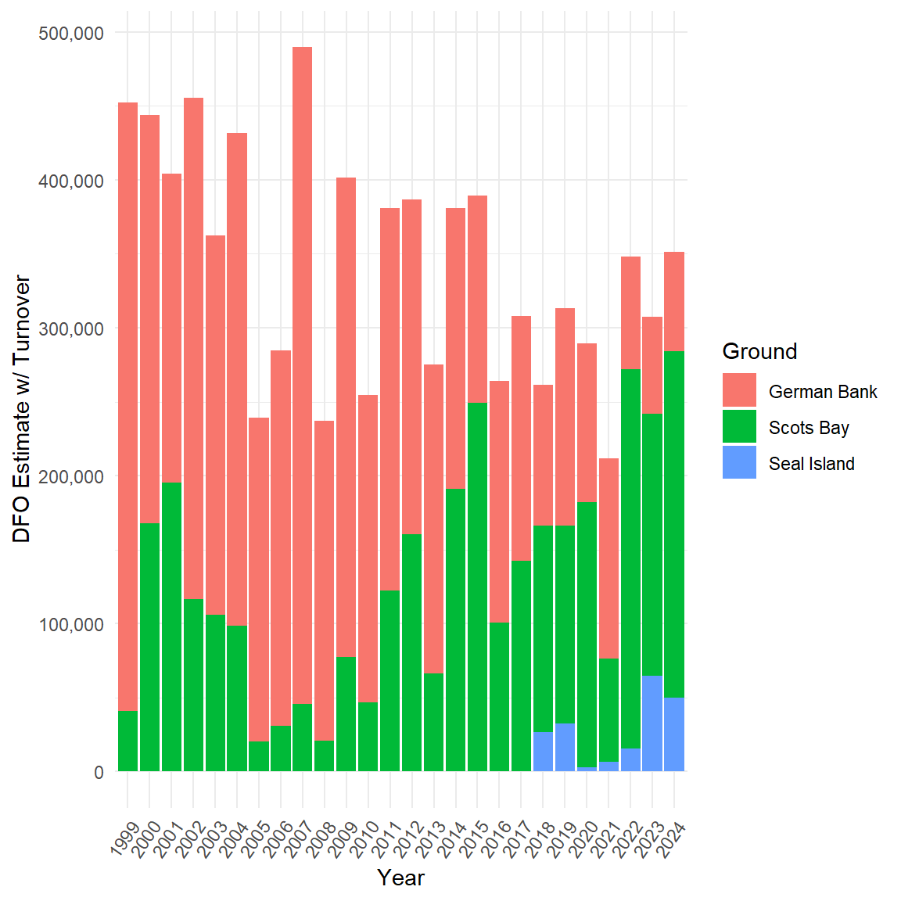


```{=html}
<div class="datatables html-widget html-fill-item" id="htmlwidget-e63e6730625f1a12873a" style="width:100%;height:auto;"></div>
<script type="application/json" data-for="htmlwidget-e63e6730625f1a12873a">{"x":{"filter":"none","vertical":false,"extensions":["Buttons"],"data":[["1","2","3","4","5","6","7","8","9","10","11","12","13","14","15","16","17","18","19","20","21","22","23","24","25","26"],["2024","2023","2022","2021","2020","2019","2018","2017","2016","2015","2014","2013","2012","2011","2010","2009","2008","2007","2006","2005","2004","2003","2002","2001","2000","1999"],[476537,406353,387895,273823,404330,445679,364165,452933,354314,null,null,null,null,null,null,null,null,null,null,null,null,null,null,null,null,null],[415957,351238,333710,234493,335700,368926,295931,376674,null,null,null,null,null,null,null,null,null,null,null,null,null,null,null,null,null,null],[402056,364758,420875,242471,346867,363117,316999,null,343142,null,null,null,null,null,null,null,null,null,null,null,null,null,null,null,null,null],[351305,307273,348319,211898,289276,313172,261335,308030,264147,389523,380887,275008,386759,380677,254624,401707,236893,489629,284839,239385,431805,362627,455631,404175,443637,452197]],"container":"<table class=\"display\">\n  <thead>\n    <tr>\n      <th> <\/th>\n      <th>Year<\/th>\n      <th>HSC Estimate<\/th>\n      <th>HSC w/ Turnover<\/th>\n      <th>DFO Estimate<\/th>\n      <th>DFO w/ Turnover<\/th>\n    <\/tr>\n  <\/thead>\n<\/table>","options":{"pageLength":5,"dom":"lfrtiBp","buttons":["copy","csv","excel","pdf","print"],"columnDefs":[{"className":"dt-right","targets":[2,3,4,5]},{"orderable":false,"targets":0},{"name":" ","targets":0},{"name":"Year","targets":1},{"name":"HSC_Estimate","targets":2},{"name":"HSC_Turnover_Adjusted","targets":3},{"name":"DFO_Estmate","targets":4},{"name":"DFO_Turnover_Adjusted","targets":5}],"order":[],"autoWidth":false,"orderClasses":false,"lengthMenu":[5,10,25,50,100]},"selection":{"mode":"multiple","selected":null,"target":"row","selectable":null}},"evals":[],"jsHooks":[]}</script>
```

#### Scots Bay

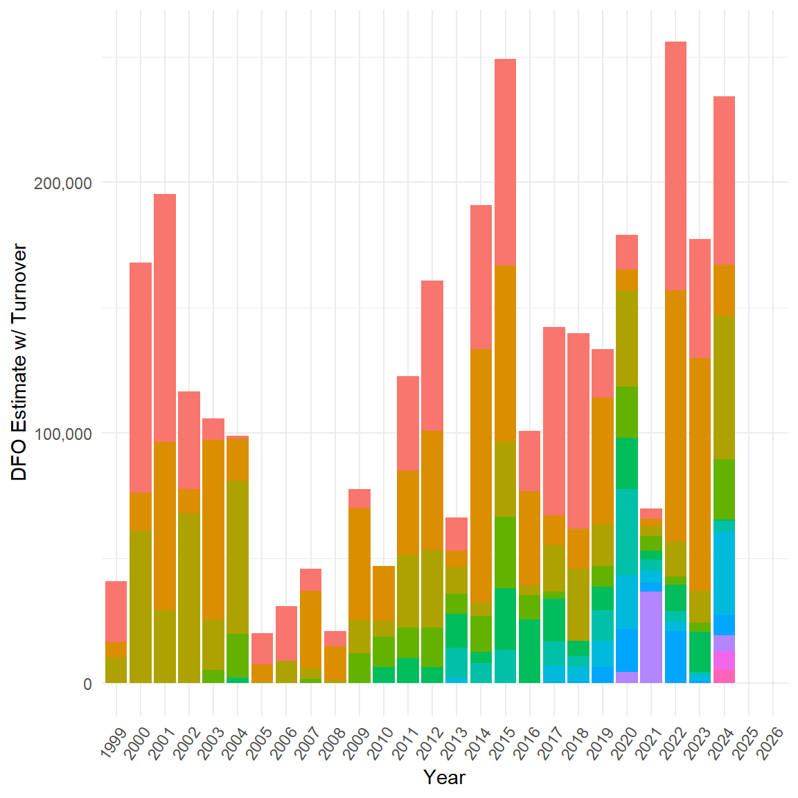


```{=html}
<div class="datatables html-widget html-fill-item" id="htmlwidget-92bc5a32daa1042bc192" style="width:100%;height:auto;"></div>
<script type="application/json" data-for="htmlwidget-92bc5a32daa1042bc192">{"x":{"filter":"none","vertical":false,"extensions":["Buttons"],"data":[["1","2","3","4","5","6","7","8","9","10","11","12","13","14","15","16","17","18","19","20","21","22","23","24","25","26","27","28"],["2026","2025","2024","2023","2022","2021","2020","2019","2018","2017","2016","2015","2014","2013","2012","2011","2010","2009","2008","2007","2006","2005","2004","2003","2002","2001","2000","1999"],[224822.90212,327268,326673,241538,279361,101305,221211,174472,175317,199560,119940,null,null,null,null,null,null,null,null,null,null,null,null,null,null,null,null,null],[196713,287912,282742,204189,241020,90764,191649,151943,149018,177060,null,null,null,null,null,null,null,null,null,null,null,null,null,null,null,null,null,null],[null,null,270323,218266,305300,76803,210238,153213,159271,172855,115668,null,null,null,null,null,null,null,null,null,null,null,null,null,null,null,null,null],[null,null,234216,177329,256011,69831,179059,133331,139651,142238,100786,249225,191002,66183,160606,122585,46888,77503,20758,45846,30865,20064,98692,105779,116404,195252,167943,40652]],"container":"<table class=\"display\">\n  <thead>\n    <tr>\n      <th> <\/th>\n      <th>Year<\/th>\n      <th>HSC Estimate<\/th>\n      <th>HSC w/ Turnover<\/th>\n      <th>DFO Estimate<\/th>\n      <th>DFO w/ Turnover<\/th>\n    <\/tr>\n  <\/thead>\n<\/table>","options":{"pageLength":5,"dom":"lfrtiBp","buttons":["copy","csv","excel","pdf","print"],"columnDefs":[{"className":"dt-right","targets":[2,3,4,5]},{"orderable":false,"targets":0},{"name":" ","targets":0},{"name":"Year","targets":1},{"name":"HSC_Estimate","targets":2},{"name":"HSC_Turnover_Adjusted","targets":3},{"name":"DFO_Estmate","targets":4},{"name":"DFO_Turnover_Adjusted","targets":5}],"order":[],"autoWidth":false,"orderClasses":false,"lengthMenu":[5,10,25,50,100]},"selection":{"mode":"multiple","selected":null,"target":"row","selectable":null}},"evals":[],"jsHooks":[]}</script>
```


#### German Bank

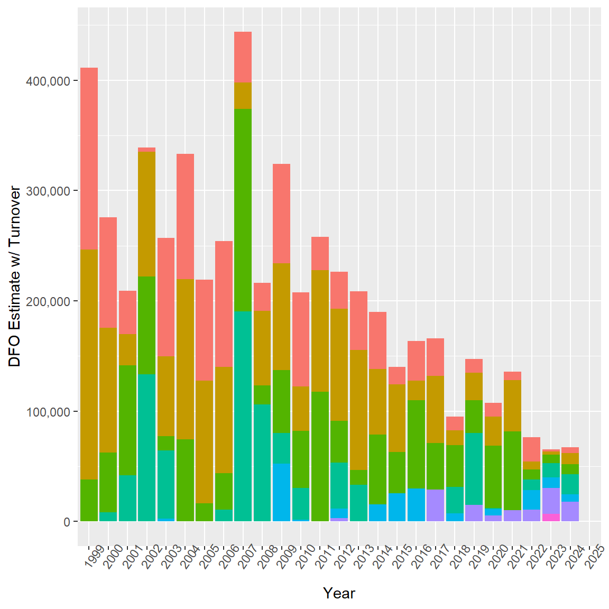


```{=html}
<div class="datatables html-widget html-fill-item" id="htmlwidget-b9bd177fccf72ed62711" style="width:100%;height:auto;"></div>
<script type="application/json" data-for="htmlwidget-b9bd177fccf72ed62711">{"x":{"filter":"none","vertical":false,"extensions":["Buttons"],"data":[["1","2","3","4","5","6","7","8","9","10","11","12","13","14","15","16","17","18","19","20","21","22","23","24","25","26","27"],["2025","2024","2023","2022","2021","2020","2019","2018","2017","2016","2015","2014","2013","2012","2011","2010","2009","2008","2007","2006","2005","2004","2003","2002","2001","2000","1999"],[122821,85360,83882,85126,160456,178518,230477,157004,253373,234374,null,null,null,null,null,null,null,null,null,null,null,null,null,null,null,null,null],[95831,68711,66116,69282,131667,139450,176253,115359,199614,null,null,null,null,null,null,null,null,null,null,null,null,null,null,null,null,null,null],[null,81720,81785,93997,155615,132299,177202,129679,null,227474,null,null,null,null,null,null,null,null,null,null,null,null,null,null,null,null,null],[null,67076,65237,76559,135629,107417,147139,94869,165792,163361,140298,189885,208825,226153,258092,207736,324204,216135,443783,253974,219321,333113,256848,339227,208923,275694,411545]],"container":"<table class=\"display\">\n  <thead>\n    <tr>\n      <th> <\/th>\n      <th>Year<\/th>\n      <th>HSC Estimate<\/th>\n      <th>HSC w/ Turnover<\/th>\n      <th>DFO Estimate<\/th>\n      <th>DFO w/ Turnover<\/th>\n    <\/tr>\n  <\/thead>\n<\/table>","options":{"pageLength":5,"dom":"lfrtiBp","buttons":["copy","csv","excel","pdf","print"],"columnDefs":[{"className":"dt-right","targets":[2,3,4,5]},{"orderable":false,"targets":0},{"name":" ","targets":0},{"name":"Year","targets":1},{"name":"HSC_Estimate","targets":2},{"name":"HSC_Turnover_Adjusted","targets":3},{"name":"DFO_Estmate","targets":4},{"name":"DFO_Turnover_Adjusted","targets":5}],"order":[],"autoWidth":false,"orderClasses":false,"lengthMenu":[5,10,25,50,100]},"selection":{"mode":"multiple","selected":null,"target":"row","selectable":null}},"evals":[],"jsHooks":[]}</script>
```

#### Seal Island

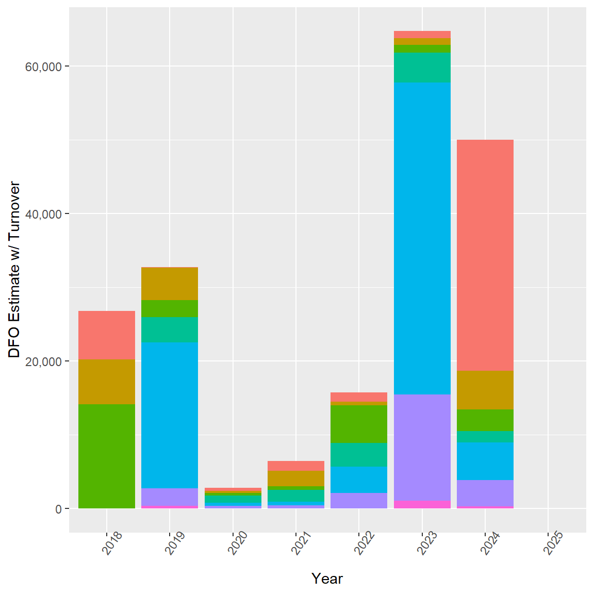


```{=html}
<div class="datatables html-widget html-fill-item" id="htmlwidget-50d62031f04a26e2d28d" style="width:100%;height:auto;"></div>
<script type="application/json" data-for="htmlwidget-50d62031f04a26e2d28d">{"x":{"filter":"none","vertical":false,"extensions":["Buttons"],"data":[["1","2","3","4","5","6","7","8"],["2025","2024","2023","2022","2021","2020","2019","2018"],[50819,64504,80933,23408,12062,4601,40730,31844],[null,64504,80933,23408,12062,4601,40730,31554],[null,50013,64707,21578,10053,4330,32702,28049],[null,50013,64707,15749,6438,2800,32702,26815]],"container":"<table class=\"display\">\n  <thead>\n    <tr>\n      <th> <\/th>\n      <th>Year<\/th>\n      <th>HSC Estimate<\/th>\n      <th>HSC w/ Turnover<\/th>\n      <th>DFO Estimate<\/th>\n      <th>DFO w/ Turnover<\/th>\n    <\/tr>\n  <\/thead>\n<\/table>","options":{"pageLength":5,"dom":"lfrtiBp","buttons":["copy","csv","excel","pdf","print"],"columnDefs":[{"className":"dt-right","targets":[2,3,4,5]},{"orderable":false,"targets":0},{"name":" ","targets":0},{"name":"Year","targets":1},{"name":"HSC_Estimate","targets":2},{"name":"HSC_Turnover_Adjusted","targets":3},{"name":"DFO_Estmate","targets":4},{"name":"DFO_Turnover_Adjusted","targets":5}],"order":[],"autoWidth":false,"orderClasses":false,"lengthMenu":[5,10,25,50,100]},"selection":{"mode":"multiple","selected":null,"target":"row","selectable":null}},"evals":[],"jsHooks":[]}</script>
```


### Annual SSB Estimates {.tabset}

#### Scots Bay {.tabset .tabset-pills}


#####  1999 

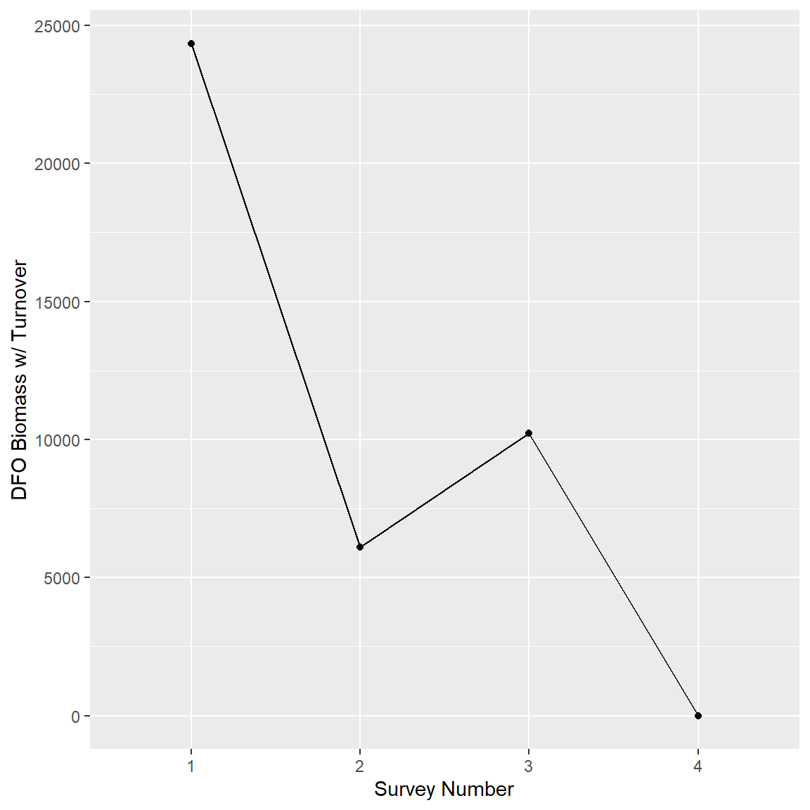
<table class=" lightable-paper lightable-striped" style='color: black; font-family: "Arial Narrow", arial, helvetica, sans-serif; width: auto !important; margin-left: auto; margin-right: auto;'>
 <thead>
  <tr>
   <th style="text-align:center;"> Year </th>
   <th style="text-align:center;"> Ground </th>
   <th style="text-align:center;"> Survey Number </th>
   <th style="text-align:center;"> DFO (Turnover Adjusted) </th>
  </tr>
 </thead>
<tbody>
  <tr>
   <td style="text-align:center;"> 1999 </td>
   <td style="text-align:center;"> Scots Bay </td>
   <td style="text-align:center;"> 1 </td>
   <td style="text-align:center;"> 24335 </td>
  </tr>
  <tr>
   <td style="text-align:center;"> 1999 </td>
   <td style="text-align:center;"> Scots Bay </td>
   <td style="text-align:center;"> 2 </td>
   <td style="text-align:center;"> 6093 </td>
  </tr>
  <tr>
   <td style="text-align:center;"> 1999 </td>
   <td style="text-align:center;"> Scots Bay </td>
   <td style="text-align:center;"> 3 </td>
   <td style="text-align:center;"> 10224 </td>
  </tr>
  <tr>
   <td style="text-align:center;"> 1999 </td>
   <td style="text-align:center;"> Scots Bay </td>
   <td style="text-align:center;"> 4 </td>
   <td style="text-align:center;"> 0 </td>
  </tr>
</tbody>
</table>

#####  2000 

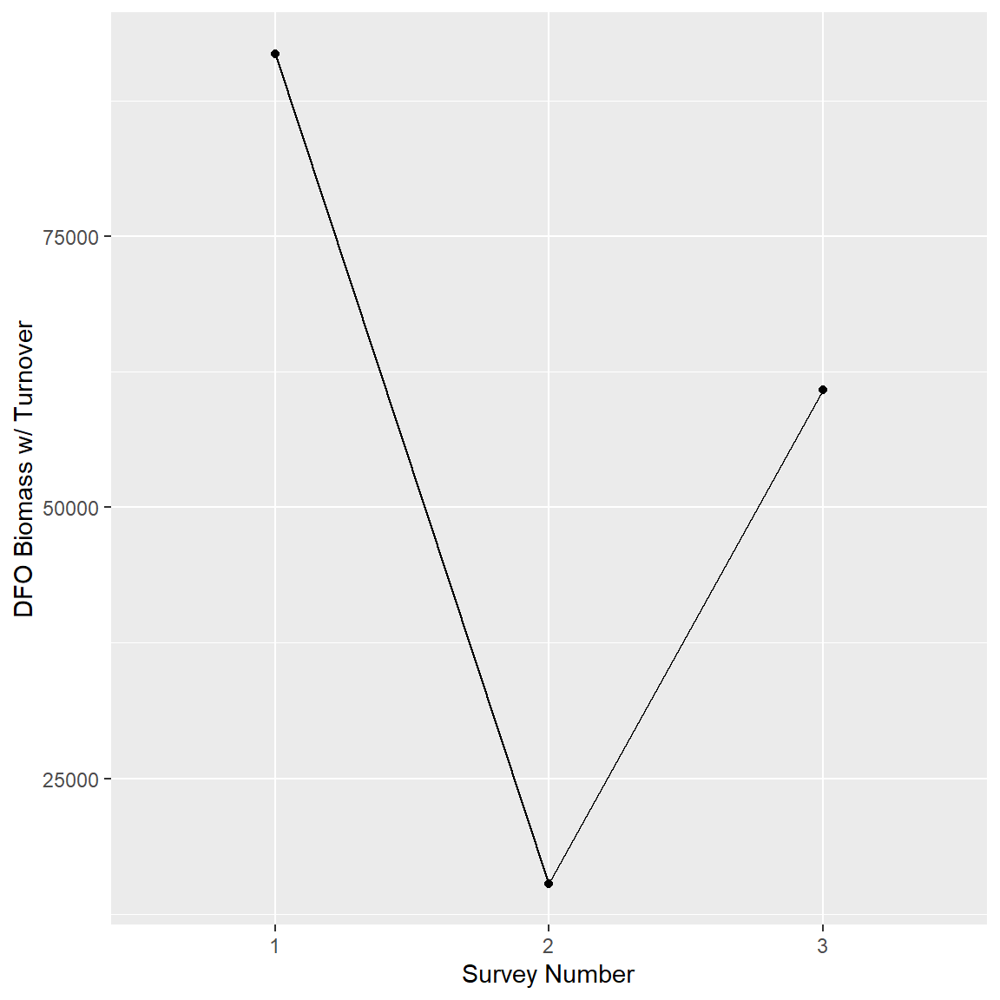
<table class=" lightable-paper lightable-striped" style='color: black; font-family: "Arial Narrow", arial, helvetica, sans-serif; width: auto !important; margin-left: auto; margin-right: auto;'>
 <thead>
  <tr>
   <th style="text-align:center;"> Year </th>
   <th style="text-align:center;"> Ground </th>
   <th style="text-align:center;"> Survey Number </th>
   <th style="text-align:center;"> DFO (Turnover Adjusted) </th>
  </tr>
 </thead>
<tbody>
  <tr>
   <td style="text-align:center;"> 2000 </td>
   <td style="text-align:center;"> Scots Bay </td>
   <td style="text-align:center;"> 1 </td>
   <td style="text-align:center;"> 91816 </td>
  </tr>
  <tr>
   <td style="text-align:center;"> 2000 </td>
   <td style="text-align:center;"> Scots Bay </td>
   <td style="text-align:center;"> 2 </td>
   <td style="text-align:center;"> 15306 </td>
  </tr>
  <tr>
   <td style="text-align:center;"> 2000 </td>
   <td style="text-align:center;"> Scots Bay </td>
   <td style="text-align:center;"> 3 </td>
   <td style="text-align:center;"> 60821 </td>
  </tr>
</tbody>
</table>

#####  2001 

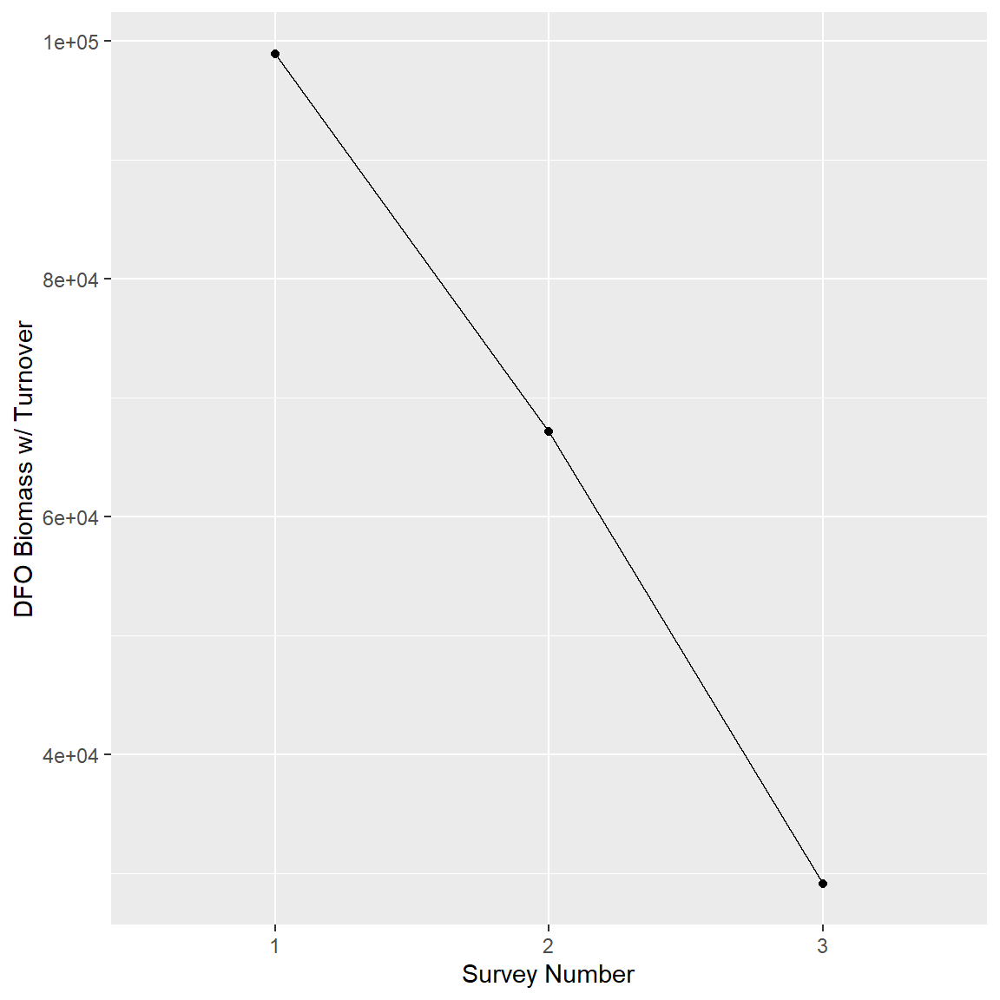
<table class=" lightable-paper lightable-striped" style='color: black; font-family: "Arial Narrow", arial, helvetica, sans-serif; width: auto !important; margin-left: auto; margin-right: auto;'>
 <thead>
  <tr>
   <th style="text-align:center;"> Year </th>
   <th style="text-align:center;"> Ground </th>
   <th style="text-align:center;"> Survey Number </th>
   <th style="text-align:center;"> DFO (Turnover Adjusted) </th>
  </tr>
 </thead>
<tbody>
  <tr>
   <td style="text-align:center;"> 2001 </td>
   <td style="text-align:center;"> Scots Bay </td>
   <td style="text-align:center;"> 1 </td>
   <td style="text-align:center;"> 98923 </td>
  </tr>
  <tr>
   <td style="text-align:center;"> 2001 </td>
   <td style="text-align:center;"> Scots Bay </td>
   <td style="text-align:center;"> 2 </td>
   <td style="text-align:center;"> 67183 </td>
  </tr>
  <tr>
   <td style="text-align:center;"> 2001 </td>
   <td style="text-align:center;"> Scots Bay </td>
   <td style="text-align:center;"> 3 </td>
   <td style="text-align:center;"> 29146 </td>
  </tr>
</tbody>
</table>

#####  2002 

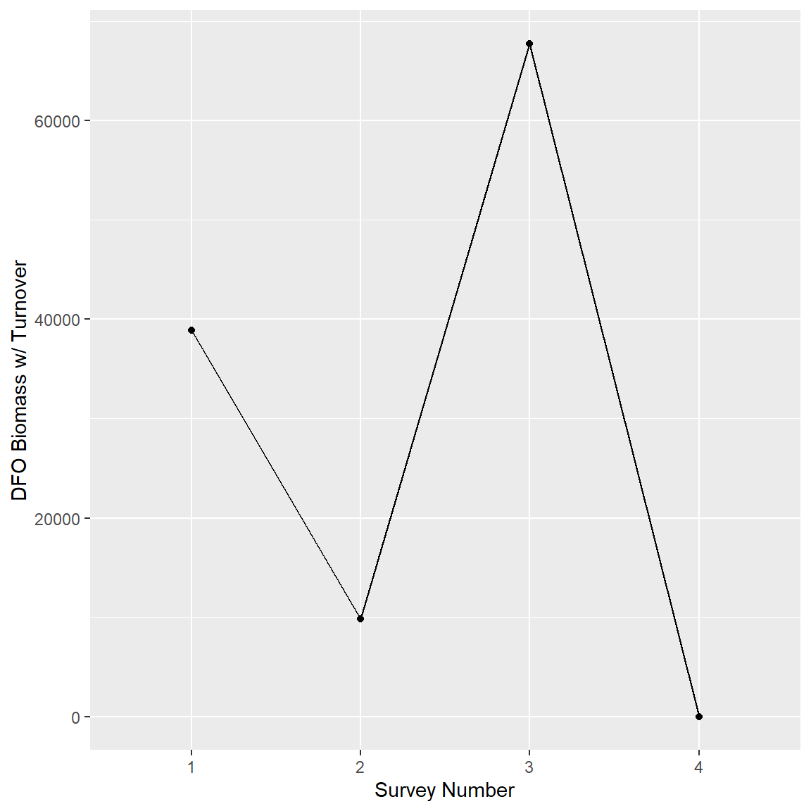
<table class=" lightable-paper lightable-striped" style='color: black; font-family: "Arial Narrow", arial, helvetica, sans-serif; width: auto !important; margin-left: auto; margin-right: auto;'>
 <thead>
  <tr>
   <th style="text-align:center;"> Year </th>
   <th style="text-align:center;"> Ground </th>
   <th style="text-align:center;"> Survey Number </th>
   <th style="text-align:center;"> DFO (Turnover Adjusted) </th>
  </tr>
 </thead>
<tbody>
  <tr>
   <td style="text-align:center;"> 2002 </td>
   <td style="text-align:center;"> Scots Bay </td>
   <td style="text-align:center;"> 1 </td>
   <td style="text-align:center;"> 38856 </td>
  </tr>
  <tr>
   <td style="text-align:center;"> 2002 </td>
   <td style="text-align:center;"> Scots Bay </td>
   <td style="text-align:center;"> 2 </td>
   <td style="text-align:center;"> 9799 </td>
  </tr>
  <tr>
   <td style="text-align:center;"> 2002 </td>
   <td style="text-align:center;"> Scots Bay </td>
   <td style="text-align:center;"> 3 </td>
   <td style="text-align:center;"> 67749 </td>
  </tr>
  <tr>
   <td style="text-align:center;"> 2002 </td>
   <td style="text-align:center;"> Scots Bay </td>
   <td style="text-align:center;"> 4 </td>
   <td style="text-align:center;"> 0 </td>
  </tr>
</tbody>
</table>

#####  2003 

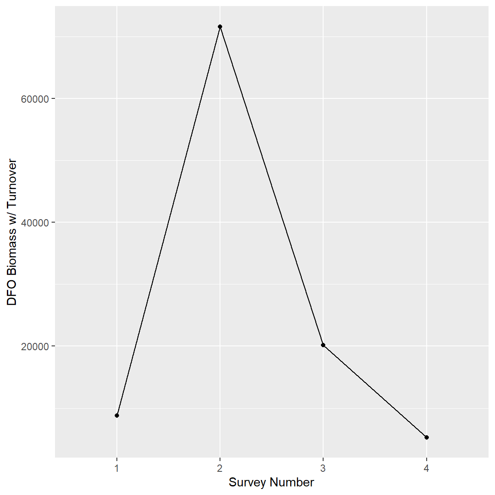
<table class=" lightable-paper lightable-striped" style='color: black; font-family: "Arial Narrow", arial, helvetica, sans-serif; width: auto !important; margin-left: auto; margin-right: auto;'>
 <thead>
  <tr>
   <th style="text-align:center;"> Year </th>
   <th style="text-align:center;"> Ground </th>
   <th style="text-align:center;"> Survey Number </th>
   <th style="text-align:center;"> DFO (Turnover Adjusted) </th>
  </tr>
 </thead>
<tbody>
  <tr>
   <td style="text-align:center;"> 2003 </td>
   <td style="text-align:center;"> Scots Bay </td>
   <td style="text-align:center;"> 1 </td>
   <td style="text-align:center;"> 8759 </td>
  </tr>
  <tr>
   <td style="text-align:center;"> 2003 </td>
   <td style="text-align:center;"> Scots Bay </td>
   <td style="text-align:center;"> 2 </td>
   <td style="text-align:center;"> 71589 </td>
  </tr>
  <tr>
   <td style="text-align:center;"> 2003 </td>
   <td style="text-align:center;"> Scots Bay </td>
   <td style="text-align:center;"> 3 </td>
   <td style="text-align:center;"> 20159 </td>
  </tr>
  <tr>
   <td style="text-align:center;"> 2003 </td>
   <td style="text-align:center;"> Scots Bay </td>
   <td style="text-align:center;"> 4 </td>
   <td style="text-align:center;"> 5272 </td>
  </tr>
</tbody>
</table>

#####  2004 

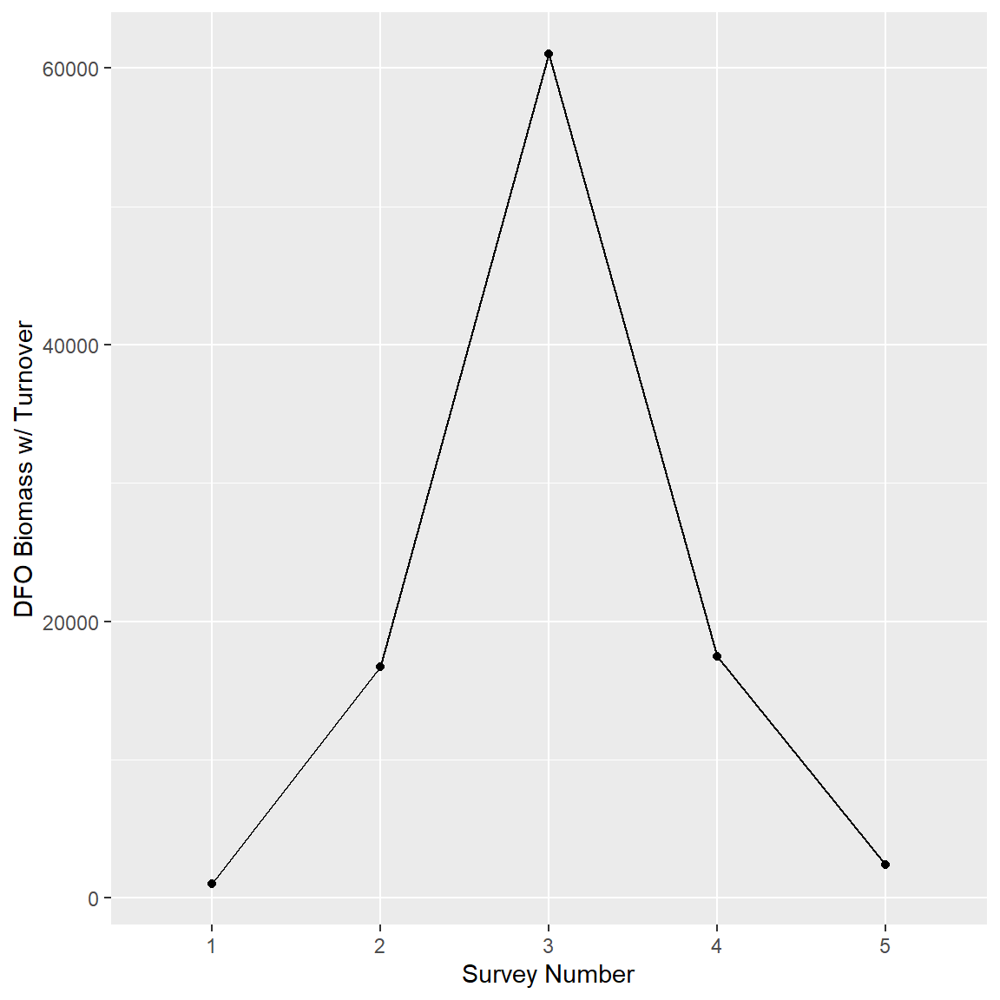
<table class=" lightable-paper lightable-striped" style='color: black; font-family: "Arial Narrow", arial, helvetica, sans-serif; width: auto !important; margin-left: auto; margin-right: auto;'>
 <thead>
  <tr>
   <th style="text-align:center;"> Year </th>
   <th style="text-align:center;"> Ground </th>
   <th style="text-align:center;"> Survey Number </th>
   <th style="text-align:center;"> DFO (Turnover Adjusted) </th>
  </tr>
 </thead>
<tbody>
  <tr>
   <td style="text-align:center;"> 2004 </td>
   <td style="text-align:center;"> Scots Bay </td>
   <td style="text-align:center;"> 1 </td>
   <td style="text-align:center;"> 1042 </td>
  </tr>
  <tr>
   <td style="text-align:center;"> 2004 </td>
   <td style="text-align:center;"> Scots Bay </td>
   <td style="text-align:center;"> 2 </td>
   <td style="text-align:center;"> 16745 </td>
  </tr>
  <tr>
   <td style="text-align:center;"> 2004 </td>
   <td style="text-align:center;"> Scots Bay </td>
   <td style="text-align:center;"> 3 </td>
   <td style="text-align:center;"> 61042 </td>
  </tr>
  <tr>
   <td style="text-align:center;"> 2004 </td>
   <td style="text-align:center;"> Scots Bay </td>
   <td style="text-align:center;"> 4 </td>
   <td style="text-align:center;"> 17489 </td>
  </tr>
  <tr>
   <td style="text-align:center;"> 2004 </td>
   <td style="text-align:center;"> Scots Bay </td>
   <td style="text-align:center;"> 5 </td>
   <td style="text-align:center;"> 2374 </td>
  </tr>
</tbody>
</table>

#####  2005 

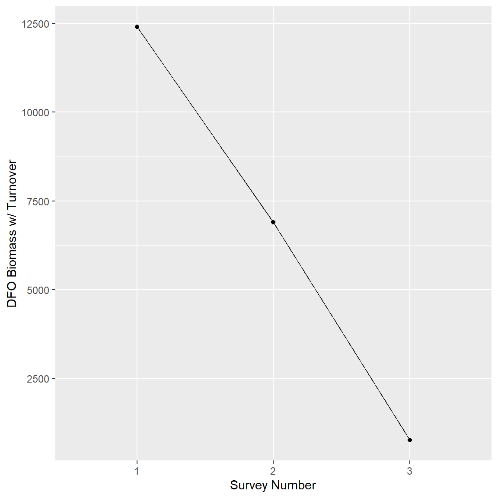
<table class=" lightable-paper lightable-striped" style='color: black; font-family: "Arial Narrow", arial, helvetica, sans-serif; width: auto !important; margin-left: auto; margin-right: auto;'>
 <thead>
  <tr>
   <th style="text-align:center;"> Year </th>
   <th style="text-align:center;"> Ground </th>
   <th style="text-align:center;"> Survey Number </th>
   <th style="text-align:center;"> DFO (Turnover Adjusted) </th>
  </tr>
 </thead>
<tbody>
  <tr>
   <td style="text-align:center;"> 2005 </td>
   <td style="text-align:center;"> Scots Bay </td>
   <td style="text-align:center;"> 1 </td>
   <td style="text-align:center;"> 12404 </td>
  </tr>
  <tr>
   <td style="text-align:center;"> 2005 </td>
   <td style="text-align:center;"> Scots Bay </td>
   <td style="text-align:center;"> 2 </td>
   <td style="text-align:center;"> 6897 </td>
  </tr>
  <tr>
   <td style="text-align:center;"> 2005 </td>
   <td style="text-align:center;"> Scots Bay </td>
   <td style="text-align:center;"> 3 </td>
   <td style="text-align:center;"> 763 </td>
  </tr>
</tbody>
</table>

#####  2006 

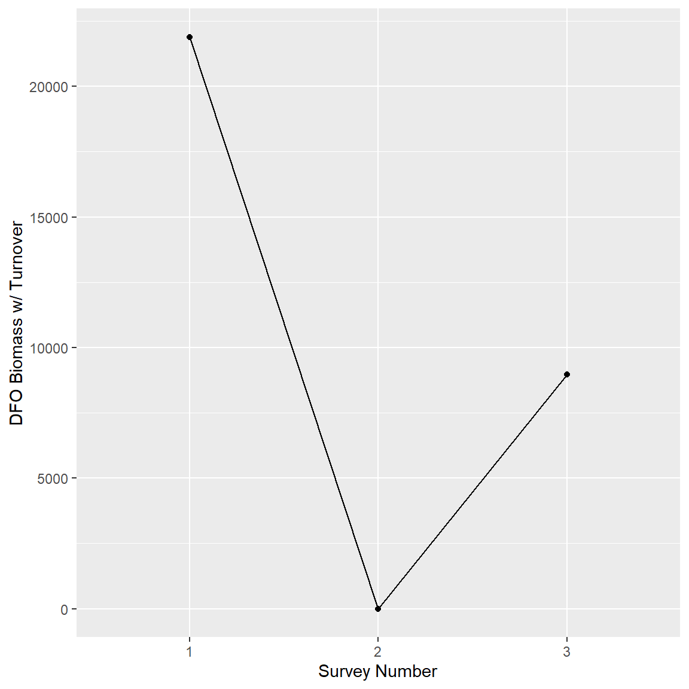
<table class=" lightable-paper lightable-striped" style='color: black; font-family: "Arial Narrow", arial, helvetica, sans-serif; width: auto !important; margin-left: auto; margin-right: auto;'>
 <thead>
  <tr>
   <th style="text-align:center;"> Year </th>
   <th style="text-align:center;"> Ground </th>
   <th style="text-align:center;"> Survey Number </th>
   <th style="text-align:center;"> DFO (Turnover Adjusted) </th>
  </tr>
 </thead>
<tbody>
  <tr>
   <td style="text-align:center;"> 2006 </td>
   <td style="text-align:center;"> Scots Bay </td>
   <td style="text-align:center;"> 1 </td>
   <td style="text-align:center;"> 21886 </td>
  </tr>
  <tr>
   <td style="text-align:center;"> 2006 </td>
   <td style="text-align:center;"> Scots Bay </td>
   <td style="text-align:center;"> 2 </td>
   <td style="text-align:center;"> 0 </td>
  </tr>
  <tr>
   <td style="text-align:center;"> 2006 </td>
   <td style="text-align:center;"> Scots Bay </td>
   <td style="text-align:center;"> 3 </td>
   <td style="text-align:center;"> 8979 </td>
  </tr>
</tbody>
</table>

#####  2007 

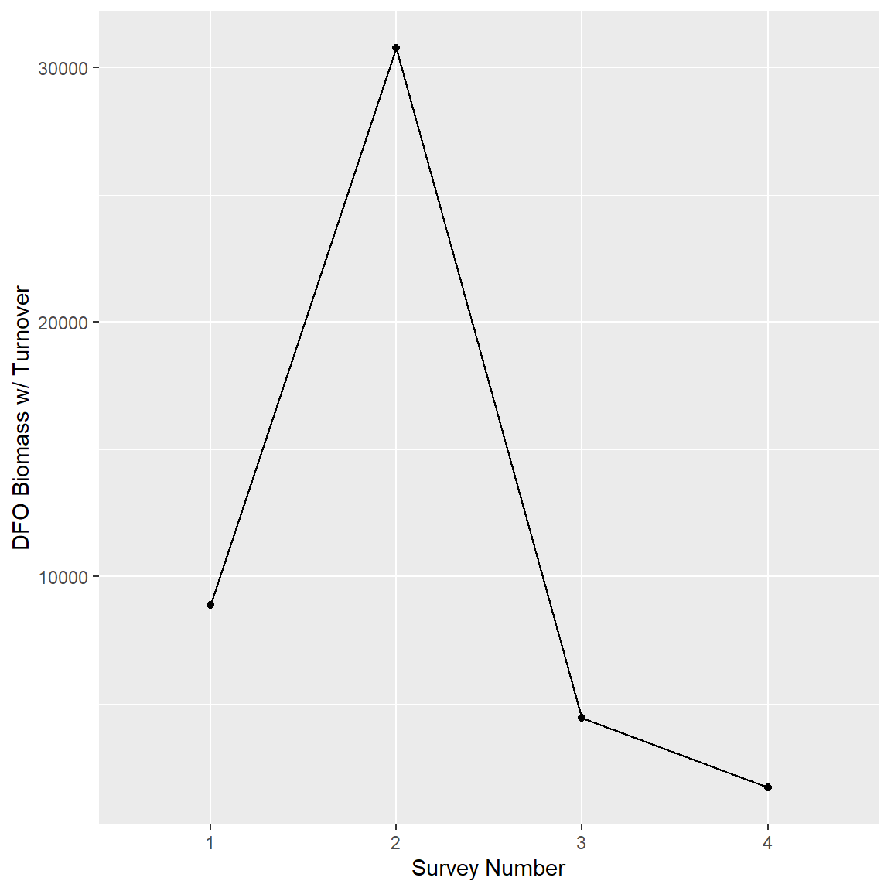
<table class=" lightable-paper lightable-striped" style='color: black; font-family: "Arial Narrow", arial, helvetica, sans-serif; width: auto !important; margin-left: auto; margin-right: auto;'>
 <thead>
  <tr>
   <th style="text-align:center;"> Year </th>
   <th style="text-align:center;"> Ground </th>
   <th style="text-align:center;"> Survey Number </th>
   <th style="text-align:center;"> DFO (Turnover Adjusted) </th>
  </tr>
 </thead>
<tbody>
  <tr>
   <td style="text-align:center;"> 2007 </td>
   <td style="text-align:center;"> Scots Bay </td>
   <td style="text-align:center;"> 1 </td>
   <td style="text-align:center;"> 8899 </td>
  </tr>
  <tr>
   <td style="text-align:center;"> 2007 </td>
   <td style="text-align:center;"> Scots Bay </td>
   <td style="text-align:center;"> 2 </td>
   <td style="text-align:center;"> 30760 </td>
  </tr>
  <tr>
   <td style="text-align:center;"> 2007 </td>
   <td style="text-align:center;"> Scots Bay </td>
   <td style="text-align:center;"> 3 </td>
   <td style="text-align:center;"> 4457 </td>
  </tr>
  <tr>
   <td style="text-align:center;"> 2007 </td>
   <td style="text-align:center;"> Scots Bay </td>
   <td style="text-align:center;"> 4 </td>
   <td style="text-align:center;"> 1730 </td>
  </tr>
</tbody>
</table>

#####  2008 

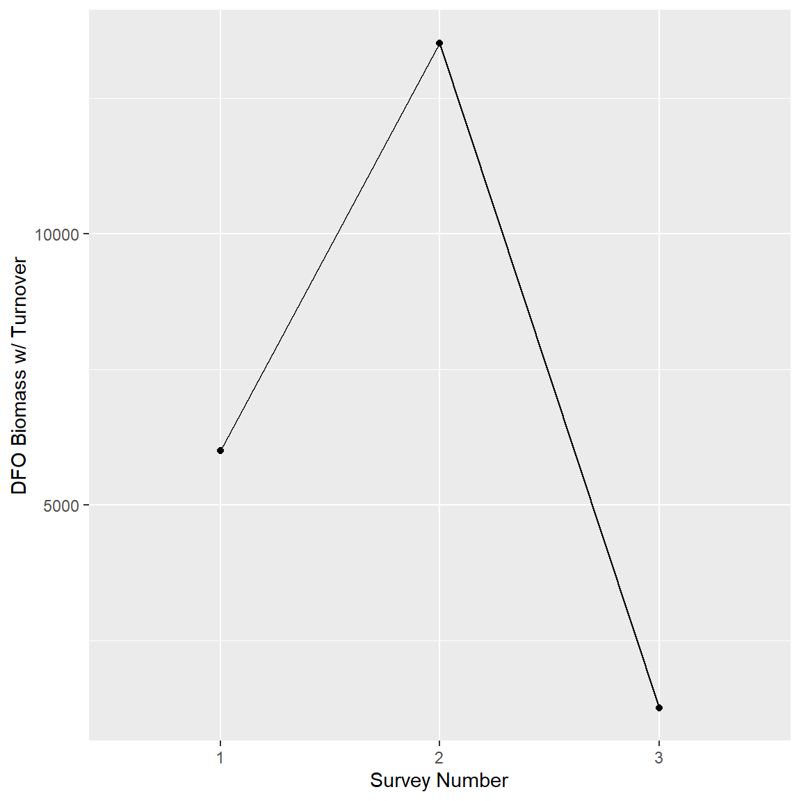
<table class=" lightable-paper lightable-striped" style='color: black; font-family: "Arial Narrow", arial, helvetica, sans-serif; width: auto !important; margin-left: auto; margin-right: auto;'>
 <thead>
  <tr>
   <th style="text-align:center;"> Year </th>
   <th style="text-align:center;"> Ground </th>
   <th style="text-align:center;"> Survey Number </th>
   <th style="text-align:center;"> DFO (Turnover Adjusted) </th>
  </tr>
 </thead>
<tbody>
  <tr>
   <td style="text-align:center;"> 2008 </td>
   <td style="text-align:center;"> Scots Bay </td>
   <td style="text-align:center;"> 1 </td>
   <td style="text-align:center;"> 5992 </td>
  </tr>
  <tr>
   <td style="text-align:center;"> 2008 </td>
   <td style="text-align:center;"> Scots Bay </td>
   <td style="text-align:center;"> 2 </td>
   <td style="text-align:center;"> 13509 </td>
  </tr>
  <tr>
   <td style="text-align:center;"> 2008 </td>
   <td style="text-align:center;"> Scots Bay </td>
   <td style="text-align:center;"> 3 </td>
   <td style="text-align:center;"> 1257 </td>
  </tr>
</tbody>
</table>

#####  2009 

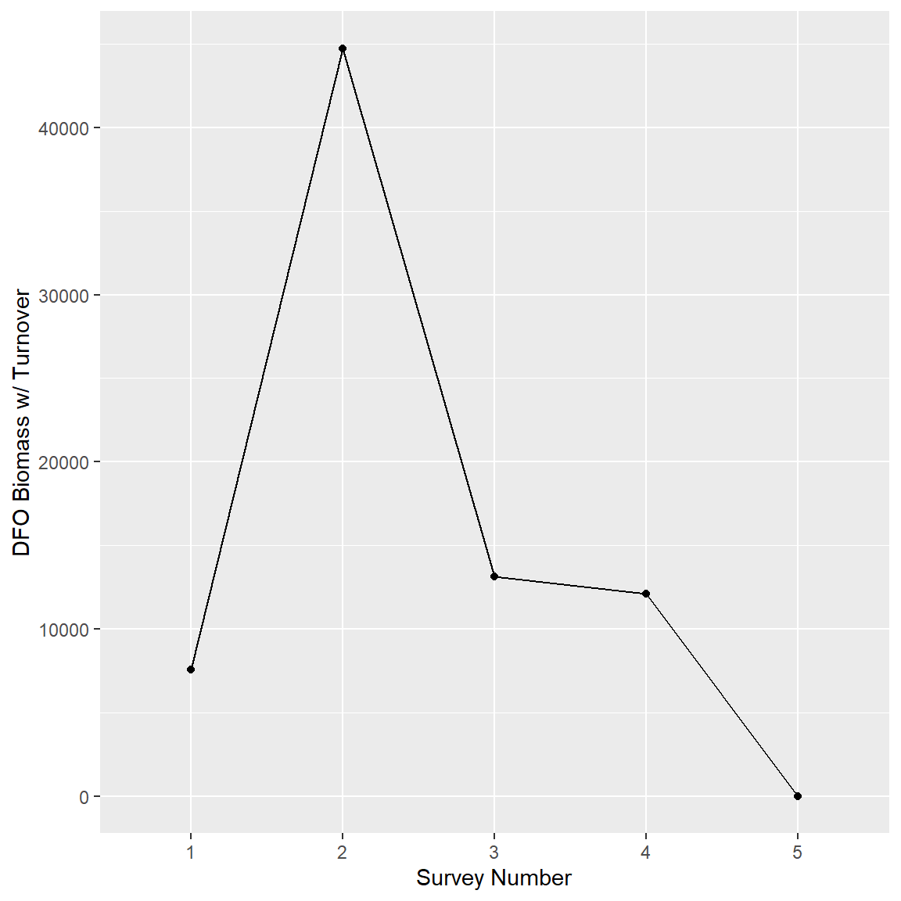
<table class=" lightable-paper lightable-striped" style='color: black; font-family: "Arial Narrow", arial, helvetica, sans-serif; width: auto !important; margin-left: auto; margin-right: auto;'>
 <thead>
  <tr>
   <th style="text-align:center;"> Year </th>
   <th style="text-align:center;"> Ground </th>
   <th style="text-align:center;"> Survey Number </th>
   <th style="text-align:center;"> DFO (Turnover Adjusted) </th>
  </tr>
 </thead>
<tbody>
  <tr>
   <td style="text-align:center;"> 2009 </td>
   <td style="text-align:center;"> Scots Bay </td>
   <td style="text-align:center;"> 1 </td>
   <td style="text-align:center;"> 7542 </td>
  </tr>
  <tr>
   <td style="text-align:center;"> 2009 </td>
   <td style="text-align:center;"> Scots Bay </td>
   <td style="text-align:center;"> 2 </td>
   <td style="text-align:center;"> 44725 </td>
  </tr>
  <tr>
   <td style="text-align:center;"> 2009 </td>
   <td style="text-align:center;"> Scots Bay </td>
   <td style="text-align:center;"> 3 </td>
   <td style="text-align:center;"> 13133 </td>
  </tr>
  <tr>
   <td style="text-align:center;"> 2009 </td>
   <td style="text-align:center;"> Scots Bay </td>
   <td style="text-align:center;"> 4 </td>
   <td style="text-align:center;"> 12103 </td>
  </tr>
  <tr>
   <td style="text-align:center;"> 2009 </td>
   <td style="text-align:center;"> Scots Bay </td>
   <td style="text-align:center;"> 5 </td>
   <td style="text-align:center;"> 0 </td>
  </tr>
</tbody>
</table>

#####  2010 

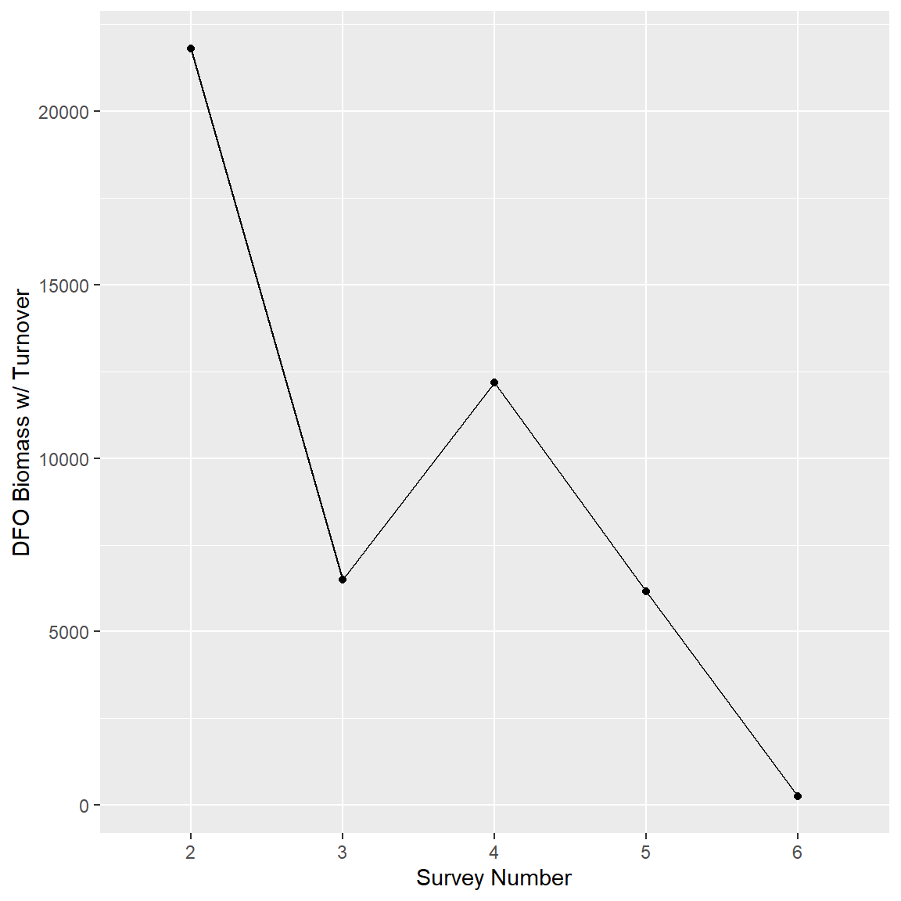
<table class=" lightable-paper lightable-striped" style='color: black; font-family: "Arial Narrow", arial, helvetica, sans-serif; width: auto !important; margin-left: auto; margin-right: auto;'>
 <thead>
  <tr>
   <th style="text-align:center;"> Year </th>
   <th style="text-align:center;"> Ground </th>
   <th style="text-align:center;"> Survey Number </th>
   <th style="text-align:center;"> DFO (Turnover Adjusted) </th>
  </tr>
 </thead>
<tbody>
  <tr>
   <td style="text-align:center;"> 2010 </td>
   <td style="text-align:center;"> Scots Bay </td>
   <td style="text-align:center;"> 2 </td>
   <td style="text-align:center;"> 21808 </td>
  </tr>
  <tr>
   <td style="text-align:center;"> 2010 </td>
   <td style="text-align:center;"> Scots Bay </td>
   <td style="text-align:center;"> 3 </td>
   <td style="text-align:center;"> 6493 </td>
  </tr>
  <tr>
   <td style="text-align:center;"> 2010 </td>
   <td style="text-align:center;"> Scots Bay </td>
   <td style="text-align:center;"> 4 </td>
   <td style="text-align:center;"> 12176 </td>
  </tr>
  <tr>
   <td style="text-align:center;"> 2010 </td>
   <td style="text-align:center;"> Scots Bay </td>
   <td style="text-align:center;"> 5 </td>
   <td style="text-align:center;"> 6150 </td>
  </tr>
  <tr>
   <td style="text-align:center;"> 2010 </td>
   <td style="text-align:center;"> Scots Bay </td>
   <td style="text-align:center;"> 6 </td>
   <td style="text-align:center;"> 261 </td>
  </tr>
</tbody>
</table>

#####  2011 

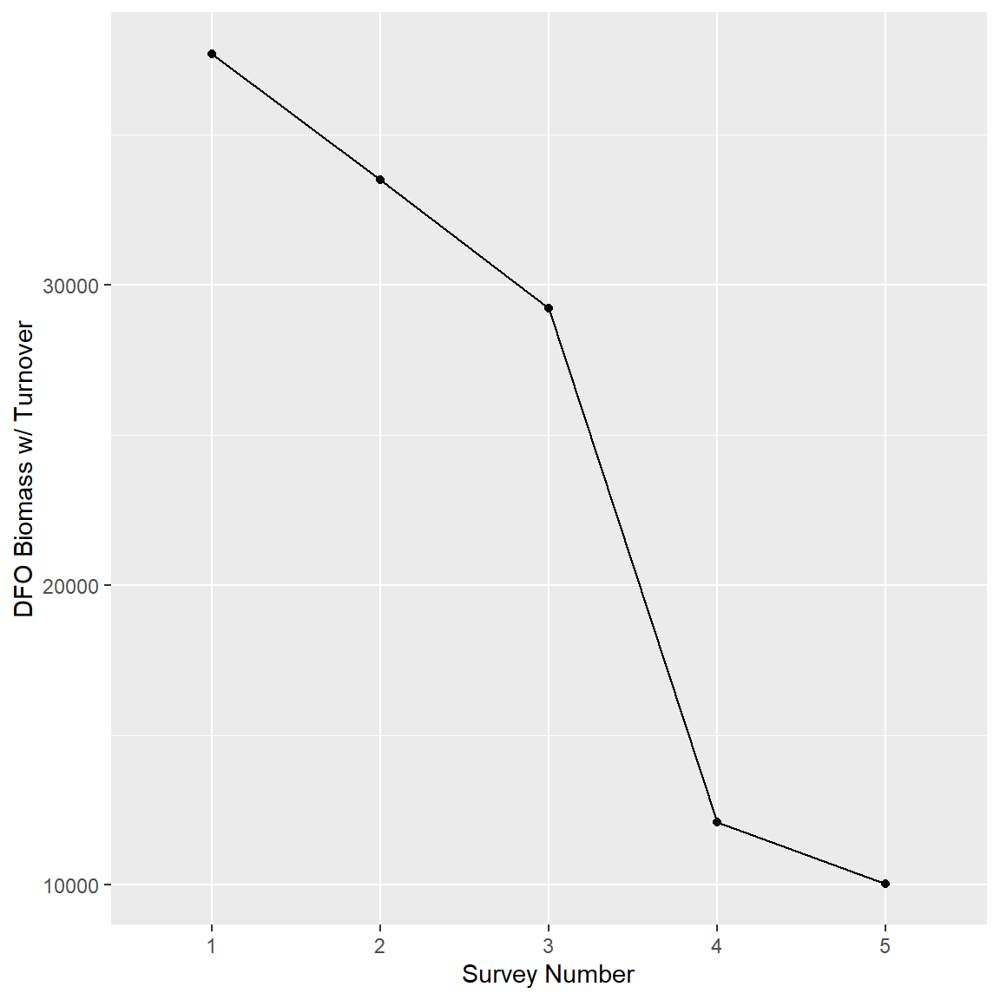
<table class=" lightable-paper lightable-striped" style='color: black; font-family: "Arial Narrow", arial, helvetica, sans-serif; width: auto !important; margin-left: auto; margin-right: auto;'>
 <thead>
  <tr>
   <th style="text-align:center;"> Year </th>
   <th style="text-align:center;"> Ground </th>
   <th style="text-align:center;"> Survey Number </th>
   <th style="text-align:center;"> DFO (Turnover Adjusted) </th>
  </tr>
 </thead>
<tbody>
  <tr>
   <td style="text-align:center;"> 2011 </td>
   <td style="text-align:center;"> Scots Bay </td>
   <td style="text-align:center;"> 1 </td>
   <td style="text-align:center;"> 37706 </td>
  </tr>
  <tr>
   <td style="text-align:center;"> 2011 </td>
   <td style="text-align:center;"> Scots Bay </td>
   <td style="text-align:center;"> 2 </td>
   <td style="text-align:center;"> 33507 </td>
  </tr>
  <tr>
   <td style="text-align:center;"> 2011 </td>
   <td style="text-align:center;"> Scots Bay </td>
   <td style="text-align:center;"> 3 </td>
   <td style="text-align:center;"> 29229 </td>
  </tr>
  <tr>
   <td style="text-align:center;"> 2011 </td>
   <td style="text-align:center;"> Scots Bay </td>
   <td style="text-align:center;"> 4 </td>
   <td style="text-align:center;"> 12091 </td>
  </tr>
  <tr>
   <td style="text-align:center;"> 2011 </td>
   <td style="text-align:center;"> Scots Bay </td>
   <td style="text-align:center;"> 5 </td>
   <td style="text-align:center;"> 10052 </td>
  </tr>
</tbody>
</table>

#####  2012 

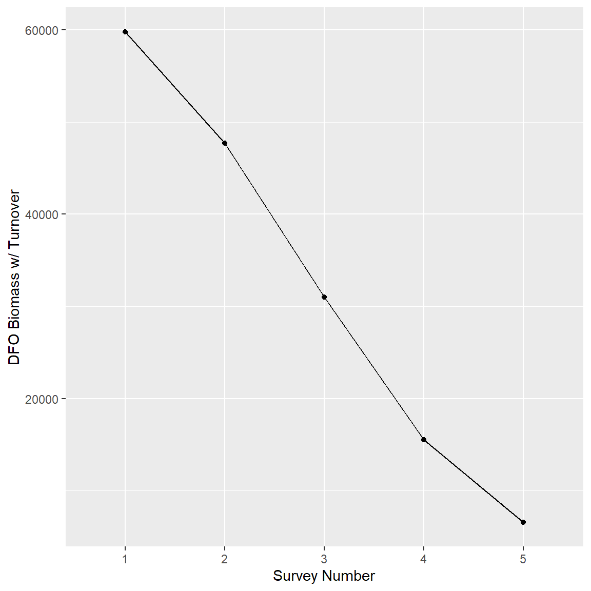
<table class=" lightable-paper lightable-striped" style='color: black; font-family: "Arial Narrow", arial, helvetica, sans-serif; width: auto !important; margin-left: auto; margin-right: auto;'>
 <thead>
  <tr>
   <th style="text-align:center;"> Year </th>
   <th style="text-align:center;"> Ground </th>
   <th style="text-align:center;"> Survey Number </th>
   <th style="text-align:center;"> DFO (Turnover Adjusted) </th>
  </tr>
 </thead>
<tbody>
  <tr>
   <td style="text-align:center;"> 2012 </td>
   <td style="text-align:center;"> Scots Bay </td>
   <td style="text-align:center;"> 1 </td>
   <td style="text-align:center;"> 59795 </td>
  </tr>
  <tr>
   <td style="text-align:center;"> 2012 </td>
   <td style="text-align:center;"> Scots Bay </td>
   <td style="text-align:center;"> 2 </td>
   <td style="text-align:center;"> 47710 </td>
  </tr>
  <tr>
   <td style="text-align:center;"> 2012 </td>
   <td style="text-align:center;"> Scots Bay </td>
   <td style="text-align:center;"> 3 </td>
   <td style="text-align:center;"> 31009 </td>
  </tr>
  <tr>
   <td style="text-align:center;"> 2012 </td>
   <td style="text-align:center;"> Scots Bay </td>
   <td style="text-align:center;"> 4 </td>
   <td style="text-align:center;"> 15507 </td>
  </tr>
  <tr>
   <td style="text-align:center;"> 2012 </td>
   <td style="text-align:center;"> Scots Bay </td>
   <td style="text-align:center;"> 5 </td>
   <td style="text-align:center;"> 6585 </td>
  </tr>
</tbody>
</table>

#####  2013 

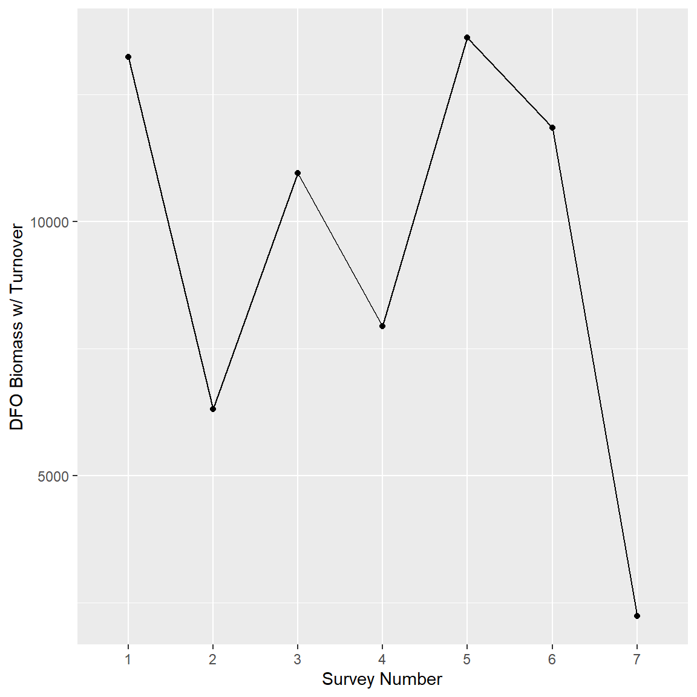
<table class=" lightable-paper lightable-striped" style='color: black; font-family: "Arial Narrow", arial, helvetica, sans-serif; width: auto !important; margin-left: auto; margin-right: auto;'>
 <thead>
  <tr>
   <th style="text-align:center;"> Year </th>
   <th style="text-align:center;"> Ground </th>
   <th style="text-align:center;"> Survey Number </th>
   <th style="text-align:center;"> DFO (Turnover Adjusted) </th>
  </tr>
 </thead>
<tbody>
  <tr>
   <td style="text-align:center;"> 2013 </td>
   <td style="text-align:center;"> Scots Bay </td>
   <td style="text-align:center;"> 1 </td>
   <td style="text-align:center;"> 13245 </td>
  </tr>
  <tr>
   <td style="text-align:center;"> 2013 </td>
   <td style="text-align:center;"> Scots Bay </td>
   <td style="text-align:center;"> 2 </td>
   <td style="text-align:center;"> 6309 </td>
  </tr>
  <tr>
   <td style="text-align:center;"> 2013 </td>
   <td style="text-align:center;"> Scots Bay </td>
   <td style="text-align:center;"> 3 </td>
   <td style="text-align:center;"> 10961 </td>
  </tr>
  <tr>
   <td style="text-align:center;"> 2013 </td>
   <td style="text-align:center;"> Scots Bay </td>
   <td style="text-align:center;"> 4 </td>
   <td style="text-align:center;"> 7948 </td>
  </tr>
  <tr>
   <td style="text-align:center;"> 2013 </td>
   <td style="text-align:center;"> Scots Bay </td>
   <td style="text-align:center;"> 5 </td>
   <td style="text-align:center;"> 13625 </td>
  </tr>
  <tr>
   <td style="text-align:center;"> 2013 </td>
   <td style="text-align:center;"> Scots Bay </td>
   <td style="text-align:center;"> 6 </td>
   <td style="text-align:center;"> 11847 </td>
  </tr>
  <tr>
   <td style="text-align:center;"> 2013 </td>
   <td style="text-align:center;"> Scots Bay </td>
   <td style="text-align:center;"> 7 </td>
   <td style="text-align:center;"> 2248 </td>
  </tr>
</tbody>
</table>

#####  2014 

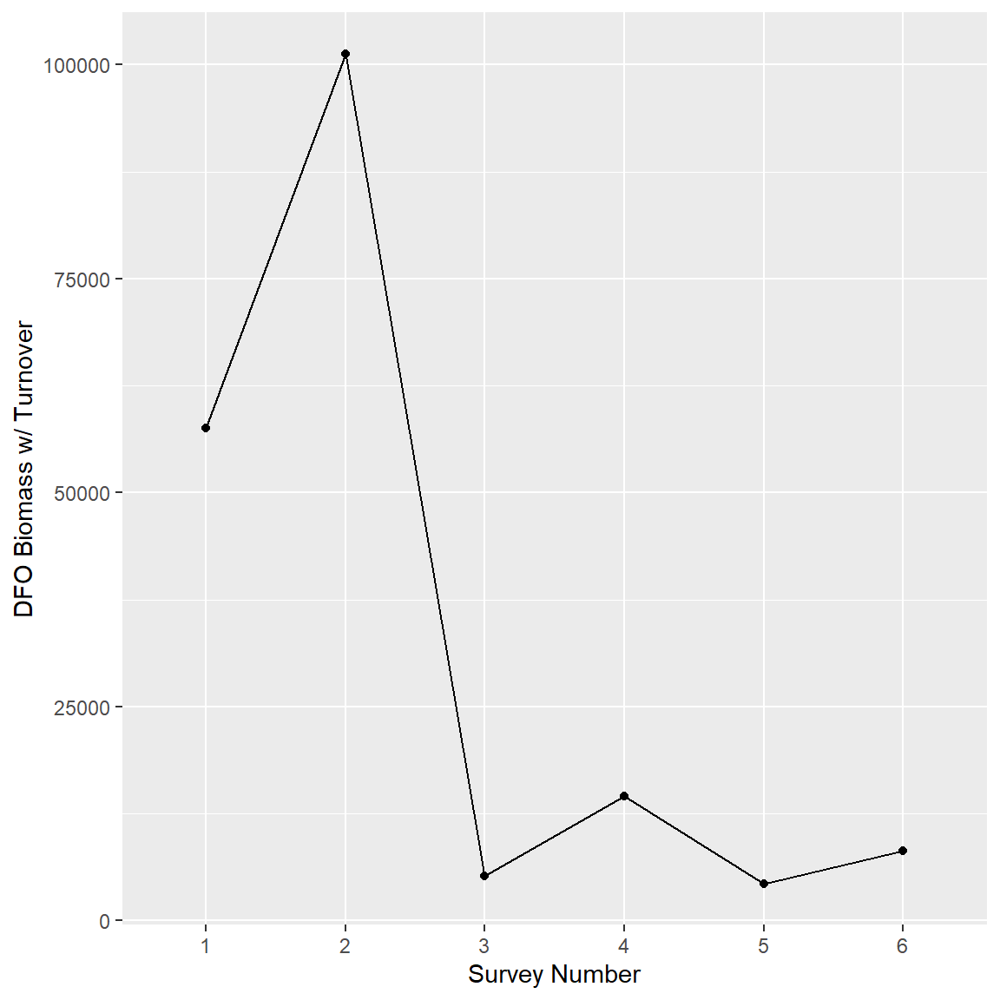
<table class=" lightable-paper lightable-striped" style='color: black; font-family: "Arial Narrow", arial, helvetica, sans-serif; width: auto !important; margin-left: auto; margin-right: auto;'>
 <thead>
  <tr>
   <th style="text-align:center;"> Year </th>
   <th style="text-align:center;"> Ground </th>
   <th style="text-align:center;"> Survey Number </th>
   <th style="text-align:center;"> DFO (Turnover Adjusted) </th>
  </tr>
 </thead>
<tbody>
  <tr>
   <td style="text-align:center;"> 2014 </td>
   <td style="text-align:center;"> Scots Bay </td>
   <td style="text-align:center;"> 1 </td>
   <td style="text-align:center;"> 57552 </td>
  </tr>
  <tr>
   <td style="text-align:center;"> 2014 </td>
   <td style="text-align:center;"> Scots Bay </td>
   <td style="text-align:center;"> 2 </td>
   <td style="text-align:center;"> 101274 </td>
  </tr>
  <tr>
   <td style="text-align:center;"> 2014 </td>
   <td style="text-align:center;"> Scots Bay </td>
   <td style="text-align:center;"> 3 </td>
   <td style="text-align:center;"> 5208 </td>
  </tr>
  <tr>
   <td style="text-align:center;"> 2014 </td>
   <td style="text-align:center;"> Scots Bay </td>
   <td style="text-align:center;"> 4 </td>
   <td style="text-align:center;"> 14545 </td>
  </tr>
  <tr>
   <td style="text-align:center;"> 2014 </td>
   <td style="text-align:center;"> Scots Bay </td>
   <td style="text-align:center;"> 5 </td>
   <td style="text-align:center;"> 4325 </td>
  </tr>
  <tr>
   <td style="text-align:center;"> 2014 </td>
   <td style="text-align:center;"> Scots Bay </td>
   <td style="text-align:center;"> 6 </td>
   <td style="text-align:center;"> 8098 </td>
  </tr>
</tbody>
</table>

#####  2015 

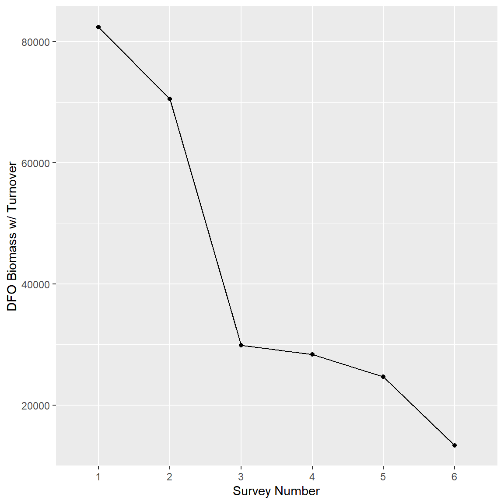
<table class=" lightable-paper lightable-striped" style='color: black; font-family: "Arial Narrow", arial, helvetica, sans-serif; width: auto !important; margin-left: auto; margin-right: auto;'>
 <thead>
  <tr>
   <th style="text-align:center;"> Year </th>
   <th style="text-align:center;"> Ground </th>
   <th style="text-align:center;"> Survey Number </th>
   <th style="text-align:center;"> DFO (Turnover Adjusted) </th>
  </tr>
 </thead>
<tbody>
  <tr>
   <td style="text-align:center;"> 2015 </td>
   <td style="text-align:center;"> Scots Bay </td>
   <td style="text-align:center;"> 1 </td>
   <td style="text-align:center;"> 82428 </td>
  </tr>
  <tr>
   <td style="text-align:center;"> 2015 </td>
   <td style="text-align:center;"> Scots Bay </td>
   <td style="text-align:center;"> 2 </td>
   <td style="text-align:center;"> 70538 </td>
  </tr>
  <tr>
   <td style="text-align:center;"> 2015 </td>
   <td style="text-align:center;"> Scots Bay </td>
   <td style="text-align:center;"> 3 </td>
   <td style="text-align:center;"> 29868 </td>
  </tr>
  <tr>
   <td style="text-align:center;"> 2015 </td>
   <td style="text-align:center;"> Scots Bay </td>
   <td style="text-align:center;"> 4 </td>
   <td style="text-align:center;"> 28382 </td>
  </tr>
  <tr>
   <td style="text-align:center;"> 2015 </td>
   <td style="text-align:center;"> Scots Bay </td>
   <td style="text-align:center;"> 5 </td>
   <td style="text-align:center;"> 24654 </td>
  </tr>
  <tr>
   <td style="text-align:center;"> 2015 </td>
   <td style="text-align:center;"> Scots Bay </td>
   <td style="text-align:center;"> 6 </td>
   <td style="text-align:center;"> 13355 </td>
  </tr>
</tbody>
</table>

#####  2016 

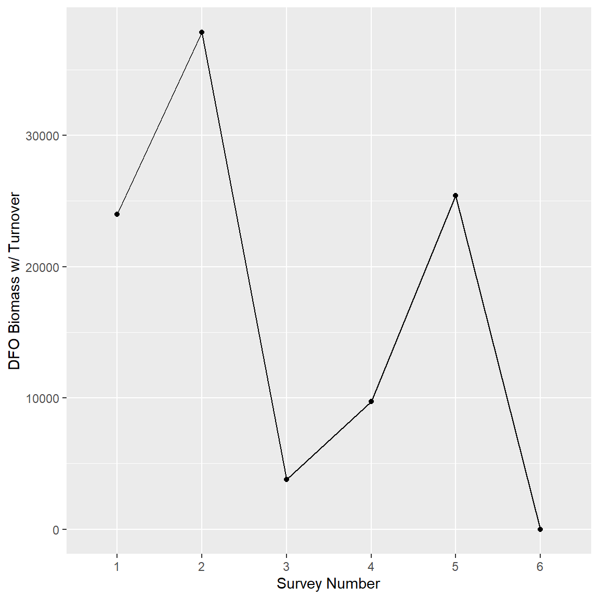
<table class=" lightable-paper lightable-striped" style='color: black; font-family: "Arial Narrow", arial, helvetica, sans-serif; width: auto !important; margin-left: auto; margin-right: auto;'>
 <thead>
  <tr>
   <th style="text-align:center;"> Year </th>
   <th style="text-align:center;"> Ground </th>
   <th style="text-align:center;"> Survey Number </th>
   <th style="text-align:center;"> DFO (Turnover Adjusted) </th>
  </tr>
 </thead>
<tbody>
  <tr>
   <td style="text-align:center;"> 2016 </td>
   <td style="text-align:center;"> Scots Bay </td>
   <td style="text-align:center;"> 1 </td>
   <td style="text-align:center;"> 23989 </td>
  </tr>
  <tr>
   <td style="text-align:center;"> 2016 </td>
   <td style="text-align:center;"> Scots Bay </td>
   <td style="text-align:center;"> 2 </td>
   <td style="text-align:center;"> 37853 </td>
  </tr>
  <tr>
   <td style="text-align:center;"> 2016 </td>
   <td style="text-align:center;"> Scots Bay </td>
   <td style="text-align:center;"> 3 </td>
   <td style="text-align:center;"> 3788 </td>
  </tr>
  <tr>
   <td style="text-align:center;"> 2016 </td>
   <td style="text-align:center;"> Scots Bay </td>
   <td style="text-align:center;"> 4 </td>
   <td style="text-align:center;"> 9747 </td>
  </tr>
  <tr>
   <td style="text-align:center;"> 2016 </td>
   <td style="text-align:center;"> Scots Bay </td>
   <td style="text-align:center;"> 5 </td>
   <td style="text-align:center;"> 25409 </td>
  </tr>
  <tr>
   <td style="text-align:center;"> 2016 </td>
   <td style="text-align:center;"> Scots Bay </td>
   <td style="text-align:center;"> 6 </td>
   <td style="text-align:center;"> 0 </td>
  </tr>
</tbody>
</table>

#####  2017 

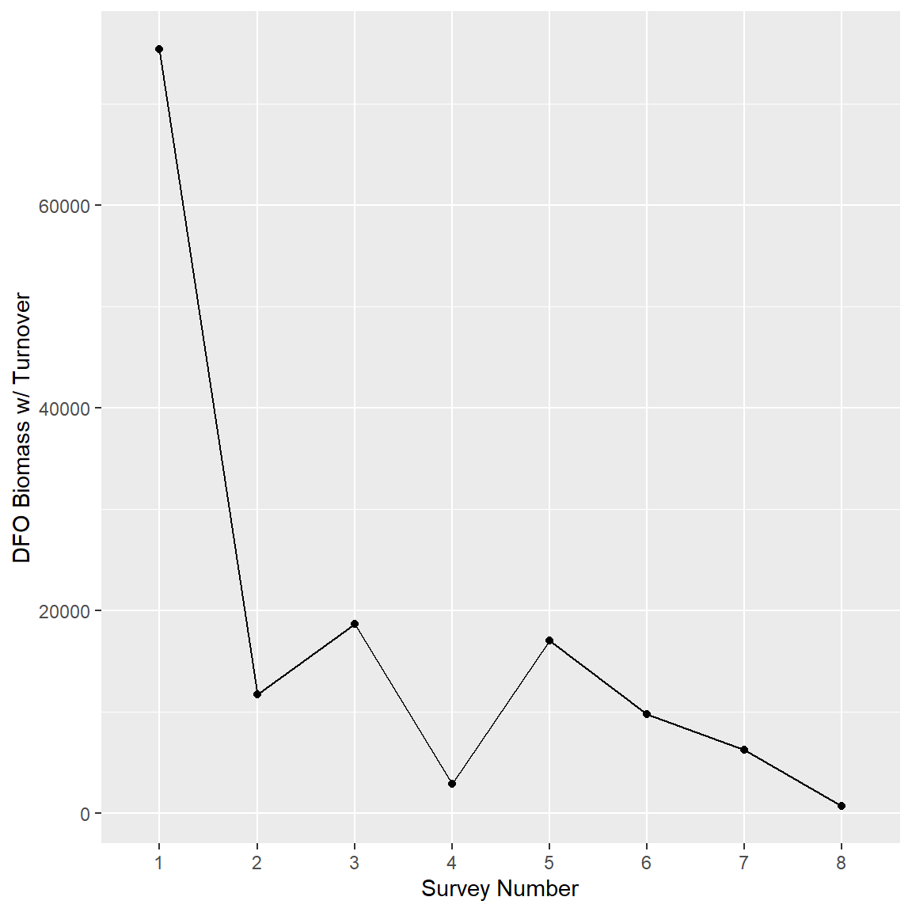
<table class=" lightable-paper lightable-striped" style='color: black; font-family: "Arial Narrow", arial, helvetica, sans-serif; width: auto !important; margin-left: auto; margin-right: auto;'>
 <thead>
  <tr>
   <th style="text-align:center;"> Year </th>
   <th style="text-align:center;"> Ground </th>
   <th style="text-align:center;"> Survey Number </th>
   <th style="text-align:center;"> DFO (Turnover Adjusted) </th>
  </tr>
 </thead>
<tbody>
  <tr>
   <td style="text-align:center;"> 2017 </td>
   <td style="text-align:center;"> Scots Bay </td>
   <td style="text-align:center;"> 1 </td>
   <td style="text-align:center;"> 75364 </td>
  </tr>
  <tr>
   <td style="text-align:center;"> 2017 </td>
   <td style="text-align:center;"> Scots Bay </td>
   <td style="text-align:center;"> 2 </td>
   <td style="text-align:center;"> 11677 </td>
  </tr>
  <tr>
   <td style="text-align:center;"> 2017 </td>
   <td style="text-align:center;"> Scots Bay </td>
   <td style="text-align:center;"> 3 </td>
   <td style="text-align:center;"> 18658 </td>
  </tr>
  <tr>
   <td style="text-align:center;"> 2017 </td>
   <td style="text-align:center;"> Scots Bay </td>
   <td style="text-align:center;"> 4 </td>
   <td style="text-align:center;"> 2835 </td>
  </tr>
  <tr>
   <td style="text-align:center;"> 2017 </td>
   <td style="text-align:center;"> Scots Bay </td>
   <td style="text-align:center;"> 5 </td>
   <td style="text-align:center;"> 17025 </td>
  </tr>
  <tr>
   <td style="text-align:center;"> 2017 </td>
   <td style="text-align:center;"> Scots Bay </td>
   <td style="text-align:center;"> 6 </td>
   <td style="text-align:center;"> 9747 </td>
  </tr>
  <tr>
   <td style="text-align:center;"> 2017 </td>
   <td style="text-align:center;"> Scots Bay </td>
   <td style="text-align:center;"> 7 </td>
   <td style="text-align:center;"> 6222 </td>
  </tr>
  <tr>
   <td style="text-align:center;"> 2017 </td>
   <td style="text-align:center;"> Scots Bay </td>
   <td style="text-align:center;"> 8 </td>
   <td style="text-align:center;"> 710 </td>
  </tr>
</tbody>
</table>

#####  2018 

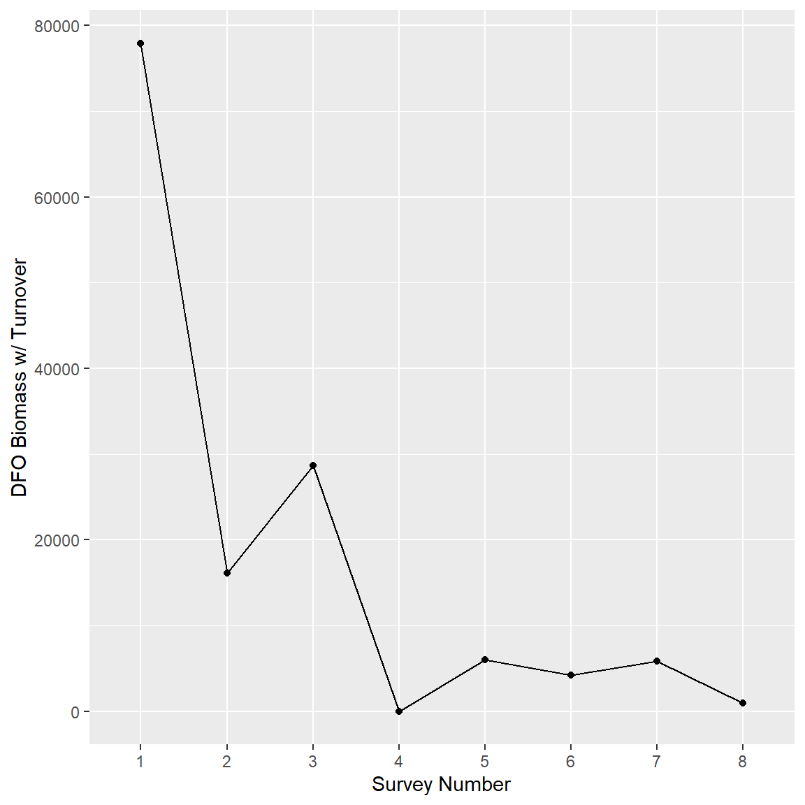
<table class=" lightable-paper lightable-striped" style='color: black; font-family: "Arial Narrow", arial, helvetica, sans-serif; width: auto !important; margin-left: auto; margin-right: auto;'>
 <thead>
  <tr>
   <th style="text-align:center;"> Year </th>
   <th style="text-align:center;"> Ground </th>
   <th style="text-align:center;"> Survey Number </th>
   <th style="text-align:center;"> DFO (Turnover Adjusted) </th>
  </tr>
 </thead>
<tbody>
  <tr>
   <td style="text-align:center;"> 2018 </td>
   <td style="text-align:center;"> Scots Bay </td>
   <td style="text-align:center;"> 1 </td>
   <td style="text-align:center;"> 77909 </td>
  </tr>
  <tr>
   <td style="text-align:center;"> 2018 </td>
   <td style="text-align:center;"> Scots Bay </td>
   <td style="text-align:center;"> 2 </td>
   <td style="text-align:center;"> 16137 </td>
  </tr>
  <tr>
   <td style="text-align:center;"> 2018 </td>
   <td style="text-align:center;"> Scots Bay </td>
   <td style="text-align:center;"> 3 </td>
   <td style="text-align:center;"> 28647 </td>
  </tr>
  <tr>
   <td style="text-align:center;"> 2018 </td>
   <td style="text-align:center;"> Scots Bay </td>
   <td style="text-align:center;"> 4 </td>
   <td style="text-align:center;"> 0 </td>
  </tr>
  <tr>
   <td style="text-align:center;"> 2018 </td>
   <td style="text-align:center;"> Scots Bay </td>
   <td style="text-align:center;"> 5 </td>
   <td style="text-align:center;"> 5984 </td>
  </tr>
  <tr>
   <td style="text-align:center;"> 2018 </td>
   <td style="text-align:center;"> Scots Bay </td>
   <td style="text-align:center;"> 6 </td>
   <td style="text-align:center;"> 4182 </td>
  </tr>
  <tr>
   <td style="text-align:center;"> 2018 </td>
   <td style="text-align:center;"> Scots Bay </td>
   <td style="text-align:center;"> 7 </td>
   <td style="text-align:center;"> 5819 </td>
  </tr>
  <tr>
   <td style="text-align:center;"> 2018 </td>
   <td style="text-align:center;"> Scots Bay </td>
   <td style="text-align:center;"> 8 </td>
   <td style="text-align:center;"> 973 </td>
  </tr>
</tbody>
</table>

#####  2019 

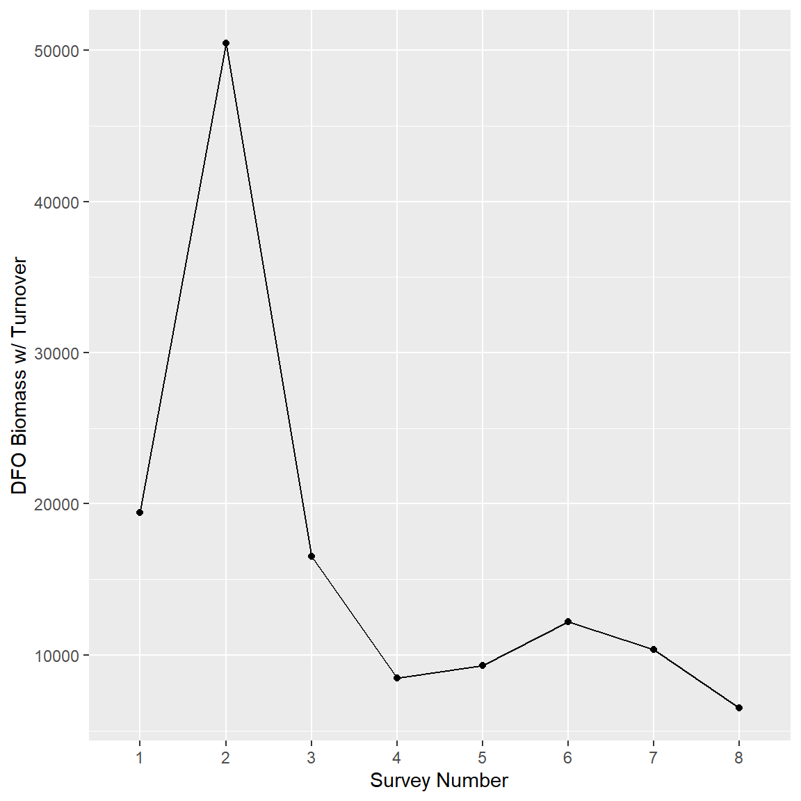
<table class=" lightable-paper lightable-striped" style='color: black; font-family: "Arial Narrow", arial, helvetica, sans-serif; width: auto !important; margin-left: auto; margin-right: auto;'>
 <thead>
  <tr>
   <th style="text-align:center;"> Year </th>
   <th style="text-align:center;"> Ground </th>
   <th style="text-align:center;"> Survey Number </th>
   <th style="text-align:center;"> DFO (Turnover Adjusted) </th>
  </tr>
 </thead>
<tbody>
  <tr>
   <td style="text-align:center;"> 2019 </td>
   <td style="text-align:center;"> Scots Bay </td>
   <td style="text-align:center;"> 1 </td>
   <td style="text-align:center;"> 19443 </td>
  </tr>
  <tr>
   <td style="text-align:center;"> 2019 </td>
   <td style="text-align:center;"> Scots Bay </td>
   <td style="text-align:center;"> 2 </td>
   <td style="text-align:center;"> 50468 </td>
  </tr>
  <tr>
   <td style="text-align:center;"> 2019 </td>
   <td style="text-align:center;"> Scots Bay </td>
   <td style="text-align:center;"> 3 </td>
   <td style="text-align:center;"> 16508 </td>
  </tr>
  <tr>
   <td style="text-align:center;"> 2019 </td>
   <td style="text-align:center;"> Scots Bay </td>
   <td style="text-align:center;"> 4 </td>
   <td style="text-align:center;"> 8475 </td>
  </tr>
  <tr>
   <td style="text-align:center;"> 2019 </td>
   <td style="text-align:center;"> Scots Bay </td>
   <td style="text-align:center;"> 5 </td>
   <td style="text-align:center;"> 9324 </td>
  </tr>
  <tr>
   <td style="text-align:center;"> 2019 </td>
   <td style="text-align:center;"> Scots Bay </td>
   <td style="text-align:center;"> 6 </td>
   <td style="text-align:center;"> 12220 </td>
  </tr>
  <tr>
   <td style="text-align:center;"> 2019 </td>
   <td style="text-align:center;"> Scots Bay </td>
   <td style="text-align:center;"> 7 </td>
   <td style="text-align:center;"> 10373 </td>
  </tr>
  <tr>
   <td style="text-align:center;"> 2019 </td>
   <td style="text-align:center;"> Scots Bay </td>
   <td style="text-align:center;"> 8 </td>
   <td style="text-align:center;"> 6520 </td>
  </tr>
</tbody>
</table>

#####  2020 

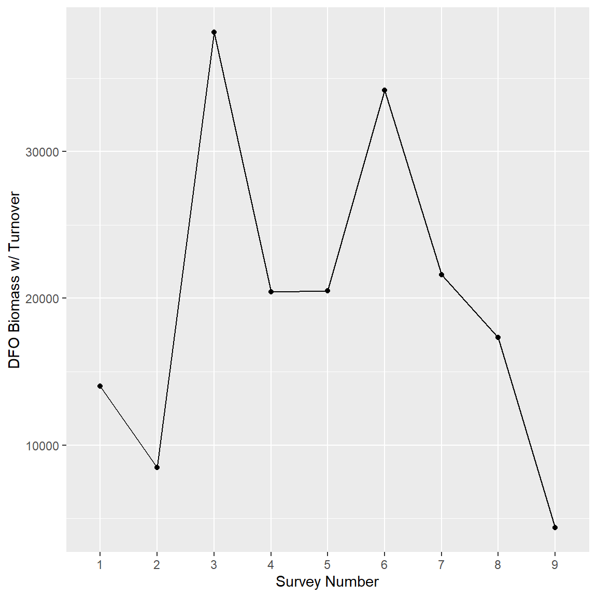
<table class=" lightable-paper lightable-striped" style='color: black; font-family: "Arial Narrow", arial, helvetica, sans-serif; width: auto !important; margin-left: auto; margin-right: auto;'>
 <thead>
  <tr>
   <th style="text-align:center;"> Year </th>
   <th style="text-align:center;"> Ground </th>
   <th style="text-align:center;"> Survey Number </th>
   <th style="text-align:center;"> DFO (Turnover Adjusted) </th>
  </tr>
 </thead>
<tbody>
  <tr>
   <td style="text-align:center;"> 2020 </td>
   <td style="text-align:center;"> Scots Bay </td>
   <td style="text-align:center;"> 1 </td>
   <td style="text-align:center;"> 13994 </td>
  </tr>
  <tr>
   <td style="text-align:center;"> 2020 </td>
   <td style="text-align:center;"> Scots Bay </td>
   <td style="text-align:center;"> 2 </td>
   <td style="text-align:center;"> 8483 </td>
  </tr>
  <tr>
   <td style="text-align:center;"> 2020 </td>
   <td style="text-align:center;"> Scots Bay </td>
   <td style="text-align:center;"> 3 </td>
   <td style="text-align:center;"> 38133 </td>
  </tr>
  <tr>
   <td style="text-align:center;"> 2020 </td>
   <td style="text-align:center;"> Scots Bay </td>
   <td style="text-align:center;"> 4 </td>
   <td style="text-align:center;"> 20446 </td>
  </tr>
  <tr>
   <td style="text-align:center;"> 2020 </td>
   <td style="text-align:center;"> Scots Bay </td>
   <td style="text-align:center;"> 5 </td>
   <td style="text-align:center;"> 20510 </td>
  </tr>
  <tr>
   <td style="text-align:center;"> 2020 </td>
   <td style="text-align:center;"> Scots Bay </td>
   <td style="text-align:center;"> 6 </td>
   <td style="text-align:center;"> 34178 </td>
  </tr>
  <tr>
   <td style="text-align:center;"> 2020 </td>
   <td style="text-align:center;"> Scots Bay </td>
   <td style="text-align:center;"> 7 </td>
   <td style="text-align:center;"> 21606 </td>
  </tr>
  <tr>
   <td style="text-align:center;"> 2020 </td>
   <td style="text-align:center;"> Scots Bay </td>
   <td style="text-align:center;"> 8 </td>
   <td style="text-align:center;"> 17325 </td>
  </tr>
  <tr>
   <td style="text-align:center;"> 2020 </td>
   <td style="text-align:center;"> Scots Bay </td>
   <td style="text-align:center;"> 9 </td>
   <td style="text-align:center;"> 4384 </td>
  </tr>
</tbody>
</table>

#####  2021 

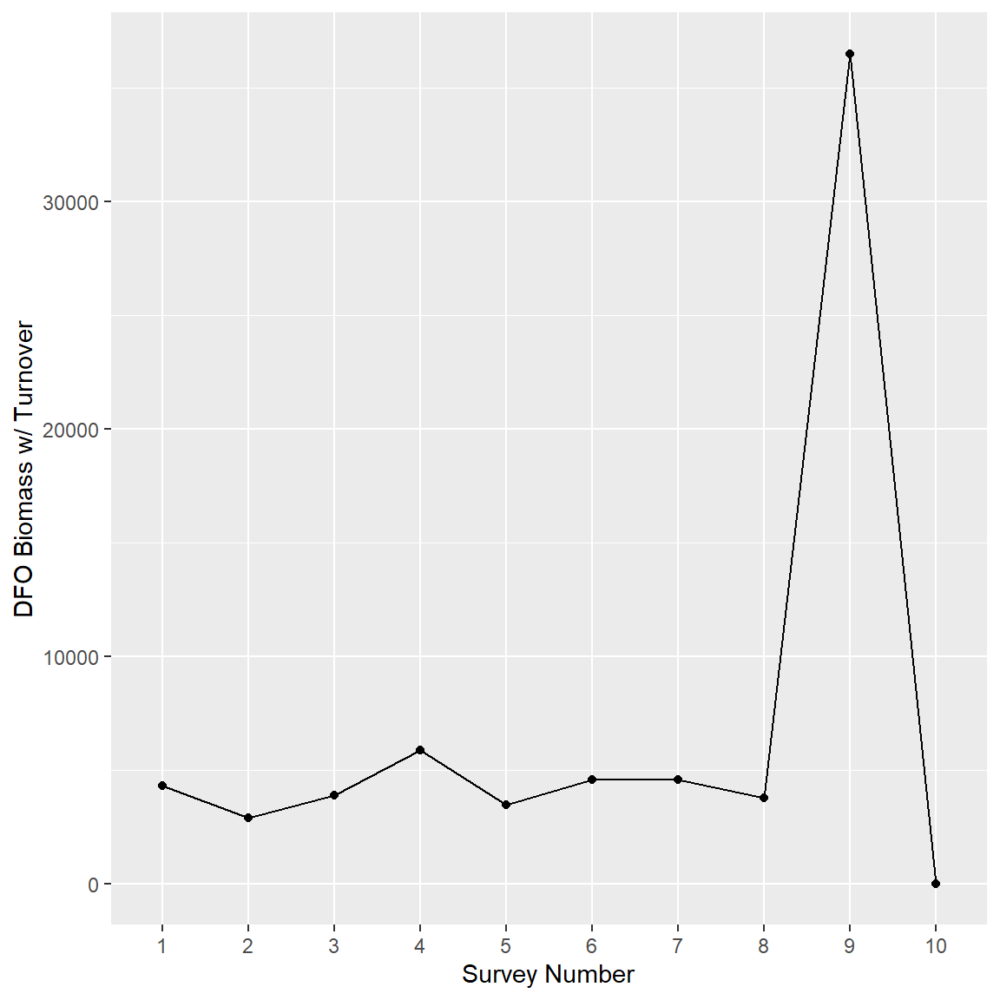
<table class=" lightable-paper lightable-striped" style='color: black; font-family: "Arial Narrow", arial, helvetica, sans-serif; width: auto !important; margin-left: auto; margin-right: auto;'>
 <thead>
  <tr>
   <th style="text-align:center;"> Year </th>
   <th style="text-align:center;"> Ground </th>
   <th style="text-align:center;"> Survey Number </th>
   <th style="text-align:center;"> DFO (Turnover Adjusted) </th>
  </tr>
 </thead>
<tbody>
  <tr>
   <td style="text-align:center;"> 2021 </td>
   <td style="text-align:center;"> Scots Bay </td>
   <td style="text-align:center;"> 1 </td>
   <td style="text-align:center;"> 4302 </td>
  </tr>
  <tr>
   <td style="text-align:center;"> 2021 </td>
   <td style="text-align:center;"> Scots Bay </td>
   <td style="text-align:center;"> 2 </td>
   <td style="text-align:center;"> 2881 </td>
  </tr>
  <tr>
   <td style="text-align:center;"> 2021 </td>
   <td style="text-align:center;"> Scots Bay </td>
   <td style="text-align:center;"> 3 </td>
   <td style="text-align:center;"> 3879 </td>
  </tr>
  <tr>
   <td style="text-align:center;"> 2021 </td>
   <td style="text-align:center;"> Scots Bay </td>
   <td style="text-align:center;"> 4 </td>
   <td style="text-align:center;"> 5861 </td>
  </tr>
  <tr>
   <td style="text-align:center;"> 2021 </td>
   <td style="text-align:center;"> Scots Bay </td>
   <td style="text-align:center;"> 5 </td>
   <td style="text-align:center;"> 3462 </td>
  </tr>
  <tr>
   <td style="text-align:center;"> 2021 </td>
   <td style="text-align:center;"> Scots Bay </td>
   <td style="text-align:center;"> 6 </td>
   <td style="text-align:center;"> 4587 </td>
  </tr>
  <tr>
   <td style="text-align:center;"> 2021 </td>
   <td style="text-align:center;"> Scots Bay </td>
   <td style="text-align:center;"> 7 </td>
   <td style="text-align:center;"> 4586 </td>
  </tr>
  <tr>
   <td style="text-align:center;"> 2021 </td>
   <td style="text-align:center;"> Scots Bay </td>
   <td style="text-align:center;"> 8 </td>
   <td style="text-align:center;"> 3765 </td>
  </tr>
  <tr>
   <td style="text-align:center;"> 2021 </td>
   <td style="text-align:center;"> Scots Bay </td>
   <td style="text-align:center;"> 9 </td>
   <td style="text-align:center;"> 36508 </td>
  </tr>
  <tr>
   <td style="text-align:center;"> 2021 </td>
   <td style="text-align:center;"> Scots Bay </td>
   <td style="text-align:center;"> 10 </td>
   <td style="text-align:center;"> 0 </td>
  </tr>
</tbody>
</table>

#####  2022 

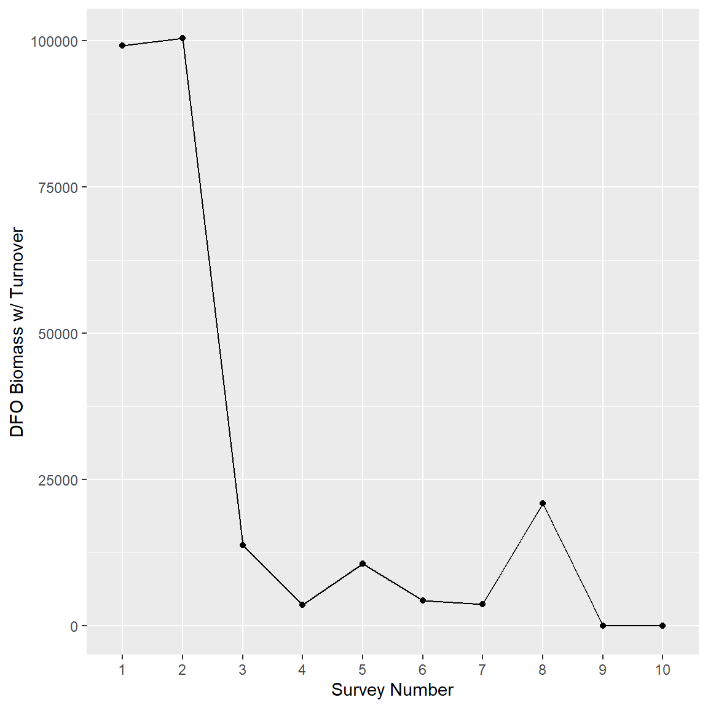
<table class=" lightable-paper lightable-striped" style='color: black; font-family: "Arial Narrow", arial, helvetica, sans-serif; width: auto !important; margin-left: auto; margin-right: auto;'>
 <thead>
  <tr>
   <th style="text-align:center;"> Year </th>
   <th style="text-align:center;"> Ground </th>
   <th style="text-align:center;"> Survey Number </th>
   <th style="text-align:center;"> DFO (Turnover Adjusted) </th>
  </tr>
 </thead>
<tbody>
  <tr>
   <td style="text-align:center;"> 2022 </td>
   <td style="text-align:center;"> Scots Bay </td>
   <td style="text-align:center;"> 1 </td>
   <td style="text-align:center;"> 99092 </td>
  </tr>
  <tr>
   <td style="text-align:center;"> 2022 </td>
   <td style="text-align:center;"> Scots Bay </td>
   <td style="text-align:center;"> 2 </td>
   <td style="text-align:center;"> 100407 </td>
  </tr>
  <tr>
   <td style="text-align:center;"> 2022 </td>
   <td style="text-align:center;"> Scots Bay </td>
   <td style="text-align:center;"> 3 </td>
   <td style="text-align:center;"> 13709 </td>
  </tr>
  <tr>
   <td style="text-align:center;"> 2022 </td>
   <td style="text-align:center;"> Scots Bay </td>
   <td style="text-align:center;"> 4 </td>
   <td style="text-align:center;"> 3515 </td>
  </tr>
  <tr>
   <td style="text-align:center;"> 2022 </td>
   <td style="text-align:center;"> Scots Bay </td>
   <td style="text-align:center;"> 5 </td>
   <td style="text-align:center;"> 10536 </td>
  </tr>
  <tr>
   <td style="text-align:center;"> 2022 </td>
   <td style="text-align:center;"> Scots Bay </td>
   <td style="text-align:center;"> 6 </td>
   <td style="text-align:center;"> 4248 </td>
  </tr>
  <tr>
   <td style="text-align:center;"> 2022 </td>
   <td style="text-align:center;"> Scots Bay </td>
   <td style="text-align:center;"> 7 </td>
   <td style="text-align:center;"> 3656 </td>
  </tr>
  <tr>
   <td style="text-align:center;"> 2022 </td>
   <td style="text-align:center;"> Scots Bay </td>
   <td style="text-align:center;"> 8 </td>
   <td style="text-align:center;"> 20848 </td>
  </tr>
  <tr>
   <td style="text-align:center;"> 2022 </td>
   <td style="text-align:center;"> Scots Bay </td>
   <td style="text-align:center;"> 9 </td>
   <td style="text-align:center;"> 0 </td>
  </tr>
  <tr>
   <td style="text-align:center;"> 2022 </td>
   <td style="text-align:center;"> Scots Bay </td>
   <td style="text-align:center;"> 10 </td>
   <td style="text-align:center;"> 0 </td>
  </tr>
</tbody>
</table>

#####  2023 

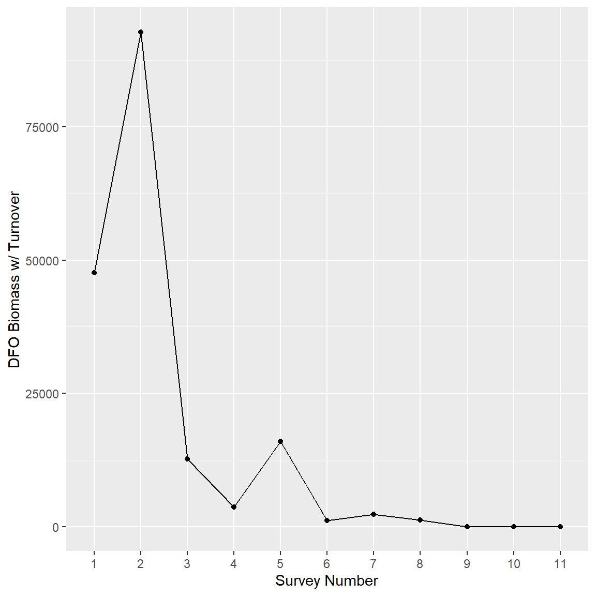
<table class=" lightable-paper lightable-striped" style='color: black; font-family: "Arial Narrow", arial, helvetica, sans-serif; width: auto !important; margin-left: auto; margin-right: auto;'>
 <thead>
  <tr>
   <th style="text-align:center;"> Year </th>
   <th style="text-align:center;"> Ground </th>
   <th style="text-align:center;"> Survey Number </th>
   <th style="text-align:center;"> DFO (Turnover Adjusted) </th>
  </tr>
 </thead>
<tbody>
  <tr>
   <td style="text-align:center;"> 2023 </td>
   <td style="text-align:center;"> Scots Bay </td>
   <td style="text-align:center;"> 1 </td>
   <td style="text-align:center;"> 47629 </td>
  </tr>
  <tr>
   <td style="text-align:center;"> 2023 </td>
   <td style="text-align:center;"> Scots Bay </td>
   <td style="text-align:center;"> 2 </td>
   <td style="text-align:center;"> 92772 </td>
  </tr>
  <tr>
   <td style="text-align:center;"> 2023 </td>
   <td style="text-align:center;"> Scots Bay </td>
   <td style="text-align:center;"> 3 </td>
   <td style="text-align:center;"> 12720 </td>
  </tr>
  <tr>
   <td style="text-align:center;"> 2023 </td>
   <td style="text-align:center;"> Scots Bay </td>
   <td style="text-align:center;"> 4 </td>
   <td style="text-align:center;"> 3622 </td>
  </tr>
  <tr>
   <td style="text-align:center;"> 2023 </td>
   <td style="text-align:center;"> Scots Bay </td>
   <td style="text-align:center;"> 5 </td>
   <td style="text-align:center;"> 16022 </td>
  </tr>
  <tr>
   <td style="text-align:center;"> 2023 </td>
   <td style="text-align:center;"> Scots Bay </td>
   <td style="text-align:center;"> 6 </td>
   <td style="text-align:center;"> 1093 </td>
  </tr>
  <tr>
   <td style="text-align:center;"> 2023 </td>
   <td style="text-align:center;"> Scots Bay </td>
   <td style="text-align:center;"> 7 </td>
   <td style="text-align:center;"> 2247 </td>
  </tr>
  <tr>
   <td style="text-align:center;"> 2023 </td>
   <td style="text-align:center;"> Scots Bay </td>
   <td style="text-align:center;"> 8 </td>
   <td style="text-align:center;"> 1224 </td>
  </tr>
  <tr>
   <td style="text-align:center;"> 2023 </td>
   <td style="text-align:center;"> Scots Bay </td>
   <td style="text-align:center;"> 9 </td>
   <td style="text-align:center;"> 0 </td>
  </tr>
  <tr>
   <td style="text-align:center;"> 2023 </td>
   <td style="text-align:center;"> Scots Bay </td>
   <td style="text-align:center;"> 10 </td>
   <td style="text-align:center;"> 0 </td>
  </tr>
  <tr>
   <td style="text-align:center;"> 2023 </td>
   <td style="text-align:center;"> Scots Bay </td>
   <td style="text-align:center;"> 11 </td>
   <td style="text-align:center;"> 0 </td>
  </tr>
</tbody>
</table>

#####  2024 

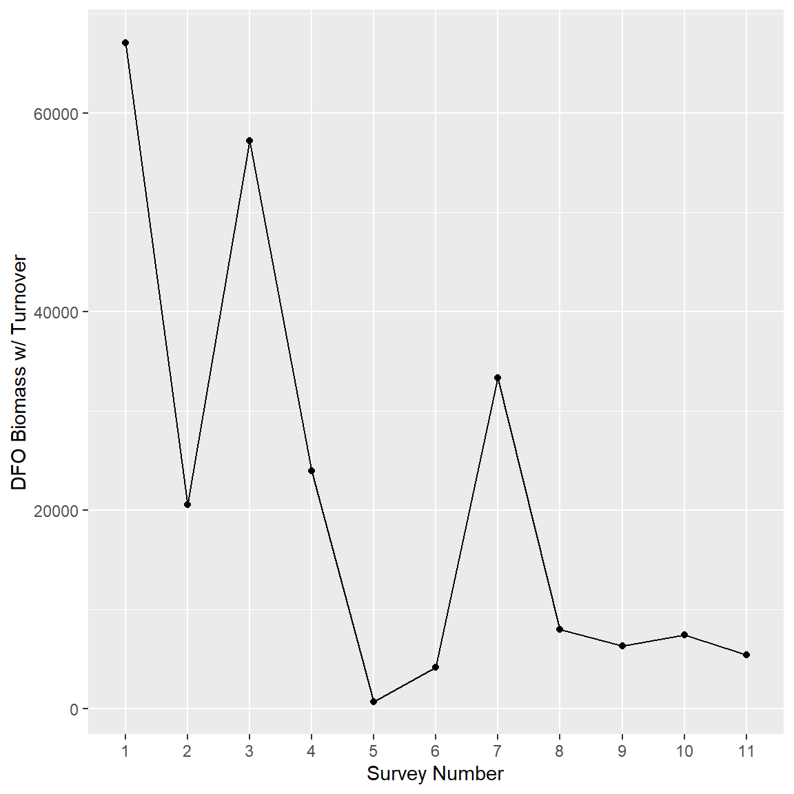
<table class=" lightable-paper lightable-striped" style='color: black; font-family: "Arial Narrow", arial, helvetica, sans-serif; width: auto !important; margin-left: auto; margin-right: auto;'>
 <thead>
  <tr>
   <th style="text-align:center;"> Year </th>
   <th style="text-align:center;"> Ground </th>
   <th style="text-align:center;"> Survey Number </th>
   <th style="text-align:center;"> DFO (Turnover Adjusted) </th>
  </tr>
 </thead>
<tbody>
  <tr>
   <td style="text-align:center;"> 2024 </td>
   <td style="text-align:center;"> Scots Bay </td>
   <td style="text-align:center;"> 1 </td>
   <td style="text-align:center;"> 67094 </td>
  </tr>
  <tr>
   <td style="text-align:center;"> 2024 </td>
   <td style="text-align:center;"> Scots Bay </td>
   <td style="text-align:center;"> 2 </td>
   <td style="text-align:center;"> 20566 </td>
  </tr>
  <tr>
   <td style="text-align:center;"> 2024 </td>
   <td style="text-align:center;"> Scots Bay </td>
   <td style="text-align:center;"> 3 </td>
   <td style="text-align:center;"> 57220 </td>
  </tr>
  <tr>
   <td style="text-align:center;"> 2024 </td>
   <td style="text-align:center;"> Scots Bay </td>
   <td style="text-align:center;"> 4 </td>
   <td style="text-align:center;"> 23965 </td>
  </tr>
  <tr>
   <td style="text-align:center;"> 2024 </td>
   <td style="text-align:center;"> Scots Bay </td>
   <td style="text-align:center;"> 5 </td>
   <td style="text-align:center;"> 705 </td>
  </tr>
  <tr>
   <td style="text-align:center;"> 2024 </td>
   <td style="text-align:center;"> Scots Bay </td>
   <td style="text-align:center;"> 6 </td>
   <td style="text-align:center;"> 4183 </td>
  </tr>
  <tr>
   <td style="text-align:center;"> 2024 </td>
   <td style="text-align:center;"> Scots Bay </td>
   <td style="text-align:center;"> 7 </td>
   <td style="text-align:center;"> 33327 </td>
  </tr>
  <tr>
   <td style="text-align:center;"> 2024 </td>
   <td style="text-align:center;"> Scots Bay </td>
   <td style="text-align:center;"> 8 </td>
   <td style="text-align:center;"> 7959 </td>
  </tr>
  <tr>
   <td style="text-align:center;"> 2024 </td>
   <td style="text-align:center;"> Scots Bay </td>
   <td style="text-align:center;"> 9 </td>
   <td style="text-align:center;"> 6338 </td>
  </tr>
  <tr>
   <td style="text-align:center;"> 2024 </td>
   <td style="text-align:center;"> Scots Bay </td>
   <td style="text-align:center;"> 10 </td>
   <td style="text-align:center;"> 7432 </td>
  </tr>
  <tr>
   <td style="text-align:center;"> 2024 </td>
   <td style="text-align:center;"> Scots Bay </td>
   <td style="text-align:center;"> 11 </td>
   <td style="text-align:center;"> 5427 </td>
  </tr>
</tbody>
</table>

#####  2025 

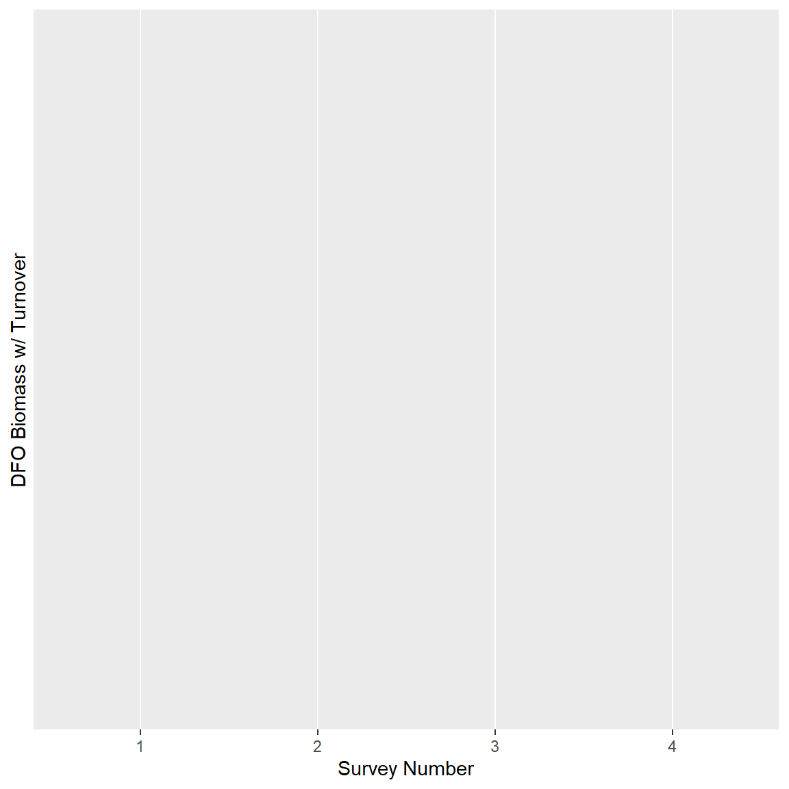
<table class=" lightable-paper lightable-striped" style='color: black; font-family: "Arial Narrow", arial, helvetica, sans-serif; width: auto !important; margin-left: auto; margin-right: auto;'>
 <thead>
  <tr>
   <th style="text-align:center;"> Year </th>
   <th style="text-align:center;"> Ground </th>
   <th style="text-align:center;"> Survey Number </th>
   <th style="text-align:center;"> DFO (Turnover Adjusted) </th>
  </tr>
 </thead>
<tbody>
  <tr>
   <td style="text-align:center;"> 2025 </td>
   <td style="text-align:center;"> Scots Bay </td>
   <td style="text-align:center;"> 1 </td>
   <td style="text-align:center;"> NA </td>
  </tr>
  <tr>
   <td style="text-align:center;"> 2025 </td>
   <td style="text-align:center;"> Scots Bay </td>
   <td style="text-align:center;"> 2 </td>
   <td style="text-align:center;"> NA </td>
  </tr>
  <tr>
   <td style="text-align:center;"> 2025 </td>
   <td style="text-align:center;"> Scots Bay </td>
   <td style="text-align:center;"> 3 </td>
   <td style="text-align:center;"> NA </td>
  </tr>
  <tr>
   <td style="text-align:center;"> 2025 </td>
   <td style="text-align:center;"> Scots Bay </td>
   <td style="text-align:center;"> 4 </td>
   <td style="text-align:center;"> NA </td>
  </tr>
  <tr>
   <td style="text-align:center;"> 2025 </td>
   <td style="text-align:center;"> Scots Bay </td>
   <td style="text-align:center;"> 5 </td>
   <td style="text-align:center;"> NA </td>
  </tr>
  <tr>
   <td style="text-align:center;"> 2025 </td>
   <td style="text-align:center;"> Scots Bay </td>
   <td style="text-align:center;"> 6 </td>
   <td style="text-align:center;"> NA </td>
  </tr>
  <tr>
   <td style="text-align:center;"> 2025 </td>
   <td style="text-align:center;"> Scots Bay </td>
   <td style="text-align:center;"> 7 </td>
   <td style="text-align:center;"> NA </td>
  </tr>
  <tr>
   <td style="text-align:center;"> 2025 </td>
   <td style="text-align:center;"> Scots Bay </td>
   <td style="text-align:center;"> 8 </td>
   <td style="text-align:center;"> NA </td>
  </tr>
  <tr>
   <td style="text-align:center;"> 2025 </td>
   <td style="text-align:center;"> Scots Bay </td>
   <td style="text-align:center;"> 9 </td>
   <td style="text-align:center;"> NA </td>
  </tr>
  <tr>
   <td style="text-align:center;"> 2025 </td>
   <td style="text-align:center;"> Scots Bay </td>
   <td style="text-align:center;"> 10 </td>
   <td style="text-align:center;"> NA </td>
  </tr>
  <tr>
   <td style="text-align:center;"> 2025 </td>
   <td style="text-align:center;"> Scots Bay </td>
   <td style="text-align:center;"> 11 </td>
   <td style="text-align:center;"> NA </td>
  </tr>
</tbody>
</table>

#####  2026 

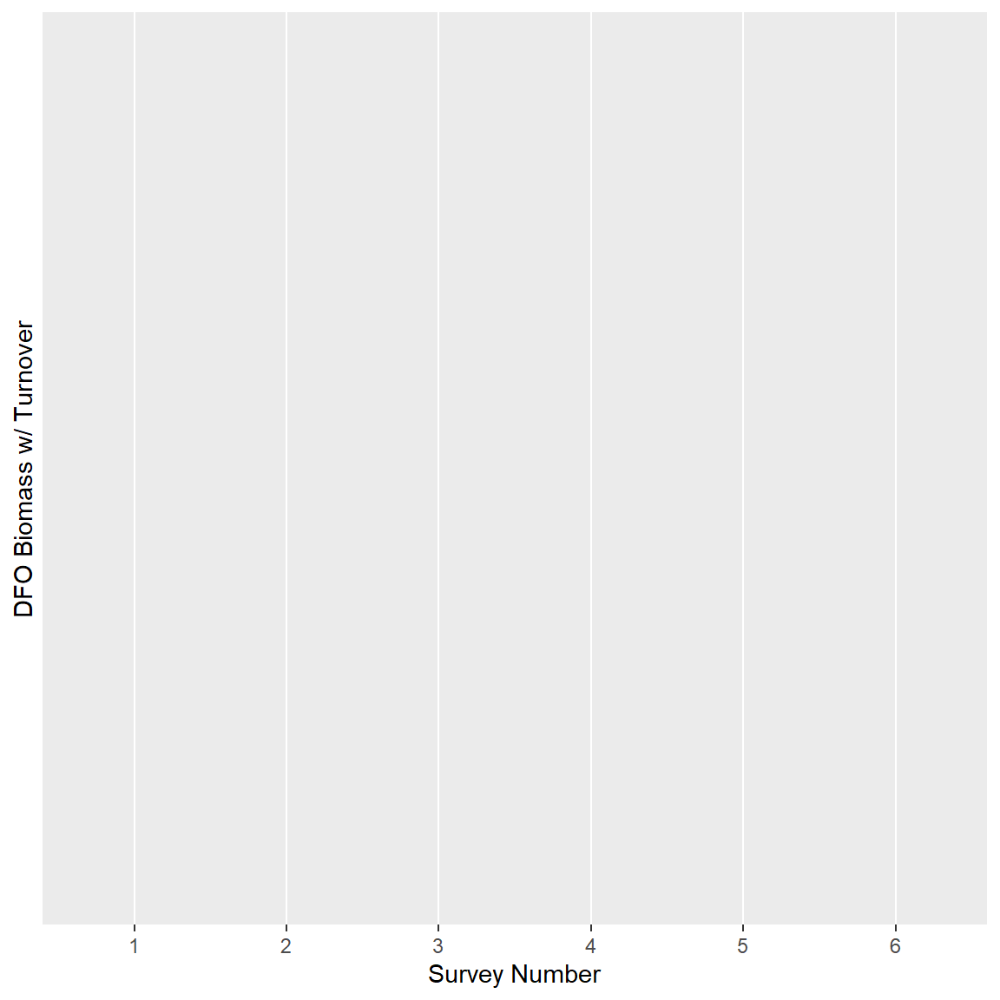
<table class=" lightable-paper lightable-striped" style='color: black; font-family: "Arial Narrow", arial, helvetica, sans-serif; width: auto !important; margin-left: auto; margin-right: auto;'>
 <thead>
  <tr>
   <th style="text-align:center;"> Year </th>
   <th style="text-align:center;"> Ground </th>
   <th style="text-align:center;"> Survey Number </th>
   <th style="text-align:center;"> DFO (Turnover Adjusted) </th>
  </tr>
 </thead>
<tbody>
  <tr>
   <td style="text-align:center;"> 2026 </td>
   <td style="text-align:center;"> Scots Bay </td>
   <td style="text-align:center;"> 1 </td>
   <td style="text-align:center;"> NA </td>
  </tr>
  <tr>
   <td style="text-align:center;"> 2026 </td>
   <td style="text-align:center;"> Scots Bay </td>
   <td style="text-align:center;"> 2 </td>
   <td style="text-align:center;"> NA </td>
  </tr>
  <tr>
   <td style="text-align:center;"> 2026 </td>
   <td style="text-align:center;"> Scots Bay </td>
   <td style="text-align:center;"> 3 </td>
   <td style="text-align:center;"> NA </td>
  </tr>
  <tr>
   <td style="text-align:center;"> 2026 </td>
   <td style="text-align:center;"> Scots Bay </td>
   <td style="text-align:center;"> 4 </td>
   <td style="text-align:center;"> NA </td>
  </tr>
  <tr>
   <td style="text-align:center;"> 2026 </td>
   <td style="text-align:center;"> Scots Bay </td>
   <td style="text-align:center;"> 5 </td>
   <td style="text-align:center;"> NA </td>
  </tr>
  <tr>
   <td style="text-align:center;"> 2026 </td>
   <td style="text-align:center;"> Scots Bay </td>
   <td style="text-align:center;"> 6 </td>
   <td style="text-align:center;"> NA </td>
  </tr>
</tbody>
</table>

#### German Bank {.tabset .tabset-pills}


#####  1999 

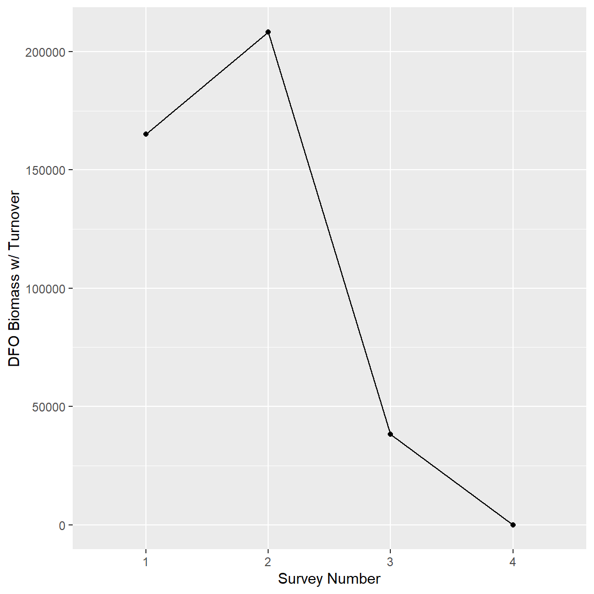
<table class=" lightable-paper lightable-striped" style='color: black; font-family: "Arial Narrow", arial, helvetica, sans-serif; width: auto !important; margin-left: auto; margin-right: auto;'>
 <thead>
  <tr>
   <th style="text-align:center;"> Year </th>
   <th style="text-align:center;"> Ground </th>
   <th style="text-align:center;"> Survey Number </th>
   <th style="text-align:center;"> DFO (Turnover Adjusted) </th>
  </tr>
 </thead>
<tbody>
  <tr>
   <td style="text-align:center;"> 1999 </td>
   <td style="text-align:center;"> German Bank </td>
   <td style="text-align:center;"> 1 </td>
   <td style="text-align:center;"> 165085 </td>
  </tr>
  <tr>
   <td style="text-align:center;"> 1999 </td>
   <td style="text-align:center;"> German Bank </td>
   <td style="text-align:center;"> 2 </td>
   <td style="text-align:center;"> 208259 </td>
  </tr>
  <tr>
   <td style="text-align:center;"> 1999 </td>
   <td style="text-align:center;"> German Bank </td>
   <td style="text-align:center;"> 3 </td>
   <td style="text-align:center;"> 38201 </td>
  </tr>
  <tr>
   <td style="text-align:center;"> 1999 </td>
   <td style="text-align:center;"> German Bank </td>
   <td style="text-align:center;"> 4 </td>
   <td style="text-align:center;"> 0 </td>
  </tr>
</tbody>
</table>

#####  2000 

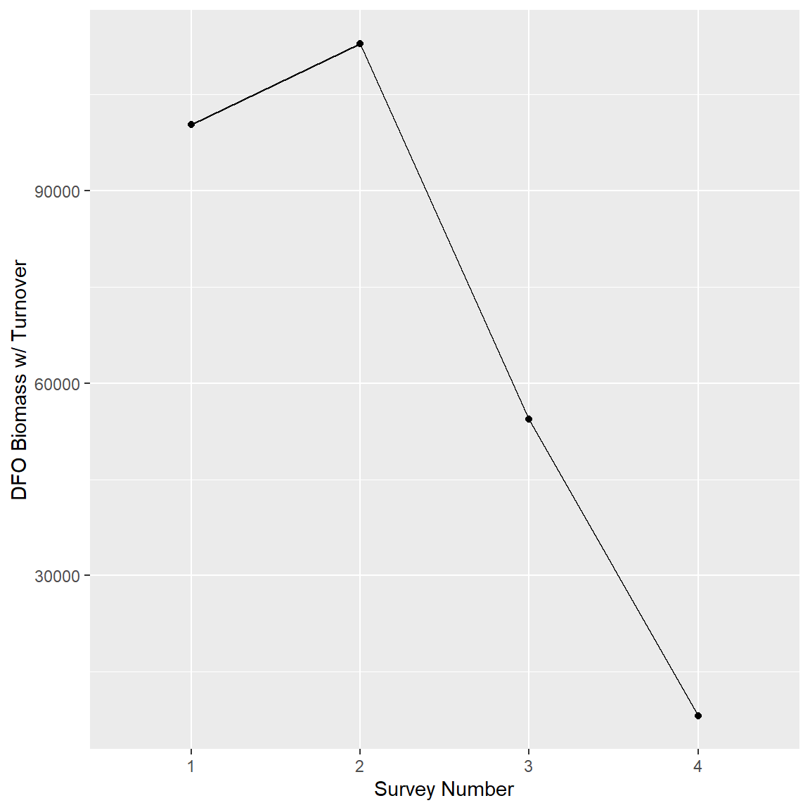
<table class=" lightable-paper lightable-striped" style='color: black; font-family: "Arial Narrow", arial, helvetica, sans-serif; width: auto !important; margin-left: auto; margin-right: auto;'>
 <thead>
  <tr>
   <th style="text-align:center;"> Year </th>
   <th style="text-align:center;"> Ground </th>
   <th style="text-align:center;"> Survey Number </th>
   <th style="text-align:center;"> DFO (Turnover Adjusted) </th>
  </tr>
 </thead>
<tbody>
  <tr>
   <td style="text-align:center;"> 2000 </td>
   <td style="text-align:center;"> German Bank </td>
   <td style="text-align:center;"> 1 </td>
   <td style="text-align:center;"> 100250 </td>
  </tr>
  <tr>
   <td style="text-align:center;"> 2000 </td>
   <td style="text-align:center;"> German Bank </td>
   <td style="text-align:center;"> 2 </td>
   <td style="text-align:center;"> 112849 </td>
  </tr>
  <tr>
   <td style="text-align:center;"> 2000 </td>
   <td style="text-align:center;"> German Bank </td>
   <td style="text-align:center;"> 3 </td>
   <td style="text-align:center;"> 54402 </td>
  </tr>
  <tr>
   <td style="text-align:center;"> 2000 </td>
   <td style="text-align:center;"> German Bank </td>
   <td style="text-align:center;"> 4 </td>
   <td style="text-align:center;"> 8193 </td>
  </tr>
</tbody>
</table>

#####  2001 

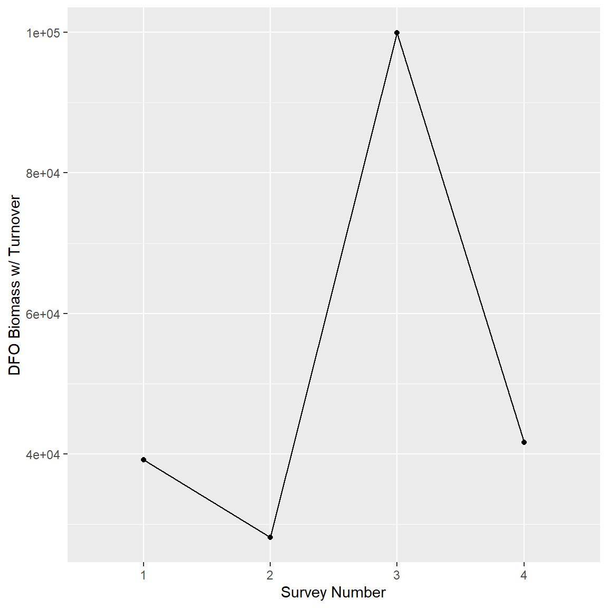
<table class=" lightable-paper lightable-striped" style='color: black; font-family: "Arial Narrow", arial, helvetica, sans-serif; width: auto !important; margin-left: auto; margin-right: auto;'>
 <thead>
  <tr>
   <th style="text-align:center;"> Year </th>
   <th style="text-align:center;"> Ground </th>
   <th style="text-align:center;"> Survey Number </th>
   <th style="text-align:center;"> DFO (Turnover Adjusted) </th>
  </tr>
 </thead>
<tbody>
  <tr>
   <td style="text-align:center;"> 2001 </td>
   <td style="text-align:center;"> German Bank </td>
   <td style="text-align:center;"> 1 </td>
   <td style="text-align:center;"> 39160 </td>
  </tr>
  <tr>
   <td style="text-align:center;"> 2001 </td>
   <td style="text-align:center;"> German Bank </td>
   <td style="text-align:center;"> 2 </td>
   <td style="text-align:center;"> 28178 </td>
  </tr>
  <tr>
   <td style="text-align:center;"> 2001 </td>
   <td style="text-align:center;"> German Bank </td>
   <td style="text-align:center;"> 3 </td>
   <td style="text-align:center;"> 99932 </td>
  </tr>
  <tr>
   <td style="text-align:center;"> 2001 </td>
   <td style="text-align:center;"> German Bank </td>
   <td style="text-align:center;"> 4 </td>
   <td style="text-align:center;"> 41653 </td>
  </tr>
</tbody>
</table>

#####  2002 

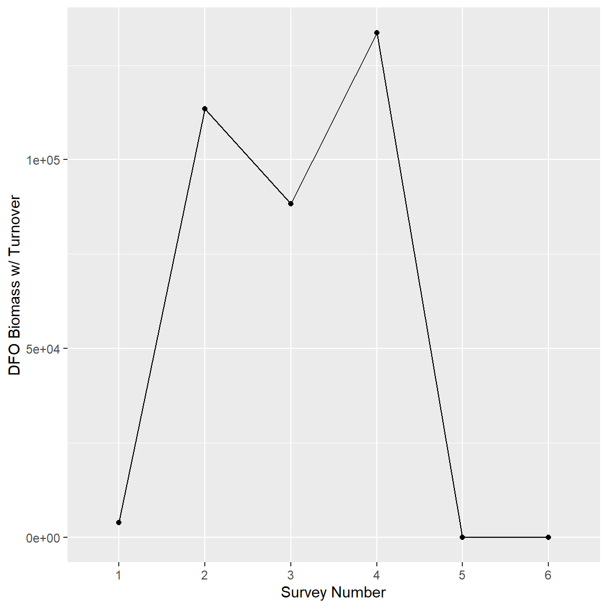
<table class=" lightable-paper lightable-striped" style='color: black; font-family: "Arial Narrow", arial, helvetica, sans-serif; width: auto !important; margin-left: auto; margin-right: auto;'>
 <thead>
  <tr>
   <th style="text-align:center;"> Year </th>
   <th style="text-align:center;"> Ground </th>
   <th style="text-align:center;"> Survey Number </th>
   <th style="text-align:center;"> DFO (Turnover Adjusted) </th>
  </tr>
 </thead>
<tbody>
  <tr>
   <td style="text-align:center;"> 2002 </td>
   <td style="text-align:center;"> German Bank </td>
   <td style="text-align:center;"> 1 </td>
   <td style="text-align:center;"> 3843 </td>
  </tr>
  <tr>
   <td style="text-align:center;"> 2002 </td>
   <td style="text-align:center;"> German Bank </td>
   <td style="text-align:center;"> 2 </td>
   <td style="text-align:center;"> 113430 </td>
  </tr>
  <tr>
   <td style="text-align:center;"> 2002 </td>
   <td style="text-align:center;"> German Bank </td>
   <td style="text-align:center;"> 3 </td>
   <td style="text-align:center;"> 88312 </td>
  </tr>
  <tr>
   <td style="text-align:center;"> 2002 </td>
   <td style="text-align:center;"> German Bank </td>
   <td style="text-align:center;"> 4 </td>
   <td style="text-align:center;"> 133642 </td>
  </tr>
  <tr>
   <td style="text-align:center;"> 2002 </td>
   <td style="text-align:center;"> German Bank </td>
   <td style="text-align:center;"> 5 </td>
   <td style="text-align:center;"> 0 </td>
  </tr>
  <tr>
   <td style="text-align:center;"> 2002 </td>
   <td style="text-align:center;"> German Bank </td>
   <td style="text-align:center;"> 6 </td>
   <td style="text-align:center;"> 0 </td>
  </tr>
</tbody>
</table>

#####  2003 

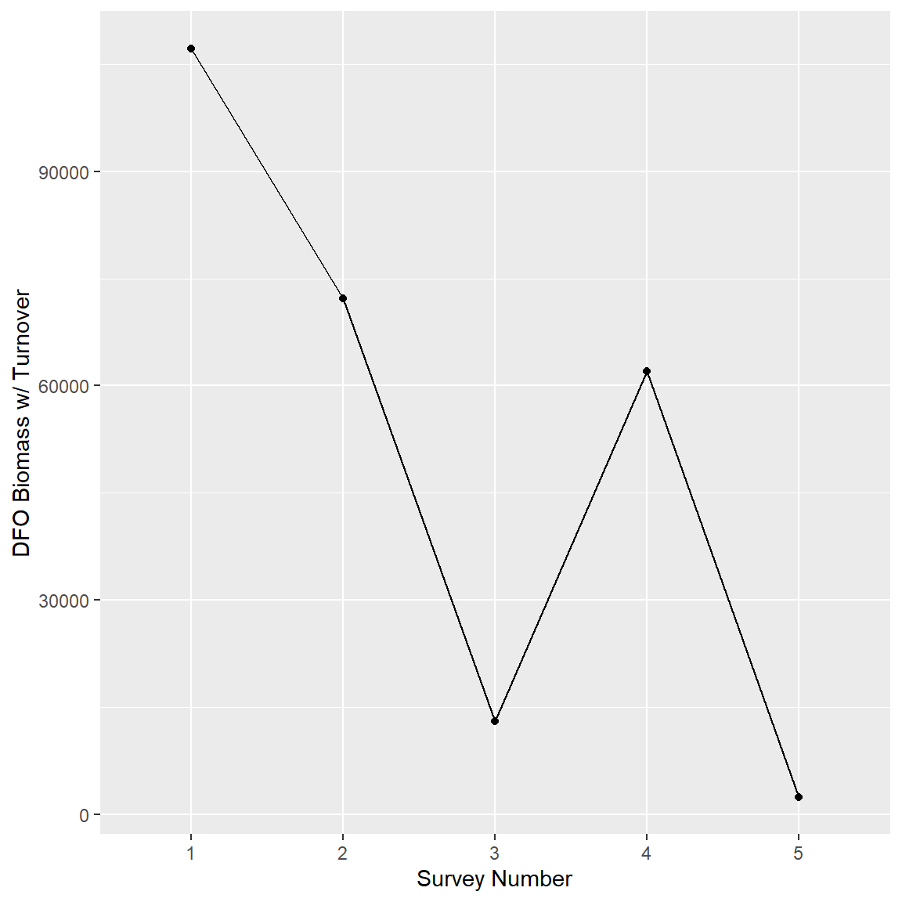
<table class=" lightable-paper lightable-striped" style='color: black; font-family: "Arial Narrow", arial, helvetica, sans-serif; width: auto !important; margin-left: auto; margin-right: auto;'>
 <thead>
  <tr>
   <th style="text-align:center;"> Year </th>
   <th style="text-align:center;"> Ground </th>
   <th style="text-align:center;"> Survey Number </th>
   <th style="text-align:center;"> DFO (Turnover Adjusted) </th>
  </tr>
 </thead>
<tbody>
  <tr>
   <td style="text-align:center;"> 2003 </td>
   <td style="text-align:center;"> German Bank </td>
   <td style="text-align:center;"> 1 </td>
   <td style="text-align:center;"> 107204 </td>
  </tr>
  <tr>
   <td style="text-align:center;"> 2003 </td>
   <td style="text-align:center;"> German Bank </td>
   <td style="text-align:center;"> 2 </td>
   <td style="text-align:center;"> 72263 </td>
  </tr>
  <tr>
   <td style="text-align:center;"> 2003 </td>
   <td style="text-align:center;"> German Bank </td>
   <td style="text-align:center;"> 3 </td>
   <td style="text-align:center;"> 13017 </td>
  </tr>
  <tr>
   <td style="text-align:center;"> 2003 </td>
   <td style="text-align:center;"> German Bank </td>
   <td style="text-align:center;"> 4 </td>
   <td style="text-align:center;"> 61964 </td>
  </tr>
  <tr>
   <td style="text-align:center;"> 2003 </td>
   <td style="text-align:center;"> German Bank </td>
   <td style="text-align:center;"> 5 </td>
   <td style="text-align:center;"> 2400 </td>
  </tr>
</tbody>
</table>

#####  2004 

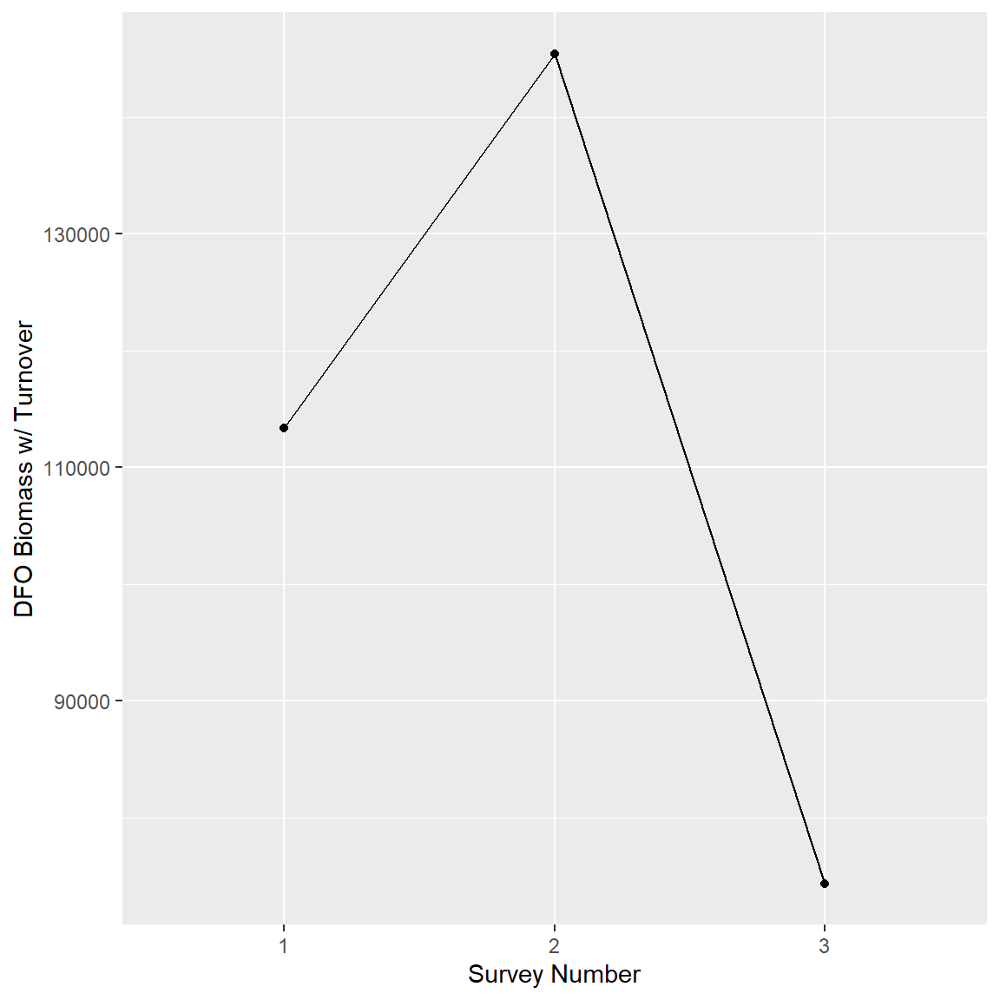
<table class=" lightable-paper lightable-striped" style='color: black; font-family: "Arial Narrow", arial, helvetica, sans-serif; width: auto !important; margin-left: auto; margin-right: auto;'>
 <thead>
  <tr>
   <th style="text-align:center;"> Year </th>
   <th style="text-align:center;"> Ground </th>
   <th style="text-align:center;"> Survey Number </th>
   <th style="text-align:center;"> DFO (Turnover Adjusted) </th>
  </tr>
 </thead>
<tbody>
  <tr>
   <td style="text-align:center;"> 2004 </td>
   <td style="text-align:center;"> German Bank </td>
   <td style="text-align:center;"> 1 </td>
   <td style="text-align:center;"> 113333 </td>
  </tr>
  <tr>
   <td style="text-align:center;"> 2004 </td>
   <td style="text-align:center;"> German Bank </td>
   <td style="text-align:center;"> 2 </td>
   <td style="text-align:center;"> 145400 </td>
  </tr>
  <tr>
   <td style="text-align:center;"> 2004 </td>
   <td style="text-align:center;"> German Bank </td>
   <td style="text-align:center;"> 3 </td>
   <td style="text-align:center;"> 74380 </td>
  </tr>
</tbody>
</table>

#####  2005 

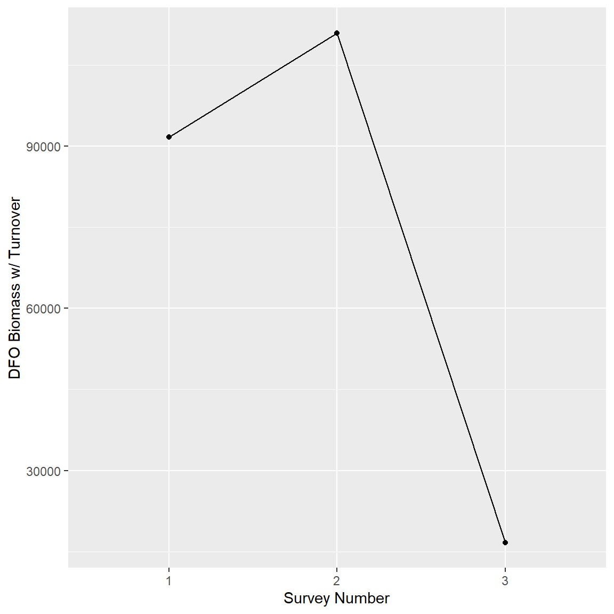
<table class=" lightable-paper lightable-striped" style='color: black; font-family: "Arial Narrow", arial, helvetica, sans-serif; width: auto !important; margin-left: auto; margin-right: auto;'>
 <thead>
  <tr>
   <th style="text-align:center;"> Year </th>
   <th style="text-align:center;"> Ground </th>
   <th style="text-align:center;"> Survey Number </th>
   <th style="text-align:center;"> DFO (Turnover Adjusted) </th>
  </tr>
 </thead>
<tbody>
  <tr>
   <td style="text-align:center;"> 2005 </td>
   <td style="text-align:center;"> German Bank </td>
   <td style="text-align:center;"> 1 </td>
   <td style="text-align:center;"> 91701 </td>
  </tr>
  <tr>
   <td style="text-align:center;"> 2005 </td>
   <td style="text-align:center;"> German Bank </td>
   <td style="text-align:center;"> 2 </td>
   <td style="text-align:center;"> 110942 </td>
  </tr>
  <tr>
   <td style="text-align:center;"> 2005 </td>
   <td style="text-align:center;"> German Bank </td>
   <td style="text-align:center;"> 3 </td>
   <td style="text-align:center;"> 16678 </td>
  </tr>
</tbody>
</table>

#####  2006 

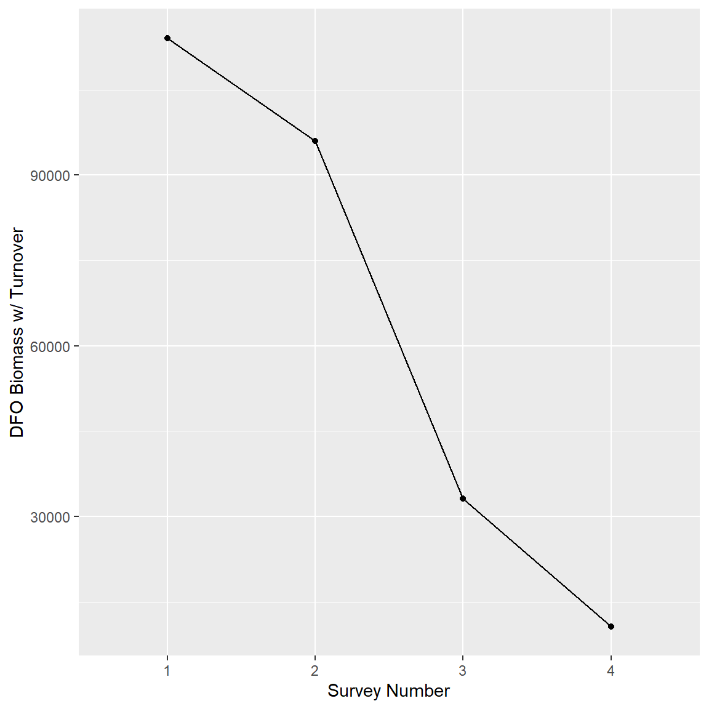
<table class=" lightable-paper lightable-striped" style='color: black; font-family: "Arial Narrow", arial, helvetica, sans-serif; width: auto !important; margin-left: auto; margin-right: auto;'>
 <thead>
  <tr>
   <th style="text-align:center;"> Year </th>
   <th style="text-align:center;"> Ground </th>
   <th style="text-align:center;"> Survey Number </th>
   <th style="text-align:center;"> DFO (Turnover Adjusted) </th>
  </tr>
 </thead>
<tbody>
  <tr>
   <td style="text-align:center;"> 2006 </td>
   <td style="text-align:center;"> German Bank </td>
   <td style="text-align:center;"> 1 </td>
   <td style="text-align:center;"> 114069 </td>
  </tr>
  <tr>
   <td style="text-align:center;"> 2006 </td>
   <td style="text-align:center;"> German Bank </td>
   <td style="text-align:center;"> 2 </td>
   <td style="text-align:center;"> 96009 </td>
  </tr>
  <tr>
   <td style="text-align:center;"> 2006 </td>
   <td style="text-align:center;"> German Bank </td>
   <td style="text-align:center;"> 3 </td>
   <td style="text-align:center;"> 33200 </td>
  </tr>
  <tr>
   <td style="text-align:center;"> 2006 </td>
   <td style="text-align:center;"> German Bank </td>
   <td style="text-align:center;"> 4 </td>
   <td style="text-align:center;"> 10696 </td>
  </tr>
</tbody>
</table>

#####  2007 

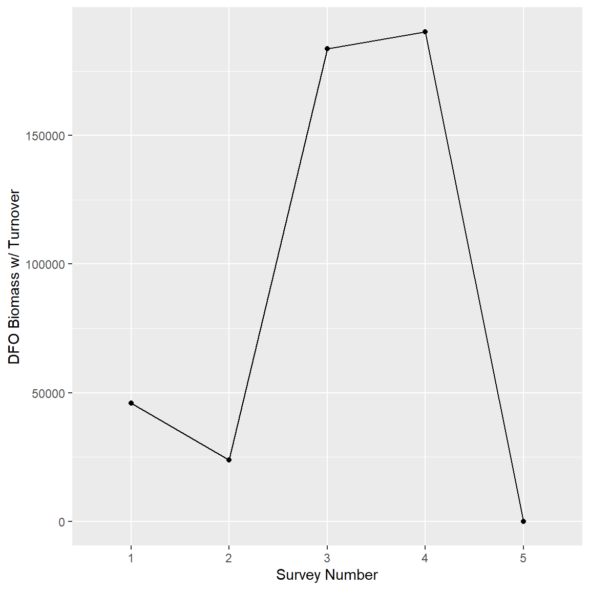
<table class=" lightable-paper lightable-striped" style='color: black; font-family: "Arial Narrow", arial, helvetica, sans-serif; width: auto !important; margin-left: auto; margin-right: auto;'>
 <thead>
  <tr>
   <th style="text-align:center;"> Year </th>
   <th style="text-align:center;"> Ground </th>
   <th style="text-align:center;"> Survey Number </th>
   <th style="text-align:center;"> DFO (Turnover Adjusted) </th>
  </tr>
 </thead>
<tbody>
  <tr>
   <td style="text-align:center;"> 2007 </td>
   <td style="text-align:center;"> German Bank </td>
   <td style="text-align:center;"> 1 </td>
   <td style="text-align:center;"> 45920 </td>
  </tr>
  <tr>
   <td style="text-align:center;"> 2007 </td>
   <td style="text-align:center;"> German Bank </td>
   <td style="text-align:center;"> 2 </td>
   <td style="text-align:center;"> 23814 </td>
  </tr>
  <tr>
   <td style="text-align:center;"> 2007 </td>
   <td style="text-align:center;"> German Bank </td>
   <td style="text-align:center;"> 3 </td>
   <td style="text-align:center;"> 183761 </td>
  </tr>
  <tr>
   <td style="text-align:center;"> 2007 </td>
   <td style="text-align:center;"> German Bank </td>
   <td style="text-align:center;"> 4 </td>
   <td style="text-align:center;"> 190288 </td>
  </tr>
  <tr>
   <td style="text-align:center;"> 2007 </td>
   <td style="text-align:center;"> German Bank </td>
   <td style="text-align:center;"> 5 </td>
   <td style="text-align:center;"> 0 </td>
  </tr>
</tbody>
</table>

#####  2008 

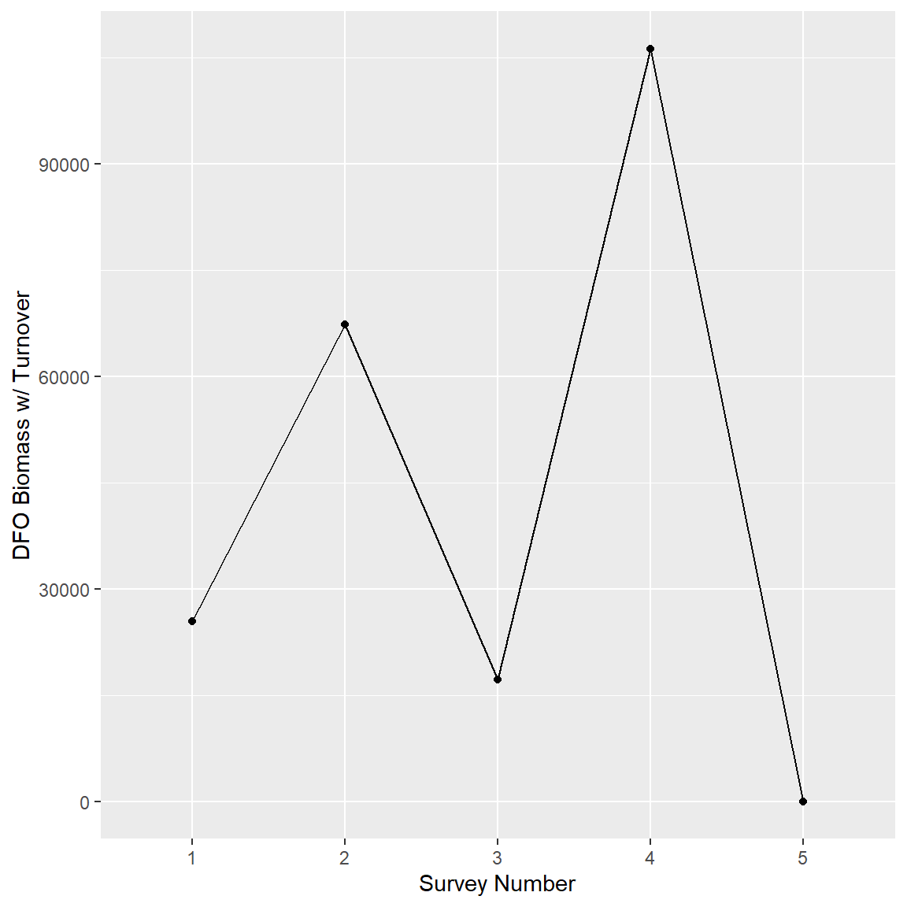
<table class=" lightable-paper lightable-striped" style='color: black; font-family: "Arial Narrow", arial, helvetica, sans-serif; width: auto !important; margin-left: auto; margin-right: auto;'>
 <thead>
  <tr>
   <th style="text-align:center;"> Year </th>
   <th style="text-align:center;"> Ground </th>
   <th style="text-align:center;"> Survey Number </th>
   <th style="text-align:center;"> DFO (Turnover Adjusted) </th>
  </tr>
 </thead>
<tbody>
  <tr>
   <td style="text-align:center;"> 2008 </td>
   <td style="text-align:center;"> German Bank </td>
   <td style="text-align:center;"> 1 </td>
   <td style="text-align:center;"> 25445 </td>
  </tr>
  <tr>
   <td style="text-align:center;"> 2008 </td>
   <td style="text-align:center;"> German Bank </td>
   <td style="text-align:center;"> 2 </td>
   <td style="text-align:center;"> 67338 </td>
  </tr>
  <tr>
   <td style="text-align:center;"> 2008 </td>
   <td style="text-align:center;"> German Bank </td>
   <td style="text-align:center;"> 3 </td>
   <td style="text-align:center;"> 17145 </td>
  </tr>
  <tr>
   <td style="text-align:center;"> 2008 </td>
   <td style="text-align:center;"> German Bank </td>
   <td style="text-align:center;"> 4 </td>
   <td style="text-align:center;"> 106207 </td>
  </tr>
  <tr>
   <td style="text-align:center;"> 2008 </td>
   <td style="text-align:center;"> German Bank </td>
   <td style="text-align:center;"> 5 </td>
   <td style="text-align:center;"> 0 </td>
  </tr>
</tbody>
</table>

#####  2009 


<table class=" lightable-paper lightable-striped" style='color: black; font-family: "Arial Narrow", arial, helvetica, sans-serif; width: auto !important; margin-left: auto; margin-right: auto;'>
 <thead>
  <tr>
   <th style="text-align:center;"> Year </th>
   <th style="text-align:center;"> Ground </th>
   <th style="text-align:center;"> Survey Number </th>
   <th style="text-align:center;"> DFO (Turnover Adjusted) </th>
  </tr>
 </thead>
<tbody>
  <tr>
   <td style="text-align:center;"> 2009 </td>
   <td style="text-align:center;"> German Bank </td>
   <td style="text-align:center;"> 1 </td>
   <td style="text-align:center;"> 90118 </td>
  </tr>
  <tr>
   <td style="text-align:center;"> 2009 </td>
   <td style="text-align:center;"> German Bank </td>
   <td style="text-align:center;"> 2 </td>
   <td style="text-align:center;"> 96977 </td>
  </tr>
  <tr>
   <td style="text-align:center;"> 2009 </td>
   <td style="text-align:center;"> German Bank </td>
   <td style="text-align:center;"> 3 </td>
   <td style="text-align:center;"> 56887 </td>
  </tr>
  <tr>
   <td style="text-align:center;"> 2009 </td>
   <td style="text-align:center;"> German Bank </td>
   <td style="text-align:center;"> 4 </td>
   <td style="text-align:center;"> 27894 </td>
  </tr>
  <tr>
   <td style="text-align:center;"> 2009 </td>
   <td style="text-align:center;"> German Bank </td>
   <td style="text-align:center;"> 5 </td>
   <td style="text-align:center;"> 52328 </td>
  </tr>
</tbody>
</table>

#####  2010 

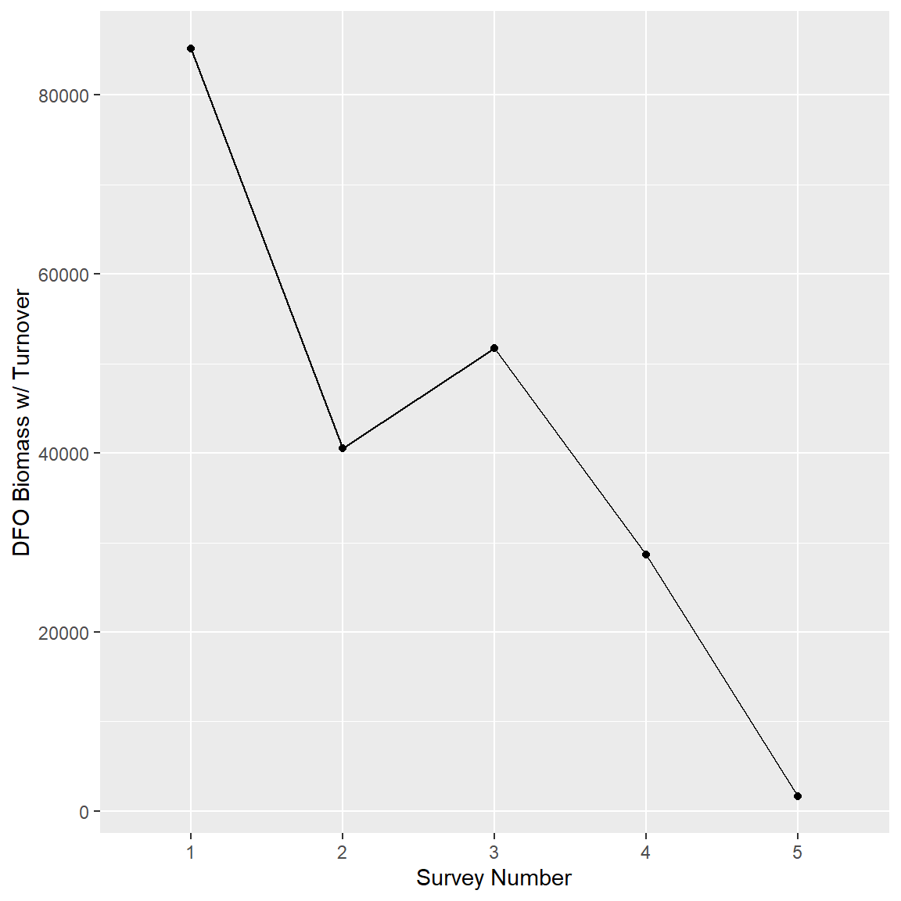
<table class=" lightable-paper lightable-striped" style='color: black; font-family: "Arial Narrow", arial, helvetica, sans-serif; width: auto !important; margin-left: auto; margin-right: auto;'>
 <thead>
  <tr>
   <th style="text-align:center;"> Year </th>
   <th style="text-align:center;"> Ground </th>
   <th style="text-align:center;"> Survey Number </th>
   <th style="text-align:center;"> DFO (Turnover Adjusted) </th>
  </tr>
 </thead>
<tbody>
  <tr>
   <td style="text-align:center;"> 2010 </td>
   <td style="text-align:center;"> German Bank </td>
   <td style="text-align:center;"> 1 </td>
   <td style="text-align:center;"> 85180 </td>
  </tr>
  <tr>
   <td style="text-align:center;"> 2010 </td>
   <td style="text-align:center;"> German Bank </td>
   <td style="text-align:center;"> 2 </td>
   <td style="text-align:center;"> 40510 </td>
  </tr>
  <tr>
   <td style="text-align:center;"> 2010 </td>
   <td style="text-align:center;"> German Bank </td>
   <td style="text-align:center;"> 3 </td>
   <td style="text-align:center;"> 51673 </td>
  </tr>
  <tr>
   <td style="text-align:center;"> 2010 </td>
   <td style="text-align:center;"> German Bank </td>
   <td style="text-align:center;"> 4 </td>
   <td style="text-align:center;"> 28686 </td>
  </tr>
  <tr>
   <td style="text-align:center;"> 2010 </td>
   <td style="text-align:center;"> German Bank </td>
   <td style="text-align:center;"> 5 </td>
   <td style="text-align:center;"> 1687 </td>
  </tr>
</tbody>
</table>

#####  2011 

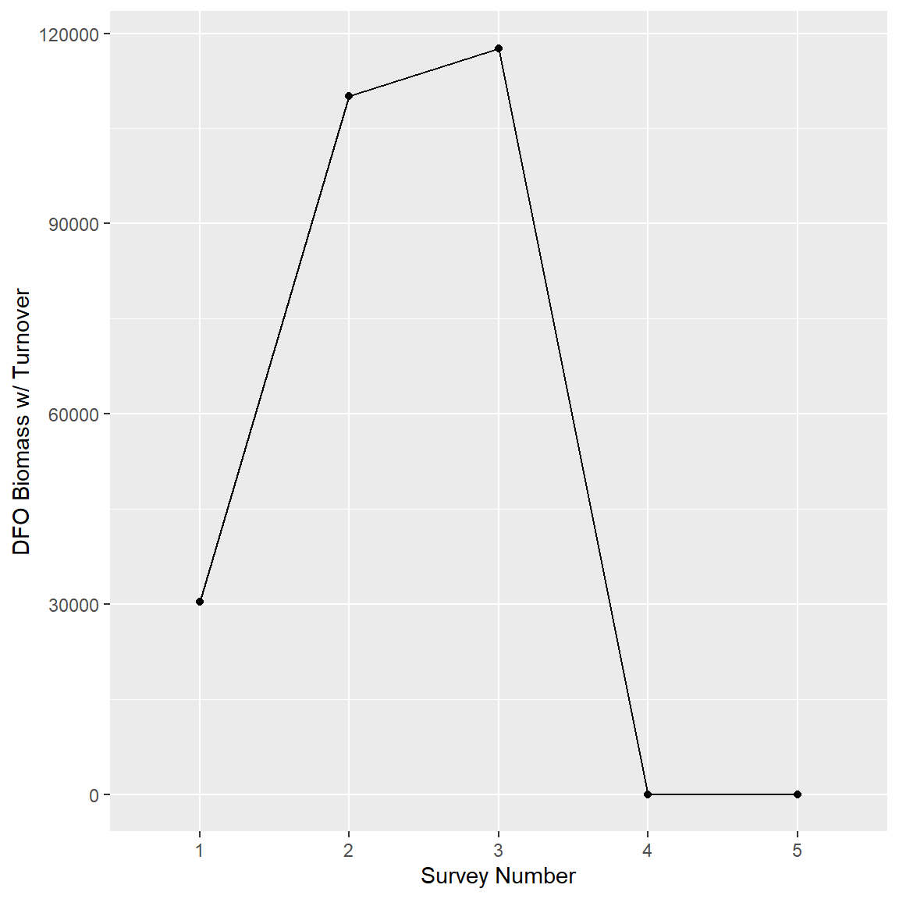
<table class=" lightable-paper lightable-striped" style='color: black; font-family: "Arial Narrow", arial, helvetica, sans-serif; width: auto !important; margin-left: auto; margin-right: auto;'>
 <thead>
  <tr>
   <th style="text-align:center;"> Year </th>
   <th style="text-align:center;"> Ground </th>
   <th style="text-align:center;"> Survey Number </th>
   <th style="text-align:center;"> DFO (Turnover Adjusted) </th>
  </tr>
 </thead>
<tbody>
  <tr>
   <td style="text-align:center;"> 2011 </td>
   <td style="text-align:center;"> German Bank </td>
   <td style="text-align:center;"> 1 </td>
   <td style="text-align:center;"> 30405 </td>
  </tr>
  <tr>
   <td style="text-align:center;"> 2011 </td>
   <td style="text-align:center;"> German Bank </td>
   <td style="text-align:center;"> 2 </td>
   <td style="text-align:center;"> 110062 </td>
  </tr>
  <tr>
   <td style="text-align:center;"> 2011 </td>
   <td style="text-align:center;"> German Bank </td>
   <td style="text-align:center;"> 3 </td>
   <td style="text-align:center;"> 117625 </td>
  </tr>
  <tr>
   <td style="text-align:center;"> 2011 </td>
   <td style="text-align:center;"> German Bank </td>
   <td style="text-align:center;"> 4 </td>
   <td style="text-align:center;"> 0 </td>
  </tr>
  <tr>
   <td style="text-align:center;"> 2011 </td>
   <td style="text-align:center;"> German Bank </td>
   <td style="text-align:center;"> 5 </td>
   <td style="text-align:center;"> 0 </td>
  </tr>
</tbody>
</table>

#####  2012 

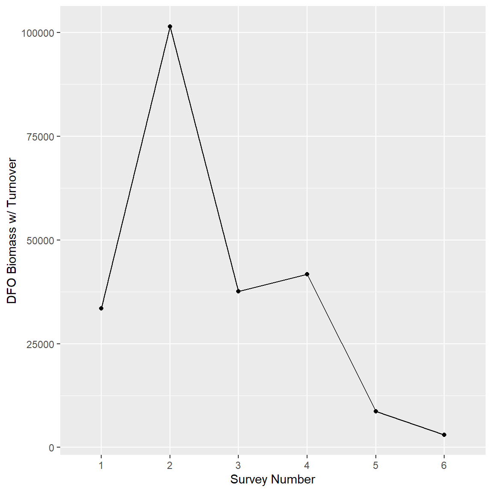
<table class=" lightable-paper lightable-striped" style='color: black; font-family: "Arial Narrow", arial, helvetica, sans-serif; width: auto !important; margin-left: auto; margin-right: auto;'>
 <thead>
  <tr>
   <th style="text-align:center;"> Year </th>
   <th style="text-align:center;"> Ground </th>
   <th style="text-align:center;"> Survey Number </th>
   <th style="text-align:center;"> DFO (Turnover Adjusted) </th>
  </tr>
 </thead>
<tbody>
  <tr>
   <td style="text-align:center;"> 2012 </td>
   <td style="text-align:center;"> German Bank </td>
   <td style="text-align:center;"> 1 </td>
   <td style="text-align:center;"> 33541 </td>
  </tr>
  <tr>
   <td style="text-align:center;"> 2012 </td>
   <td style="text-align:center;"> German Bank </td>
   <td style="text-align:center;"> 2 </td>
   <td style="text-align:center;"> 101453 </td>
  </tr>
  <tr>
   <td style="text-align:center;"> 2012 </td>
   <td style="text-align:center;"> German Bank </td>
   <td style="text-align:center;"> 3 </td>
   <td style="text-align:center;"> 37651 </td>
  </tr>
  <tr>
   <td style="text-align:center;"> 2012 </td>
   <td style="text-align:center;"> German Bank </td>
   <td style="text-align:center;"> 4 </td>
   <td style="text-align:center;"> 41725 </td>
  </tr>
  <tr>
   <td style="text-align:center;"> 2012 </td>
   <td style="text-align:center;"> German Bank </td>
   <td style="text-align:center;"> 5 </td>
   <td style="text-align:center;"> 8711 </td>
  </tr>
  <tr>
   <td style="text-align:center;"> 2012 </td>
   <td style="text-align:center;"> German Bank </td>
   <td style="text-align:center;"> 6 </td>
   <td style="text-align:center;"> 3072 </td>
  </tr>
</tbody>
</table>

#####  2013 

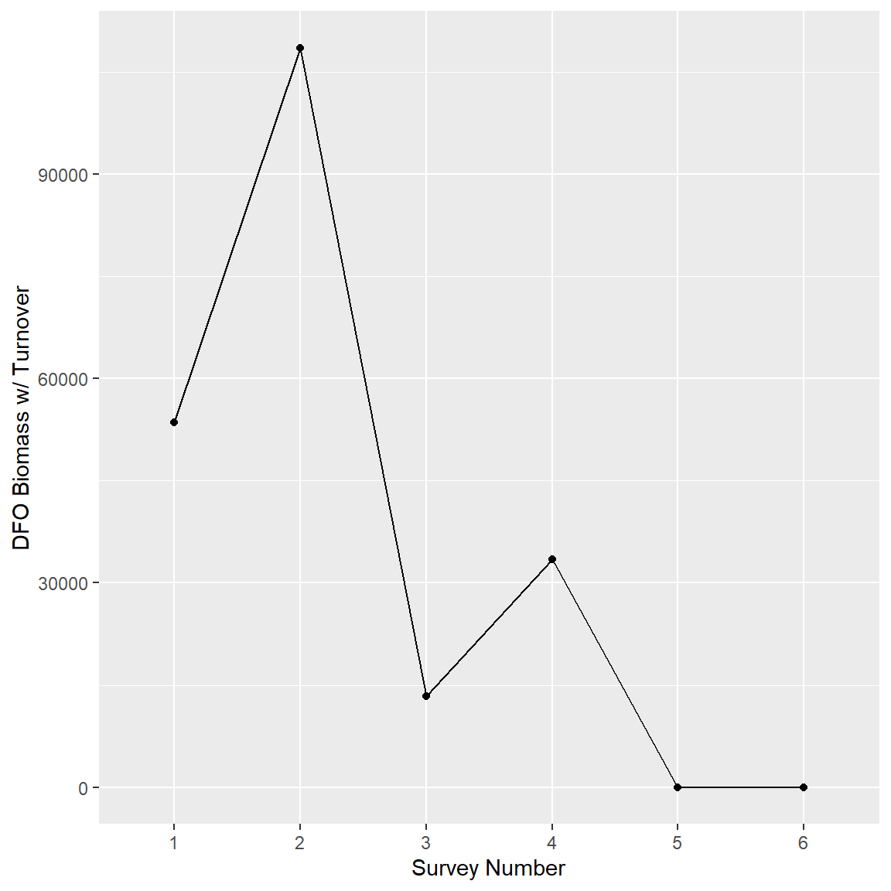
<table class=" lightable-paper lightable-striped" style='color: black; font-family: "Arial Narrow", arial, helvetica, sans-serif; width: auto !important; margin-left: auto; margin-right: auto;'>
 <thead>
  <tr>
   <th style="text-align:center;"> Year </th>
   <th style="text-align:center;"> Ground </th>
   <th style="text-align:center;"> Survey Number </th>
   <th style="text-align:center;"> DFO (Turnover Adjusted) </th>
  </tr>
 </thead>
<tbody>
  <tr>
   <td style="text-align:center;"> 2013 </td>
   <td style="text-align:center;"> German Bank </td>
   <td style="text-align:center;"> 1 </td>
   <td style="text-align:center;"> 53509 </td>
  </tr>
  <tr>
   <td style="text-align:center;"> 2013 </td>
   <td style="text-align:center;"> German Bank </td>
   <td style="text-align:center;"> 2 </td>
   <td style="text-align:center;"> 108500 </td>
  </tr>
  <tr>
   <td style="text-align:center;"> 2013 </td>
   <td style="text-align:center;"> German Bank </td>
   <td style="text-align:center;"> 3 </td>
   <td style="text-align:center;"> 13384 </td>
  </tr>
  <tr>
   <td style="text-align:center;"> 2013 </td>
   <td style="text-align:center;"> German Bank </td>
   <td style="text-align:center;"> 4 </td>
   <td style="text-align:center;"> 33432 </td>
  </tr>
  <tr>
   <td style="text-align:center;"> 2013 </td>
   <td style="text-align:center;"> German Bank </td>
   <td style="text-align:center;"> 5 </td>
   <td style="text-align:center;"> 0 </td>
  </tr>
  <tr>
   <td style="text-align:center;"> 2013 </td>
   <td style="text-align:center;"> German Bank </td>
   <td style="text-align:center;"> 6 </td>
   <td style="text-align:center;"> 0 </td>
  </tr>
</tbody>
</table>

#####  2014 

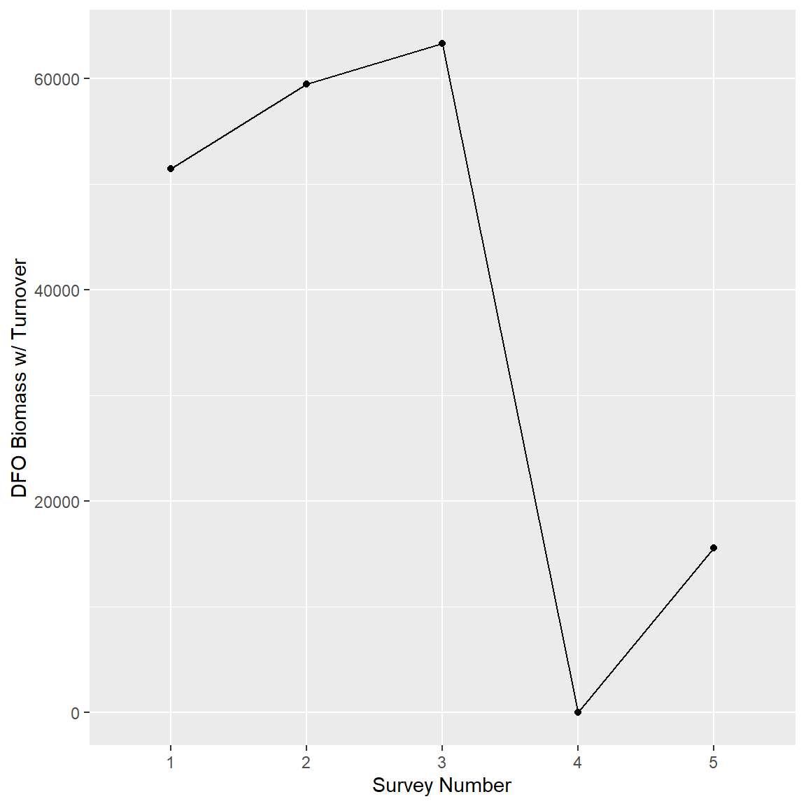
<table class=" lightable-paper lightable-striped" style='color: black; font-family: "Arial Narrow", arial, helvetica, sans-serif; width: auto !important; margin-left: auto; margin-right: auto;'>
 <thead>
  <tr>
   <th style="text-align:center;"> Year </th>
   <th style="text-align:center;"> Ground </th>
   <th style="text-align:center;"> Survey Number </th>
   <th style="text-align:center;"> DFO (Turnover Adjusted) </th>
  </tr>
 </thead>
<tbody>
  <tr>
   <td style="text-align:center;"> 2014 </td>
   <td style="text-align:center;"> German Bank </td>
   <td style="text-align:center;"> 1 </td>
   <td style="text-align:center;"> 51496 </td>
  </tr>
  <tr>
   <td style="text-align:center;"> 2014 </td>
   <td style="text-align:center;"> German Bank </td>
   <td style="text-align:center;"> 2 </td>
   <td style="text-align:center;"> 59467 </td>
  </tr>
  <tr>
   <td style="text-align:center;"> 2014 </td>
   <td style="text-align:center;"> German Bank </td>
   <td style="text-align:center;"> 3 </td>
   <td style="text-align:center;"> 63342 </td>
  </tr>
  <tr>
   <td style="text-align:center;"> 2014 </td>
   <td style="text-align:center;"> German Bank </td>
   <td style="text-align:center;"> 4 </td>
   <td style="text-align:center;"> 0 </td>
  </tr>
  <tr>
   <td style="text-align:center;"> 2014 </td>
   <td style="text-align:center;"> German Bank </td>
   <td style="text-align:center;"> 5 </td>
   <td style="text-align:center;"> 15580 </td>
  </tr>
</tbody>
</table>

#####  2015 

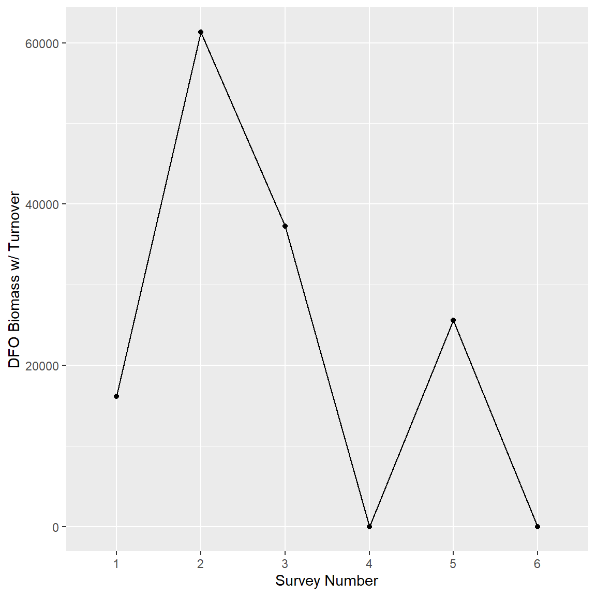
<table class=" lightable-paper lightable-striped" style='color: black; font-family: "Arial Narrow", arial, helvetica, sans-serif; width: auto !important; margin-left: auto; margin-right: auto;'>
 <thead>
  <tr>
   <th style="text-align:center;"> Year </th>
   <th style="text-align:center;"> Ground </th>
   <th style="text-align:center;"> Survey Number </th>
   <th style="text-align:center;"> DFO (Turnover Adjusted) </th>
  </tr>
 </thead>
<tbody>
  <tr>
   <td style="text-align:center;"> 2015 </td>
   <td style="text-align:center;"> German Bank </td>
   <td style="text-align:center;"> 1 </td>
   <td style="text-align:center;"> 16156 </td>
  </tr>
  <tr>
   <td style="text-align:center;"> 2015 </td>
   <td style="text-align:center;"> German Bank </td>
   <td style="text-align:center;"> 2 </td>
   <td style="text-align:center;"> 61324 </td>
  </tr>
  <tr>
   <td style="text-align:center;"> 2015 </td>
   <td style="text-align:center;"> German Bank </td>
   <td style="text-align:center;"> 3 </td>
   <td style="text-align:center;"> 37271 </td>
  </tr>
  <tr>
   <td style="text-align:center;"> 2015 </td>
   <td style="text-align:center;"> German Bank </td>
   <td style="text-align:center;"> 4 </td>
   <td style="text-align:center;"> 0 </td>
  </tr>
  <tr>
   <td style="text-align:center;"> 2015 </td>
   <td style="text-align:center;"> German Bank </td>
   <td style="text-align:center;"> 5 </td>
   <td style="text-align:center;"> 25547 </td>
  </tr>
  <tr>
   <td style="text-align:center;"> 2015 </td>
   <td style="text-align:center;"> German Bank </td>
   <td style="text-align:center;"> 6 </td>
   <td style="text-align:center;"> 0 </td>
  </tr>
</tbody>
</table>

#####  2016 

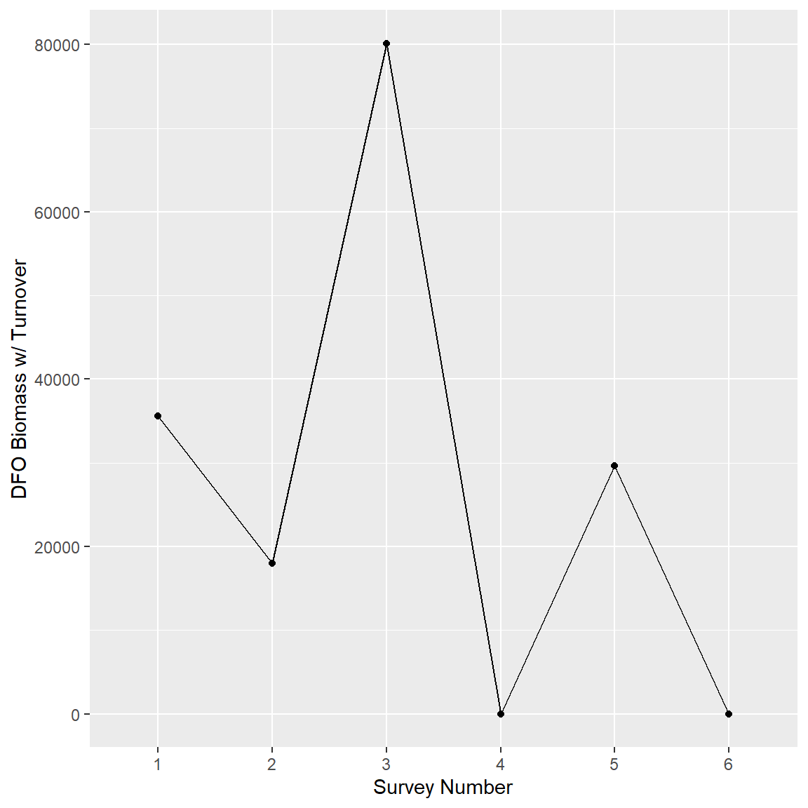
<table class=" lightable-paper lightable-striped" style='color: black; font-family: "Arial Narrow", arial, helvetica, sans-serif; width: auto !important; margin-left: auto; margin-right: auto;'>
 <thead>
  <tr>
   <th style="text-align:center;"> Year </th>
   <th style="text-align:center;"> Ground </th>
   <th style="text-align:center;"> Survey Number </th>
   <th style="text-align:center;"> DFO (Turnover Adjusted) </th>
  </tr>
 </thead>
<tbody>
  <tr>
   <td style="text-align:center;"> 2016 </td>
   <td style="text-align:center;"> German Bank </td>
   <td style="text-align:center;"> 1 </td>
   <td style="text-align:center;"> 35565 </td>
  </tr>
  <tr>
   <td style="text-align:center;"> 2016 </td>
   <td style="text-align:center;"> German Bank </td>
   <td style="text-align:center;"> 2 </td>
   <td style="text-align:center;"> 18010 </td>
  </tr>
  <tr>
   <td style="text-align:center;"> 2016 </td>
   <td style="text-align:center;"> German Bank </td>
   <td style="text-align:center;"> 3 </td>
   <td style="text-align:center;"> 80119 </td>
  </tr>
  <tr>
   <td style="text-align:center;"> 2016 </td>
   <td style="text-align:center;"> German Bank </td>
   <td style="text-align:center;"> 4 </td>
   <td style="text-align:center;"> 0 </td>
  </tr>
  <tr>
   <td style="text-align:center;"> 2016 </td>
   <td style="text-align:center;"> German Bank </td>
   <td style="text-align:center;"> 5 </td>
   <td style="text-align:center;"> 29667 </td>
  </tr>
  <tr>
   <td style="text-align:center;"> 2016 </td>
   <td style="text-align:center;"> German Bank </td>
   <td style="text-align:center;"> 6 </td>
   <td style="text-align:center;"> 0 </td>
  </tr>
</tbody>
</table>

#####  2017 

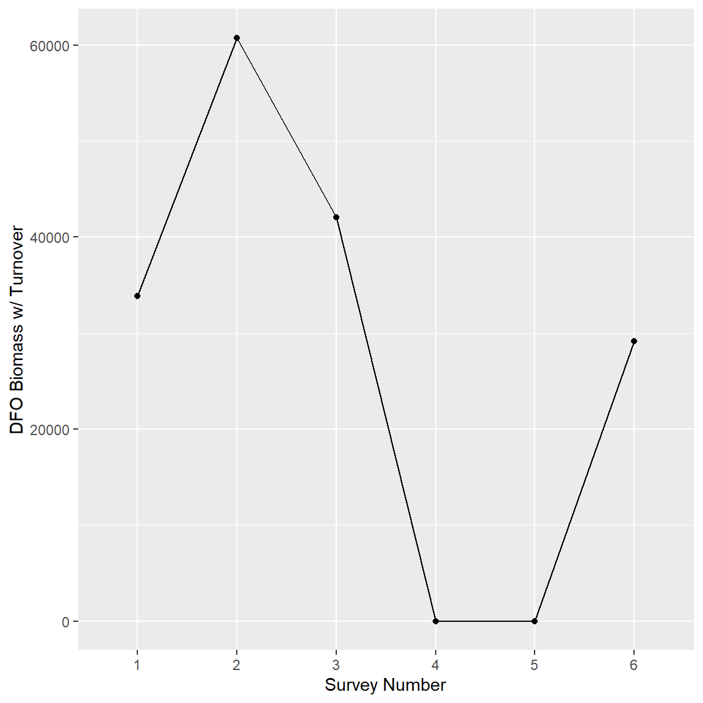
<table class=" lightable-paper lightable-striped" style='color: black; font-family: "Arial Narrow", arial, helvetica, sans-serif; width: auto !important; margin-left: auto; margin-right: auto;'>
 <thead>
  <tr>
   <th style="text-align:center;"> Year </th>
   <th style="text-align:center;"> Ground </th>
   <th style="text-align:center;"> Survey Number </th>
   <th style="text-align:center;"> DFO (Turnover Adjusted) </th>
  </tr>
 </thead>
<tbody>
  <tr>
   <td style="text-align:center;"> 2017 </td>
   <td style="text-align:center;"> German Bank </td>
   <td style="text-align:center;"> 1 </td>
   <td style="text-align:center;"> 33839 </td>
  </tr>
  <tr>
   <td style="text-align:center;"> 2017 </td>
   <td style="text-align:center;"> German Bank </td>
   <td style="text-align:center;"> 2 </td>
   <td style="text-align:center;"> 60745 </td>
  </tr>
  <tr>
   <td style="text-align:center;"> 2017 </td>
   <td style="text-align:center;"> German Bank </td>
   <td style="text-align:center;"> 3 </td>
   <td style="text-align:center;"> 42053 </td>
  </tr>
  <tr>
   <td style="text-align:center;"> 2017 </td>
   <td style="text-align:center;"> German Bank </td>
   <td style="text-align:center;"> 4 </td>
   <td style="text-align:center;"> 0 </td>
  </tr>
  <tr>
   <td style="text-align:center;"> 2017 </td>
   <td style="text-align:center;"> German Bank </td>
   <td style="text-align:center;"> 5 </td>
   <td style="text-align:center;"> 0 </td>
  </tr>
  <tr>
   <td style="text-align:center;"> 2017 </td>
   <td style="text-align:center;"> German Bank </td>
   <td style="text-align:center;"> 6 </td>
   <td style="text-align:center;"> 29155 </td>
  </tr>
</tbody>
</table>

#####  2018 


<table class=" lightable-paper lightable-striped" style='color: black; font-family: "Arial Narrow", arial, helvetica, sans-serif; width: auto !important; margin-left: auto; margin-right: auto;'>
 <thead>
  <tr>
   <th style="text-align:center;"> Year </th>
   <th style="text-align:center;"> Ground </th>
   <th style="text-align:center;"> Survey Number </th>
   <th style="text-align:center;"> DFO (Turnover Adjusted) </th>
  </tr>
 </thead>
<tbody>
  <tr>
   <td style="text-align:center;"> 2018 </td>
   <td style="text-align:center;"> German Bank </td>
   <td style="text-align:center;"> 1 </td>
   <td style="text-align:center;"> 12170 </td>
  </tr>
  <tr>
   <td style="text-align:center;"> 2018 </td>
   <td style="text-align:center;"> German Bank </td>
   <td style="text-align:center;"> 2 </td>
   <td style="text-align:center;"> 13693 </td>
  </tr>
  <tr>
   <td style="text-align:center;"> 2018 </td>
   <td style="text-align:center;"> German Bank </td>
   <td style="text-align:center;"> 3 </td>
   <td style="text-align:center;"> 37490 </td>
  </tr>
  <tr>
   <td style="text-align:center;"> 2018 </td>
   <td style="text-align:center;"> German Bank </td>
   <td style="text-align:center;"> 4 </td>
   <td style="text-align:center;"> 24298 </td>
  </tr>
  <tr>
   <td style="text-align:center;"> 2018 </td>
   <td style="text-align:center;"> German Bank </td>
   <td style="text-align:center;"> 5 </td>
   <td style="text-align:center;"> 7218 </td>
  </tr>
  <tr>
   <td style="text-align:center;"> 2018 </td>
   <td style="text-align:center;"> German Bank </td>
   <td style="text-align:center;"> 6 </td>
   <td style="text-align:center;"> 0 </td>
  </tr>
</tbody>
</table>

#####  2019 


<table class=" lightable-paper lightable-striped" style='color: black; font-family: "Arial Narrow", arial, helvetica, sans-serif; width: auto !important; margin-left: auto; margin-right: auto;'>
 <thead>
  <tr>
   <th style="text-align:center;"> Year </th>
   <th style="text-align:center;"> Ground </th>
   <th style="text-align:center;"> Survey Number </th>
   <th style="text-align:center;"> DFO (Turnover Adjusted) </th>
  </tr>
 </thead>
<tbody>
  <tr>
   <td style="text-align:center;"> 2019 </td>
   <td style="text-align:center;"> German Bank </td>
   <td style="text-align:center;"> 1 </td>
   <td style="text-align:center;"> 12319 </td>
  </tr>
  <tr>
   <td style="text-align:center;"> 2019 </td>
   <td style="text-align:center;"> German Bank </td>
   <td style="text-align:center;"> 2 </td>
   <td style="text-align:center;"> 25125 </td>
  </tr>
  <tr>
   <td style="text-align:center;"> 2019 </td>
   <td style="text-align:center;"> German Bank </td>
   <td style="text-align:center;"> 3 </td>
   <td style="text-align:center;"> 29498 </td>
  </tr>
  <tr>
   <td style="text-align:center;"> 2019 </td>
   <td style="text-align:center;"> German Bank </td>
   <td style="text-align:center;"> 4 </td>
   <td style="text-align:center;"> 65077 </td>
  </tr>
  <tr>
   <td style="text-align:center;"> 2019 </td>
   <td style="text-align:center;"> German Bank </td>
   <td style="text-align:center;"> 5 </td>
   <td style="text-align:center;"> 0 </td>
  </tr>
  <tr>
   <td style="text-align:center;"> 2019 </td>
   <td style="text-align:center;"> German Bank </td>
   <td style="text-align:center;"> 6 </td>
   <td style="text-align:center;"> 15120 </td>
  </tr>
  <tr>
   <td style="text-align:center;"> 2019 </td>
   <td style="text-align:center;"> German Bank </td>
   <td style="text-align:center;"> 7 </td>
   <td style="text-align:center;"> 0 </td>
  </tr>
</tbody>
</table>

#####  2020 


<table class=" lightable-paper lightable-striped" style='color: black; font-family: "Arial Narrow", arial, helvetica, sans-serif; width: auto !important; margin-left: auto; margin-right: auto;'>
 <thead>
  <tr>
   <th style="text-align:center;"> Year </th>
   <th style="text-align:center;"> Ground </th>
   <th style="text-align:center;"> Survey Number </th>
   <th style="text-align:center;"> DFO (Turnover Adjusted) </th>
  </tr>
 </thead>
<tbody>
  <tr>
   <td style="text-align:center;"> 2020 </td>
   <td style="text-align:center;"> German Bank </td>
   <td style="text-align:center;"> 1 </td>
   <td style="text-align:center;"> 12319 </td>
  </tr>
  <tr>
   <td style="text-align:center;"> 2020 </td>
   <td style="text-align:center;"> German Bank </td>
   <td style="text-align:center;"> 2 </td>
   <td style="text-align:center;"> 26279 </td>
  </tr>
  <tr>
   <td style="text-align:center;"> 2020 </td>
   <td style="text-align:center;"> German Bank </td>
   <td style="text-align:center;"> 3 </td>
   <td style="text-align:center;"> 56738 </td>
  </tr>
  <tr>
   <td style="text-align:center;"> 2020 </td>
   <td style="text-align:center;"> German Bank </td>
   <td style="text-align:center;"> 4 </td>
   <td style="text-align:center;"> 875 </td>
  </tr>
  <tr>
   <td style="text-align:center;"> 2020 </td>
   <td style="text-align:center;"> German Bank </td>
   <td style="text-align:center;"> 5 </td>
   <td style="text-align:center;"> 5692 </td>
  </tr>
  <tr>
   <td style="text-align:center;"> 2020 </td>
   <td style="text-align:center;"> German Bank </td>
   <td style="text-align:center;"> 6 </td>
   <td style="text-align:center;"> 5514 </td>
  </tr>
</tbody>
</table>

#####  2021 


<table class=" lightable-paper lightable-striped" style='color: black; font-family: "Arial Narrow", arial, helvetica, sans-serif; width: auto !important; margin-left: auto; margin-right: auto;'>
 <thead>
  <tr>
   <th style="text-align:center;"> Year </th>
   <th style="text-align:center;"> Ground </th>
   <th style="text-align:center;"> Survey Number </th>
   <th style="text-align:center;"> DFO (Turnover Adjusted) </th>
  </tr>
 </thead>
<tbody>
  <tr>
   <td style="text-align:center;"> 2021 </td>
   <td style="text-align:center;"> German Bank </td>
   <td style="text-align:center;"> 1 </td>
   <td style="text-align:center;"> 7460 </td>
  </tr>
  <tr>
   <td style="text-align:center;"> 2021 </td>
   <td style="text-align:center;"> German Bank </td>
   <td style="text-align:center;"> 2 </td>
   <td style="text-align:center;"> 46441 </td>
  </tr>
  <tr>
   <td style="text-align:center;"> 2021 </td>
   <td style="text-align:center;"> German Bank </td>
   <td style="text-align:center;"> 3 </td>
   <td style="text-align:center;"> 71574 </td>
  </tr>
  <tr>
   <td style="text-align:center;"> 2021 </td>
   <td style="text-align:center;"> German Bank </td>
   <td style="text-align:center;"> 4 </td>
   <td style="text-align:center;"> 0 </td>
  </tr>
  <tr>
   <td style="text-align:center;"> 2021 </td>
   <td style="text-align:center;"> German Bank </td>
   <td style="text-align:center;"> 5 </td>
   <td style="text-align:center;"> 145 </td>
  </tr>
  <tr>
   <td style="text-align:center;"> 2021 </td>
   <td style="text-align:center;"> German Bank </td>
   <td style="text-align:center;"> 6 </td>
   <td style="text-align:center;"> 10009 </td>
  </tr>
</tbody>
</table>

#####  2022 


<table class=" lightable-paper lightable-striped" style='color: black; font-family: "Arial Narrow", arial, helvetica, sans-serif; width: auto !important; margin-left: auto; margin-right: auto;'>
 <thead>
  <tr>
   <th style="text-align:center;"> Year </th>
   <th style="text-align:center;"> Ground </th>
   <th style="text-align:center;"> Survey Number </th>
   <th style="text-align:center;"> DFO (Turnover Adjusted) </th>
  </tr>
 </thead>
<tbody>
  <tr>
   <td style="text-align:center;"> 2022 </td>
   <td style="text-align:center;"> German Bank </td>
   <td style="text-align:center;"> 1 </td>
   <td style="text-align:center;"> 22081 </td>
  </tr>
  <tr>
   <td style="text-align:center;"> 2022 </td>
   <td style="text-align:center;"> German Bank </td>
   <td style="text-align:center;"> 2 </td>
   <td style="text-align:center;"> 7393 </td>
  </tr>
  <tr>
   <td style="text-align:center;"> 2022 </td>
   <td style="text-align:center;"> German Bank </td>
   <td style="text-align:center;"> 3 </td>
   <td style="text-align:center;"> 8826 </td>
  </tr>
  <tr>
   <td style="text-align:center;"> 2022 </td>
   <td style="text-align:center;"> German Bank </td>
   <td style="text-align:center;"> 4 </td>
   <td style="text-align:center;"> 9761 </td>
  </tr>
  <tr>
   <td style="text-align:center;"> 2022 </td>
   <td style="text-align:center;"> German Bank </td>
   <td style="text-align:center;"> 5 </td>
   <td style="text-align:center;"> 17675 </td>
  </tr>
  <tr>
   <td style="text-align:center;"> 2022 </td>
   <td style="text-align:center;"> German Bank </td>
   <td style="text-align:center;"> 6 </td>
   <td style="text-align:center;"> 10823 </td>
  </tr>
</tbody>
</table>

#####  2023 


<table class=" lightable-paper lightable-striped" style='color: black; font-family: "Arial Narrow", arial, helvetica, sans-serif; width: auto !important; margin-left: auto; margin-right: auto;'>
 <thead>
  <tr>
   <th style="text-align:center;"> Year </th>
   <th style="text-align:center;"> Ground </th>
   <th style="text-align:center;"> Survey Number </th>
   <th style="text-align:center;"> DFO (Turnover Adjusted) </th>
  </tr>
 </thead>
<tbody>
  <tr>
   <td style="text-align:center;"> 2023 </td>
   <td style="text-align:center;"> German Bank </td>
   <td style="text-align:center;"> 1 </td>
   <td style="text-align:center;"> 2021 </td>
  </tr>
  <tr>
   <td style="text-align:center;"> 2023 </td>
   <td style="text-align:center;"> German Bank </td>
   <td style="text-align:center;"> 2 </td>
   <td style="text-align:center;"> 2887 </td>
  </tr>
  <tr>
   <td style="text-align:center;"> 2023 </td>
   <td style="text-align:center;"> German Bank </td>
   <td style="text-align:center;"> 3 </td>
   <td style="text-align:center;"> 7660 </td>
  </tr>
  <tr>
   <td style="text-align:center;"> 2023 </td>
   <td style="text-align:center;"> German Bank </td>
   <td style="text-align:center;"> 4 </td>
   <td style="text-align:center;"> 12498 </td>
  </tr>
  <tr>
   <td style="text-align:center;"> 2023 </td>
   <td style="text-align:center;"> German Bank </td>
   <td style="text-align:center;"> 5 </td>
   <td style="text-align:center;"> 9978 </td>
  </tr>
  <tr>
   <td style="text-align:center;"> 2023 </td>
   <td style="text-align:center;"> German Bank </td>
   <td style="text-align:center;"> 6 </td>
   <td style="text-align:center;"> 23390 </td>
  </tr>
  <tr>
   <td style="text-align:center;"> 2023 </td>
   <td style="text-align:center;"> German Bank </td>
   <td style="text-align:center;"> 7 </td>
   <td style="text-align:center;"> 6803 </td>
  </tr>
</tbody>
</table>

#####  2024 


<table class=" lightable-paper lightable-striped" style='color: black; font-family: "Arial Narrow", arial, helvetica, sans-serif; width: auto !important; margin-left: auto; margin-right: auto;'>
 <thead>
  <tr>
   <th style="text-align:center;"> Year </th>
   <th style="text-align:center;"> Ground </th>
   <th style="text-align:center;"> Survey Number </th>
   <th style="text-align:center;"> DFO (Turnover Adjusted) </th>
  </tr>
 </thead>
<tbody>
  <tr>
   <td style="text-align:center;"> 2024 </td>
   <td style="text-align:center;"> German Bank </td>
   <td style="text-align:center;"> 1 </td>
   <td style="text-align:center;"> 5026 </td>
  </tr>
  <tr>
   <td style="text-align:center;"> 2024 </td>
   <td style="text-align:center;"> German Bank </td>
   <td style="text-align:center;"> 2 </td>
   <td style="text-align:center;"> 10353 </td>
  </tr>
  <tr>
   <td style="text-align:center;"> 2024 </td>
   <td style="text-align:center;"> German Bank </td>
   <td style="text-align:center;"> 3 </td>
   <td style="text-align:center;"> 8899 </td>
  </tr>
  <tr>
   <td style="text-align:center;"> 2024 </td>
   <td style="text-align:center;"> German Bank </td>
   <td style="text-align:center;"> 4 </td>
   <td style="text-align:center;"> 18363 </td>
  </tr>
  <tr>
   <td style="text-align:center;"> 2024 </td>
   <td style="text-align:center;"> German Bank </td>
   <td style="text-align:center;"> 5 </td>
   <td style="text-align:center;"> 6588 </td>
  </tr>
  <tr>
   <td style="text-align:center;"> 2024 </td>
   <td style="text-align:center;"> German Bank </td>
   <td style="text-align:center;"> 6 </td>
   <td style="text-align:center;"> 17847 </td>
  </tr>
  <tr>
   <td style="text-align:center;"> 2024 </td>
   <td style="text-align:center;"> German Bank </td>
   <td style="text-align:center;"> 7 </td>
   <td style="text-align:center;"> 0 </td>
  </tr>
</tbody>
</table>

#####  2025 


<table class=" lightable-paper lightable-striped" style='color: black; font-family: "Arial Narrow", arial, helvetica, sans-serif; width: auto !important; margin-left: auto; margin-right: auto;'>
 <thead>
  <tr>
   <th style="text-align:center;"> Year </th>
   <th style="text-align:center;"> Ground </th>
   <th style="text-align:center;"> Survey Number </th>
   <th style="text-align:center;"> DFO (Turnover Adjusted) </th>
  </tr>
 </thead>
<tbody>
  <tr>
   <td style="text-align:center;"> 2025 </td>
   <td style="text-align:center;"> German Bank </td>
   <td style="text-align:center;"> 1 </td>
   <td style="text-align:center;"> NA </td>
  </tr>
  <tr>
   <td style="text-align:center;"> 2025 </td>
   <td style="text-align:center;"> German Bank </td>
   <td style="text-align:center;"> 2 </td>
   <td style="text-align:center;"> NA </td>
  </tr>
  <tr>
   <td style="text-align:center;"> 2025 </td>
   <td style="text-align:center;"> German Bank </td>
   <td style="text-align:center;"> 3 </td>
   <td style="text-align:center;"> NA </td>
  </tr>
  <tr>
   <td style="text-align:center;"> 2025 </td>
   <td style="text-align:center;"> German Bank </td>
   <td style="text-align:center;"> 4 </td>
   <td style="text-align:center;"> NA </td>
  </tr>
  <tr>
   <td style="text-align:center;"> 2025 </td>
   <td style="text-align:center;"> German Bank </td>
   <td style="text-align:center;"> 5 </td>
   <td style="text-align:center;"> NA </td>
  </tr>
  <tr>
   <td style="text-align:center;"> 2025 </td>
   <td style="text-align:center;"> German Bank </td>
   <td style="text-align:center;"> 6 </td>
   <td style="text-align:center;"> NA </td>
  </tr>
  <tr>
   <td style="text-align:center;"> 2025 </td>
   <td style="text-align:center;"> German Bank </td>
   <td style="text-align:center;"> 7 </td>
   <td style="text-align:center;"> NA </td>
  </tr>
</tbody>
</table>

#####  2026 


<table class=" lightable-paper lightable-striped" style='color: black; font-family: "Arial Narrow", arial, helvetica, sans-serif; width: auto !important; margin-left: auto; margin-right: auto;'>
 <thead>
  <tr>
   <th style="text-align:center;"> Year </th>
   <th style="text-align:center;"> Ground </th>
   <th style="text-align:center;"> Survey Number </th>
   <th style="text-align:center;"> DFO (Turnover Adjusted) </th>
  </tr>
 </thead>
<tbody>
  <tr>

  </tr>
</tbody>
</table>

#### Seal Island {.tabset .tabset-pills}


#####  2018 


<table class=" lightable-paper lightable-striped" style='color: black; font-family: "Arial Narrow", arial, helvetica, sans-serif; width: auto !important; margin-left: auto; margin-right: auto;'>
 <thead>
  <tr>
   <th style="text-align:center;"> Year </th>
   <th style="text-align:center;"> Ground </th>
   <th style="text-align:center;"> Survey Number </th>
   <th style="text-align:center;"> DFO (Turnover Adjusted) </th>
  </tr>
 </thead>
<tbody>
  <tr>
   <td style="text-align:center;"> 2018 </td>
   <td style="text-align:center;"> Seal Island </td>
   <td style="text-align:center;"> 1 </td>
   <td style="text-align:center;"> 6600 </td>
  </tr>
  <tr>
   <td style="text-align:center;"> 2018 </td>
   <td style="text-align:center;"> Seal Island </td>
   <td style="text-align:center;"> 2 </td>
   <td style="text-align:center;"> 6082 </td>
  </tr>
  <tr>
   <td style="text-align:center;"> 2018 </td>
   <td style="text-align:center;"> Seal Island </td>
   <td style="text-align:center;"> 3 </td>
   <td style="text-align:center;"> 14133 </td>
  </tr>
</tbody>
</table>

#####  2019 


<table class=" lightable-paper lightable-striped" style='color: black; font-family: "Arial Narrow", arial, helvetica, sans-serif; width: auto !important; margin-left: auto; margin-right: auto;'>
 <thead>
  <tr>
   <th style="text-align:center;"> Year </th>
   <th style="text-align:center;"> Ground </th>
   <th style="text-align:center;"> Survey Number </th>
   <th style="text-align:center;"> DFO (Turnover Adjusted) </th>
  </tr>
 </thead>
<tbody>
  <tr>
   <td style="text-align:center;"> 2019 </td>
   <td style="text-align:center;"> Seal Island </td>
   <td style="text-align:center;"> 1 </td>
   <td style="text-align:center;"> 37 </td>
  </tr>
  <tr>
   <td style="text-align:center;"> 2019 </td>
   <td style="text-align:center;"> Seal Island </td>
   <td style="text-align:center;"> 2 </td>
   <td style="text-align:center;"> 4396 </td>
  </tr>
  <tr>
   <td style="text-align:center;"> 2019 </td>
   <td style="text-align:center;"> Seal Island </td>
   <td style="text-align:center;"> 3 </td>
   <td style="text-align:center;"> 2297 </td>
  </tr>
  <tr>
   <td style="text-align:center;"> 2019 </td>
   <td style="text-align:center;"> Seal Island </td>
   <td style="text-align:center;"> 4 </td>
   <td style="text-align:center;"> 3412 </td>
  </tr>
  <tr>
   <td style="text-align:center;"> 2019 </td>
   <td style="text-align:center;"> Seal Island </td>
   <td style="text-align:center;"> 5 </td>
   <td style="text-align:center;"> 19782 </td>
  </tr>
  <tr>
   <td style="text-align:center;"> 2019 </td>
   <td style="text-align:center;"> Seal Island </td>
   <td style="text-align:center;"> 6 </td>
   <td style="text-align:center;"> 2426 </td>
  </tr>
  <tr>
   <td style="text-align:center;"> 2019 </td>
   <td style="text-align:center;"> Seal Island </td>
   <td style="text-align:center;"> 7 </td>
   <td style="text-align:center;"> 352 </td>
  </tr>
</tbody>
</table>

#####  2020 


<table class=" lightable-paper lightable-striped" style='color: black; font-family: "Arial Narrow", arial, helvetica, sans-serif; width: auto !important; margin-left: auto; margin-right: auto;'>
 <thead>
  <tr>
   <th style="text-align:center;"> Year </th>
   <th style="text-align:center;"> Ground </th>
   <th style="text-align:center;"> Survey Number </th>
   <th style="text-align:center;"> DFO (Turnover Adjusted) </th>
  </tr>
 </thead>
<tbody>
  <tr>
   <td style="text-align:center;"> 2020 </td>
   <td style="text-align:center;"> Seal Island </td>
   <td style="text-align:center;"> 1 </td>
   <td style="text-align:center;"> 415 </td>
  </tr>
  <tr>
   <td style="text-align:center;"> 2020 </td>
   <td style="text-align:center;"> Seal Island </td>
   <td style="text-align:center;"> 2 </td>
   <td style="text-align:center;"> 239 </td>
  </tr>
  <tr>
   <td style="text-align:center;"> 2020 </td>
   <td style="text-align:center;"> Seal Island </td>
   <td style="text-align:center;"> 3 </td>
   <td style="text-align:center;"> 342 </td>
  </tr>
  <tr>
   <td style="text-align:center;"> 2020 </td>
   <td style="text-align:center;"> Seal Island </td>
   <td style="text-align:center;"> 4 </td>
   <td style="text-align:center;"> 1040 </td>
  </tr>
  <tr>
   <td style="text-align:center;"> 2020 </td>
   <td style="text-align:center;"> Seal Island </td>
   <td style="text-align:center;"> 5 </td>
   <td style="text-align:center;"> 372 </td>
  </tr>
  <tr>
   <td style="text-align:center;"> 2020 </td>
   <td style="text-align:center;"> Seal Island </td>
   <td style="text-align:center;"> 6 </td>
   <td style="text-align:center;"> 392 </td>
  </tr>
</tbody>
</table>

#####  2021 


<table class=" lightable-paper lightable-striped" style='color: black; font-family: "Arial Narrow", arial, helvetica, sans-serif; width: auto !important; margin-left: auto; margin-right: auto;'>
 <thead>
  <tr>
   <th style="text-align:center;"> Year </th>
   <th style="text-align:center;"> Ground </th>
   <th style="text-align:center;"> Survey Number </th>
   <th style="text-align:center;"> DFO (Turnover Adjusted) </th>
  </tr>
 </thead>
<tbody>
  <tr>
   <td style="text-align:center;"> 2021 </td>
   <td style="text-align:center;"> Seal Island </td>
   <td style="text-align:center;"> 1 </td>
   <td style="text-align:center;"> 1341 </td>
  </tr>
  <tr>
   <td style="text-align:center;"> 2021 </td>
   <td style="text-align:center;"> Seal Island </td>
   <td style="text-align:center;"> 2 </td>
   <td style="text-align:center;"> 2050 </td>
  </tr>
  <tr>
   <td style="text-align:center;"> 2021 </td>
   <td style="text-align:center;"> Seal Island </td>
   <td style="text-align:center;"> 3 </td>
   <td style="text-align:center;"> 509 </td>
  </tr>
  <tr>
   <td style="text-align:center;"> 2021 </td>
   <td style="text-align:center;"> Seal Island </td>
   <td style="text-align:center;"> 4 </td>
   <td style="text-align:center;"> 1578 </td>
  </tr>
  <tr>
   <td style="text-align:center;"> 2021 </td>
   <td style="text-align:center;"> Seal Island </td>
   <td style="text-align:center;"> 5 </td>
   <td style="text-align:center;"> 520 </td>
  </tr>
  <tr>
   <td style="text-align:center;"> 2021 </td>
   <td style="text-align:center;"> Seal Island </td>
   <td style="text-align:center;"> 6 </td>
   <td style="text-align:center;"> 440 </td>
  </tr>
</tbody>
</table>

#####  2022 


<table class=" lightable-paper lightable-striped" style='color: black; font-family: "Arial Narrow", arial, helvetica, sans-serif; width: auto !important; margin-left: auto; margin-right: auto;'>
 <thead>
  <tr>
   <th style="text-align:center;"> Year </th>
   <th style="text-align:center;"> Ground </th>
   <th style="text-align:center;"> Survey Number </th>
   <th style="text-align:center;"> DFO (Turnover Adjusted) </th>
  </tr>
 </thead>
<tbody>
  <tr>
   <td style="text-align:center;"> 2022 </td>
   <td style="text-align:center;"> Seal Island </td>
   <td style="text-align:center;"> 1 </td>
   <td style="text-align:center;"> 1290 </td>
  </tr>
  <tr>
   <td style="text-align:center;"> 2022 </td>
   <td style="text-align:center;"> Seal Island </td>
   <td style="text-align:center;"> 2 </td>
   <td style="text-align:center;"> 426 </td>
  </tr>
  <tr>
   <td style="text-align:center;"> 2022 </td>
   <td style="text-align:center;"> Seal Island </td>
   <td style="text-align:center;"> 3 </td>
   <td style="text-align:center;"> 5151 </td>
  </tr>
  <tr>
   <td style="text-align:center;"> 2022 </td>
   <td style="text-align:center;"> Seal Island </td>
   <td style="text-align:center;"> 4 </td>
   <td style="text-align:center;"> 3225 </td>
  </tr>
  <tr>
   <td style="text-align:center;"> 2022 </td>
   <td style="text-align:center;"> Seal Island </td>
   <td style="text-align:center;"> 5 </td>
   <td style="text-align:center;"> 3520 </td>
  </tr>
  <tr>
   <td style="text-align:center;"> 2022 </td>
   <td style="text-align:center;"> Seal Island </td>
   <td style="text-align:center;"> 6 </td>
   <td style="text-align:center;"> 2137 </td>
  </tr>
</tbody>
</table>

#####  2023 


<table class=" lightable-paper lightable-striped" style='color: black; font-family: "Arial Narrow", arial, helvetica, sans-serif; width: auto !important; margin-left: auto; margin-right: auto;'>
 <thead>
  <tr>
   <th style="text-align:center;"> Year </th>
   <th style="text-align:center;"> Ground </th>
   <th style="text-align:center;"> Survey Number </th>
   <th style="text-align:center;"> DFO (Turnover Adjusted) </th>
  </tr>
 </thead>
<tbody>
  <tr>
   <td style="text-align:center;"> 2023 </td>
   <td style="text-align:center;"> Seal Island </td>
   <td style="text-align:center;"> 1 </td>
   <td style="text-align:center;"> 929 </td>
  </tr>
  <tr>
   <td style="text-align:center;"> 2023 </td>
   <td style="text-align:center;"> Seal Island </td>
   <td style="text-align:center;"> 2 </td>
   <td style="text-align:center;"> 897 </td>
  </tr>
  <tr>
   <td style="text-align:center;"> 2023 </td>
   <td style="text-align:center;"> Seal Island </td>
   <td style="text-align:center;"> 3 </td>
   <td style="text-align:center;"> 1099 </td>
  </tr>
  <tr>
   <td style="text-align:center;"> 2023 </td>
   <td style="text-align:center;"> Seal Island </td>
   <td style="text-align:center;"> 4 </td>
   <td style="text-align:center;"> 4045 </td>
  </tr>
  <tr>
   <td style="text-align:center;"> 2023 </td>
   <td style="text-align:center;"> Seal Island </td>
   <td style="text-align:center;"> 5 </td>
   <td style="text-align:center;"> 42269 </td>
  </tr>
  <tr>
   <td style="text-align:center;"> 2023 </td>
   <td style="text-align:center;"> Seal Island </td>
   <td style="text-align:center;"> 6 </td>
   <td style="text-align:center;"> 14381 </td>
  </tr>
  <tr>
   <td style="text-align:center;"> 2023 </td>
   <td style="text-align:center;"> Seal Island </td>
   <td style="text-align:center;"> 7 </td>
   <td style="text-align:center;"> 1087 </td>
  </tr>
</tbody>
</table>

#####  2024 


<table class=" lightable-paper lightable-striped" style='color: black; font-family: "Arial Narrow", arial, helvetica, sans-serif; width: auto !important; margin-left: auto; margin-right: auto;'>
 <thead>
  <tr>
   <th style="text-align:center;"> Year </th>
   <th style="text-align:center;"> Ground </th>
   <th style="text-align:center;"> Survey Number </th>
   <th style="text-align:center;"> DFO (Turnover Adjusted) </th>
  </tr>
 </thead>
<tbody>
  <tr>
   <td style="text-align:center;"> 2024 </td>
   <td style="text-align:center;"> Seal Island </td>
   <td style="text-align:center;"> 1 </td>
   <td style="text-align:center;"> 31328 </td>
  </tr>
  <tr>
   <td style="text-align:center;"> 2024 </td>
   <td style="text-align:center;"> Seal Island </td>
   <td style="text-align:center;"> 2 </td>
   <td style="text-align:center;"> 5241 </td>
  </tr>
  <tr>
   <td style="text-align:center;"> 2024 </td>
   <td style="text-align:center;"> Seal Island </td>
   <td style="text-align:center;"> 3 </td>
   <td style="text-align:center;"> 2914 </td>
  </tr>
  <tr>
   <td style="text-align:center;"> 2024 </td>
   <td style="text-align:center;"> Seal Island </td>
   <td style="text-align:center;"> 4 </td>
   <td style="text-align:center;"> 1538 </td>
  </tr>
  <tr>
   <td style="text-align:center;"> 2024 </td>
   <td style="text-align:center;"> Seal Island </td>
   <td style="text-align:center;"> 5 </td>
   <td style="text-align:center;"> 5125 </td>
  </tr>
  <tr>
   <td style="text-align:center;"> 2024 </td>
   <td style="text-align:center;"> Seal Island </td>
   <td style="text-align:center;"> 6 </td>
   <td style="text-align:center;"> 3543 </td>
  </tr>
  <tr>
   <td style="text-align:center;"> 2024 </td>
   <td style="text-align:center;"> Seal Island </td>
   <td style="text-align:center;"> 7 </td>
   <td style="text-align:center;"> 324 </td>
  </tr>
</tbody>
</table>
## Tagging Project

### Current Tag Data {.tabset}

#### Scots Bay {.tabset .tabset-pills}


##### Total


##### Survey 2 


##### Survey 3 


##### Survey 4 


##### Survey 5 


##### Survey 8 


##### Survey 9 


##### Survey NA 


#### German Bank {.tabset .tabset-pills}


##### Total


##### Survey 2 


##### Survey 3 


##### Survey 4 


##### Survey 5 


##### Survey 6 


##### Survey 8 


##### Survey NA 


### Tag Summaries {.tabset}

#### Annual Summary

::: row
::: col-md-6

:::

::: col-md-6
<table class=" lightable-paper lightable-striped" style='color: black; font-family: "Arial Narrow", arial, helvetica, sans-serif; width: auto !important; margin-left: auto; margin-right: auto;'>
 <thead>
  <tr>
   <th style="text-align:left;"> Year </th>
   <th style="text-align:right;"> Tags </th>
  </tr>
 </thead>
<tbody>
  <tr>
   <td style="text-align:left;"> 2016 </td>
   <td style="text-align:right;"> 19941 </td>
  </tr>
  <tr>
   <td style="text-align:left;"> 2017 </td>
   <td style="text-align:right;"> 6397 </td>
  </tr>
  <tr>
   <td style="text-align:left;"> 2018 </td>
   <td style="text-align:right;"> 10182 </td>
  </tr>
  <tr>
   <td style="text-align:left;"> 2019 </td>
   <td style="text-align:right;"> 16668 </td>
  </tr>
  <tr>
   <td style="text-align:left;"> 2020 </td>
   <td style="text-align:right;"> 13520 </td>
  </tr>
  <tr>
   <td style="text-align:left;"> 2021 </td>
   <td style="text-align:right;"> 30004 </td>
  </tr>
  <tr>
   <td style="text-align:left;"> 2022 </td>
   <td style="text-align:right;"> 22945 </td>
  </tr>
  <tr>
   <td style="text-align:left;"> 2023 </td>
   <td style="text-align:right;"> 38293 </td>
  </tr>
  <tr>
   <td style="text-align:left;"> 2024 </td>
   <td style="text-align:right;"> 194 </td>
  </tr>
</tbody>
</table>
:::
:::

#### Tagger Summary

::: row
::: col-md-6

:::

::: col-md-6
<table class=" lightable-paper lightable-striped" style='color: black; font-family: "Arial Narrow", arial, helvetica, sans-serif; width: auto !important; margin-left: auto; margin-right: auto;'>
 <thead>
  <tr>
   <th style="text-align:left;"> Tagger </th>
   <th style="text-align:left;"> Average Tags/Year </th>
  </tr>
 </thead>
<tbody>
  <tr>
   <td style="text-align:left;"> Annik Doucette </td>
   <td style="text-align:left;"> 5210 </td>
  </tr>
  <tr>
   <td style="text-align:left;"> Chuck Lambert </td>
   <td style="text-align:left;"> 6627 </td>
  </tr>
  <tr>
   <td style="text-align:left;"> Cody Mark </td>
   <td style="text-align:left;"> 7194 </td>
  </tr>
  <tr>
   <td style="text-align:left;"> Courtney Thomas </td>
   <td style="text-align:left;"> 4214 </td>
  </tr>
  <tr>
   <td style="text-align:left;"> Dale Fitzgerald </td>
   <td style="text-align:left;"> 7451 </td>
  </tr>
  <tr>
   <td style="text-align:left;"> Darren Kelly </td>
   <td style="text-align:left;"> 679 </td>
  </tr>
  <tr>
   <td style="text-align:left;"> Drew Schrader </td>
   <td style="text-align:left;"> 3000 </td>
  </tr>
  <tr>
   <td style="text-align:left;"> Emilie Knighton </td>
   <td style="text-align:left;"> 1348 </td>
  </tr>
  <tr>
   <td style="text-align:left;"> Jenna Munden </td>
   <td style="text-align:left;"> 93 </td>
  </tr>
  <tr>
   <td style="text-align:left;"> Joseph Nickerson </td>
   <td style="text-align:left;"> 2908 </td>
  </tr>
  <tr>
   <td style="text-align:left;"> Lee Surette </td>
   <td style="text-align:left;"> 7940 </td>
  </tr>
  <tr>
   <td style="text-align:left;"> Lerman D'Eon </td>
   <td style="text-align:left;"> 12151 </td>
  </tr>
  <tr>
   <td style="text-align:left;"> Lisa Houston </td>
   <td style="text-align:left;"> 5987 </td>
  </tr>
  <tr>
   <td style="text-align:left;"> Manon Holmes </td>
   <td style="text-align:left;"> 1500 </td>
  </tr>
  <tr>
   <td style="text-align:left;"> Nicholas d'Entremont </td>
   <td style="text-align:left;"> 3041 </td>
  </tr>
  <tr>
   <td style="text-align:left;"> Nicole Seamone </td>
   <td style="text-align:left;"> 4949 </td>
  </tr>
  <tr>
   <td style="text-align:left;"> Tracey Leask </td>
   <td style="text-align:left;"> 194 </td>
  </tr>
  <tr>
   <td style="text-align:left;"> William Cusack </td>
   <td style="text-align:left;"> 7502 </td>
  </tr>
</tbody>
</table>
:::
:::

## Tag Returns {.tabset}

### Average Time Difference Across All Grounds  {.tabset .tabset-fade .tabset-pills}


<table>
 <thead>
  <tr>
   <th style="text-align:center;"> Category </th>
   <th style="text-align:center;"> Average Time Difference (days) </th>
   <th style="text-align:center;"> Minimum Time Difference (Days) </th>
   <th style="text-align:center;"> Maximum Time Difference (Days) </th>
   <th style="text-align:center;"> Category Abundance </th>
  </tr>
 </thead>
<tbody>
  <tr>
   <td style="text-align:center;"> 1 </td>
   <td style="text-align:center;"> 1.5 </td>
   <td style="text-align:center;"> 1 </td>
   <td style="text-align:center;"> 2 </td>
   <td style="text-align:center;"> 777 </td>
  </tr>
  <tr>
   <td style="text-align:center;"> 2 </td>
   <td style="text-align:center;"> 6.7 </td>
   <td style="text-align:center;"> 3 </td>
   <td style="text-align:center;"> 10 </td>
   <td style="text-align:center;"> 855 </td>
  </tr>
  <tr>
   <td style="text-align:center;"> 3 </td>
   <td style="text-align:center;"> 15 </td>
   <td style="text-align:center;"> 11 </td>
   <td style="text-align:center;"> 30 </td>
   <td style="text-align:center;"> 526 </td>
  </tr>
  <tr>
   <td style="text-align:center;"> 4 </td>
   <td style="text-align:center;"> 61 </td>
   <td style="text-align:center;"> 31 </td>
   <td style="text-align:center;"> 133 </td>
   <td style="text-align:center;"> 258 </td>
  </tr>
  <tr>
   <td style="text-align:center;"> 5 </td>
   <td style="text-align:center;"> 315 </td>
   <td style="text-align:center;"> 190 </td>
   <td style="text-align:center;"> 365 </td>
   <td style="text-align:center;"> 65 </td>
  </tr>
  <tr>
   <td style="text-align:center;"> 6 </td>
   <td style="text-align:center;"> 409 </td>
   <td style="text-align:center;"> 366 </td>
   <td style="text-align:center;"> 715 </td>
   <td style="text-align:center;"> 104 </td>
  </tr>
  <tr>
   <td style="text-align:center;"> 7 </td>
   <td style="text-align:center;"> 796 </td>
   <td style="text-align:center;"> 743 </td>
   <td style="text-align:center;"> 1079 </td>
   <td style="text-align:center;"> 20 </td>
  </tr>
  <tr>
   <td style="text-align:center;"> 8 </td>
   <td style="text-align:center;"> 1451 </td>
   <td style="text-align:center;"> 1127 </td>
   <td style="text-align:center;"> 2092 </td>
   <td style="text-align:center;"> 6 </td>
  </tr>
</tbody>
</table>


### Scots Bay, German Bank and Seal Island Tags {.tabset .tabset-fade .tabset-pills}

#### Tag Returns between German Bank and Scots Bay

<table class=" lightable-paper lightable-striped" style='color: black; font-family: "Arial Narrow", arial, helvetica, sans-serif; width: auto !important; margin-left: auto; margin-right: auto;'>
 <thead>
  <tr>
   <th style="text-align:center;"> Category </th>
   <th style="text-align:center;"> Initial Tagging Ground </th>
   <th style="text-align:center;"> Tag Retrieval Ground </th>
   <th style="text-align:center;"> Abundance in Category </th>
  </tr>
 </thead>
<tbody>
  <tr>
   <td style="text-align:center;"> 1 </td>
   <td style="text-align:center;"> German Bank </td>
   <td style="text-align:center;"> Scots Bay </td>
   <td style="text-align:center;"> 2 </td>
  </tr>
  <tr>
   <td style="text-align:center;"> 2 </td>
   <td style="text-align:center;"> German Bank </td>
   <td style="text-align:center;"> Scots Bay </td>
   <td style="text-align:center;"> 10 </td>
  </tr>
  <tr>
   <td style="text-align:center;"> 3 </td>
   <td style="text-align:center;"> German Bank </td>
   <td style="text-align:center;"> Scots Bay </td>
   <td style="text-align:center;"> 3 </td>
  </tr>
  <tr>
   <td style="text-align:center;"> 4 </td>
   <td style="text-align:center;"> German Bank </td>
   <td style="text-align:center;"> Scots Bay </td>
   <td style="text-align:center;"> 3 </td>
  </tr>
  <tr>
   <td style="text-align:center;"> 5 </td>
   <td style="text-align:center;"> German Bank </td>
   <td style="text-align:center;"> Scots Bay </td>
   <td style="text-align:center;"> 4 </td>
  </tr>
  <tr>
   <td style="text-align:center;"> 6 </td>
   <td style="text-align:center;"> German Bank </td>
   <td style="text-align:center;"> Scots Bay </td>
   <td style="text-align:center;"> 3 </td>
  </tr>
  <tr>
   <td style="text-align:center;"> 8 </td>
   <td style="text-align:center;"> German Bank </td>
   <td style="text-align:center;"> Scots Bay </td>
   <td style="text-align:center;"> 2 </td>
  </tr>
</tbody>
</table>

<table class=" lightable-paper lightable-striped" style='color: black; font-family: "Arial Narrow", arial, helvetica, sans-serif; width: auto !important; margin-left: auto; margin-right: auto;'>
 <thead>
  <tr>
   <th style="text-align:center;"> Category </th>
   <th style="text-align:center;"> Initial Tagging Ground </th>
   <th style="text-align:center;"> Tag Retrieval Ground </th>
   <th style="text-align:center;"> Abundance </th>
  </tr>
 </thead>
<tbody>
  <tr>
   <td style="text-align:center;"> 2 </td>
   <td style="text-align:center;"> Scots Bay </td>
   <td style="text-align:center;"> German Bank </td>
   <td style="text-align:center;"> 21 </td>
  </tr>
  <tr>
   <td style="text-align:center;"> 3 </td>
   <td style="text-align:center;"> Scots Bay </td>
   <td style="text-align:center;"> German Bank </td>
   <td style="text-align:center;"> 25 </td>
  </tr>
  <tr>
   <td style="text-align:center;"> 4 </td>
   <td style="text-align:center;"> Scots Bay </td>
   <td style="text-align:center;"> German Bank </td>
   <td style="text-align:center;"> 11 </td>
  </tr>
  <tr>
   <td style="text-align:center;"> 6 </td>
   <td style="text-align:center;"> Scots Bay </td>
   <td style="text-align:center;"> German Bank </td>
   <td style="text-align:center;"> 4 </td>
  </tr>
</tbody>
</table>
#### Tag returns that started in either German Bank or Scots Bay

<table class=" lightable-paper lightable-striped" style='color: black; font-family: "Arial Narrow", arial, helvetica, sans-serif; width: auto !important; margin-left: auto; margin-right: auto;'>
 <thead>
  <tr>
   <th style="text-align:center;"> Category </th>
   <th style="text-align:center;"> Initial Tagging Ground </th>
   <th style="text-align:center;"> Tag Retrieval Ground </th>
   <th style="text-align:center;"> Abundance </th>
  </tr>
 </thead>
<tbody>
  <tr>
   <td style="text-align:center;"> 1 </td>
   <td style="text-align:center;"> German Bank </td>
   <td style="text-align:center;"> German Bank </td>
   <td style="text-align:center;"> 133 </td>
  </tr>
  <tr>
   <td style="text-align:center;"> 1 </td>
   <td style="text-align:center;"> Scots Bay </td>
   <td style="text-align:center;"> Scots Bay </td>
   <td style="text-align:center;"> 482 </td>
  </tr>
  <tr>
   <td style="text-align:center;"> 1 </td>
   <td style="text-align:center;"> German Bank </td>
   <td style="text-align:center;"> Scots Bay </td>
   <td style="text-align:center;"> 2 </td>
  </tr>
  <tr>
   <td style="text-align:center;"> 2 </td>
   <td style="text-align:center;"> German Bank </td>
   <td style="text-align:center;"> German Bank </td>
   <td style="text-align:center;"> 207 </td>
  </tr>
  <tr>
   <td style="text-align:center;"> 2 </td>
   <td style="text-align:center;"> Scots Bay </td>
   <td style="text-align:center;"> German Bank </td>
   <td style="text-align:center;"> 21 </td>
  </tr>
  <tr>
   <td style="text-align:center;"> 2 </td>
   <td style="text-align:center;"> Scots Bay </td>
   <td style="text-align:center;"> Scots Bay </td>
   <td style="text-align:center;"> 380 </td>
  </tr>
  <tr>
   <td style="text-align:center;"> 2 </td>
   <td style="text-align:center;"> German Bank </td>
   <td style="text-align:center;"> Scots Bay </td>
   <td style="text-align:center;"> 10 </td>
  </tr>
  <tr>
   <td style="text-align:center;"> 3 </td>
   <td style="text-align:center;"> German Bank </td>
   <td style="text-align:center;"> German Bank </td>
   <td style="text-align:center;"> 99 </td>
  </tr>
  <tr>
   <td style="text-align:center;"> 3 </td>
   <td style="text-align:center;"> Scots Bay </td>
   <td style="text-align:center;"> Scots Bay </td>
   <td style="text-align:center;"> 186 </td>
  </tr>
  <tr>
   <td style="text-align:center;"> 3 </td>
   <td style="text-align:center;"> German Bank </td>
   <td style="text-align:center;"> Scots Bay </td>
   <td style="text-align:center;"> 3 </td>
  </tr>
  <tr>
   <td style="text-align:center;"> 3 </td>
   <td style="text-align:center;"> Scots Bay </td>
   <td style="text-align:center;"> German Bank </td>
   <td style="text-align:center;"> 25 </td>
  </tr>
  <tr>
   <td style="text-align:center;"> 4 </td>
   <td style="text-align:center;"> Scots Bay </td>
   <td style="text-align:center;"> German Bank </td>
   <td style="text-align:center;"> 11 </td>
  </tr>
  <tr>
   <td style="text-align:center;"> 4 </td>
   <td style="text-align:center;"> Scots Bay </td>
   <td style="text-align:center;"> Scots Bay </td>
   <td style="text-align:center;"> 6 </td>
  </tr>
  <tr>
   <td style="text-align:center;"> 4 </td>
   <td style="text-align:center;"> German Bank </td>
   <td style="text-align:center;"> German Bank </td>
   <td style="text-align:center;"> 11 </td>
  </tr>
  <tr>
   <td style="text-align:center;"> 4 </td>
   <td style="text-align:center;"> German Bank </td>
   <td style="text-align:center;"> Scots Bay </td>
   <td style="text-align:center;"> 3 </td>
  </tr>
  <tr>
   <td style="text-align:center;"> 5 </td>
   <td style="text-align:center;"> German Bank </td>
   <td style="text-align:center;"> Scots Bay </td>
   <td style="text-align:center;"> 4 </td>
  </tr>
  <tr>
   <td style="text-align:center;"> 5 </td>
   <td style="text-align:center;"> German Bank </td>
   <td style="text-align:center;"> German Bank </td>
   <td style="text-align:center;"> 2 </td>
  </tr>
  <tr>
   <td style="text-align:center;"> 5 </td>
   <td style="text-align:center;"> Scots Bay </td>
   <td style="text-align:center;"> Scots Bay </td>
   <td style="text-align:center;"> 16 </td>
  </tr>
  <tr>
   <td style="text-align:center;"> 6 </td>
   <td style="text-align:center;"> Scots Bay </td>
   <td style="text-align:center;"> Scots Bay </td>
   <td style="text-align:center;"> 44 </td>
  </tr>
  <tr>
   <td style="text-align:center;"> 6 </td>
   <td style="text-align:center;"> German Bank </td>
   <td style="text-align:center;"> German Bank </td>
   <td style="text-align:center;"> 21 </td>
  </tr>
  <tr>
   <td style="text-align:center;"> 6 </td>
   <td style="text-align:center;"> German Bank </td>
   <td style="text-align:center;"> Scots Bay </td>
   <td style="text-align:center;"> 3 </td>
  </tr>
  <tr>
   <td style="text-align:center;"> 6 </td>
   <td style="text-align:center;"> Scots Bay </td>
   <td style="text-align:center;"> German Bank </td>
   <td style="text-align:center;"> 4 </td>
  </tr>
  <tr>
   <td style="text-align:center;"> 7 </td>
   <td style="text-align:center;"> German Bank </td>
   <td style="text-align:center;"> German Bank </td>
   <td style="text-align:center;"> 3 </td>
  </tr>
  <tr>
   <td style="text-align:center;"> 7 </td>
   <td style="text-align:center;"> Scots Bay </td>
   <td style="text-align:center;"> Scots Bay </td>
   <td style="text-align:center;"> 7 </td>
  </tr>
  <tr>
   <td style="text-align:center;"> 8 </td>
   <td style="text-align:center;"> Scots Bay </td>
   <td style="text-align:center;"> Scots Bay </td>
   <td style="text-align:center;"> 2 </td>
  </tr>
  <tr>
   <td style="text-align:center;"> 8 </td>
   <td style="text-align:center;"> German Bank </td>
   <td style="text-align:center;"> Scots Bay </td>
   <td style="text-align:center;"> 2 </td>
  </tr>
</tbody>
</table>
#### Tag Returns between German Bank and Seal Island

<table class=" lightable-paper lightable-striped" style='color: black; font-family: "Arial Narrow", arial, helvetica, sans-serif; width: auto !important; margin-left: auto; margin-right: auto;'>
 <thead>
  <tr>
   <th style="text-align:center;"> Category </th>
   <th style="text-align:center;"> Initial Tagging Ground </th>
   <th style="text-align:center;"> Tag Retrieval Ground </th>
   <th style="text-align:center;"> Abundance </th>
  </tr>
 </thead>
<tbody>
  <tr>
   <td style="text-align:center;"> 1 </td>
   <td style="text-align:center;"> German Bank </td>
   <td style="text-align:center;"> Seal Island </td>
   <td style="text-align:center;"> 36 </td>
  </tr>
  <tr>
   <td style="text-align:center;"> 2 </td>
   <td style="text-align:center;"> German Bank </td>
   <td style="text-align:center;"> Seal Island </td>
   <td style="text-align:center;"> 14 </td>
  </tr>
  <tr>
   <td style="text-align:center;"> 3 </td>
   <td style="text-align:center;"> German Bank </td>
   <td style="text-align:center;"> Seal Island </td>
   <td style="text-align:center;"> 12 </td>
  </tr>
  <tr>
   <td style="text-align:center;"> 3 </td>
   <td style="text-align:center;"> Seal Island </td>
   <td style="text-align:center;"> German Bank </td>
   <td style="text-align:center;"> 1 </td>
  </tr>
  <tr>
   <td style="text-align:center;"> 4 </td>
   <td style="text-align:center;"> German Bank </td>
   <td style="text-align:center;"> Seal Island </td>
   <td style="text-align:center;"> 1 </td>
  </tr>
  <tr>
   <td style="text-align:center;"> 5 </td>
   <td style="text-align:center;"> German Bank </td>
   <td style="text-align:center;"> Seal Island </td>
   <td style="text-align:center;"> 1 </td>
  </tr>
</tbody>
</table>


### By Ground {.tabset .tabset-fade .tabset-pills}

#### German Bank 

<table class=" lightable-paper lightable-striped" style='color: black; font-family: "Arial Narrow", arial, helvetica, sans-serif; width: auto !important; margin-left: auto; margin-right: auto;'>
 <thead>
  <tr>
   <th style="text-align:center;"> Tag ground to return ground </th>
   <th style="text-align:center;"> Category </th>
   <th style="text-align:center;"> Abundance </th>
  </tr>
 </thead>
<tbody>
  <tr>
   <td style="text-align:center;"> GB to GB </td>
   <td style="text-align:center;"> 2 </td>
   <td style="text-align:center;"> 207 </td>
  </tr>
  <tr>
   <td style="text-align:center;"> GB to SB </td>
   <td style="text-align:center;"> 2 </td>
   <td style="text-align:center;"> 10 </td>
  </tr>
  <tr>
   <td style="text-align:center;"> GB to SI </td>
   <td style="text-align:center;"> 2 </td>
   <td style="text-align:center;"> 14 </td>
  </tr>
  <tr>
   <td style="text-align:center;"> GB to GB </td>
   <td style="text-align:center;"> 3 </td>
   <td style="text-align:center;"> 99 </td>
  </tr>
  <tr>
   <td style="text-align:center;"> GB to SB </td>
   <td style="text-align:center;"> 3 </td>
   <td style="text-align:center;"> 3 </td>
  </tr>
  <tr>
   <td style="text-align:center;"> GB to SI </td>
   <td style="text-align:center;"> 3 </td>
   <td style="text-align:center;"> 12 </td>
  </tr>
  <tr>
   <td style="text-align:center;"> GB to GB </td>
   <td style="text-align:center;"> 4 </td>
   <td style="text-align:center;"> 11 </td>
  </tr>
  <tr>
   <td style="text-align:center;"> GB to LI </td>
   <td style="text-align:center;"> 4 </td>
   <td style="text-align:center;"> 3 </td>
  </tr>
  <tr>
   <td style="text-align:center;"> GB to SB </td>
   <td style="text-align:center;"> 4 </td>
   <td style="text-align:center;"> 3 </td>
  </tr>
  <tr>
   <td style="text-align:center;"> GB to SI </td>
   <td style="text-align:center;"> 4 </td>
   <td style="text-align:center;"> 1 </td>
  </tr>
  <tr>
   <td style="text-align:center;"> GB to GB </td>
   <td style="text-align:center;"> 5 </td>
   <td style="text-align:center;"> 2 </td>
  </tr>
  <tr>
   <td style="text-align:center;"> GB to L </td>
   <td style="text-align:center;"> 5 </td>
   <td style="text-align:center;"> 2 </td>
  </tr>
  <tr>
   <td style="text-align:center;"> GB to LI </td>
   <td style="text-align:center;"> 5 </td>
   <td style="text-align:center;"> 1 </td>
  </tr>
  <tr>
   <td style="text-align:center;"> GB to SB </td>
   <td style="text-align:center;"> 5 </td>
   <td style="text-align:center;"> 4 </td>
  </tr>
  <tr>
   <td style="text-align:center;"> GB to SI </td>
   <td style="text-align:center;"> 5 </td>
   <td style="text-align:center;"> 1 </td>
  </tr>
  <tr>
   <td style="text-align:center;"> GB to GB </td>
   <td style="text-align:center;"> 6 </td>
   <td style="text-align:center;"> 21 </td>
  </tr>
  <tr>
   <td style="text-align:center;"> GB to SB </td>
   <td style="text-align:center;"> 6 </td>
   <td style="text-align:center;"> 3 </td>
  </tr>
  <tr>
   <td style="text-align:center;"> GB to GB </td>
   <td style="text-align:center;"> 7 </td>
   <td style="text-align:center;"> 3 </td>
  </tr>
  <tr>
   <td style="text-align:center;"> GB to SB </td>
   <td style="text-align:center;"> 8 </td>
   <td style="text-align:center;"> 2 </td>
  </tr>
</tbody>
</table>

#### NB Coastal

<table class=" lightable-paper lightable-striped" style='color: black; font-family: "Arial Narrow", arial, helvetica, sans-serif; width: auto !important; margin-left: auto; margin-right: auto;'>
 <thead>
  <tr>
   <th style="text-align:center;"> Tag Location </th>
   <th style="text-align:center;"> Category </th>
   <th style="text-align:center;"> Abundance in Category </th>
  </tr>
 </thead>
<tbody>
  <tr>
   <td style="text-align:center;"> NBC to GB </td>
   <td style="text-align:center;"> 2 </td>
   <td style="text-align:center;"> 8 </td>
  </tr>
</tbody>
</table>

<table class=" lightable-paper lightable-striped" style='color: black; font-family: "Arial Narrow", arial, helvetica, sans-serif; width: auto !important; margin-left: auto; margin-right: auto;'>
 <thead>
  <tr>
   <th style="text-align:center;"> Tag Location </th>
   <th style="text-align:center;"> Category </th>
   <th style="text-align:center;"> Abundance in Category </th>
  </tr>
 </thead>
<tbody>
  <tr>
   <td style="text-align:center;"> NBC to GB </td>
   <td style="text-align:center;"> 2 </td>
   <td style="text-align:center;"> 8 </td>
  </tr>
</tbody>
</table>

#### Grand Manan

<table class=" lightable-paper lightable-striped" style='color: black; font-family: "Arial Narrow", arial, helvetica, sans-serif; width: auto !important; margin-left: auto; margin-right: auto;'>
 <thead>
  <tr>
   <th style="text-align:center;"> Tag Location </th>
   <th style="text-align:center;"> Category </th>
   <th style="text-align:center;"> Abundance in Category </th>
  </tr>
 </thead>
<tbody>
  <tr>
   <td style="text-align:center;"> GM to GDL </td>
   <td style="text-align:center;"> 2 </td>
   <td style="text-align:center;"> 1 </td>
  </tr>
  <tr>
   <td style="text-align:center;"> GM to GM </td>
   <td style="text-align:center;"> 1 </td>
   <td style="text-align:center;"> 6 </td>
  </tr>
  <tr>
   <td style="text-align:center;"> GM to GM </td>
   <td style="text-align:center;"> 2 </td>
   <td style="text-align:center;"> 1 </td>
  </tr>
  <tr>
   <td style="text-align:center;"> GM to GM </td>
   <td style="text-align:center;"> 3 </td>
   <td style="text-align:center;"> 6 </td>
  </tr>
  <tr>
   <td style="text-align:center;"> GM to GM </td>
   <td style="text-align:center;"> 5 </td>
   <td style="text-align:center;"> 2 </td>
  </tr>
</tbody>
</table>

<table class=" lightable-paper lightable-striped" style='color: black; font-family: "Arial Narrow", arial, helvetica, sans-serif; width: auto !important; margin-left: auto; margin-right: auto;'>
 <thead>
  <tr>
   <th style="text-align:center;"> Tag Location </th>
   <th style="text-align:center;"> Category </th>
   <th style="text-align:center;"> Abundance in Category </th>
  </tr>
 </thead>
<tbody>
  <tr>
   <td style="text-align:center;"> GM to GDL </td>
   <td style="text-align:center;"> 2 </td>
   <td style="text-align:center;"> 1 </td>
  </tr>
  <tr>
   <td style="text-align:center;"> GM to GM </td>
   <td style="text-align:center;"> 2 </td>
   <td style="text-align:center;"> 1 </td>
  </tr>
  <tr>
   <td style="text-align:center;"> GM to GM </td>
   <td style="text-align:center;"> 3 </td>
   <td style="text-align:center;"> 6 </td>
  </tr>
  <tr>
   <td style="text-align:center;"> GM to GM </td>
   <td style="text-align:center;"> 5 </td>
   <td style="text-align:center;"> 2 </td>
  </tr>
</tbody>
</table>

#### Grand Manan Banks

<table class=" lightable-paper lightable-striped" style='color: black; font-family: "Arial Narrow", arial, helvetica, sans-serif; width: auto !important; margin-left: auto; margin-right: auto;'>
 <thead>
  <tr>
   <th style="text-align:center;"> Tag Location </th>
   <th style="text-align:center;"> Category </th>
   <th style="text-align:center;"> Abundance in Category </th>
  </tr>
 </thead>
<tbody>
  <tr>
   <td style="text-align:center;"> GMB to GB </td>
   <td style="text-align:center;"> 4 </td>
   <td style="text-align:center;"> 1 </td>
  </tr>
  <tr>
   <td style="text-align:center;"> GMB to GM </td>
   <td style="text-align:center;"> 3 </td>
   <td style="text-align:center;"> 2 </td>
  </tr>
  <tr>
   <td style="text-align:center;"> GMB to GM </td>
   <td style="text-align:center;"> 4 </td>
   <td style="text-align:center;"> 1 </td>
  </tr>
  <tr>
   <td style="text-align:center;"> GMB to GMB </td>
   <td style="text-align:center;"> 1 </td>
   <td style="text-align:center;"> 2 </td>
  </tr>
  <tr>
   <td style="text-align:center;"> GMB to GMB </td>
   <td style="text-align:center;"> 2 </td>
   <td style="text-align:center;"> 2 </td>
  </tr>
  <tr>
   <td style="text-align:center;"> GMB to GMB </td>
   <td style="text-align:center;"> 4 </td>
   <td style="text-align:center;"> 2 </td>
  </tr>
  <tr>
   <td style="text-align:center;"> GMB to L </td>
   <td style="text-align:center;"> 4 </td>
   <td style="text-align:center;"> 1 </td>
  </tr>
  <tr>
   <td style="text-align:center;"> GMB to LI </td>
   <td style="text-align:center;"> 4 </td>
   <td style="text-align:center;"> 1 </td>
  </tr>
  <tr>
   <td style="text-align:center;"> GMB to SB </td>
   <td style="text-align:center;"> 2 </td>
   <td style="text-align:center;"> 1 </td>
  </tr>
  <tr>
   <td style="text-align:center;"> GMB to SB </td>
   <td style="text-align:center;"> 3 </td>
   <td style="text-align:center;"> 2 </td>
  </tr>
  <tr>
   <td style="text-align:center;"> GMB to SB </td>
   <td style="text-align:center;"> 4 </td>
   <td style="text-align:center;"> 3 </td>
  </tr>
  <tr>
   <td style="text-align:center;"> GMB to SB </td>
   <td style="text-align:center;"> 5 </td>
   <td style="text-align:center;"> 1 </td>
  </tr>
</tbody>
</table>

<table class=" lightable-paper lightable-striped" style='color: black; font-family: "Arial Narrow", arial, helvetica, sans-serif; width: auto !important; margin-left: auto; margin-right: auto;'>
 <thead>
  <tr>
   <th style="text-align:center;"> Tag Location </th>
   <th style="text-align:center;"> Category </th>
   <th style="text-align:center;"> Abundance in Category </th>
  </tr>
 </thead>
<tbody>
  <tr>
   <td style="text-align:center;"> GMB to GB </td>
   <td style="text-align:center;"> 4 </td>
   <td style="text-align:center;"> 1 </td>
  </tr>
  <tr>
   <td style="text-align:center;"> GMB to GM </td>
   <td style="text-align:center;"> 3 </td>
   <td style="text-align:center;"> 2 </td>
  </tr>
  <tr>
   <td style="text-align:center;"> GMB to GM </td>
   <td style="text-align:center;"> 4 </td>
   <td style="text-align:center;"> 1 </td>
  </tr>
  <tr>
   <td style="text-align:center;"> GMB to GMB </td>
   <td style="text-align:center;"> 2 </td>
   <td style="text-align:center;"> 2 </td>
  </tr>
  <tr>
   <td style="text-align:center;"> GMB to GMB </td>
   <td style="text-align:center;"> 4 </td>
   <td style="text-align:center;"> 2 </td>
  </tr>
  <tr>
   <td style="text-align:center;"> GMB to L </td>
   <td style="text-align:center;"> 4 </td>
   <td style="text-align:center;"> 1 </td>
  </tr>
  <tr>
   <td style="text-align:center;"> GMB to LI </td>
   <td style="text-align:center;"> 4 </td>
   <td style="text-align:center;"> 1 </td>
  </tr>
  <tr>
   <td style="text-align:center;"> GMB to SB </td>
   <td style="text-align:center;"> 2 </td>
   <td style="text-align:center;"> 1 </td>
  </tr>
  <tr>
   <td style="text-align:center;"> GMB to SB </td>
   <td style="text-align:center;"> 3 </td>
   <td style="text-align:center;"> 2 </td>
  </tr>
  <tr>
   <td style="text-align:center;"> GMB to SB </td>
   <td style="text-align:center;"> 4 </td>
   <td style="text-align:center;"> 3 </td>
  </tr>
  <tr>
   <td style="text-align:center;"> GMB to SB </td>
   <td style="text-align:center;"> 5 </td>
   <td style="text-align:center;"> 1 </td>
  </tr>
</tbody>
</table>

#### Long Island

<table class=" lightable-paper lightable-striped" style='color: black; font-family: "Arial Narrow", arial, helvetica, sans-serif; width: auto !important; margin-left: auto; margin-right: auto;'>
 <thead>
  <tr>
   <th style="text-align:center;"> Tag Location </th>
   <th style="text-align:center;"> Category </th>
   <th style="text-align:center;"> Abundance in Category </th>
  </tr>
 </thead>
<tbody>
  <tr>
   <td style="text-align:center;"> LI to GB </td>
   <td style="text-align:center;"> 4 </td>
   <td style="text-align:center;"> 3 </td>
  </tr>
  <tr>
   <td style="text-align:center;"> LI to GM </td>
   <td style="text-align:center;"> 5 </td>
   <td style="text-align:center;"> 2 </td>
  </tr>
  <tr>
   <td style="text-align:center;"> LI to SB </td>
   <td style="text-align:center;"> 2 </td>
   <td style="text-align:center;"> 14 </td>
  </tr>
  <tr>
   <td style="text-align:center;"> LI to SB </td>
   <td style="text-align:center;"> 3 </td>
   <td style="text-align:center;"> 22 </td>
  </tr>
  <tr>
   <td style="text-align:center;"> LI to SB </td>
   <td style="text-align:center;"> 5 </td>
   <td style="text-align:center;"> 5 </td>
  </tr>
  <tr>
   <td style="text-align:center;"> LI to SB </td>
   <td style="text-align:center;"> 6 </td>
   <td style="text-align:center;"> 1 </td>
  </tr>
</tbody>
</table>

<table class=" lightable-paper lightable-striped" style='color: black; font-family: "Arial Narrow", arial, helvetica, sans-serif; width: auto !important; margin-left: auto; margin-right: auto;'>
 <thead>
  <tr>
   <th style="text-align:center;"> Tag Location </th>
   <th style="text-align:center;"> Category </th>
   <th style="text-align:center;"> Abundance in Category </th>
  </tr>
 </thead>
<tbody>
  <tr>
   <td style="text-align:center;"> LI to GB </td>
   <td style="text-align:center;"> 4 </td>
   <td style="text-align:center;"> 3 </td>
  </tr>
  <tr>
   <td style="text-align:center;"> LI to GM </td>
   <td style="text-align:center;"> 5 </td>
   <td style="text-align:center;"> 2 </td>
  </tr>
  <tr>
   <td style="text-align:center;"> LI to SB </td>
   <td style="text-align:center;"> 2 </td>
   <td style="text-align:center;"> 14 </td>
  </tr>
  <tr>
   <td style="text-align:center;"> LI to SB </td>
   <td style="text-align:center;"> 3 </td>
   <td style="text-align:center;"> 22 </td>
  </tr>
  <tr>
   <td style="text-align:center;"> LI to SB </td>
   <td style="text-align:center;"> 5 </td>
   <td style="text-align:center;"> 5 </td>
  </tr>
  <tr>
   <td style="text-align:center;"> LI to SB </td>
   <td style="text-align:center;"> 6 </td>
   <td style="text-align:center;"> 1 </td>
  </tr>
</tbody>
</table>

#### Seal Island

<table class=" lightable-paper lightable-striped" style='color: black; font-family: "Arial Narrow", arial, helvetica, sans-serif; width: auto !important; margin-left: auto; margin-right: auto;'>
 <thead>
  <tr>
   <th style="text-align:center;"> Tag Location </th>
   <th style="text-align:center;"> Category </th>
   <th style="text-align:center;"> Abundance in Category </th>
  </tr>
 </thead>
<tbody>
  <tr>
   <td style="text-align:center;"> SI to GB </td>
   <td style="text-align:center;"> 3 </td>
   <td style="text-align:center;"> 1 </td>
  </tr>
</tbody>
</table>

<table class=" lightable-paper lightable-striped" style='color: black; font-family: "Arial Narrow", arial, helvetica, sans-serif; width: auto !important; margin-left: auto; margin-right: auto;'>
 <thead>
  <tr>
   <th style="text-align:center;"> Tag Location </th>
   <th style="text-align:center;"> Category </th>
   <th style="text-align:center;"> Abundance in Category </th>
  </tr>
 </thead>
<tbody>
  <tr>
   <td style="text-align:center;"> SI to GB </td>
   <td style="text-align:center;"> 3 </td>
   <td style="text-align:center;"> 1 </td>
  </tr>
</tbody>
</table>

#### Scots Bay

<table class=" lightable-paper lightable-striped" style='color: black; font-family: "Arial Narrow", arial, helvetica, sans-serif; width: auto !important; margin-left: auto; margin-right: auto;'>
 <thead>
  <tr>
   <th style="text-align:center;"> Tag Location </th>
   <th style="text-align:center;"> Category </th>
   <th style="text-align:center;"> Abundance in Category </th>
  </tr>
 </thead>
<tbody>
  <tr>
   <td style="text-align:center;"> SB to GB </td>
   <td style="text-align:center;"> 2 </td>
   <td style="text-align:center;"> 21 </td>
  </tr>
  <tr>
   <td style="text-align:center;"> SB to GB </td>
   <td style="text-align:center;"> 3 </td>
   <td style="text-align:center;"> 25 </td>
  </tr>
  <tr>
   <td style="text-align:center;"> SB to GB </td>
   <td style="text-align:center;"> 4 </td>
   <td style="text-align:center;"> 11 </td>
  </tr>
  <tr>
   <td style="text-align:center;"> SB to GB </td>
   <td style="text-align:center;"> 6 </td>
   <td style="text-align:center;"> 4 </td>
  </tr>
  <tr>
   <td style="text-align:center;"> SB to GMB </td>
   <td style="text-align:center;"> 4 </td>
   <td style="text-align:center;"> 1 </td>
  </tr>
  <tr>
   <td style="text-align:center;"> SB to L </td>
   <td style="text-align:center;"> 3 </td>
   <td style="text-align:center;"> 1 </td>
  </tr>
  <tr>
   <td style="text-align:center;"> SB to LI </td>
   <td style="text-align:center;"> 3 </td>
   <td style="text-align:center;"> 1 </td>
  </tr>
  <tr>
   <td style="text-align:center;"> SB to SB </td>
   <td style="text-align:center;"> 1 </td>
   <td style="text-align:center;"> 482 </td>
  </tr>
  <tr>
   <td style="text-align:center;"> SB to SB </td>
   <td style="text-align:center;"> 2 </td>
   <td style="text-align:center;"> 380 </td>
  </tr>
  <tr>
   <td style="text-align:center;"> SB to SB </td>
   <td style="text-align:center;"> 3 </td>
   <td style="text-align:center;"> 186 </td>
  </tr>
  <tr>
   <td style="text-align:center;"> SB to SB </td>
   <td style="text-align:center;"> 4 </td>
   <td style="text-align:center;"> 6 </td>
  </tr>
  <tr>
   <td style="text-align:center;"> SB to SB </td>
   <td style="text-align:center;"> 5 </td>
   <td style="text-align:center;"> 16 </td>
  </tr>
  <tr>
   <td style="text-align:center;"> SB to SB </td>
   <td style="text-align:center;"> 6 </td>
   <td style="text-align:center;"> 44 </td>
  </tr>
  <tr>
   <td style="text-align:center;"> SB to SB </td>
   <td style="text-align:center;"> 7 </td>
   <td style="text-align:center;"> 7 </td>
  </tr>
  <tr>
   <td style="text-align:center;"> SB to SB </td>
   <td style="text-align:center;"> 8 </td>
   <td style="text-align:center;"> 2 </td>
  </tr>
  <tr>
   <td style="text-align:center;"> SB to SI </td>
   <td style="text-align:center;"> 2 </td>
   <td style="text-align:center;"> 15 </td>
  </tr>
</tbody>
</table>

<table class=" lightable-paper lightable-striped" style='color: black; font-family: "Arial Narrow", arial, helvetica, sans-serif; width: auto !important; margin-left: auto; margin-right: auto;'>
 <thead>
  <tr>
   <th style="text-align:center;"> Tag Location </th>
   <th style="text-align:center;"> Category </th>
   <th style="text-align:center;"> Abundance in Category </th>
  </tr>
 </thead>
<tbody>
  <tr>
   <td style="text-align:center;"> SB to GB </td>
   <td style="text-align:center;"> 2 </td>
   <td style="text-align:center;"> 21 </td>
  </tr>
  <tr>
   <td style="text-align:center;"> SB to GB </td>
   <td style="text-align:center;"> 3 </td>
   <td style="text-align:center;"> 25 </td>
  </tr>
  <tr>
   <td style="text-align:center;"> SB to GB </td>
   <td style="text-align:center;"> 4 </td>
   <td style="text-align:center;"> 11 </td>
  </tr>
  <tr>
   <td style="text-align:center;"> SB to GB </td>
   <td style="text-align:center;"> 6 </td>
   <td style="text-align:center;"> 4 </td>
  </tr>
  <tr>
   <td style="text-align:center;"> SB to GMB </td>
   <td style="text-align:center;"> 4 </td>
   <td style="text-align:center;"> 1 </td>
  </tr>
  <tr>
   <td style="text-align:center;"> SB to L </td>
   <td style="text-align:center;"> 3 </td>
   <td style="text-align:center;"> 1 </td>
  </tr>
  <tr>
   <td style="text-align:center;"> SB to LI </td>
   <td style="text-align:center;"> 3 </td>
   <td style="text-align:center;"> 1 </td>
  </tr>
  <tr>
   <td style="text-align:center;"> SB to SB </td>
   <td style="text-align:center;"> 2 </td>
   <td style="text-align:center;"> 380 </td>
  </tr>
  <tr>
   <td style="text-align:center;"> SB to SB </td>
   <td style="text-align:center;"> 3 </td>
   <td style="text-align:center;"> 186 </td>
  </tr>
  <tr>
   <td style="text-align:center;"> SB to SB </td>
   <td style="text-align:center;"> 4 </td>
   <td style="text-align:center;"> 6 </td>
  </tr>
  <tr>
   <td style="text-align:center;"> SB to SB </td>
   <td style="text-align:center;"> 5 </td>
   <td style="text-align:center;"> 16 </td>
  </tr>
  <tr>
   <td style="text-align:center;"> SB to SB </td>
   <td style="text-align:center;"> 6 </td>
   <td style="text-align:center;"> 44 </td>
  </tr>
  <tr>
   <td style="text-align:center;"> SB to SB </td>
   <td style="text-align:center;"> 7 </td>
   <td style="text-align:center;"> 7 </td>
  </tr>
  <tr>
   <td style="text-align:center;"> SB to SB </td>
   <td style="text-align:center;"> 8 </td>
   <td style="text-align:center;"> 2 </td>
  </tr>
  <tr>
   <td style="text-align:center;"> SB to SI </td>
   <td style="text-align:center;"> 2 </td>
   <td style="text-align:center;"> 15 </td>
  </tr>
</tbody>
</table>

#### Yankee Bank

<table class=" lightable-paper lightable-striped" style='color: black; font-family: "Arial Narrow", arial, helvetica, sans-serif; width: auto !important; margin-left: auto; margin-right: auto;'>
 <thead>
  <tr>
   <th style="text-align:center;"> Tag Location </th>
   <th style="text-align:center;"> Category </th>
   <th style="text-align:center;"> Abundance in Category </th>
  </tr>
 </thead>
<tbody>
  <tr>

  </tr>
</tbody>
</table>

<table class=" lightable-paper lightable-striped" style='color: black; font-family: "Arial Narrow", arial, helvetica, sans-serif; width: auto !important; margin-left: auto; margin-right: auto;'>
 <thead>
  <tr>
   <th style="text-align:center;"> Tag Location </th>
   <th style="text-align:center;"> Category </th>
   <th style="text-align:center;"> Abundance in Category </th>
  </tr>
 </thead>
<tbody>
  <tr>

  </tr>
</tbody>
</table>

#### Trinity

<table class=" lightable-paper lightable-striped" style='color: black; font-family: "Arial Narrow", arial, helvetica, sans-serif; width: auto !important; margin-left: auto; margin-right: auto;'>
 <thead>
  <tr>
   <th style="text-align:center;"> Tag Location </th>
   <th style="text-align:center;"> Category </th>
   <th style="text-align:center;"> Abundance in Category </th>
  </tr>
 </thead>
<tbody>
  <tr>
   <td style="text-align:center;"> T to GM </td>
   <td style="text-align:center;"> 5 </td>
   <td style="text-align:center;"> 2 </td>
  </tr>
  <tr>
   <td style="text-align:center;"> T to SB </td>
   <td style="text-align:center;"> 3 </td>
   <td style="text-align:center;"> 4 </td>
  </tr>
  <tr>
   <td style="text-align:center;"> T to SB </td>
   <td style="text-align:center;"> 4 </td>
   <td style="text-align:center;"> 3 </td>
  </tr>
  <tr>
   <td style="text-align:center;"> T to SB </td>
   <td style="text-align:center;"> 5 </td>
   <td style="text-align:center;"> 1 </td>
  </tr>
</tbody>
</table>

<table class=" lightable-paper lightable-striped" style='color: black; font-family: "Arial Narrow", arial, helvetica, sans-serif; width: auto !important; margin-left: auto; margin-right: auto;'>
 <thead>
  <tr>
   <th style="text-align:center;"> Tag Location </th>
   <th style="text-align:center;"> Category </th>
   <th style="text-align:center;"> Abundance in Category </th>
  </tr>
 </thead>
<tbody>
  <tr>
   <td style="text-align:center;"> T to GM </td>
   <td style="text-align:center;"> 5 </td>
   <td style="text-align:center;"> 2 </td>
  </tr>
  <tr>
   <td style="text-align:center;"> T to SB </td>
   <td style="text-align:center;"> 3 </td>
   <td style="text-align:center;"> 4 </td>
  </tr>
  <tr>
   <td style="text-align:center;"> T to SB </td>
   <td style="text-align:center;"> 4 </td>
   <td style="text-align:center;"> 3 </td>
  </tr>
  <tr>
   <td style="text-align:center;"> T to SB </td>
   <td style="text-align:center;"> 5 </td>
   <td style="text-align:center;"> 1 </td>
  </tr>
</tbody>
</table>

#### Browns Bank

<table class=" lightable-paper lightable-striped" style='color: black; font-family: "Arial Narrow", arial, helvetica, sans-serif; width: auto !important; margin-left: auto; margin-right: auto;'>
 <thead>
  <tr>
   <th style="text-align:center;"> Tag Location </th>
   <th style="text-align:center;"> Category </th>
   <th style="text-align:center;"> Abundance in Category </th>
  </tr>
 </thead>
<tbody>
  <tr>

  </tr>
</tbody>
</table>

<table class=" lightable-paper lightable-striped" style='color: black; font-family: "Arial Narrow", arial, helvetica, sans-serif; width: auto !important; margin-left: auto; margin-right: auto;'>
 <thead>
  <tr>
   <th style="text-align:center;"> Tag Location </th>
   <th style="text-align:center;"> Category </th>
   <th style="text-align:center;"> Abundance in Category </th>
  </tr>
 </thead>
<tbody>
  <tr>

  </tr>
</tbody>
</table>

#### SW Ground

<table class=" lightable-paper lightable-striped" style='color: black; font-family: "Arial Narrow", arial, helvetica, sans-serif; width: auto !important; margin-left: auto; margin-right: auto;'>
 <thead>
  <tr>
   <th style="text-align:center;"> Tag Location </th>
   <th style="text-align:center;"> Category </th>
   <th style="text-align:center;"> Abundance in Category </th>
  </tr>
 </thead>
<tbody>
  <tr>
   <td style="text-align:center;"> SWG to GB </td>
   <td style="text-align:center;"> 1 </td>
   <td style="text-align:center;"> 7 </td>
  </tr>
  <tr>
   <td style="text-align:center;"> SWG to GB </td>
   <td style="text-align:center;"> 2 </td>
   <td style="text-align:center;"> 1 </td>
  </tr>
  <tr>
   <td style="text-align:center;"> SWG to SB </td>
   <td style="text-align:center;"> 4 </td>
   <td style="text-align:center;"> 1 </td>
  </tr>
  <tr>
   <td style="text-align:center;"> SWG to SB </td>
   <td style="text-align:center;"> 6 </td>
   <td style="text-align:center;"> 1 </td>
  </tr>
  <tr>
   <td style="text-align:center;"> SWG to SWG </td>
   <td style="text-align:center;"> 1 </td>
   <td style="text-align:center;"> 1 </td>
  </tr>
  <tr>
   <td style="text-align:center;"> SWG to SWG </td>
   <td style="text-align:center;"> 2 </td>
   <td style="text-align:center;"> 2 </td>
  </tr>
</tbody>
</table>

<table class=" lightable-paper lightable-striped" style='color: black; font-family: "Arial Narrow", arial, helvetica, sans-serif; width: auto !important; margin-left: auto; margin-right: auto;'>
 <thead>
  <tr>
   <th style="text-align:center;"> Tag Location </th>
   <th style="text-align:center;"> Category </th>
   <th style="text-align:center;"> Abundance in Category </th>
  </tr>
 </thead>
<tbody>
  <tr>
   <td style="text-align:center;"> SWG to GB </td>
   <td style="text-align:center;"> 2 </td>
   <td style="text-align:center;"> 1 </td>
  </tr>
  <tr>
   <td style="text-align:center;"> SWG to SB </td>
   <td style="text-align:center;"> 4 </td>
   <td style="text-align:center;"> 1 </td>
  </tr>
  <tr>
   <td style="text-align:center;"> SWG to SB </td>
   <td style="text-align:center;"> 6 </td>
   <td style="text-align:center;"> 1 </td>
  </tr>
  <tr>
   <td style="text-align:center;"> SWG to SWG </td>
   <td style="text-align:center;"> 2 </td>
   <td style="text-align:center;"> 2 </td>
  </tr>
</tbody>
</table>

#### Gannet Dry Ledge

<table class=" lightable-paper lightable-striped" style='color: black; font-family: "Arial Narrow", arial, helvetica, sans-serif; width: auto !important; margin-left: auto; margin-right: auto;'>
 <thead>
  <tr>
   <th style="text-align:center;"> Tag Location </th>
   <th style="text-align:center;"> Category </th>
   <th style="text-align:center;"> Abundance in Category </th>
  </tr>
 </thead>
<tbody>
  <tr>
   <td style="text-align:center;"> GDL to GB </td>
   <td style="text-align:center;"> 1 </td>
   <td style="text-align:center;"> 1 </td>
  </tr>
  <tr>
   <td style="text-align:center;"> GDL to GB </td>
   <td style="text-align:center;"> 3 </td>
   <td style="text-align:center;"> 1 </td>
  </tr>
  <tr>
   <td style="text-align:center;"> GDL to GB </td>
   <td style="text-align:center;"> 4 </td>
   <td style="text-align:center;"> 7 </td>
  </tr>
  <tr>
   <td style="text-align:center;"> GDL to GDL </td>
   <td style="text-align:center;"> 1 </td>
   <td style="text-align:center;"> 4 </td>
  </tr>
  <tr>
   <td style="text-align:center;"> GDL to GDL </td>
   <td style="text-align:center;"> 3 </td>
   <td style="text-align:center;"> 1 </td>
  </tr>
  <tr>
   <td style="text-align:center;"> GDL to SB </td>
   <td style="text-align:center;"> 4 </td>
   <td style="text-align:center;"> 16 </td>
  </tr>
  <tr>
   <td style="text-align:center;"> GDL to SB </td>
   <td style="text-align:center;"> 5 </td>
   <td style="text-align:center;"> 1 </td>
  </tr>
  <tr>
   <td style="text-align:center;"> GDL to T </td>
   <td style="text-align:center;"> 4 </td>
   <td style="text-align:center;"> 1 </td>
  </tr>
</tbody>
</table>

<table class=" lightable-paper lightable-striped" style='color: black; font-family: "Arial Narrow", arial, helvetica, sans-serif; width: auto !important; margin-left: auto; margin-right: auto;'>
 <thead>
  <tr>
   <th style="text-align:center;"> Tag Location </th>
   <th style="text-align:center;"> Category </th>
   <th style="text-align:center;"> Abundance in Category </th>
  </tr>
 </thead>
<tbody>
  <tr>
   <td style="text-align:center;"> GDL to GB </td>
   <td style="text-align:center;"> 3 </td>
   <td style="text-align:center;"> 1 </td>
  </tr>
  <tr>
   <td style="text-align:center;"> GDL to GB </td>
   <td style="text-align:center;"> 4 </td>
   <td style="text-align:center;"> 7 </td>
  </tr>
  <tr>
   <td style="text-align:center;"> GDL to GDL </td>
   <td style="text-align:center;"> 3 </td>
   <td style="text-align:center;"> 1 </td>
  </tr>
  <tr>
   <td style="text-align:center;"> GDL to SB </td>
   <td style="text-align:center;"> 4 </td>
   <td style="text-align:center;"> 16 </td>
  </tr>
  <tr>
   <td style="text-align:center;"> GDL to SB </td>
   <td style="text-align:center;"> 5 </td>
   <td style="text-align:center;"> 1 </td>
  </tr>
  <tr>
   <td style="text-align:center;"> GDL to T </td>
   <td style="text-align:center;"> 4 </td>
   <td style="text-align:center;"> 1 </td>
  </tr>
</tbody>
</table>

#### Lurcher

<table class=" lightable-paper lightable-striped" style='color: black; font-family: "Arial Narrow", arial, helvetica, sans-serif; width: auto !important; margin-left: auto; margin-right: auto;'>
 <thead>
  <tr>
   <th style="text-align:center;"> Tag Location </th>
   <th style="text-align:center;"> Category </th>
   <th style="text-align:center;"> Abundance in Category </th>
  </tr>
 </thead>
<tbody>
  <tr>
   <td style="text-align:center;"> L to GB </td>
   <td style="text-align:center;"> 4 </td>
   <td style="text-align:center;"> 1 </td>
  </tr>
  <tr>
   <td style="text-align:center;"> L to GDL </td>
   <td style="text-align:center;"> 4 </td>
   <td style="text-align:center;"> 1 </td>
  </tr>
  <tr>
   <td style="text-align:center;"> L to SB </td>
   <td style="text-align:center;"> 4 </td>
   <td style="text-align:center;"> 6 </td>
  </tr>
</tbody>
</table>

<table class=" lightable-paper lightable-striped" style='color: black; font-family: "Arial Narrow", arial, helvetica, sans-serif; width: auto !important; margin-left: auto; margin-right: auto;'>
 <thead>
  <tr>
   <th style="text-align:center;"> Tag Location </th>
   <th style="text-align:center;"> Category </th>
   <th style="text-align:center;"> Abundance in Category </th>
  </tr>
 </thead>
<tbody>
  <tr>
   <td style="text-align:center;"> L to GB </td>
   <td style="text-align:center;"> 4 </td>
   <td style="text-align:center;"> 1 </td>
  </tr>
  <tr>
   <td style="text-align:center;"> L to GDL </td>
   <td style="text-align:center;"> 4 </td>
   <td style="text-align:center;"> 1 </td>
  </tr>
  <tr>
   <td style="text-align:center;"> L to SB </td>
   <td style="text-align:center;"> 4 </td>
   <td style="text-align:center;"> 6 </td>
  </tr>
</tbody>
</table>

### Gear Types {.tabset .tabset-fade .tabset-pills}

#### All Gear

<table class=" lightable-paper lightable-striped" style='color: black; font-family: "Arial Narrow", arial, helvetica, sans-serif; width: auto !important; margin-left: auto; margin-right: auto;'>
 <thead>
  <tr>
   <th style="text-align:center;"> Category </th>
   <th style="text-align:center;"> Initial Tagging Ground </th>
   <th style="text-align:center;"> Tag Retrieval Ground </th>
   <th style="text-align:center;"> Gear Type </th>
  </tr>
 </thead>
<tbody>
  <tr>
   <td style="text-align:center;"> 5 </td>
   <td style="text-align:center;"> Gannet Dry Ledge </td>
   <td style="text-align:center;"> Area 1B </td>
   <td style="text-align:center;"> Mid Water Trawl </td>
  </tr>
  <tr>
   <td style="text-align:center;"> 5 </td>
   <td style="text-align:center;"> German Bank </td>
   <td style="text-align:center;"> Area 1B </td>
   <td style="text-align:center;"> Mid Water Trawl </td>
  </tr>
  <tr>
   <td style="text-align:center;"> 4 </td>
   <td style="text-align:center;"> Grand Manan Banks </td>
   <td style="text-align:center;"> Northeast Bank </td>
   <td style="text-align:center;"> N/A </td>
  </tr>
  <tr>
   <td style="text-align:center;"> 8 </td>
   <td style="text-align:center;"> German Bank </td>
   <td style="text-align:center;"> Scots Bay </td>
   <td style="text-align:center;"> N/A </td>
  </tr>
  <tr>
   <td style="text-align:center;"> 2 </td>
   <td style="text-align:center;"> German Bank </td>
   <td style="text-align:center;"> German Bank </td>
   <td style="text-align:center;"> Purse Seine </td>
  </tr>
  <tr>
   <td style="text-align:center;"> 2 </td>
   <td style="text-align:center;"> NB Coastal </td>
   <td style="text-align:center;"> German Bank </td>
   <td style="text-align:center;"> Purse Seine </td>
  </tr>
  <tr>
   <td style="text-align:center;"> 2 </td>
   <td style="text-align:center;"> Scots Bay </td>
   <td style="text-align:center;"> German Bank </td>
   <td style="text-align:center;"> Purse Seine </td>
  </tr>
  <tr>
   <td style="text-align:center;"> 2 </td>
   <td style="text-align:center;"> Scots Bay </td>
   <td style="text-align:center;"> Northeast Bank </td>
   <td style="text-align:center;"> Purse Seine </td>
  </tr>
  <tr>
   <td style="text-align:center;"> 2 </td>
   <td style="text-align:center;"> Scots Bay </td>
   <td style="text-align:center;"> Scots Bay </td>
   <td style="text-align:center;"> Purse Seine </td>
  </tr>
  <tr>
   <td style="text-align:center;"> 2 </td>
   <td style="text-align:center;"> German Bank </td>
   <td style="text-align:center;"> Scots Bay </td>
   <td style="text-align:center;"> Purse Seine </td>
  </tr>
  <tr>
   <td style="text-align:center;"> 2 </td>
   <td style="text-align:center;"> German Bank </td>
   <td style="text-align:center;"> Seal Island </td>
   <td style="text-align:center;"> Purse Seine </td>
  </tr>
  <tr>
   <td style="text-align:center;"> 2 </td>
   <td style="text-align:center;"> Grand Manan Banks </td>
   <td style="text-align:center;"> Southwest Bank </td>
   <td style="text-align:center;"> Purse Seine </td>
  </tr>
  <tr>
   <td style="text-align:center;"> 2 </td>
   <td style="text-align:center;"> German Bank </td>
   <td style="text-align:center;"> White Head </td>
   <td style="text-align:center;"> Purse Seine </td>
  </tr>
  <tr>
   <td style="text-align:center;"> 2 </td>
   <td style="text-align:center;"> Grand Manan </td>
   <td style="text-align:center;"> White Head </td>
   <td style="text-align:center;"> Purse Seine </td>
  </tr>
  <tr>
   <td style="text-align:center;"> 2 </td>
   <td style="text-align:center;"> NB Coastal </td>
   <td style="text-align:center;"> Wolves </td>
   <td style="text-align:center;"> Purse Seine </td>
  </tr>
  <tr>
   <td style="text-align:center;"> 2 </td>
   <td style="text-align:center;"> Scots Bay </td>
   <td style="text-align:center;"> NA </td>
   <td style="text-align:center;"> Purse Seine </td>
  </tr>
  <tr>
   <td style="text-align:center;"> 2 </td>
   <td style="text-align:center;"> Scots Bay </td>
   <td style="text-align:center;"> UNKNOWN </td>
   <td style="text-align:center;"> Purse Seine </td>
  </tr>
  <tr>
   <td style="text-align:center;"> 2 </td>
   <td style="text-align:center;"> German Bank </td>
   <td style="text-align:center;"> UNKNOWN </td>
   <td style="text-align:center;"> Purse Seine </td>
  </tr>
  <tr>
   <td style="text-align:center;"> 4 </td>
   <td style="text-align:center;"> Scots Bay </td>
   <td style="text-align:center;"> German Bank </td>
   <td style="text-align:center;"> Purse Seine </td>
  </tr>
  <tr>
   <td style="text-align:center;"> 4 </td>
   <td style="text-align:center;"> Gannet Dry Ledge </td>
   <td style="text-align:center;"> Prong </td>
   <td style="text-align:center;"> Purse Seine </td>
  </tr>
  <tr>
   <td style="text-align:center;"> 4 </td>
   <td style="text-align:center;"> Scots Bay </td>
   <td style="text-align:center;"> Scots Bay </td>
   <td style="text-align:center;"> Purse Seine </td>
  </tr>
  <tr>
   <td style="text-align:center;"> 4 </td>
   <td style="text-align:center;"> Grand Manan Banks </td>
   <td style="text-align:center;"> Southwest Bank </td>
   <td style="text-align:center;"> Purse Seine </td>
  </tr>
  <tr>
   <td style="text-align:center;"> 4 </td>
   <td style="text-align:center;"> Trinity </td>
   <td style="text-align:center;"> Long Island Shore </td>
   <td style="text-align:center;"> Purse Seine </td>
  </tr>
  <tr>
   <td style="text-align:center;"> 4 </td>
   <td style="text-align:center;"> Scots Bay </td>
   <td style="text-align:center;"> Sandy Cove NS </td>
   <td style="text-align:center;"> Purse Seine </td>
  </tr>
  <tr>
   <td style="text-align:center;"> 4 </td>
   <td style="text-align:center;"> Gannet Dry Ledge </td>
   <td style="text-align:center;"> Scots Bay </td>
   <td style="text-align:center;"> Purse Seine </td>
  </tr>
  <tr>
   <td style="text-align:center;"> 4 </td>
   <td style="text-align:center;"> Gannet Dry Ledge </td>
   <td style="text-align:center;"> Trinity </td>
   <td style="text-align:center;"> Purse Seine </td>
  </tr>
  <tr>
   <td style="text-align:center;"> 4 </td>
   <td style="text-align:center;"> German Bank </td>
   <td style="text-align:center;"> White Head </td>
   <td style="text-align:center;"> Purse Seine </td>
  </tr>
  <tr>
   <td style="text-align:center;"> 4 </td>
   <td style="text-align:center;"> Lurcher </td>
   <td style="text-align:center;"> Gannet Dry Ledge </td>
   <td style="text-align:center;"> Purse Seine </td>
  </tr>
  <tr>
   <td style="text-align:center;"> 4 </td>
   <td style="text-align:center;"> German Bank </td>
   <td style="text-align:center;"> German Bank </td>
   <td style="text-align:center;"> Purse Seine </td>
  </tr>
  <tr>
   <td style="text-align:center;"> 4 </td>
   <td style="text-align:center;"> Grand Manan Banks </td>
   <td style="text-align:center;"> Northeast Bank </td>
   <td style="text-align:center;"> Purse Seine </td>
  </tr>
  <tr>
   <td style="text-align:center;"> 4 </td>
   <td style="text-align:center;"> Lurcher </td>
   <td style="text-align:center;"> Sandy Cove NS </td>
   <td style="text-align:center;"> Purse Seine </td>
  </tr>
  <tr>
   <td style="text-align:center;"> 4 </td>
   <td style="text-align:center;"> German Bank </td>
   <td style="text-align:center;"> Long Island </td>
   <td style="text-align:center;"> Purse Seine </td>
  </tr>
  <tr>
   <td style="text-align:center;"> 4 </td>
   <td style="text-align:center;"> SW Grounds </td>
   <td style="text-align:center;"> Scots Bay </td>
   <td style="text-align:center;"> Purse Seine </td>
  </tr>
  <tr>
   <td style="text-align:center;"> 4 </td>
   <td style="text-align:center;"> Grand Manan Banks </td>
   <td style="text-align:center;"> German Bank </td>
   <td style="text-align:center;"> Purse Seine </td>
  </tr>
  <tr>
   <td style="text-align:center;"> 4 </td>
   <td style="text-align:center;"> Grand Manan Banks </td>
   <td style="text-align:center;"> Grand Manan Banks </td>
   <td style="text-align:center;"> Purse Seine </td>
  </tr>
  <tr>
   <td style="text-align:center;"> 4 </td>
   <td style="text-align:center;"> German Bank </td>
   <td style="text-align:center;"> Seal Island </td>
   <td style="text-align:center;"> Purse Seine </td>
  </tr>
  <tr>
   <td style="text-align:center;"> 4 </td>
   <td style="text-align:center;"> Trinity </td>
   <td style="text-align:center;"> White Head </td>
   <td style="text-align:center;"> Purse Seine </td>
  </tr>
  <tr>
   <td style="text-align:center;"> 4 </td>
   <td style="text-align:center;"> Grand Manan Banks </td>
   <td style="text-align:center;"> Seal Cove </td>
   <td style="text-align:center;"> Purse Seine </td>
  </tr>
  <tr>
   <td style="text-align:center;"> 4 </td>
   <td style="text-align:center;"> Grand Manan </td>
   <td style="text-align:center;"> White Head </td>
   <td style="text-align:center;"> Purse Seine </td>
  </tr>
  <tr>
   <td style="text-align:center;"> 2 </td>
   <td style="text-align:center;"> Scots Bay </td>
   <td style="text-align:center;"> Long Island Shore </td>
   <td style="text-align:center;"> Purse Seine </td>
  </tr>
  <tr>
   <td style="text-align:center;"> 2 </td>
   <td style="text-align:center;"> Trinity </td>
   <td style="text-align:center;"> Long Island Shore </td>
   <td style="text-align:center;"> Purse Seine </td>
  </tr>
  <tr>
   <td style="text-align:center;"> 2 </td>
   <td style="text-align:center;"> Grand Manan Banks </td>
   <td style="text-align:center;"> Northeast Bank </td>
   <td style="text-align:center;"> Purse Seine </td>
  </tr>
  <tr>
   <td style="text-align:center;"> 2 </td>
   <td style="text-align:center;"> German Bank </td>
   <td style="text-align:center;"> Undetermined </td>
   <td style="text-align:center;"> Purse Seine </td>
  </tr>
  <tr>
   <td style="text-align:center;"> 4 </td>
   <td style="text-align:center;"> Grand Manan Banks </td>
   <td style="text-align:center;"> Lurcher </td>
   <td style="text-align:center;"> Purse Seine </td>
  </tr>
  <tr>
   <td style="text-align:center;"> 4 </td>
   <td style="text-align:center;"> Lurcher </td>
   <td style="text-align:center;"> Scots Bay </td>
   <td style="text-align:center;"> Purse Seine </td>
  </tr>
  <tr>
   <td style="text-align:center;"> 4 </td>
   <td style="text-align:center;"> German Bank </td>
   <td style="text-align:center;"> Scots Bay </td>
   <td style="text-align:center;"> Purse Seine </td>
  </tr>
  <tr>
   <td style="text-align:center;"> 4 </td>
   <td style="text-align:center;"> German Bank </td>
   <td style="text-align:center;"> Southwest Bank </td>
   <td style="text-align:center;"> Purse Seine </td>
  </tr>
  <tr>
   <td style="text-align:center;"> 4 </td>
   <td style="text-align:center;"> Scots Bay </td>
   <td style="text-align:center;"> White Head </td>
   <td style="text-align:center;"> Purse Seine </td>
  </tr>
  <tr>
   <td style="text-align:center;"> 4 </td>
   <td style="text-align:center;"> Long Island </td>
   <td style="text-align:center;"> German Bank </td>
   <td style="text-align:center;"> Purse Seine </td>
  </tr>
  <tr>
   <td style="text-align:center;"> 4 </td>
   <td style="text-align:center;"> Grand Manan Banks </td>
   <td style="text-align:center;"> Prong </td>
   <td style="text-align:center;"> Purse Seine </td>
  </tr>
  <tr>
   <td style="text-align:center;"> 4 </td>
   <td style="text-align:center;"> Grand Manan Banks </td>
   <td style="text-align:center;"> Brier </td>
   <td style="text-align:center;"> Purse Seine </td>
  </tr>
  <tr>
   <td style="text-align:center;"> 4 </td>
   <td style="text-align:center;"> Lurcher </td>
   <td style="text-align:center;"> McDormand Patch </td>
   <td style="text-align:center;"> Purse Seine </td>
  </tr>
  <tr>
   <td style="text-align:center;"> 4 </td>
   <td style="text-align:center;"> Grand Manan Banks </td>
   <td style="text-align:center;"> Sandy Cove </td>
   <td style="text-align:center;"> Purse Seine </td>
  </tr>
  <tr>
   <td style="text-align:center;"> 4 </td>
   <td style="text-align:center;"> Gannet Dry Ledge </td>
   <td style="text-align:center;"> German Bank </td>
   <td style="text-align:center;"> Purse Seine </td>
  </tr>
  <tr>
   <td style="text-align:center;"> 4 </td>
   <td style="text-align:center;"> Scots Bay </td>
   <td style="text-align:center;"> McDormand Patch </td>
   <td style="text-align:center;"> Purse Seine </td>
  </tr>
  <tr>
   <td style="text-align:center;"> 4 </td>
   <td style="text-align:center;"> Trinity </td>
   <td style="text-align:center;"> North West Ledge </td>
   <td style="text-align:center;"> Purse Seine </td>
  </tr>
  <tr>
   <td style="text-align:center;"> 4 </td>
   <td style="text-align:center;"> Grand Manan Banks </td>
   <td style="text-align:center;"> Long Island </td>
   <td style="text-align:center;"> Purse Seine </td>
  </tr>
  <tr>
   <td style="text-align:center;"> 4 </td>
   <td style="text-align:center;"> German Bank </td>
   <td style="text-align:center;"> Northeast Bank </td>
   <td style="text-align:center;"> Purse Seine </td>
  </tr>
  <tr>
   <td style="text-align:center;"> 4 </td>
   <td style="text-align:center;"> Lurcher </td>
   <td style="text-align:center;"> Sandy Cove </td>
   <td style="text-align:center;"> Purse Seine </td>
  </tr>
  <tr>
   <td style="text-align:center;"> 2 </td>
   <td style="text-align:center;"> German Bank </td>
   <td style="text-align:center;"> Casper </td>
   <td style="text-align:center;"> Purse Seine </td>
  </tr>
  <tr>
   <td style="text-align:center;"> 2 </td>
   <td style="text-align:center;"> Grand Manan </td>
   <td style="text-align:center;"> Grand Manan </td>
   <td style="text-align:center;"> Purse Seine </td>
  </tr>
  <tr>
   <td style="text-align:center;"> 2 </td>
   <td style="text-align:center;"> Trinity </td>
   <td style="text-align:center;"> McDormand Patch </td>
   <td style="text-align:center;"> Purse Seine </td>
  </tr>
  <tr>
   <td style="text-align:center;"> 2 </td>
   <td style="text-align:center;"> Grand Manan Banks </td>
   <td style="text-align:center;"> Prong </td>
   <td style="text-align:center;"> Purse Seine </td>
  </tr>
  <tr>
   <td style="text-align:center;"> 2 </td>
   <td style="text-align:center;"> SW Grounds </td>
   <td style="text-align:center;"> SW Grounds </td>
   <td style="text-align:center;"> Purse Seine </td>
  </tr>
  <tr>
   <td style="text-align:center;"> 4 </td>
   <td style="text-align:center;"> Trinity </td>
   <td style="text-align:center;"> Scots Bay </td>
   <td style="text-align:center;"> Purse Seine </td>
  </tr>
  <tr>
   <td style="text-align:center;"> 4 </td>
   <td style="text-align:center;"> German Bank </td>
   <td style="text-align:center;"> SpawnTow </td>
   <td style="text-align:center;"> Purse Seine </td>
  </tr>
  <tr>
   <td style="text-align:center;"> 4 </td>
   <td style="text-align:center;"> Long Island </td>
   <td style="text-align:center;"> White Head </td>
   <td style="text-align:center;"> Purse Seine </td>
  </tr>
  <tr>
   <td style="text-align:center;"> 4 </td>
   <td style="text-align:center;"> German Bank </td>
   <td style="text-align:center;"> North West Ledge </td>
   <td style="text-align:center;"> Purse Seine </td>
  </tr>
  <tr>
   <td style="text-align:center;"> 2 </td>
   <td style="text-align:center;"> Grand Manan </td>
   <td style="text-align:center;"> Gannet Dry Ledge </td>
   <td style="text-align:center;"> Purse Seine </td>
  </tr>
  <tr>
   <td style="text-align:center;"> 2 </td>
   <td style="text-align:center;"> Grand Manan Banks </td>
   <td style="text-align:center;"> Sandy Cove NS </td>
   <td style="text-align:center;"> Purse Seine </td>
  </tr>
  <tr>
   <td style="text-align:center;"> 4 </td>
   <td style="text-align:center;"> Grand Manan Banks </td>
   <td style="text-align:center;"> Scots Bay </td>
   <td style="text-align:center;"> Purse Seine </td>
  </tr>
  <tr>
   <td style="text-align:center;"> 4 </td>
   <td style="text-align:center;"> Grand Manan Banks </td>
   <td style="text-align:center;"> White Head </td>
   <td style="text-align:center;"> Purse Seine </td>
  </tr>
  <tr>
   <td style="text-align:center;"> 2 </td>
   <td style="text-align:center;"> SW Grounds </td>
   <td style="text-align:center;"> German Bank </td>
   <td style="text-align:center;"> Purse Seine </td>
  </tr>
  <tr>
   <td style="text-align:center;"> 2 </td>
   <td style="text-align:center;"> Grand Manan Banks </td>
   <td style="text-align:center;"> Grand Manan Banks </td>
   <td style="text-align:center;"> Purse Seine </td>
  </tr>
  <tr>
   <td style="text-align:center;"> 2 </td>
   <td style="text-align:center;"> Scots Bay </td>
   <td style="text-align:center;"> Seal Island </td>
   <td style="text-align:center;"> Purse Seine </td>
  </tr>
  <tr>
   <td style="text-align:center;"> 4 </td>
   <td style="text-align:center;"> Lurcher </td>
   <td style="text-align:center;"> German Bank </td>
   <td style="text-align:center;"> Purse Seine </td>
  </tr>
  <tr>
   <td style="text-align:center;"> 7 </td>
   <td style="text-align:center;"> German Bank </td>
   <td style="text-align:center;"> German Bank </td>
   <td style="text-align:center;"> Purse Seine </td>
  </tr>
  <tr>
   <td style="text-align:center;"> 7 </td>
   <td style="text-align:center;"> Scots Bay </td>
   <td style="text-align:center;"> Scots Bay </td>
   <td style="text-align:center;"> Purse Seine </td>
  </tr>
  <tr>
   <td style="text-align:center;"> 7 </td>
   <td style="text-align:center;"> German Bank </td>
   <td style="text-align:center;"> UNKNOWN </td>
   <td style="text-align:center;"> Purse Seine </td>
  </tr>
  <tr>
   <td style="text-align:center;"> 7 </td>
   <td style="text-align:center;"> Scots Bay </td>
   <td style="text-align:center;"> UNKNOWN </td>
   <td style="text-align:center;"> Purse Seine </td>
  </tr>
  <tr>
   <td style="text-align:center;"> 2 </td>
   <td style="text-align:center;"> German Bank </td>
   <td style="text-align:center;"> Patch </td>
   <td style="text-align:center;"> Purse Seine </td>
  </tr>
  <tr>
   <td style="text-align:center;"> 2 </td>
   <td style="text-align:center;"> Grand Manan Banks </td>
   <td style="text-align:center;"> Scots Bay </td>
   <td style="text-align:center;"> Purse Seine </td>
  </tr>
  <tr>
   <td style="text-align:center;"> 2 </td>
   <td style="text-align:center;"> Long Island </td>
   <td style="text-align:center;"> Scots Bay </td>
   <td style="text-align:center;"> Purse Seine </td>
  </tr>
  <tr>
   <td style="text-align:center;"> 7 </td>
   <td style="text-align:center;"> Grand Manan </td>
   <td style="text-align:center;"> UNKNOWN </td>
   <td style="text-align:center;"> Purse Seine </td>
  </tr>
  <tr>
   <td style="text-align:center;"> 4 </td>
   <td style="text-align:center;"> Scots Bay </td>
   <td style="text-align:center;"> Grand Manan Banks </td>
   <td style="text-align:center;"> Purse Seine </td>
  </tr>
  <tr>
   <td style="text-align:center;"> 4 </td>
   <td style="text-align:center;"> Gannet Dry Ledge </td>
   <td style="text-align:center;"> Moore's Ledge </td>
   <td style="text-align:center;"> Purse Seine </td>
  </tr>
  <tr>
   <td style="text-align:center;"> 4 </td>
   <td style="text-align:center;"> Grand Manan </td>
   <td style="text-align:center;"> Wolves </td>
   <td style="text-align:center;"> Purse Seine </td>
  </tr>
  <tr>
   <td style="text-align:center;"> 4 </td>
   <td style="text-align:center;"> Trinity </td>
   <td style="text-align:center;"> Wolves </td>
   <td style="text-align:center;"> Purse Seine </td>
  </tr>
  <tr>
   <td style="text-align:center;"> 2 </td>
   <td style="text-align:center;"> Long Island </td>
   <td style="text-align:center;"> UNKNOWN </td>
   <td style="text-align:center;"> Purse Seine </td>
  </tr>
  <tr>
   <td style="text-align:center;"> 4 </td>
   <td style="text-align:center;"> Scots Bay </td>
   <td style="text-align:center;"> Wolves </td>
   <td style="text-align:center;"> Purse Seine </td>
  </tr>
  <tr>
   <td style="text-align:center;"> 1 </td>
   <td style="text-align:center;"> Gannet Dry Ledge </td>
   <td style="text-align:center;"> Gannet Dry Ledge </td>
   <td style="text-align:center;"> Purse Seine </td>
  </tr>
  <tr>
   <td style="text-align:center;"> 1 </td>
   <td style="text-align:center;"> German Bank </td>
   <td style="text-align:center;"> German Bank </td>
   <td style="text-align:center;"> Purse Seine </td>
  </tr>
  <tr>
   <td style="text-align:center;"> 1 </td>
   <td style="text-align:center;"> Gannet Dry Ledge </td>
   <td style="text-align:center;"> German Bank </td>
   <td style="text-align:center;"> Purse Seine </td>
  </tr>
  <tr>
   <td style="text-align:center;"> 1 </td>
   <td style="text-align:center;"> Grand Manan </td>
   <td style="text-align:center;"> Grand Manan </td>
   <td style="text-align:center;"> Purse Seine </td>
  </tr>
  <tr>
   <td style="text-align:center;"> 1 </td>
   <td style="text-align:center;"> Grand Manan Banks </td>
   <td style="text-align:center;"> Grand Manan Banks </td>
   <td style="text-align:center;"> Purse Seine </td>
  </tr>
  <tr>
   <td style="text-align:center;"> 1 </td>
   <td style="text-align:center;"> Long Island </td>
   <td style="text-align:center;"> Moore's Ledge </td>
   <td style="text-align:center;"> Purse Seine </td>
  </tr>
  <tr>
   <td style="text-align:center;"> 1 </td>
   <td style="text-align:center;"> Long Island </td>
   <td style="text-align:center;"> Moore's Ledge &amp; Prong </td>
   <td style="text-align:center;"> Purse Seine </td>
  </tr>
  <tr>
   <td style="text-align:center;"> 1 </td>
   <td style="text-align:center;"> Grand Manan Banks </td>
   <td style="text-align:center;"> Northeast Bank </td>
   <td style="text-align:center;"> Purse Seine </td>
  </tr>
  <tr>
   <td style="text-align:center;"> 1 </td>
   <td style="text-align:center;"> Scots Bay </td>
   <td style="text-align:center;"> Scots Bay </td>
   <td style="text-align:center;"> Purse Seine </td>
  </tr>
  <tr>
   <td style="text-align:center;"> 1 </td>
   <td style="text-align:center;"> German Bank </td>
   <td style="text-align:center;"> Seal Island </td>
   <td style="text-align:center;"> Purse Seine </td>
  </tr>
  <tr>
   <td style="text-align:center;"> 1 </td>
   <td style="text-align:center;"> Grand Manan Banks </td>
   <td style="text-align:center;"> South East Banks </td>
   <td style="text-align:center;"> Purse Seine </td>
  </tr>
  <tr>
   <td style="text-align:center;"> 1 </td>
   <td style="text-align:center;"> Grand Manan Banks </td>
   <td style="text-align:center;"> Southwest Bank </td>
   <td style="text-align:center;"> Purse Seine </td>
  </tr>
  <tr>
   <td style="text-align:center;"> 1 </td>
   <td style="text-align:center;"> SW Grounds </td>
   <td style="text-align:center;"> SW Grounds </td>
   <td style="text-align:center;"> Purse Seine </td>
  </tr>
  <tr>
   <td style="text-align:center;"> 1 </td>
   <td style="text-align:center;"> Gannet Dry Ledge </td>
   <td style="text-align:center;"> Tear Drop </td>
   <td style="text-align:center;"> Purse Seine </td>
  </tr>
  <tr>
   <td style="text-align:center;"> 1 </td>
   <td style="text-align:center;"> German Bank </td>
   <td style="text-align:center;"> Tear Drop </td>
   <td style="text-align:center;"> Purse Seine </td>
  </tr>
  <tr>
   <td style="text-align:center;"> 1 </td>
   <td style="text-align:center;"> Other </td>
   <td style="text-align:center;"> The Patch </td>
   <td style="text-align:center;"> Purse Seine </td>
  </tr>
  <tr>
   <td style="text-align:center;"> 1 </td>
   <td style="text-align:center;"> Scots Bay </td>
   <td style="text-align:center;"> White Head </td>
   <td style="text-align:center;"> Purse Seine </td>
  </tr>
  <tr>
   <td style="text-align:center;"> 1 </td>
   <td style="text-align:center;"> Grand Manan </td>
   <td style="text-align:center;"> White Head </td>
   <td style="text-align:center;"> Purse Seine </td>
  </tr>
  <tr>
   <td style="text-align:center;"> 1 </td>
   <td style="text-align:center;"> NB Coastal </td>
   <td style="text-align:center;"> Wolves </td>
   <td style="text-align:center;"> Purse Seine </td>
  </tr>
  <tr>
   <td style="text-align:center;"> 1 </td>
   <td style="text-align:center;"> German Bank </td>
   <td style="text-align:center;"> UNKNOWN </td>
   <td style="text-align:center;"> Purse Seine </td>
  </tr>
  <tr>
   <td style="text-align:center;"> 1 </td>
   <td style="text-align:center;"> Scots Bay </td>
   <td style="text-align:center;"> UNKNOWN </td>
   <td style="text-align:center;"> Purse Seine </td>
  </tr>
  <tr>
   <td style="text-align:center;"> 2 </td>
   <td style="text-align:center;"> Gannet Dry Ledge </td>
   <td style="text-align:center;"> Tear Drop </td>
   <td style="text-align:center;"> Purse Seine </td>
  </tr>
  <tr>
   <td style="text-align:center;"> 4 </td>
   <td style="text-align:center;"> Scots Bay </td>
   <td style="text-align:center;"> North West Ledge </td>
   <td style="text-align:center;"> Purse Seine </td>
  </tr>
  <tr>
   <td style="text-align:center;"> 3 </td>
   <td style="text-align:center;"> German Bank </td>
   <td style="text-align:center;"> German Bank </td>
   <td style="text-align:center;"> Purse Seine </td>
  </tr>
  <tr>
   <td style="text-align:center;"> 3 </td>
   <td style="text-align:center;"> Gannet Dry Ledge </td>
   <td style="text-align:center;"> German Bank </td>
   <td style="text-align:center;"> Purse Seine </td>
  </tr>
  <tr>
   <td style="text-align:center;"> 3 </td>
   <td style="text-align:center;"> Scots Bay </td>
   <td style="text-align:center;"> McDormand Patch </td>
   <td style="text-align:center;"> Purse Seine </td>
  </tr>
  <tr>
   <td style="text-align:center;"> 3 </td>
   <td style="text-align:center;"> Trinity </td>
   <td style="text-align:center;"> Sandy Cove </td>
   <td style="text-align:center;"> Purse Seine </td>
  </tr>
  <tr>
   <td style="text-align:center;"> 3 </td>
   <td style="text-align:center;"> Scots Bay </td>
   <td style="text-align:center;"> Scots Bay </td>
   <td style="text-align:center;"> Purse Seine </td>
  </tr>
  <tr>
   <td style="text-align:center;"> 3 </td>
   <td style="text-align:center;"> German Bank </td>
   <td style="text-align:center;"> White Head </td>
   <td style="text-align:center;"> Purse Seine </td>
  </tr>
  <tr>
   <td style="text-align:center;"> 3 </td>
   <td style="text-align:center;"> Grand Manan </td>
   <td style="text-align:center;"> White Head </td>
   <td style="text-align:center;"> Purse Seine </td>
  </tr>
  <tr>
   <td style="text-align:center;"> 3 </td>
   <td style="text-align:center;"> NB Coastal </td>
   <td style="text-align:center;"> Wolfs Bank </td>
   <td style="text-align:center;"> Purse Seine </td>
  </tr>
  <tr>
   <td style="text-align:center;"> 3 </td>
   <td style="text-align:center;"> Scots Bay </td>
   <td style="text-align:center;"> UNKNOWN </td>
   <td style="text-align:center;"> Purse Seine </td>
  </tr>
  <tr>
   <td style="text-align:center;"> 3 </td>
   <td style="text-align:center;"> German Bank </td>
   <td style="text-align:center;"> UNKNOWN </td>
   <td style="text-align:center;"> Purse Seine </td>
  </tr>
  <tr>
   <td style="text-align:center;"> 8 </td>
   <td style="text-align:center;"> Scots Bay </td>
   <td style="text-align:center;"> Scots Bay </td>
   <td style="text-align:center;"> Purse Seine </td>
  </tr>
  <tr>
   <td style="text-align:center;"> 4 </td>
   <td style="text-align:center;"> Gannet Dry Ledge </td>
   <td style="text-align:center;"> Northeast Bank </td>
   <td style="text-align:center;"> Purse Seine </td>
  </tr>
  <tr>
   <td style="text-align:center;"> 8 </td>
   <td style="text-align:center;"> Long Island </td>
   <td style="text-align:center;"> Other </td>
   <td style="text-align:center;"> Purse Seine </td>
  </tr>
  <tr>
   <td style="text-align:center;"> 3 </td>
   <td style="text-align:center;"> Grand Manan Banks </td>
   <td style="text-align:center;"> Prong </td>
   <td style="text-align:center;"> Purse Seine </td>
  </tr>
  <tr>
   <td style="text-align:center;"> 3 </td>
   <td style="text-align:center;"> German Bank </td>
   <td style="text-align:center;"> Scots Bay </td>
   <td style="text-align:center;"> Purse Seine </td>
  </tr>
  <tr>
   <td style="text-align:center;"> 3 </td>
   <td style="text-align:center;"> Long Island </td>
   <td style="text-align:center;"> Scots Bay </td>
   <td style="text-align:center;"> Purse Seine </td>
  </tr>
  <tr>
   <td style="text-align:center;"> 3 </td>
   <td style="text-align:center;"> Gannet Dry Ledge </td>
   <td style="text-align:center;"> Tear Drop </td>
   <td style="text-align:center;"> Purse Seine </td>
  </tr>
  <tr>
   <td style="text-align:center;"> 4 </td>
   <td style="text-align:center;"> Grand Manan Banks </td>
   <td style="text-align:center;"> Grand Manan </td>
   <td style="text-align:center;"> Purse Seine </td>
  </tr>
  <tr>
   <td style="text-align:center;"> 3 </td>
   <td style="text-align:center;"> Grand Manan </td>
   <td style="text-align:center;"> Grand Manan </td>
   <td style="text-align:center;"> Purse Seine </td>
  </tr>
  <tr>
   <td style="text-align:center;"> 3 </td>
   <td style="text-align:center;"> Scots Bay </td>
   <td style="text-align:center;"> Leroy Island Shore (4WX) </td>
   <td style="text-align:center;"> Purse Seine </td>
  </tr>
  <tr>
   <td style="text-align:center;"> 3 </td>
   <td style="text-align:center;"> Scots Bay </td>
   <td style="text-align:center;"> Long Island </td>
   <td style="text-align:center;"> Purse Seine </td>
  </tr>
  <tr>
   <td style="text-align:center;"> 3 </td>
   <td style="text-align:center;"> German Bank </td>
   <td style="text-align:center;"> Seal Island </td>
   <td style="text-align:center;"> Purse Seine </td>
  </tr>
  <tr>
   <td style="text-align:center;"> 3 </td>
   <td style="text-align:center;"> German Bank </td>
   <td style="text-align:center;"> SpawnTow </td>
   <td style="text-align:center;"> Purse Seine </td>
  </tr>
  <tr>
   <td style="text-align:center;"> 3 </td>
   <td style="text-align:center;"> NB Coastal </td>
   <td style="text-align:center;"> Wolves </td>
   <td style="text-align:center;"> Purse Seine </td>
  </tr>
  <tr>
   <td style="text-align:center;"> 4 </td>
   <td style="text-align:center;"> Lurcher </td>
   <td style="text-align:center;"> Northeast Bank </td>
   <td style="text-align:center;"> Purse Seine </td>
  </tr>
  <tr>
   <td style="text-align:center;"> 3 </td>
   <td style="text-align:center;"> Grand Manan Banks </td>
   <td style="text-align:center;"> Southwest Bank </td>
   <td style="text-align:center;"> Purse Seine </td>
  </tr>
  <tr>
   <td style="text-align:center;"> 3 </td>
   <td style="text-align:center;"> Gannet Dry Ledge </td>
   <td style="text-align:center;"> Gannet Dry Ledge </td>
   <td style="text-align:center;"> Purse Seine </td>
  </tr>
  <tr>
   <td style="text-align:center;"> 3 </td>
   <td style="text-align:center;"> Scots Bay </td>
   <td style="text-align:center;"> German Bank </td>
   <td style="text-align:center;"> Purse Seine </td>
  </tr>
  <tr>
   <td style="text-align:center;"> 3 </td>
   <td style="text-align:center;"> Grand Manan Banks </td>
   <td style="text-align:center;"> Grand Manan </td>
   <td style="text-align:center;"> Purse Seine </td>
  </tr>
  <tr>
   <td style="text-align:center;"> 3 </td>
   <td style="text-align:center;"> Scots Bay </td>
   <td style="text-align:center;"> Lurcher </td>
   <td style="text-align:center;"> Purse Seine </td>
  </tr>
  <tr>
   <td style="text-align:center;"> 3 </td>
   <td style="text-align:center;"> Grand Manan Banks </td>
   <td style="text-align:center;"> Northeast Bank </td>
   <td style="text-align:center;"> Purse Seine </td>
  </tr>
  <tr>
   <td style="text-align:center;"> 3 </td>
   <td style="text-align:center;"> Grand Manan </td>
   <td style="text-align:center;"> Wolves </td>
   <td style="text-align:center;"> Purse Seine </td>
  </tr>
  <tr>
   <td style="text-align:center;"> 3 </td>
   <td style="text-align:center;"> Scots Bay </td>
   <td style="text-align:center;"> White Head </td>
   <td style="text-align:center;"> Purse Seine </td>
  </tr>
  <tr>
   <td style="text-align:center;"> 3 </td>
   <td style="text-align:center;"> Long Island </td>
   <td style="text-align:center;"> UNKNOWN </td>
   <td style="text-align:center;"> Purse Seine </td>
  </tr>
  <tr>
   <td style="text-align:center;"> 3 </td>
   <td style="text-align:center;"> Grand Manan </td>
   <td style="text-align:center;"> North West Ledge </td>
   <td style="text-align:center;"> Purse Seine </td>
  </tr>
  <tr>
   <td style="text-align:center;"> 3 </td>
   <td style="text-align:center;"> Grand Manan Banks </td>
   <td style="text-align:center;"> White Head </td>
   <td style="text-align:center;"> Purse Seine </td>
  </tr>
  <tr>
   <td style="text-align:center;"> 3 </td>
   <td style="text-align:center;"> Scots Bay </td>
   <td style="text-align:center;"> Sandy Cove NS </td>
   <td style="text-align:center;"> Purse Seine </td>
  </tr>
  <tr>
   <td style="text-align:center;"> 1 </td>
   <td style="text-align:center;"> SW Grounds </td>
   <td style="text-align:center;"> German Bank </td>
   <td style="text-align:center;"> Purse Seine </td>
  </tr>
  <tr>
   <td style="text-align:center;"> 1 </td>
   <td style="text-align:center;"> German Bank </td>
   <td style="text-align:center;"> Gully 4Xq </td>
   <td style="text-align:center;"> Purse Seine </td>
  </tr>
  <tr>
   <td style="text-align:center;"> 1 </td>
   <td style="text-align:center;"> Scots Bay </td>
   <td style="text-align:center;"> Northeast Bank </td>
   <td style="text-align:center;"> Purse Seine </td>
  </tr>
  <tr>
   <td style="text-align:center;"> 1 </td>
   <td style="text-align:center;"> Grand Manan Banks </td>
   <td style="text-align:center;"> Prong </td>
   <td style="text-align:center;"> Purse Seine </td>
  </tr>
  <tr>
   <td style="text-align:center;"> 1 </td>
   <td style="text-align:center;"> German Bank </td>
   <td style="text-align:center;"> Scots Bay </td>
   <td style="text-align:center;"> Purse Seine </td>
  </tr>
  <tr>
   <td style="text-align:center;"> 3 </td>
   <td style="text-align:center;"> Grand Manan Banks </td>
   <td style="text-align:center;"> Scots Bay </td>
   <td style="text-align:center;"> Purse Seine </td>
  </tr>
  <tr>
   <td style="text-align:center;"> 3 </td>
   <td style="text-align:center;"> Trinity </td>
   <td style="text-align:center;"> Scots Bay </td>
   <td style="text-align:center;"> Purse Seine </td>
  </tr>
  <tr>
   <td style="text-align:center;"> 5 </td>
   <td style="text-align:center;"> Gannet Dry Ledge </td>
   <td style="text-align:center;"> Scots Bay </td>
   <td style="text-align:center;"> Purse Seine </td>
  </tr>
  <tr>
   <td style="text-align:center;"> 3 </td>
   <td style="text-align:center;"> Gannet Dry Ledge </td>
   <td style="text-align:center;"> Sandy Cove NS </td>
   <td style="text-align:center;"> Purse Seine </td>
  </tr>
  <tr>
   <td style="text-align:center;"> 5 </td>
   <td style="text-align:center;"> German Bank </td>
   <td style="text-align:center;"> Southwest Bank </td>
   <td style="text-align:center;"> Purse Seine </td>
  </tr>
  <tr>
   <td style="text-align:center;"> 5 </td>
   <td style="text-align:center;"> Long Island </td>
   <td style="text-align:center;"> Grand Manan </td>
   <td style="text-align:center;"> Purse Seine </td>
  </tr>
  <tr>
   <td style="text-align:center;"> 5 </td>
   <td style="text-align:center;"> Grand Manan </td>
   <td style="text-align:center;"> Grand Manan </td>
   <td style="text-align:center;"> Purse Seine </td>
  </tr>
  <tr>
   <td style="text-align:center;"> 3 </td>
   <td style="text-align:center;"> Seal Island </td>
   <td style="text-align:center;"> German Bank </td>
   <td style="text-align:center;"> Purse Seine </td>
  </tr>
  <tr>
   <td style="text-align:center;"> 3 </td>
   <td style="text-align:center;"> SW Grounds </td>
   <td style="text-align:center;"> Prong </td>
   <td style="text-align:center;"> Purse Seine </td>
  </tr>
  <tr>
   <td style="text-align:center;"> 3 </td>
   <td style="text-align:center;"> Long Island </td>
   <td style="text-align:center;"> White Head </td>
   <td style="text-align:center;"> Purse Seine </td>
  </tr>
  <tr>
   <td style="text-align:center;"> 3 </td>
   <td style="text-align:center;"> Lurcher </td>
   <td style="text-align:center;"> Sandy Cove NS </td>
   <td style="text-align:center;"> Purse Seine </td>
  </tr>
  <tr>
   <td style="text-align:center;"> 5 </td>
   <td style="text-align:center;"> Trinity </td>
   <td style="text-align:center;"> Grand Manan </td>
   <td style="text-align:center;"> Purse Seine </td>
  </tr>
  <tr>
   <td style="text-align:center;"> 5 </td>
   <td style="text-align:center;"> German Bank </td>
   <td style="text-align:center;"> Lurcher </td>
   <td style="text-align:center;"> Purse Seine </td>
  </tr>
  <tr>
   <td style="text-align:center;"> 5 </td>
   <td style="text-align:center;"> Trinity </td>
   <td style="text-align:center;"> Scots Bay </td>
   <td style="text-align:center;"> Purse Seine </td>
  </tr>
  <tr>
   <td style="text-align:center;"> 5 </td>
   <td style="text-align:center;"> Long Island </td>
   <td style="text-align:center;"> Scots Bay </td>
   <td style="text-align:center;"> Purse Seine </td>
  </tr>
  <tr>
   <td style="text-align:center;"> 5 </td>
   <td style="text-align:center;"> German Bank </td>
   <td style="text-align:center;"> Scots Bay </td>
   <td style="text-align:center;"> Purse Seine </td>
  </tr>
  <tr>
   <td style="text-align:center;"> 5 </td>
   <td style="text-align:center;"> Scots Bay </td>
   <td style="text-align:center;"> White Head </td>
   <td style="text-align:center;"> Purse Seine </td>
  </tr>
  <tr>
   <td style="text-align:center;"> 5 </td>
   <td style="text-align:center;"> Grand Manan Banks </td>
   <td style="text-align:center;"> Scots Bay </td>
   <td style="text-align:center;"> Purse Seine </td>
  </tr>
  <tr>
   <td style="text-align:center;"> 5 </td>
   <td style="text-align:center;"> German Bank </td>
   <td style="text-align:center;"> Long Island </td>
   <td style="text-align:center;"> Purse Seine </td>
  </tr>
  <tr>
   <td style="text-align:center;"> 5 </td>
   <td style="text-align:center;"> Scots Bay </td>
   <td style="text-align:center;"> UNKNOWN </td>
   <td style="text-align:center;"> Purse Seine </td>
  </tr>
  <tr>
   <td style="text-align:center;"> 5 </td>
   <td style="text-align:center;"> German Bank </td>
   <td style="text-align:center;"> Sandy Cove </td>
   <td style="text-align:center;"> Purse Seine </td>
  </tr>
  <tr>
   <td style="text-align:center;"> 5 </td>
   <td style="text-align:center;"> German Bank </td>
   <td style="text-align:center;"> German Bank </td>
   <td style="text-align:center;"> Purse Seine </td>
  </tr>
  <tr>
   <td style="text-align:center;"> 5 </td>
   <td style="text-align:center;"> Scots Bay </td>
   <td style="text-align:center;"> Scots Bay </td>
   <td style="text-align:center;"> Purse Seine </td>
  </tr>
  <tr>
   <td style="text-align:center;"> 5 </td>
   <td style="text-align:center;"> Gannet Dry Ledge </td>
   <td style="text-align:center;"> Tear Drop </td>
   <td style="text-align:center;"> Purse Seine </td>
  </tr>
  <tr>
   <td style="text-align:center;"> 5 </td>
   <td style="text-align:center;"> German Bank </td>
   <td style="text-align:center;"> UNKNOWN </td>
   <td style="text-align:center;"> Purse Seine </td>
  </tr>
  <tr>
   <td style="text-align:center;"> 5 </td>
   <td style="text-align:center;"> Grand Manan </td>
   <td style="text-align:center;"> Prong </td>
   <td style="text-align:center;"> Purse Seine </td>
  </tr>
  <tr>
   <td style="text-align:center;"> 5 </td>
   <td style="text-align:center;"> Scots Bay </td>
   <td style="text-align:center;"> Northeast Bank </td>
   <td style="text-align:center;"> Purse Seine </td>
  </tr>
  <tr>
   <td style="text-align:center;"> 5 </td>
   <td style="text-align:center;"> Grand Manan </td>
   <td style="text-align:center;"> White Head </td>
   <td style="text-align:center;"> Purse Seine </td>
  </tr>
  <tr>
   <td style="text-align:center;"> 5 </td>
   <td style="text-align:center;"> German Bank </td>
   <td style="text-align:center;"> Seal Island </td>
   <td style="text-align:center;"> Purse Seine </td>
  </tr>
  <tr>
   <td style="text-align:center;"> 6 </td>
   <td style="text-align:center;"> Scots Bay </td>
   <td style="text-align:center;"> Scots Bay </td>
   <td style="text-align:center;"> Purse Seine </td>
  </tr>
  <tr>
   <td style="text-align:center;"> 6 </td>
   <td style="text-align:center;"> Grand Manan </td>
   <td style="text-align:center;"> White Head </td>
   <td style="text-align:center;"> Purse Seine </td>
  </tr>
  <tr>
   <td style="text-align:center;"> 6 </td>
   <td style="text-align:center;"> Scots Bay </td>
   <td style="text-align:center;"> UNKNOWN </td>
   <td style="text-align:center;"> Purse Seine </td>
  </tr>
  <tr>
   <td style="text-align:center;"> 6 </td>
   <td style="text-align:center;"> German Bank </td>
   <td style="text-align:center;"> German Bank </td>
   <td style="text-align:center;"> Purse Seine </td>
  </tr>
  <tr>
   <td style="text-align:center;"> 6 </td>
   <td style="text-align:center;"> German Bank </td>
   <td style="text-align:center;"> Scots Bay </td>
   <td style="text-align:center;"> Purse Seine </td>
  </tr>
  <tr>
   <td style="text-align:center;"> 6 </td>
   <td style="text-align:center;"> German Bank </td>
   <td style="text-align:center;"> UNKNOWN </td>
   <td style="text-align:center;"> Purse Seine </td>
  </tr>
  <tr>
   <td style="text-align:center;"> 6 </td>
   <td style="text-align:center;"> Long Island </td>
   <td style="text-align:center;"> Scots Bay </td>
   <td style="text-align:center;"> Purse Seine </td>
  </tr>
  <tr>
   <td style="text-align:center;"> 6 </td>
   <td style="text-align:center;"> Long Island </td>
   <td style="text-align:center;"> McDormand Patch </td>
   <td style="text-align:center;"> Purse Seine </td>
  </tr>
  <tr>
   <td style="text-align:center;"> 6 </td>
   <td style="text-align:center;"> Scots Bay </td>
   <td style="text-align:center;"> German Bank </td>
   <td style="text-align:center;"> Purse Seine </td>
  </tr>
  <tr>
   <td style="text-align:center;"> 6 </td>
   <td style="text-align:center;"> German Bank </td>
   <td style="text-align:center;"> White Head </td>
   <td style="text-align:center;"> Purse Seine </td>
  </tr>
  <tr>
   <td style="text-align:center;"> 6 </td>
   <td style="text-align:center;"> SW Grounds </td>
   <td style="text-align:center;"> Scots Bay </td>
   <td style="text-align:center;"> Purse Seine </td>
  </tr>
  <tr>
   <td style="text-align:center;"> 6 </td>
   <td style="text-align:center;"> Scots Bay </td>
   <td style="text-align:center;"> White Head </td>
   <td style="text-align:center;"> Purse Seine </td>
  </tr>
  <tr>
   <td style="text-align:center;"> 6 </td>
   <td style="text-align:center;"> Grand Manan </td>
   <td style="text-align:center;"> UNKNOWN </td>
   <td style="text-align:center;"> Purse Seine </td>
  </tr>
  <tr>
   <td style="text-align:center;"> 1 </td>
   <td style="text-align:center;"> Grand Manan </td>
   <td style="text-align:center;"> White Head </td>
   <td style="text-align:center;"> Purse Seine/Frozen </td>
  </tr>
  <tr>
   <td style="text-align:center;"> 3 </td>
   <td style="text-align:center;"> Grand Manan </td>
   <td style="text-align:center;"> White Head </td>
   <td style="text-align:center;"> Purse Seine/Frozen </td>
  </tr>
  <tr>
   <td style="text-align:center;"> 4 </td>
   <td style="text-align:center;"> German Bank </td>
   <td style="text-align:center;"> Seelys Head </td>
   <td style="text-align:center;"> Shut-Off </td>
  </tr>
  <tr>
   <td style="text-align:center;"> 4 </td>
   <td style="text-align:center;"> Grand Manan Banks </td>
   <td style="text-align:center;"> Mill Cove Back Bay </td>
   <td style="text-align:center;"> Shut-Off </td>
  </tr>
  <tr>
   <td style="text-align:center;"> 4 </td>
   <td style="text-align:center;"> Grand Manan Banks </td>
   <td style="text-align:center;"> Cora Bell Weir Grand Manan </td>
   <td style="text-align:center;"> Shut-Off </td>
  </tr>
  <tr>
   <td style="text-align:center;"> 5 </td>
   <td style="text-align:center;"> Lurcher </td>
   <td style="text-align:center;"> Mill Cove, Campobello </td>
   <td style="text-align:center;"> Shut-Off </td>
  </tr>
  <tr>
   <td style="text-align:center;"> 4 </td>
   <td style="text-align:center;"> Grand Manan </td>
   <td style="text-align:center;"> Money Cove Weir </td>
   <td style="text-align:center;"> Weir </td>
  </tr>
  <tr>
   <td style="text-align:center;"> 4 </td>
   <td style="text-align:center;"> Trinity </td>
   <td style="text-align:center;"> Seelys Head </td>
   <td style="text-align:center;"> Weir </td>
  </tr>
  <tr>
   <td style="text-align:center;"> 4 </td>
   <td style="text-align:center;"> Grand Manan Banks </td>
   <td style="text-align:center;"> Bradfords Cove Weir </td>
   <td style="text-align:center;"> Weir </td>
  </tr>
  <tr>
   <td style="text-align:center;"> 4 </td>
   <td style="text-align:center;"> Grand Manan Banks </td>
   <td style="text-align:center;"> Chattis Point </td>
   <td style="text-align:center;"> Weir </td>
  </tr>
  <tr>
   <td style="text-align:center;"> 4 </td>
   <td style="text-align:center;"> Grand Manan Banks </td>
   <td style="text-align:center;"> Flagg Cove </td>
   <td style="text-align:center;"> Weir </td>
  </tr>
  <tr>
   <td style="text-align:center;"> 4 </td>
   <td style="text-align:center;"> Grand Manan Banks </td>
   <td style="text-align:center;"> Spruce Island Weir </td>
   <td style="text-align:center;"> Weir </td>
  </tr>
  <tr>
   <td style="text-align:center;"> 4 </td>
   <td style="text-align:center;"> Grand Manan Banks </td>
   <td style="text-align:center;"> Crow Island Weir </td>
   <td style="text-align:center;"> Weir </td>
  </tr>
  <tr>
   <td style="text-align:center;"> 3 </td>
   <td style="text-align:center;"> Grand Manan Banks </td>
   <td style="text-align:center;"> The Mumps Weir </td>
   <td style="text-align:center;"> Weir </td>
  </tr>
  <tr>
   <td style="text-align:center;"> 3 </td>
   <td style="text-align:center;"> Grand Manan </td>
   <td style="text-align:center;"> Money Cove Weir </td>
   <td style="text-align:center;"> Weir </td>
  </tr>
  <tr>
   <td style="text-align:center;"> 4 </td>
   <td style="text-align:center;"> Long Island </td>
   <td style="text-align:center;"> Deer Island NB </td>
   <td style="text-align:center;"> Weir/Black Water </td>
  </tr>
  <tr>
   <td style="text-align:center;"> 4 </td>
   <td style="text-align:center;"> Grand Manan Banks </td>
   <td style="text-align:center;"> Mumps weir Shutoff </td>
   <td style="text-align:center;"> Weir/Shut-Off </td>
  </tr>
  <tr>
   <td style="text-align:center;"> 4 </td>
   <td style="text-align:center;"> Grand Manan Banks </td>
   <td style="text-align:center;"> Tuckers Cove </td>
   <td style="text-align:center;"> Weir/Shut-Off </td>
  </tr>
  <tr>
   <td style="text-align:center;"> 5 </td>
   <td style="text-align:center;"> Grand Manan </td>
   <td style="text-align:center;"> Grand Manan Mumps Weir </td>
   <td style="text-align:center;"> Weir/Shut-Off </td>
  </tr>
  <tr>
   <td style="text-align:center;"> 5 </td>
   <td style="text-align:center;"> Grand Manan Banks </td>
   <td style="text-align:center;"> Grand Manan Mumps Weir </td>
   <td style="text-align:center;"> Weir/Shut-Off </td>
  </tr>
  <tr>
   <td style="text-align:center;"> 5 </td>
   <td style="text-align:center;"> Grand Manan </td>
   <td style="text-align:center;"> Campobello North Road Shut Off </td>
   <td style="text-align:center;"> Weir/Shut-Off </td>
  </tr>
  <tr>
   <td style="text-align:center;"> 5 </td>
   <td style="text-align:center;"> Grand Manan </td>
   <td style="text-align:center;"> Campobello Ship Head Weir </td>
   <td style="text-align:center;"> Weir/Shut-Off </td>
  </tr>
  <tr>
   <td style="text-align:center;"> 5 </td>
   <td style="text-align:center;"> Grand Manan Banks </td>
   <td style="text-align:center;"> Bradfords Cove Weir </td>
   <td style="text-align:center;"> Weir/Shut-Off </td>
  </tr>
  <tr>
   <td style="text-align:center;"> 4 </td>
   <td style="text-align:center;"> Long Island </td>
   <td style="text-align:center;"> Whale Cove/Grand Manan </td>
   <td style="text-align:center;"> Weir/Star </td>
  </tr>
  <tr>
   <td style="text-align:center;"> 4 </td>
   <td style="text-align:center;"> Grand Manan Banks </td>
   <td style="text-align:center;"> Whale Cove/Grand Manan </td>
   <td style="text-align:center;"> Weir/Star </td>
  </tr>
</tbody>
</table>

<table class=" lightable-paper lightable-striped" style='color: black; font-family: "Arial Narrow", arial, helvetica, sans-serif; width: auto !important; margin-left: auto; margin-right: auto;'>
 <thead>
  <tr>
   <th style="text-align:center;"> Gear Type </th>
   <th style="text-align:center;"> Category </th>
   <th style="text-align:center;"> Abundance in Category </th>
  </tr>
 </thead>
<tbody>
  <tr>
   <td style="text-align:center;"> Mid Water Trawl </td>
   <td style="text-align:center;"> 5 </td>
   <td style="text-align:center;"> 2 </td>
  </tr>
  <tr>
   <td style="text-align:center;"> Purse Seine </td>
   <td style="text-align:center;"> 2 </td>
   <td style="text-align:center;"> 855 </td>
  </tr>
  <tr>
   <td style="text-align:center;"> Purse Seine </td>
   <td style="text-align:center;"> 3 </td>
   <td style="text-align:center;"> 522 </td>
  </tr>
  <tr>
   <td style="text-align:center;"> Purse Seine </td>
   <td style="text-align:center;"> 4 </td>
   <td style="text-align:center;"> 234 </td>
  </tr>
  <tr>
   <td style="text-align:center;"> Purse Seine </td>
   <td style="text-align:center;"> 5 </td>
   <td style="text-align:center;"> 57 </td>
  </tr>
  <tr>
   <td style="text-align:center;"> Purse Seine </td>
   <td style="text-align:center;"> 6 </td>
   <td style="text-align:center;"> 104 </td>
  </tr>
  <tr>
   <td style="text-align:center;"> Purse Seine </td>
   <td style="text-align:center;"> 7 </td>
   <td style="text-align:center;"> 20 </td>
  </tr>
  <tr>
   <td style="text-align:center;"> Purse Seine </td>
   <td style="text-align:center;"> 8 </td>
   <td style="text-align:center;"> 4 </td>
  </tr>
  <tr>
   <td style="text-align:center;"> Purse Seine/Frozen </td>
   <td style="text-align:center;"> 3 </td>
   <td style="text-align:center;"> 2 </td>
  </tr>
  <tr>
   <td style="text-align:center;"> Shut-Off </td>
   <td style="text-align:center;"> 4 </td>
   <td style="text-align:center;"> 4 </td>
  </tr>
  <tr>
   <td style="text-align:center;"> Shut-Off </td>
   <td style="text-align:center;"> 5 </td>
   <td style="text-align:center;"> 1 </td>
  </tr>
  <tr>
   <td style="text-align:center;"> Weir </td>
   <td style="text-align:center;"> 3 </td>
   <td style="text-align:center;"> 2 </td>
  </tr>
  <tr>
   <td style="text-align:center;"> Weir </td>
   <td style="text-align:center;"> 4 </td>
   <td style="text-align:center;"> 12 </td>
  </tr>
  <tr>
   <td style="text-align:center;"> Weir/Black Water </td>
   <td style="text-align:center;"> 4 </td>
   <td style="text-align:center;"> 1 </td>
  </tr>
  <tr>
   <td style="text-align:center;"> Weir/Shut-Off </td>
   <td style="text-align:center;"> 4 </td>
   <td style="text-align:center;"> 2 </td>
  </tr>
  <tr>
   <td style="text-align:center;"> Weir/Shut-Off </td>
   <td style="text-align:center;"> 5 </td>
   <td style="text-align:center;"> 5 </td>
  </tr>
  <tr>
   <td style="text-align:center;"> Weir/Star </td>
   <td style="text-align:center;"> 4 </td>
   <td style="text-align:center;"> 3 </td>
  </tr>
</tbody>
</table>

#### Removal of Purse Seine 

<table class=" lightable-paper lightable-striped" style='color: black; font-family: "Arial Narrow", arial, helvetica, sans-serif; width: auto !important; margin-left: auto; margin-right: auto;'>
 <thead>
  <tr>
   <th style="text-align:center;"> Gear Type </th>
   <th style="text-align:center;"> Category </th>
   <th style="text-align:center;"> Abundance in Category </th>
  </tr>
 </thead>
<tbody>
  <tr>
   <td style="text-align:center;"> Purse Seine/Frozen </td>
   <td style="text-align:center;"> 1 </td>
   <td style="text-align:center;"> 2 </td>
  </tr>
  <tr>
   <td style="text-align:center;"> Purse Seine/Frozen </td>
   <td style="text-align:center;"> 3 </td>
   <td style="text-align:center;"> 2 </td>
  </tr>
  <tr>
   <td style="text-align:center;"> Shut-Off </td>
   <td style="text-align:center;"> 4 </td>
   <td style="text-align:center;"> 4 </td>
  </tr>
  <tr>
   <td style="text-align:center;"> Shut-Off </td>
   <td style="text-align:center;"> 5 </td>
   <td style="text-align:center;"> 1 </td>
  </tr>
  <tr>
   <td style="text-align:center;"> Weir </td>
   <td style="text-align:center;"> 3 </td>
   <td style="text-align:center;"> 2 </td>
  </tr>
  <tr>
   <td style="text-align:center;"> Weir </td>
   <td style="text-align:center;"> 4 </td>
   <td style="text-align:center;"> 12 </td>
  </tr>
  <tr>
   <td style="text-align:center;"> Weir/Black Water </td>
   <td style="text-align:center;"> 4 </td>
   <td style="text-align:center;"> 1 </td>
  </tr>
  <tr>
   <td style="text-align:center;"> Weir/Shut-Off </td>
   <td style="text-align:center;"> 4 </td>
   <td style="text-align:center;"> 2 </td>
  </tr>
  <tr>
   <td style="text-align:center;"> Weir/Shut-Off </td>
   <td style="text-align:center;"> 5 </td>
   <td style="text-align:center;"> 5 </td>
  </tr>
  <tr>
   <td style="text-align:center;"> Weir/Star </td>
   <td style="text-align:center;"> 4 </td>
   <td style="text-align:center;"> 3 </td>
  </tr>
</tbody>
</table>


## Oceanographic Project

### Current CTD Data {.tabset}

#### Scots Bay {.tabset .tabset-pills}

##### Total


#### German Bank {.tabset .tabset-pills}

##### Total


### Annual CTD Data {.tabset}

#### Scots Bay {.tabset}

##### Sea Surface Temperatures (SST) {.tabset .tabset-pills}

###### Total


###### 2018 


###### 2019 


###### 2020 


###### 2021 


###### 2022 


###### 2023 


###### 2024 


##### At Depth Temperatures (30m) {.tabset .tabset-pills}

###### Total


###### 2018 


###### 2022 


###### 2024 


###### 2019 


###### 2020 


###### 2021 


###### 2023 


##### Stratified Temperatures {.tabset .tabset-pills}

###### Total


###### 2018 


###### 2022 


###### 2024 


###### 2019 


###### 2020 


###### 2021 


###### 2023 


##### Stratified Salinity {.tabset .tabset-pills}

###### Total


```
## <ggplot2::labels> List of 3
##  $ x    : chr "Year"
##  $ y    : chr "Salinity Difference (PSS)"
##  $ title: chr "Salinity Difference (Stratification) vs. Year"
```


###### 2018 


###### 2022 


###### 2024 


###### 2019 


###### 2020 


###### 2021 


###### 2023 


#### German Bank {.tabset}

##### Sea Surface Temperatures (SST) {.tabset .tabset-pills}

###### Total


###### 2017 


###### 2018 


###### 2019 


###### 2021 


###### 2022 


###### 2023 


###### 2024 


###### 2020 


##### At Depth Temperatures (30m) {.tabset .tabset-pills}

###### Total


###### 2017 


###### 2018 


###### 2021 


###### 2022 


###### 2023 


###### 2024 


###### 2019 


###### 2020 


##### Stratified Temperatures {.tabset .tabset-pills}

###### Total


###### 2017 


###### 2018 


###### 2021 


###### 2022 


###### 2023 


###### 2024 


###### 2019 


###### 2020 


##### Stratified Salinity {.tabset .tabset-pills}

###### Total


###### 2017 


###### 2018 


###### 2021 


###### 2022 


###### 2023 


###### 2024 


###### 2019 


###### 2020 


### All CTD Data (incl. Out-Box) {.tabset}

#### Scots Bay {.tabset}

##### Sea Surface Temperatures (SST) {.tabset .tabset-pills}

###### Total


###### 2017 


###### 2018 


###### 2019 


###### 2022 


###### 2024 


###### 2020 


###### 2021 


###### 2023 


##### At Depth Temperatures (30m) {.tabset .tabset-pills}

###### Total


###### 2017 


###### 2018 


###### 2019 


###### 2022 


###### 2024 


###### 2020 


###### 2021 


###### 2023 


##### Stratified Temperatures {.tabset .tabset-pills}

###### Total


###### 2017 


###### 2018 


###### 2019 


###### 2022 


###### 2024 


###### 2020 


###### 2021 


###### 2023 


##### Stratified Salinity {.tabset .tabset-pills}

###### Total


###### 2017 


###### 2018 


###### 2019 


###### 2022 


###### 2024 


###### 2020 


###### 2021 


###### 2023 


#### German Bank {.tabset}

##### Sea Surface Temperatures (SST) {.tabset .tabset-pills}

###### Total


###### 2017 


###### 2018 


###### 2019 


###### 2020 


###### 2021 


###### 2022 


###### 2023 


###### 2024 


##### At Depth Temperatures (30m) {.tabset .tabset-pills}

###### Total


###### 2017 


###### 2018 


###### 2020 


###### 2021 


###### 2022 


###### 2023 


###### 2024 


###### 2019 


##### Stratified Temperatures {.tabset .tabset-pills}

###### Total


###### 2017 


###### 2018 


###### 2020 


###### 2021 


###### 2022 


###### 2023 


###### 2024 


###### 2019 


##### Stratified Salinity {.tabset .tabset-pills}

###### Total


###### 2017 


###### 2018 


###### 2020 


###### 2021 


###### 2022 


###### 2023 


###### 2024 


###### 2019 


#### Maps {.tabset}

##### Scots Bay


##### German Bank


##### All Casts


## Larval Project DISABLED Line 2876 - Line 4170{.tabset} 

### Scots Bay {.tabset}

#### Length Data {.tabset .tabset-pills}

##### Total 


#### Mapped Data {.tabset .tabset-pills}


##### Total


#### Depth Data {.tabset .tabset-pills}
##### Total


#### Spawning Modes {.tabset .tabset-pills}

##### Total

Growth applied to compare spawning modes.


#### Individual Spawn Dates {.tabset}

##### Total

Dates individual larvae were spawned. Used an incubation period of 14 days.


##### Year {.tabset}


##### Tow ID {.tabset .tabset-fade .tabset-pills}


### German Bank {.tabset}
#### Length Data {.tabset .tabset-pills}

##### Total


#### Mapped Data {.tabset .tabset-pills}


##### Total


#### Depth Data {.tabset .tabset-pills}
##### Total


#### Spawning Modes {.tabset .tabset-pills}

##### Total

Growth applied to compare spawning modes.


#### Individual Spawn Dates {.tabset}

##### Total

Dates individual larvae were spawned. Used an incubation period of 10 days.


##### Year {.tabset}


##### Tow ID {.tabset .tabset-fade .tabset-pills}


### Seal Island {.tabset}
#### Length Data {.tabset .tabset-pills}

##### Total


#### Mapped Data {.tabset .tabset-pills}


##### Total


#### Depth Data {.tabset .tabset-pills}
##### Total


#### Spawning Modes {.tabset .tabset-pills}

##### Total

Growth applied to compare spawning modes.


#### Individual Spawn Dates {.tabset}

##### Total

Dates individual larvae were spawned. Used an incubation period of 10 days.


##### Year {.tabset}


##### Tow ID {.tabset .tabset-fade .tabset-pills}


## Fat Project 

### Spatial Analysis {.tabset .tabset-pills}

#### By Ground {.tabset .tabset-pills}

##### Total


```{=html}
<div class="leaflet html-widget html-fill-item" id="htmlwidget-87409c3404b3464ff570" style="width:576px;height:576px;"></div>
<script type="application/json" data-for="htmlwidget-87409c3404b3464ff570">{"x":{"options":{"crs":{"crsClass":"L.CRS.EPSG3857","code":null,"proj4def":null,"projectedBounds":null,"options":{}},"preferCanvas":true},"calls":[{"method":"addCircles","args":[[43.1724,43.173,43.24,44.387,44.398,45.17,45.1766,45.17,45.1702,44.195,45.1745,45.1752,45.167,45.16748,43.2475,43.265,44.36,44.39,45.177,43.15,43.16,43.1913,43.2302,43.252,44.35,44.38,44.17,43.14,43.154,43.159,43.16,43.169,43.1712,43.2396,44.34,45.127,45.1291,43.5437,43.5447,43.162,45.067,45.0926,43.5298,45.138,45.149,45.17,44.17,43.533,43.5499,44.148,44.161,44.17,44.17,44.17,44.37,44.1672,44.1004,43.165,44.16,44.39,44.1684,43.3517,43.174,43.192,44.155,43.1917,45.0873,44.3515,44.055,45.0759,45.0905,43.205,43.6,44.3536,43.177,43.171,43.1731,44.14,45.17,45.17,44.3951,44.14,43.16,43.165,44.241,44.154,44.159,44.226,44.2338,45.158,45.1651,43.1382,44.36,44.37,44.37,44.224,45.1578,45.147,43.1601,43.1651,43.179,43.189,43.2014,44.36,44.37,45.17,45.77,44.4003,45.1605,45.134,45.1541,43.169,43.169,43.178,43.146,43.1863,44.32,44.36,44.37,44.17,44.18,44.402,44.408,43.3,44.96,44.33,44.43,44.61,44.33,44.61,44.96,44.89,44.61,44.13,44.96,45.05,44.33,45.02,44.33,44.61,45.02,44.61,45.07,45.05,44.61,44.89,44.13,44.96,45.05,44.96,45.02,45.02,44.96,44.96,45.02,45.02,44.33,45.02,44.61,44.33,42.67,44.43,44.61,44.43,42.67,44.33,43.02,44.43,44.28,43.3,44.43,44.33,44.33,44.61,44.43,44.61,44.61,44.43,44.61,44.28,44.61,45.02,44.61,45.05,44.43,44.61,44.43,44.61,44.61,44.03,44.13,44.43,44.61,45.02,45,44.89,44.13,44.96,45,45.02,45.05,44.96,45.05,44.13,45,45.02,44.61,44.89,45.05,45.07,44.89,45.05,45.07,45,45.02,44.13,44.33,45.05,44.96,44.13,44.89,44.96,45,45.02,44.61,44.96,45,45.02,44.96,44.33,44.96,45.02,43.3,44.51,44.33,45.05,44.89,44.13,44.96,43.3,44.96,44.33,44.86,43.02,43.3,43.3,43.3,44.96,44.96,42.67,45.05,42.67,44.5,41.41,41.41,41.41,41.41,41.41,44.35,44.33,44.33,44.33,44.35,44.33,44.33,44.33,44.28,44.33,44.28,43.02,43.3,43.3,43.02,43.3,43.3,43.02,43.3,44.43,43.3,43.3,43.3,43.02,43.3,43.3,43.3,44.61,45,43.02,43.3,44.61,43.3,43.3,44.43,43.3,44.61,45.02,44.61,45.02,43.02,43.3,44.28,43.3,44.13,44.61,44.13,45.07,44.13,44.61,45,44.13,45.02,45.05,43.3,44.13,44.96,45,45.02,45.15,45,45.06,43.3,44.43,45.05,45.06,43.3,44.43,45.02,43.3,45,43.3,44.89,45.02,43.3,44.13,43.3,45.05,43.3,44.61,44.89,45.02,43.3,44.43,45,43.3,43.3,43.3,45,44.04,44.13,45.02,45.05,43.86,45.05,44.13,44.13,45.02,43.3,43.86,45.05,45.05,43.3,44.61,44.89,43.3,44.13,43.3,45.05,43.3,44.89,44.96,44.96,45.02,44.61,45.02,43.86,44.13,44.89,44.96,43.3,44.13,44.89,45.05,43.3,45.02,43.3,43.3,43.3,43.3,44.89,45.05,45.06,41.69,43.3,44.13,43.3,44.13,44.89,43.86,45.05,44.33,44.96,45.02,45.05,43.86,44.13,44.51,44.28,45.05,44.13,45.05,42.67,44.61,41.41,44.96,44.96,41.17,41.79,44.33,44.33,44.33,44.33,45.05,44.33,44.33,44.61,43.02,44.61,44.42,44.61,43.02,44.42,44.61,44.42,44.61,44.42,44.42,44.5,43.3,44.42,44.61,44.41,44.42,44.61,44.41,44.42,44.61,43.86,44.33,44.51,43.3,44.61,44.42,44.61,44.33,44.43,44.86,44.61,43.3,45,45.02,43.3,44.43,44.61,43.3,43.3,44.33,44.61,44.89,44.96,43.3,44.61,43.3,44.61,45,45.05,43.3,45.02,44.61,44.96,43.3,43.3,44.13,44.61,44.89,44.96,43.3,43.3,44.43,44.61,43.3,44.61,43.3,44.33,45.02,44.13,45.02,44.13,44.61,45.06,44.13,44.33,44.96,45.02,45.05,45.02,44.13,44.61,44.96,45.02,45.06,44.33,44.61,44.89,44.13,44.61,44.96,44.13,44.61,44.89,44.96,45.02,43.02,43.3,44.13,44.61,43.3,43.3,45.02,44.13,44.96,45,45.02,44.61,44.89,44.96,44.13,44.61,43.3,44.13,44.89,43.3,44.13,44.61,44.96,43.3,44.28,44.61,45.02,43.3,44.89,45.02,43.3,44.89,44.96,45.05,45.05,45.02,43.3,44.28,44.89,45.05,43.3,44.13,44.61,44.89,43.3,44.61,45.02,43.3,44.13,44.61,44.28,44.89,45.02,44.61,43.3,44.89,43.3,44.61,44.96,44.96,43.3,44.96,44.28,44.61,44.96,44.89,45.02,45.05,44.61,44.96,45.02,45.05,43.02,44.61,44.89,45.02,45.05,44.61,44.96,45.02,44.61,44.89,45.02,45.05,44.61,44.89,45.05,44.33,44.43,44.28,44.28,44.43,44.28,44.43,44.43,42.5,44.28,44.43,44.33,44.42,44.42,44.96,44.42,44.42,44.43,44.42,44.42,43.3,43.3,43.3,44.42,45.05,45.07,43.3,45.05,43.3,44.61,45,45.05,44.13,45.05,45.02,42.83,45.07,42.83,42.83,44.43,44.61,45.02,44.61,45,44.28,44.42,44.42,44.96,44.28,44.89,43.3,44.43,44.89,43.3,43.3,44.42,43.02,44.96,45.05,45.02,45,45.02,44.43,45,45.05,45.02,45.05,45,45.05,44.13,44.96,45.07,44.33,44.61,45.02,45.05,44.61,44.89,44.43,44.13,44.96,45,45.02,44.43,44.89,44.96,45,45.02,44.96,45.02,44.33,45.05,43.3,44.13,44.61,44.96,44.28,44.61,44.61,44.61,45.02,45.05,44.13,44.28,44.61,44.28,44.96,43.3,44.89,44.13,45.02,44.61,44.61,44.61,43.3,44.13,44.61,44.33,44.13,44.96,44.96,42.67,44.89,44.61,42.67,44.61,42.67,44.61,44.61,44.28,44.28,44.33,44.33,44.33,44.35,44.35,44.35,44.35,43.63,44.35,44.35,44.35,44.35,44.35,44.61,43.93,43.93,44.42,44.42,44.42,44.61,44.42,44.42,44.61,44.42,44.42,44.61,43.02,44.42,44.61,44.42,45.05,44.42,43.65,43.02,43.86,45,45,44.61,44.28,44.42,44.28,44.61,45.05,44.61,45,44.28,44.61,44.61,44.61,44.61,44.28,44.61,44.61,44.61,43.3,44.61,43.3,45.05,43.3,44.61,43.3,44.28,44.61,43.02,43.3,43.3,44.28,44.61,43.3,44.61,43.3,44.61,43.3,44.13,43.3,43.3,43.3,43.3,44.61,44.61,44.61,45.02,44.13,43.3,44.61,44.61,45.02,45.09,43.3,43.3,43.3,44.61,44.96,45.02,41.69,45.07,44.33,41.69,45.07,44.28,44.28,41.69,45.02,43.3,43.3,41.69,43.3,44.28,41.69,44.33,44.33,43.3,44.96,45.08,43.3,44.61,45.05,45.08,44.89,45.05,42.67,44.96,44.96,44.96,44.96,42.67,44.96,42.67,42.67,44.96,42.67,44.96,44.96,41.35,44.96,44.96,41.17,41.35,44.96,45.02,41.17,41.94,43.3,43.3,43.3,43.3,43.3,44.35,44.35,44.35,44.43,44.35,45.07,44.35,45.07,44.34,44.35,44.34,44.61,44.61,44.35,44.61,44.13,44.35,44.43,45.02,43.86,44.28,44.43,44.61,44.43,44.35,44.43,44.61,44.28,44.35,44.61,45.02,44.41,44.61,44.28,44.61,44.96,44.34,44.13,44.61,45.1,44.41,44.61,45.05,44.28,44.61,43.02,44.89,44.61,44.61,44.43,44.61,44.28,44.13,44.28,44.28,44.61,44.28,44.61,44.61,44.13,44.13,44.61,45,44.28,44.61,44.61,44.96,44.13,44.61,44.89,44.96,44.28,44.61,45,43.3,44.61,44.13,44.61,44.96,43.02,44.89,44.96,44.61,43.3,43.02,44.61,44.89,45.07,44.28,44.61,44.96,44.89,44.13,44.28,44.61,43.02,44.61,44.89,44.96,43.02,44.61,44.61,43.3,43.02,43.3,44.61,44.96,44.89,43.3,44.61,44.96,44.61,44.61,45.02,44.96,44.96,44.96,44.61,44.61,44.96,44.96,44.96,44.96,44.96,44.96,45.05,44.61,42.85,44.61,42.64,41.17,41.17,41.17,41.17,41.17,41.17,41.17,41.17,44.28,44.28,44.28,43.02,44.28,44.28,44.28,44.75,44.78,44.28,45.07,44.3,44.75,45,44.3,44.3,44.32,44.28,45.07,44.28,44.61,44.78,45.07,44.75,44.75,44.78,44.61,45,45.07,44.61,44.77,44.78,44.28,45,45.07,44.76,44.78,44.3,44.3,45.02,44.3,44.89,44.75,44.77,44.67,44.78,44.89,45,45.03,44.3,45,44.13,45,44.28,45.05,44.3,43.02,44.3,43.3,44.3,44.89,43.3,45.02,44.28,44.89,43.3,43.3,45.05,44.13,45.02,43.5,44.89,43.5,44.96,44.13,44.96,44.13,44.76,44.76,43.02,44.28,41.17,41.17,41.17,41.17,41.17,41.17,41.17,41.42,41.17,41.17,40.77,41.17,41.94,43.02,43.02,43.02,44.8,44.78,43.02,44.78,43.02,44.28,44.41,44.3,45,44.28,41.69,44.28,43.02,44.22,44.28,44.28,45,44.22,43.5,44.22,44.28,41.69,44.41,44.22,41.69,43.5,44.22,45,44.22,44.28,44.22,44.28,44.22,43.3,43.86,44.28,45,43.3,44.78,43.86,44.22,45,43.3,44.22,43.3,44.22,44.78,41.42,43.3,41.42,41.94,41.94,41.17,41.17,41.17,41.17,41.42,41.94,41.17,41.35,41.69,41.17,41.17,41.17,41.17,41.17,41.69,40.77,41.08,40.77,44.28,44.28,44.35,44.28,44.93,44.28,45.02,41.42,41.17,41.42,41.94,41.17,41.94,41.08,41.08,41.94,43.3,43.98,44.35,44.35,44.35,44.42,44.42,44.35,44.42,44.35,44.42,44.35,44.42,45,44.35,44.42,45,45,44.35,44.35,44.35,45,45,44.35,45,44.28,44.35,44.35,43.02,43.86,44.35,43.3,43.86,43.3,43.3,44.61,43.3,43.3,44.35,43.36,44.35,44.35,43.3,44.35,43.3,43.3,44.35,44.35,44.35,45,43.3,45,44.35,44.35,44.35,43.86,43.86,43.86,43.86,44.35,45,45,43.3,43.3,43.3,43.3,43.3,44.28,45,43.86,45,43.3,43.3,43.3,43.3,43.3,43.3,43.3,43.3,43.3,43.3,43.3,43.3,43.3,45,44.28,45,44.28,45,44.28,45,44.28,45,44.28,44.28,44.61,44.28,44.61,44.28,43.3,44.61,43.3,44.28,44.61,44.28,44.28,44.28,43.93,43.93,43.93,43.93,43.93,43.93,43.93,43.93,43.93,43.93,43.93,43.93,44.35,44.35,44.35,44.35,44.35,44.35,44.35,44.35,44.35,44.35,44.35,45,44.35,44.35,44.42,45,45,44.41,44.41,44.61,44.61,44.34,44.61,45,45,45,44.61,44.61,44.61,45,45,44.61,45,44.61,44.61,44.61,44.34,44.33,44.34,44.33,45,44.33,45,44.34,45,44.33,44.34,43.36,44.34,43.36,43.36,43.45,44.34,43.36,43.45,45,45,44.33,44.33,44.33,44.34,43.36,43.3,43.36,43.3,45,45,43.36,43.36,43.36,43.3,43.3,43.3,43.36,43.3,43.3,43.36,43.3,43.36,43.36,43.36,43.3,43.3,43.3,43.3,43.3,43.36,43.3,43.3,43.3,43.36,43.36,43.3,43.36,43.3,43.19,43.38,43.35,43.36,43.37,45.16,45.16,43.08,43.08,43.09,43.05,43.04,43.06,43.06,43.09,43.09,43.2,43.09,44.33,44.06,44.2,45.11,45,45.1,44.38,45.06,45.06,45.05,43.27,43.27,44.3,43.31,45.11,45.1,44.78,45.12,44.92,43.16,43.14,45.14,44.16,43.37,43.37,43.36,43.45,43.35,43.34,43.35,43.35,43.35,43.3,43.47,43.47,43.46,43.51,43.46,43.47,43.48,43.48,43.53,44.15,44.16,44.09,44.14,44.17,44.16,44.17,45.15,44.08,44.1,44.17,44.22,43.03,44.22,44.23,44.25,44.2,44.22,45,45.17,45.17,45.18,45.17,45.18,44.03,44.18,44.05,44.12,44.19,44.19,43.55,43.53,45.06,45.07,45.07,45.08,45.06,44.19,44.16,44.16,45.07,45.08,45.08,45.07,45.07,45.08,45.09,45.09,45.07,45.07,45.07,45.07,45.07,43.19,43.2,45.08,43.19,43.17,43.19,45.08,45.08,45.09,45.08,45.09,43.17,45.15,43.16,43.19,44.09,44.15,44.17,44.15,44.42,45.14,44.15,44.17,44.18,44.18,44.15,44.17,44.16,44.18,44.16,44.16,44.19,44.15,44.18,44.16,45.14,44.37,44.36,44.18,44.38,44.36,44.16,44.37,44.15,44.37,44.13,43.57,44.17,45.08,43.57,43.59,43.57,45.1,44.42,45.1,44.06,43.54,44.16,45.09,45.08,45.1,45.1,45.5,45.09,45.11,45.11,43.17,43.21,45.08,45.09,43.14,44.16,43.16,45.17,43.15,43.16,43.14,43.15,43.16,43.15,44.082,44.1,44.17,44.17,43.178,43.16,44.093,44.1906,44.18,44.18,43.154,43.199,43.2,45.67,44.183,44.1906,44.17,44.1841,44.459,44.1984,44.354,45.083,43.151,44.15,44.36,44.3402,44.351,45.083,44.16,44.17,44.3495,44.363,45.16,43.151,43.16057,45.0808,43.2077,44.1893,44.3601,43.1425,45.112,45.114,44.208,43.152,43.1594,43.1714,45.123,45.152,45.104,45.093,44.38],[-66.2469,-66.25,-62.255,-66.39,-66.373,-64.59,-64.5865,-64.575,-64.5578,-66.21899999999999,-64.5455,-64.54049999999999,-64.575,-64.56699999999999,-66.1049,-66.122,-66.34999999999999,-66.34999999999999,-64.54600000000001,-66.2243,-66.271,-66.217,-66.11020000000001,-66.108,-66.34999999999999,-66.36,-62.16,-66.232,-66.239,-66.22499999999999,-66.224,-66.229,-66.2354,-66.1069,-66.34999999999999,-64.517,-64.5181,-66.2278,-66.2787,-66.23,-65.05,-64.5954,-66.29559999999999,-64.458,-64.40000000000001,-64.56,-62.16,-66.23699999999999,-65.2808,-67.02,-66.5951,-66.59999999999999,-66.59,-62.16,-66.38,-66.59780000000001,-66.4276,-66.229,-67.01000000000001,-66.39,-66.59739999999999,-66.3618,-66.056,-66.0672,-67.017,-66.1016,-64.59699999999999,-66.3674,-67.10299999999999,-65.0253,-65.02800000000001,-66.095,-62.24,-66.3647,-66.0766,-66.068,-66.0752,-62.22,-64.58,-64.56999999999999,-66.3578,-62.215,-66.22199999999999,-66.23,-66.441,-67.01000000000001,-67.008,-66.401,-66.4487,-64.574,-64.325,-66.2165,-66.36,-66.34999999999999,-66.31999999999999,-66.465,-64.5688,-64.45699999999999,-66.221,-66.2244,-66.081,-66.101,-66.1135,-66.34999999999999,-66.36,-64.56999999999999,-64.58,-66.3318,-64.5652,-65.505,-64.4212,-66.083,-66.07340000000001,-66.087,-66.2728,-66.2728,-66.36,-66.36,-66.39,-66.58,-66.56999999999999,-66.3541,-66.34,-66.83,-66.72,-66.34999999999999,-66.09,-66.67,-66.34999999999999,-66.67,-66.72,-66.95999999999999,-66.67,-68.56999999999999,-66.72,-66.84999999999999,-66.34999999999999,-66.84,-66.34999999999999,-66.67,-66.84,-66.67,-66.68000000000001,-66.84999999999999,-66.67,-66.95999999999999,-68.56999999999999,-66.72,-66.84999999999999,-66.72,-66.84999999999999,-66.84999999999999,-66.72,-66.72,-66.84999999999999,-66.84999999999999,-66.34999999999999,-66.84999999999999,-66.67,-66.34999999999999,-70.56999999999999,-66.09,-66.67,-66.09,-70.56999999999999,-66.34999999999999,-66.45,-66.09,-67.06,-66.83,-66.09,-66.34999999999999,-66.34999999999999,-66.67,-66.09,-66.67,-66.67,-66.09,-66.67,-67.06,-66.67,-66.84,-66.67,-66.73,-66.09,-66.67,-66.09,-66.67,-66.67,-66.3,-68.56999999999999,-66.09,-66.67,-66.84,-65.58,-66.95999999999999,-68.56999999999999,-66.72,-65.58,-66.84,-66.84999999999999,-66.72,-66.77,-68.56999999999999,-65.58,-66.84,-66.67,-66.95999999999999,-66.73,-66.68000000000001,-66.95999999999999,-66.84999999999999,-66.68000000000001,-65.58,-66.84,-68.56999999999999,-66.34999999999999,-66.73,-66.72,-68.56999999999999,-66.95999999999999,-66.72,-65.58,-66.84,-66.67,-66.72,-65.58,-66.84,-66.72,-66.34999999999999,-66.72,-66.84,-66.83,-66.09999999999999,-66.34999999999999,-66.84999999999999,-66.95999999999999,-68.56999999999999,-66.72,-66.83,-66.72,-66.34999999999999,-66.09999999999999,-66.45,-66.83,-66.83,-66.83,-66.72,-66.72,-70.56999999999999,-66.73,-70.56999999999999,-63.35,-71.34999999999999,-71.34999999999999,-71.34999999999999,-71.34999999999999,-71.34999999999999,-62.25,-61.6,-66.34999999999999,-66.34999999999999,-62.25,-66.34999999999999,-61.6,-61.6,-67.06,-61.6,-67.06,-66.45,-66.83,-66.83,-66.45,-66.83,-66.83,-66.45,-66.83,-66.09,-66.83,-66.83,-66.83,-66.45,-66.83,-66.83,-66.83,-66.67,-65.58,-66.45,-66.83,-66.67,-66.83,-66.83,-66.09,-66.83,-66.67,-66.84,-66.67,-66.84,-66.45,-66.83,-67.06,-66.83,-68.56999999999999,-66.67,-68.56999999999999,-66.68000000000001,-68.56999999999999,-66.67,-65.58,-68.56999999999999,-66.84,-66.84999999999999,-66.83,-68.56999999999999,-66.72,-65.58,-66.84,-66.48999999999999,-65.58,-65.08,-66.83,-66.09,-66.73,-65.08,-66.83,-66.09,-66.84,-66.83,-65.58,-66.83,-66.95999999999999,-66.84999999999999,-66.83,-68.56999999999999,-66.83,-66.84999999999999,-66.83,-66.67,-66.95999999999999,-66.84,-66.83,-66.09,-65.58,-66.83,-66.83,-66.83,-65.58,-68.66,-68.56999999999999,-66.84,-66.73,-66.88,-66.77,-68.56999999999999,-68.56999999999999,-66.84,-66.83,-66.88,-66.77,-66.84999999999999,-66.83,-66.67,-66.95999999999999,-66.83,-68.56999999999999,-66.83,-66.77,-66.83,-66.95999999999999,-66.72,-66.72,-66.84,-66.67,-66.84,-66.88,-68.56999999999999,-66.95999999999999,-66.72,-66.83,-68.56999999999999,-66.95999999999999,-66.77,-66.83,-66.84,-66.83,-66.83,-66.83,-66.83,-66.95999999999999,-66.77,-66.92,-67.43000000000001,-66.83,-68.56999999999999,-66.83,-68.56999999999999,-66.95999999999999,-66.88,-66.84999999999999,-66.34999999999999,-66.72,-66.84,-66.84999999999999,-66.88,-68.56999999999999,-66.09999999999999,-67.06,-66.84999999999999,-68.56999999999999,-66.73,-70.56999999999999,-66.67,-71.34999999999999,-66.72,-66.72,-71.52,-69.93000000000001,-61.6,-61.6,-61.6,-61.6,-66.84999999999999,-61.6,-61.6,-66.67,-66.45,-66.67,-66.73,-66.67,-66.45,-66.73,-66.67,-66.73,-66.67,-66.73,-66.73,-63.35,-66.83,-66.73,-66.67,-66.73,-66.73,-66.67,-66.73,-66.73,-66.67,-66.88,-66.34999999999999,-66.09999999999999,-66.83,-66.67,-66.73,-66.67,-66.34999999999999,-66.09,-66.09999999999999,-66.67,-66.83,-65.58,-66.84,-66.83,-66.09,-66.67,-66.83,-66.83,-66.34999999999999,-66.67,-66.95999999999999,-66.72,-66.83,-66.67,-66.83,-66.67,-65.58,-66.73,-66.83,-66.84,-66.67,-66.72,-66.83,-66.83,-68.56999999999999,-66.67,-66.95999999999999,-66.72,-66.83,-66.83,-66.09,-66.67,-66.83,-66.67,-66.83,-66.34999999999999,-66.84,-68.56999999999999,-66.84,-68.56999999999999,-66.67,-65.08,-68.56999999999999,-66.34999999999999,-66.72,-66.84,-66.73,-66.84,-68.56999999999999,-66.67,-66.72,-66.84,-65.08,-66.34999999999999,-66.67,-66.95999999999999,-68.56999999999999,-66.67,-66.72,-68.56999999999999,-66.67,-66.95999999999999,-66.72,-66.84,-66.45,-66.83,-68.56999999999999,-66.67,-66.83,-66.83,-66.84,-68.56999999999999,-66.72,-65.58,-66.84,-66.67,-66.95999999999999,-66.72,-68.56999999999999,-66.67,-66.83,-68.56999999999999,-66.95999999999999,-66.83,-68.56999999999999,-66.67,-66.72,-66.83,-67.06,-66.67,-66.84,-66.83,-66.95999999999999,-66.84,-66.83,-66.95999999999999,-66.72,-66.84999999999999,-66.77,-66.84,-66.83,-67.06,-66.95999999999999,-66.77,-66.83,-68.56999999999999,-66.67,-66.95999999999999,-66.83,-66.67,-66.84,-66.83,-68.56999999999999,-66.67,-67.06,-66.95999999999999,-66.84,-66.67,-66.83,-66.95999999999999,-66.83,-66.67,-66.72,-66.72,-66.83,-66.72,-67.06,-66.67,-66.72,-66.95999999999999,-66.84,-66.73,-66.67,-66.72,-66.84,-66.77,-66.45,-66.67,-66.95999999999999,-66.84,-66.77,-66.67,-66.72,-66.84,-66.67,-66.95999999999999,-66.84,-66.77,-66.67,-66.95999999999999,-66.77,-61.6,-66.09,-67.06,-67.06,-66.09,-67.06,-66.09,-66.09,-66.90000000000001,-67.06,-66.09,-66.34999999999999,-66.73,-66.73,-66.72,-66.73,-66.73,-66.09,-66.73,-66.73,-66.83,-66.83,-66.83,-66.73,-66.84999999999999,-67.06,-66.83,-66.77,-66.83,-66.67,-65.58,-66.73,-68.56999999999999,-66.84999999999999,-66.84,-66.75,-66.68000000000001,-66.75,-66.75,-66.09,-66.67,-66.84,-66.67,-65.58,-67.06,-66.73,-66.73,-66.72,-67.06,-66.95999999999999,-66.83,-66.09,-66.95999999999999,-66.83,-66.83,-66.73,-66.45,-66.72,-66.84999999999999,-66.84,-65.58,-66.84,-66.09,-65.58,-66.77,-66.84,-66.73,-65.58,-66.84999999999999,-68.56999999999999,-66.72,-66.68000000000001,-66.34999999999999,-66.67,-66.84,-66.77,-66.67,-66.95999999999999,-66.09,-68.56999999999999,-66.72,-65.58,-66.84,-66.09,-66.95999999999999,-66.72,-65.58,-66.84,-66.72,-66.84,-66.34999999999999,-66.84999999999999,-66.83,-68.56999999999999,-66.67,-66.72,-67.06,-66.67,-66.67,-66.67,-66.84,-66.77,-68.56999999999999,-67.06,-66.67,-67.06,-66.72,-66.83,-66.95999999999999,-68.56999999999999,-66.84,-66.67,-66.67,-66.67,-66.83,-68.56999999999999,-66.67,-66.34999999999999,-68.56999999999999,-66.72,-66.72,-70.56999999999999,-66.95999999999999,-66.67,-70.56999999999999,-66.67,-70.56999999999999,-66.67,-66.67,-67.06,-67.06,-61.6,-61.6,-61.6,-62.25,-62.25,-62.25,-62.25,-65.31999999999999,-62.25,-62.25,-62.25,-62.25,-62.25,-66.67,-63.57,-63.57,-66.73,-66.73,-66.73,-66.67,-66.73,-66.73,-66.67,-66.73,-66.73,-66.67,-66.45,-66.73,-66.67,-66.73,-66.73,-66.73,-66.90000000000001,-66.45,-66.88,-65.58,-65.58,-66.67,-67.06,-66.73,-67.06,-66.67,-66.84999999999999,-66.67,-65.58,-67.06,-66.67,-66.67,-66.67,-66.67,-67.06,-66.67,-66.67,-66.67,-66.83,-66.67,-66.83,-66.84999999999999,-66.83,-66.67,-66.83,-67.06,-66.67,-66.45,-66.83,-66.83,-67.06,-66.67,-66.83,-66.67,-66.83,-66.67,-66.83,-68.56999999999999,-66.83,-66.83,-66.83,-66.83,-66.67,-66.67,-66.67,-66.84,-68.56999999999999,-66.83,-66.67,-66.67,-66.84,-66.5,-66.83,-66.83,-66.83,-66.67,-66.72,-66.84,-67.43000000000001,-66.84,-66.34999999999999,-67.43000000000001,-66.84,-67.06,-67.06,-67.43000000000001,-66.84,-66.83,-66.83,-67.43000000000001,-66.83,-67.06,-67.43000000000001,-66.34999999999999,-66.34999999999999,-66.83,-66.72,-66.38,-66.83,-66.67,-66.77,-66.38,-66.98,-66.77,-70.56999999999999,-66.72,-66.72,-66.72,-66.72,-70.56999999999999,-66.72,-70.56999999999999,-70.56999999999999,-66.72,-70.56999999999999,-66.72,-66.72,-71.47,-66.72,-66.72,-71.52,-71.47,-66.72,-66.84,-71.52,-70.31999999999999,-64.75,-64.75,-64.75,-64.75,-64.75,-62.25,-62.25,-62.25,-66.09,-62.25,-66.84,-62.25,-66.84,-66.34,-62.25,-66.34,-66.67,-66.67,-62.25,-66.67,-68.56999999999999,-62.25,-66.09,-66.84,-66.88,-67.06,-66.09,-66.67,-66.09,-62.25,-66.09,-66.67,-67.06,-62.25,-66.67,-66.84,-66.73,-66.67,-67.06,-66.67,-66.72,-66.34,-68.56999999999999,-66.67,-66.98,-66.73,-66.67,-66.81999999999999,-67.06,-66.67,-66.45,-66.95999999999999,-66.67,-66.67,-66.09,-66.67,-67.06,-68.56999999999999,-67.06,-67.06,-66.67,-67.06,-66.67,-66.67,-68.56999999999999,-68.56999999999999,-66.67,-65.58,-67.06,-66.67,-66.67,-66.72,-68.56999999999999,-66.67,-66.95999999999999,-66.72,-67.06,-66.67,-65.58,-66.83,-66.67,-68.56999999999999,-66.67,-66.72,-66.45,-66.95999999999999,-66.72,-66.67,-66.83,-66.45,-66.67,-66.95999999999999,-66.68000000000001,-67.06,-66.67,-66.72,-66.95999999999999,-68.56999999999999,-67.06,-66.67,-66.45,-66.67,-66.95999999999999,-66.72,-66.45,-66.67,-66.67,-66.83,-66.45,-66.83,-66.67,-66.72,-66.95999999999999,-66.83,-66.67,-66.72,-66.67,-66.67,-66.84,-66.72,-66.72,-66.72,-66.67,-66.67,-66.72,-66.72,-66.72,-66.72,-66.72,-66.72,-66.77,-66.67,-70.28,-66.67,-70.56999999999999,-71.52,-71.52,-71.52,-71.52,-71.52,-71.52,-71.52,-71.52,-67.06,-67.06,-67.06,-66.45,-67.06,-67.06,-67.06,-66.84,-66.81999999999999,-67.06,-66.68000000000001,-66.65000000000001,-66.84,-65.58,-66.65000000000001,-66.65000000000001,-68.06,-67.06,-66.68000000000001,-67.06,-66.94,-66.81999999999999,-66.68000000000001,-66.84,-66.84,-66.81999999999999,-66.94,-65.58,-66.68000000000001,-66.94,null,-66.76000000000001,-67.06,-65.58,-66.68000000000001,-66.75,-66.76000000000001,-66.65000000000001,-66.65000000000001,-66.84999999999999,-66.65000000000001,-66.98,-66.84,null,-66.69,-66.76000000000001,-66.98,-65.58,-66.87,-66.65000000000001,-65.58,-68.56999999999999,-65.58,-67.06,-66.84999999999999,-66.65000000000001,-66.45,-66.65000000000001,-66.83,-66.65000000000001,-66.95999999999999,-66.83,-66.84,-67.06,-66.95999999999999,-66.83,-66.83,-66.84999999999999,-68.56999999999999,-66.84,-69.5,-66.95999999999999,-69.5,-66.72,-68.56999999999999,-66.72,-68.56999999999999,-66.73999999999999,-66.73999999999999,-66.45,-67.06,-71.52,-71.52,-71.52,-71.52,-71.52,-71.52,-71.52,-71.41,-71.52,-71.52,-72.79000000000001,-71.52,-70.31999999999999,-66.45,-66.45,-66.45,-62.5,-66.81999999999999,-66.45,-66.81999999999999,-66.45,-67.06,-66.73,-66.65000000000001,-65.58,-67.06,-67.43000000000001,-67.06,-66.45,-68.13,-67.06,-67.06,-65.58,-68.13,-69.5,-68.13,-67.06,-67.43000000000001,-66.73,-68.13,-67.43000000000001,-69.5,-68.13,-65.58,-68.13,-67.06,-68.13,-67.06,-68.13,-66.83,-66.88,-67.06,-65.58,-66.83,-66.81999999999999,-66.88,-68.13,-65.58,-66.83,-68.13,-66.83,-68.13,-66.81999999999999,-71.41,-66.83,-71.41,-70.31999999999999,-70.31999999999999,-71.52,-71.52,-71.52,-71.52,-71.41,-70.31999999999999,-71.52,-71.47,-67.43000000000001,-71.52,-71.52,-71.52,-71.52,-71.52,-67.43000000000001,-72.79000000000001,-71.78,-72.79000000000001,-67.06,-67.06,-62.25,-67.06,-66.90000000000001,-67.06,-66.84999999999999,-71.41,-71.52,-71.41,-70.31999999999999,-71.52,-70.31999999999999,-71.78,-71.78,-70.31999999999999,-64.75,-64.68000000000001,-62.25,-62.25,-62.25,-66.73,-66.73,-62.25,-66.73,-62.25,-66.73,-62.25,-66.73,-65.58,-62.25,-66.73,-65.58,-65.58,-62.25,-62.25,-62.25,-65.58,-65.58,-62.25,-65.58,-67.06,-62.25,-62.25,-66.45,-66.88,-62.25,-66.83,-66.88,-66.83,-66.83,-66.67,-66.83,-66.83,-62.25,-65.62,-62.25,-62.25,-66.83,-62.25,-66.83,-66.83,-62.25,-62.25,-62.25,-65.58,-66.83,-65.58,-62.25,-62.25,-62.25,-66.88,-66.88,-66.88,-66.88,-62.25,-65.58,-65.58,-66.83,-66.83,-66.83,-66.83,-66.83,-67.06,-65.58,-66.88,-65.58,-66.83,-66.83,-66.83,-66.83,-66.83,-66.83,-66.83,-66.83,-66.83,-66.83,-66.83,-66.83,-66.83,-65.58,-67.06,-65.58,-67.06,-65.58,-67.06,-65.58,-67.06,-65.58,-67.06,-67.06,-66.67,-67.06,-66.67,-67.06,-66.83,-66.67,-66.83,-67.06,-66.67,-67.06,-67.06,-67.06,-64.81,-64.81,-64.81,-64.81,-64.81,-64.81,-64.81,-64.81,-64.81,-64.81,-64.81,-64.81,-62.25,-62.25,-62.25,-62.25,-62.25,-62.25,-62.25,-62.25,-62.25,-62.25,-62.25,-65.58,-62.25,-62.25,-66.73,-65.58,-65.58,-66.73,-66.73,-66.67,-66.67,-66.34,-66.67,-65.58,-65.58,-65.58,-66.67,-66.67,-66.67,-65.58,-65.58,-66.67,-65.58,-66.67,-66.67,-66.67,-66.34,-66.34999999999999,-66.34,-66.34999999999999,-65.58,-66.34999999999999,-65.58,-66.34,-65.58,-66.34999999999999,-66.34,-65.62,-66.34,-65.62,-65.62,-66.22,-66.34,-65.62,-66.22,-65.58,-65.58,-66.34999999999999,-66.34999999999999,-66.34999999999999,-66.34,-65.62,-66.83,-65.62,-66.83,-65.58,-65.58,-65.62,-65.62,-65.62,-66.83,-66.83,-66.83,-65.62,-66.83,-66.83,-65.62,-66.83,-65.62,-65.62,-65.62,-66.83,-66.83,-66.83,-66.83,-66.83,-65.62,-66.83,-66.83,-66.83,-65.62,-65.62,-66.83,-65.62,-66.83,-64.44,-66.34999999999999,-66.36,-66.53,-66.55,-64.52,-64.56,-66.02,-66.02,-66.06,-66.02,-66.01000000000001,-66.03,-66.03,-66.04000000000001,-66.06999999999999,-66.18000000000001,-66.08,-66.94,-66.28,-66.20999999999999,-64.54000000000001,-65.58,null,-66.34999999999999,-65.02,-65.01000000000001,-65.04000000000001,-66.26000000000001,-66.23,-66.22,-66.29000000000001,-65,-65.02,-66.81999999999999,-64.56,-66.89,-66.19,-64.53,-64.54000000000001,-67,-67,-66.59,-66.56999999999999,-66.56999999999999,-66.45999999999999,-66.47,-66.87,-66.37,-66.37,-66.51000000000001,-67.03,-67.01000000000001,-67.01000000000001,-67.01000000000001,-67.03,-67.03,-67.04000000000001,-67.02,-66.29000000000001,-66.59,-67,-67.05,-67.02,-66.58,-66.02,-66.58,-67,-66.43000000000001,-66.41,-66.56999999999999,-66.47,-65.56999999999999,-66.45999999999999,-66.47,-66.44,-66.22,-66.19,-65.58,-64.56,-64.51000000000001,-64.52,-64.52,-64.52,-66.39,-64.55,-66.29000000000001,-66.37,-66.29000000000001,-66.20999999999999,-66.28,-66.29000000000001,-65.45,-65.03,-65.02,-65.01000000000001,-65.04000000000001,-66.23,-67.01000000000001,-66.59,-65.03,-65.04000000000001,-65.03,-65.03,-65.01000000000001,-65.01000000000001,-64.59,-64.58,-65.01000000000001,-65.02,-65.06,-65.03,-65.02,-66.25,-66.25,-65.01000000000001,-66.25,-66.23,-66.23999999999999,-65.04000000000001,-65.03,-65.01000000000001,-65.03,-65.01000000000001,-66.20999999999999,-66.22,-66.23,-66.2,-67.55,-67.02,-66.59,-67.59,-64.44,-65.45999999999999,-67.02,-66.58,-67,-66.59,-67.02,-66.58,-67,-62.16,-67,-67.01000000000001,-62.16,-62.3,-62.16,-62.19,-64.42,-66.37,-66.34,-63.12,-66.36,-66.38,-62.15,-66.38,-62.25,-66.38,-63.22,-62.27,-62.18,-65.03,-62.27,-62.23,-62.28,-64.56999999999999,-65.45999999999999,-64.59,-66.28,-66.29000000000001,-67.01000000000001,-65.01000000000001,-65.01000000000001,-64.56,-64.58,-64.56,-64.58,-64.56,-64.53,-66.25,-66.26000000000001,-65,-65.02,-66.2,-67,-66.22,-66.22,-66.2,-66.20999999999999,-66.2,-66.20999999999999,-66.20999999999999,-66.20999999999999,-66.303,-63.12,-66.58,-66.56999999999999,-66.22799999999999,-66.23,-66.29900000000001,-66.2623,-66.59,-66.56999999999999,-66.211,-66.0907,-66.09,-65.03,-66.268,-66.2623,-66.58,-66.2617,-66.42,-66.23390000000001,-66.309,-65.029,-66.22799999999999,-67.01000000000001,-66.36,-66.3459,-66.352,-65.029,-67.01000000000001,-67.02,-66.3571,-66.363,-64.5,-66.26000000000001,-66.0367,-65.0372,-66.0677,-66.2606,-66.37820000000001,-66.1926,-64.54600000000001,-64.53700000000001,-66.218,-66.024,-66.03400000000001,-66.2316,-64.518,-66.21899999999999,-64.5844,-63.016,-66.09999999999999],10,null,null,{"interactive":true,"className":"","stroke":true,"color":["#FFEEE7","#FFECE2","#FEE5D9","#FFE8DE","#FFE9DF","#FFF0E9","#FFF1EB","#808080","#808080","#FFEAE1","#FFEDE5","#FFEDE5","#808080","#808080","#FFEDE4","#FFEAE1","#FFECE3","#FFEBE1","#FFEEE7","#FFEAE0","#FFEDE4","#FFECE4","#FFEEE6","#FFECE3","#FFECE4","#FFECE3","#808080","#FFEEE6","#FFEDE5","#FFF0E9","#FFEDE5","#FFEFE8","#FFEDE5","#FFECE3","#FFEAE0","#808080","#808080","#FFEFE7","#FFEDE4","#FFEAE1","#FFEDE5","#FFEDE5","#FFECE3","#808080","#808080","#FFF0E9","#808080","#FFEAE0","#FFEBE2","#808080","#808080","#FFEEE6","#FFEAE0","#808080","#FFEBE1","#808080","#808080","#FFEEE6","#FFEDE4","#FFECE3","#808080","#FFEEE6","#FFECE4","#FFEFE7","#FFEFE7","#FFEBE2","#FFEDE5","#FFEDE5","#FFEDE4","#FFEEE7","#FFEDE4","#FFECE3","#FEE6DA","#FFEDE5","#FFEEE6","#FFEDE4","#FFECE3","#FEE4D7","#FFF0E9","#FFF1EA","#FECFBB","#FEE6DB","#FFECE3","#FFECE4","#808080","#FFEEE6","#FFEFE7","#808080","#808080","#FFEDE5","#808080","#FFEEE5","#FFE7DC","#FFEAE1","#FFEBE2","#808080","#FFEBE2","#808080","#FFECE4","#FFECE3","#FFEEE6","#FFEEE6","#FFEDE5","#FFEAE0","#FEE0D2","#FFF0E9","#FFEFE8","#FFEAE0","#FFEDE5","#808080","#808080","#FFEEE6","#FFEDE5","#FFEEE6","#FFEFE7","#FFEBE1","#FFEBE1","#FFEDE4","#FFECE3","#FFECE4","#FFEDE4","#FFE8DD","#FFE9DE","#FFEFE7","#FFF0E9","#FFECE3","#FFEDE5","#FFF0EA","#FFEDE4","#FFEDE4","#FFEFE8","#FFF0E9","#FFEBE2","#FFEEE6","#FFF0E8","#FFF1EA","#FFEEE6","#FFEEE7","#FFEFE8","#FFEDE4","#FFF0E8","#FFEFE7","#FFEFE7","#FFEFE7","#FFEDE4","#FFEEE6","#FFF1EA","#FFF0E9","#FFF0E9","#FFEFE7","#FFF3ED","#FFF2EB","#FFEFE8","#FFEFE7","#FFF3ED","#FFF3ED","#FFF1EB","#FFEEE6","#FFEEE6","#FFF2EC","#FFECE3","#FFECE3","#FFF0E9","#FFEFE8","#FFEDE4","#FFF1EA","#FFEFE8","#FFF1EB","#FFEDE4","#FFF1EB","#FFEFE8","#FFEDE5","#FFEEE7","#FFEEE6","#FFF1EA","#FFECE3","#FFEAE1","#FFF3ED","#FFECE3","#FFEBE1","#FFEBE2","#FFF0E9","#FFEBE2","#FFF0E8","#FFF3ED","#FFECE3","#FFF0E9","#FFECE3","#FFEAE0","#FFEBE1","#FFEDE4","#FFF0E9","#FFEFE7","#FFEFE7","#FFF0E8","#FFEEE6","#FFEBE2","#FFECE3","#FFF1EA","#FFEDE5","#FFEEE6","#FFECE4","#FFECE4","#FFECE3","#FFF0E8","#FFEDE4","#FFECE3","#FFEDE5","#FFEDE4","#FFF1EB","#FFECE3","#FFEFE8","#FFEEE6","#FFF0E9","#FFEEE5","#FFEDE5","#FFEEE5","#FFEEE6","#FFEEE6","#FFEEE6","#FFF0E9","#FFF2EB","#FFF0E8","#FFF1EA","#FFEEE6","#FFEFE7","#FFF0EA","#FFEFE7","#FFEEE6","#FFF0E9","#FFF0E9","#FFEDE4","#FFF1EB","#FFEFE8","#FFF0E8","#FFEFE7","#FFEFE8","#FFEDE5","#FFEEE6","#FFF2EC","#FFECE2","#FFEEE6","#FFECE3","#FFEEE7","#FFEEE6","#FFEEE6","#FFEFE8","#FFEAE0","#FFEDE5","#FFF1EB","#FFE7DC","#FFF2EB","#FFEFE7","#FFF2EB","#FFF2EB","#FFF1EA","#FFF4EE","#FFF3ED","#FFEBE2","#FFEAE0","#FFEFE7","#FFEFE7","#FFEBE2","#FFF1EA","#FFEAE0","#FFEAE0","#FFEBE2","#FFEAE0","#FFEBE2","#FFE9DF","#FFE9DF","#FFE8DD","#FFECE3","#FFE8DE","#FFEAE0","#FFE9DE","#FFE9DF","#FFEBE2","#FFE8DE","#FFE9DF","#FFEBE1","#FFE9DF","#FFE9DF","#FFEAE0","#FFE8DE","#FFEAE1","#FFEFE8","#FFE9DF","#FFE9DF","#FFEDE4","#FFE9DF","#FFE9DE","#FFF0E8","#FFEAE0","#FFEDE5","#FFEFE7","#FFEDE5","#FFEEE7","#FFEAE1","#FFE8DE","#FFEAE0","#FFE7DD","#FFEFE8","#FFEAE0","#FFEBE2","#FFEEE5","#FFF3EC","#FFF1EA","#FFF1EB","#FFEFE8","#FFEDE4","#FFEDE5","#FFE9DE","#FFF0E8","#FFEDE4","#FFEEE6","#FFEDE5","#FFF1EA","#FFF2EB","#FFEFE7","#FFEBE2","#FFEEE5","#FFECE3","#FFF1EA","#FFEAE1","#FFEEE6","#FFEEE7","#FFECE2","#FFECE4","#FFECE3","#FFEDE4","#FFECE2","#FFEDE4","#FFEFE7","#FFECE3","#FFECE4","#FFEAE0","#FFEFE7","#FFEDE4","#FFEDE4","#FFEDE5","#FFEFE7","#FFEFE8","#FFEDE4","#FFEBE1","#FFECE3","#FFEEE6","#FFEAE0","#FFEBE2","#FFEFE7","#FFECE3","#FFEDE4","#FFEEE6","#FFEBE1","#FFEDE5","#FFEFE7","#FFECE2","#FFEDE5","#FFEDE5","#FFECE3","#FFEDE4","#FFEEE6","#FFEEE6","#FFECE4","#FFECE3","#FFEEE5","#FFEDE5","#FFEFE7","#FFF0E8","#FFF0E8","#FFEDE5","#FFEEE5","#FFEEE6","#FFEEE6","#FFEEE5","#FFEFE7","#FFEEE6","#FFEBE2","#FFEEE6","#FFEBE2","#FFF0EA","#FFEEE6","#FFEEE5","#FFECE3","#FFEFE7","#FFF0E9","#FFEEE6","#FFF0E9","#FFEEE6","#FFF0E8","#FFEFE8","#FFF1EA","#FFEEE6","#FFEDE5","#FFEFE7","#FFEFE7","#FFECE3","#FFF0E9","#FFEFE7","#FFEAE0","#FFF0E8","#FFEFE8","#FFEFE7","#FFEDE4","#FFEFE7","#FFE7DC","#FFEDE4","#FFEFE7","#FFECE3","#FFF0E9","#FFF0E9","#FFEDE4","#FFF1EA","#FFECE3","#FFEBE1","#FFF3ED","#FFF2EC","#FFECE4","#FFEBE2","#FFEAE1","#FFEBE2","#FFEEE6","#FFE9DE","#FFE8DD","#FFEEE6","#FFE7DB","#FFECE3","#FFE8DE","#FFECE3","#FFE7DC","#FFE7DC","#FFECE3","#FFE7DB","#FFE8DD","#FFE7DC","#FFE6DB","#FFEDE4","#FFEAE1","#FFE9DE","#FFEBE2","#FFEAE1","#FFEAE0","#FFECE3","#FEE6DB","#FFE6DB","#FEE5DA","#FFE7DB","#FFEAE0","#FFEBE1","#FFE7DD","#FFE7DC","#FFE7DD","#FFE6DB","#FFEAE1","#FFEBE1","#FFECE3","#FFE8DD","#FFE8DE","#FFEFE7","#FFEAE0","#FFEAE0","#FFEBE2","#FFE9DF","#FFE9E0","#FFE7DC","#FFE9DF","#FFE9DE","#FFEBE2","#FFEAE0","#FFE8DD","#FFE8DE","#FFE8DE","#FFE7DC","#FFECE3","#FFEAE0","#FFE9DE","#FFEBE2","#FFE9DF","#FFEAE1","#FFE9DE","#FFE7DD","#FFE9DF","#FFE6DB","#FFEBE2","#FFEAE0","#FFE8DD","#FFE7DC","#FFEDE5","#FFE9DE","#FFE7DC","#FFE7DD","#FFE8DE","#FFEAE0","#FFEAE0","#FFEBE2","#FFEDE5","#FFE9DF","#FFE9DF","#FFEDE5","#FFEAE0","#FFE8DD","#FFECE2","#FFE9DF","#FFE7DC","#FFE9DE","#FFEAE0","#FFEAE1","#FFE7DD","#FFEDE4","#FFEEE5","#FFEAE1","#FFE8DD","#FFEBE1","#FFE9DF","#FFEBE1","#FFE9DF","#FFEBE2","#FFE8DE","#FFEBE2","#FFE9DE","#FFE9DF","#FFEBE1","#FFEAE0","#FFEAE0","#FFE9DF","#FFEBE2","#FFEBE2","#FFE9DF","#FFEBE1","#FFEAE0","#FFEFE7","#FFECE3","#FFEEE6","#FFECE4","#FFEAE0","#FFEAE0","#FFE9DF","#FFECE3","#FFE9DF","#FFECE3","#FFEEE5","#FFECE4","#FFEAE1","#FFEBE2","#FFEDE4","#FFEAE0","#FFECE3","#FFE9DE","#FFEEE6","#FFEBE2","#FFECE4","#FFEBE1","#FFEBE2","#FFEBE1","#FFEBE2","#FFEAE1","#FFE8DE","#FFEEE6","#FFE9DF","#FFEBE2","#FFECE3","#FFEDE4","#FFEAE0","#FFEAE0","#FFECE4","#FFEFE7","#FFEAE1","#FFEBE1","#FFEEE6","#FFECE3","#FFECE3","#FFE9DE","#FFEDE4","#FFECE3","#FFECE3","#FFEDE5","#FFEDE4","#FFF0E8","#FFE8DE","#FFEDE4","#FFEBE2","#FFEEE6","#FFEAE0","#FFECE3","#FFEAE0","#FFECE2","#FFECE3","#FFEEE6","#FFEDE4","#FFEDE5","#FFECE4","#FFEDE5","#FFEDE5","#FFEAE0","#FFEAE1","#FFEDE4","#FFEEE6","#FFEDE5","#FFEBE1","#FFEDE4","#FFECE3","#FFECE2","#FFEDE5","#FFEDE5","#FFEBE2","#FFECE2","#FFEDE4","#FFEEE5","#FFECE3","#FFEDE5","#FFECE3","#FFEEE6","#FFECE4","#FFEAE0","#FFEEE7","#FFEEE6","#FFEAE0","#FFEBE1","#FFEDE5","#FFEDE4","#FFEAE0","#FFEAE0","#FFEDE4","#FFE9DF","#FFEAE0","#FFECE4","#FFE8DE","#FFE9DE","#FFE9DF","#FFE9DF","#FFE7DC","#FFE7DC","#FFECE3","#FFECE3","#FFEAE0","#FFECE4","#FFE9DF","#FFE7DC","#FFEDE4","#FFECE3","#FFEDE4","#FFEEE5","#FFEBE2","#FEE6DB","#FFECE3","#FFE9DF","#FFE8DD","#FFECE3","#FFE7DD","#FFEDE5","#FFEDE4","#FFEDE4","#FFECE2","#FFE7DC","#FFE7DC","#FFECE4","#FFE9DF","#FFEEE7","#FFE7DC","#FFF1EA","#FFEBE2","#FFE7DD","#FFE8DE","#FFE9DF","#FFEAE0","#FFEBE2","#FFECE3","#FFEDE5","#FFEEE6","#FFECE4","#FFEEE6","#FFEEE6","#FFECE3","#FFF0E9","#FFE9DE","#FFEDE5","#FFEBE2","#FFE9DF","#FFEBE1","#FFECE3","#FFEDE4","#FFEBE2","#FFEBE1","#FFEDE5","#FFEEE6","#FFEAE0","#FFEBE1","#FFEAE0","#FFEBE2","#FFEEE5","#FFECE3","#FFF1EA","#FFEBE2","#FFEDE4","#FFEEE6","#FFE9DE","#FFECE3","#FFEEE6","#FFEDE5","#FFEDE5","#FFEEE7","#FFE9DE","#FFEDE4","#FFEBE1","#FFECE4","#FFEDE4","#FFECE4","#FFE9DE","#FFECE3","#FFEEE6","#FFEDE4","#FFEBE1","#FFEEE6","#FFF0E8","#FFEDE5","#FFF1EA","#FFECE3","#FFECE2","#FFECE3","#FFEBE2","#FFEBE2","#FFECE3","#FFEEE7","#FFEDE5","#FFEEE6","#FFECE3","#FFEBE2","#FFEAE0","#FFEBE2","#FFF1EA","#FFEBE2","#FFEAE0","#FFF0EA","#FFEBE2","#FFEDE4","#FFF0E9","#FFECE3","#FFEEE7","#FFEDE4","#FFEBE1","#FFE9DE","#FFE9DF","#FFEAE0","#FFE8DD","#FFE9DF","#FFE9DF","#FFEAE0","#FFE8DD","#FFE9DF","#FFE8DD","#FFE8DE","#FFE9DF","#FFEDE5","#FFE7DC","#FFE8DE","#FFE8DD","#FEE6DB","#FFE8DD","#FFECE4","#FFE7DC","#FFEAE0","#FFE9DF","#FFE9DF","#FFE9DE","#FFEDE4","#FFE9DF","#FFEAE0","#FFEFE7","#FFE8DD","#FFEFE7","#FFE9DF","#FFEBE1","#FFE9DF","#FFEAE0","#FFF1EB","#FFEFE7","#FFEBE2","#FFE9DE","#FFEBE1","#FFEAE0","#FFEBE2","#FFEDE5","#FFE9DE","#FFEFE7","#FFEAE1","#FFECE3","#FFEDE5","#FFEBE2","#FFEBE1","#FFEAE1","#FFEBE2","#FFECE3","#FFECE3","#FFEAE0","#FFECE2","#FFE9DF","#FFEFE7","#FFE9DF","#FFEEE6","#FFEAE0","#FFEBE2","#FFEFE7","#FFECE3","#FFE9DF","#FFEBE2","#FFEDE5","#FFF0E9","#FFEAE1","#FFEDE5","#FFEAE0","#FFEDE4","#FFEBE1","#FFEBE2","#FFEAE0","#FFEAE1","#FFE9DF","#FFECE3","#FFE9DF","#FFE8DE","#FFE9DF","#FFE9DF","#FFE9DF","#FFECE3","#FFEBE1","#FFEBE1","#FFE7DC","#FFF0E8","#FFE9DE","#FFEBE1","#FFEAE1","#FFECE3","#FFEAE1","#FFE8DD","#FFEEE6","#FFE8DD","#FFEFE7","#FFEFE8","#FFEBE1","#FFECE3","#FFECE4","#FFEFE7","#FFEBE2","#FFECE2","#FFECE3","#FFEDE5","#FFECE4","#FFECE3","#FFEFE7","#FFEDE5","#FFECE3","#FFECE4","#FFEBE1","#FFF0E9","#FFEEE5","#FFEFE8","#FFEDE5","#FFEEE5","#FFEDE4","#FFEEE6","#FFEEE7","#FFE9DF","#FFECE3","#FFECE3","#FFECE3","#FFF0EA","#FFECE3","#FFF0E9","#FFEFE7","#FFEDE5","#FFF1EA","#FFEFE8","#FFF0E9","#FFF2EC","#FFF1EB","#FFF1EA","#FFF3ED","#FFF3ED","#FFF0EA","#FFF2EB","#FFF4EE","#FFF1EA","#FFEAE0","#FFE8DD","#FFE7DC","#FFE9DE","#FFE6DB","#FFEBE2","#FFEAE0","#FFE8DE","#FFF1EB","#FFEAE0","#FFF2EC","#FFE8DE","#FFF2EB","#FFECE3","#FFE9DF","#FFEBE2","#FFEDE4","#FFF1EB","#FFE8DE","#FFEFE8","#FFEFE8","#FFE9DE","#FFEFE7","#FFEFE8","#FFEEE6","#FFF0E9","#FFEEE6","#FFEDE4","#FFEEE5","#FFEAE0","#FFEFE8","#FFEFE7","#FFEFE7","#FFEBE1","#FFEFE7","#FFF1EA","#FFEFE8","#FFF0E9","#FFEEE6","#FFEFE7","#FFEFE7","#FFEEE6","#FFF1EA","#FFEFE7","#FFEDE5","#FFF1EA","#FFEFE7","#FFF0EA","#FFF0E9","#FFEFE7","#FFEDE4","#FFEFE7","#FFF1EA","#FFF0E9","#FFF3ED","#FFEFE7","#FFEEE6","#FFF1EA","#FFF0E9","#FFEEE6","#FFEEE6","#FFEDE4","#FFEFE8","#FFEDE4","#FFF1EA","#FFF1EA","#FFEDE4","#FFEDE4","#FFEEE6","#FFF2EB","#FFEFE7","#FFF0E9","#FFF2EC","#FFF1EA","#FFF2EB","#FFEFE8","#FFEDE4","#FFEDE5","#FFECE3","#FFEAE0","#FFEAE0","#FFF2EB","#FFF0E9","#FFF1EA","#FFEEE6","#FFEFE8","#FFEFE8","#FFF1EA","#FFECE3","#FFEFE8","#FFF2EC","#FFF0E9","#FFF1EA","#FFEFE8","#FFEFE8","#FFF0E8","#FFF1EA","#FFF0E9","#FFF1EA","#FFF1EA","#FFF0E8","#FFEFE8","#FFF2EC","#FFF2EC","#FFF0E9","#FFF1EA","#FFEFE8","#FFF3ED","#FFEFE7","#FFF0E9","#FFF2EC","#FFF0E9","#FFF1EA","#FFF0E8","#FFF1EA","#FFEFE7","#FFF0E9","#FFF1EA","#FFF0E9","#FFF0E9","#FFF0E9","#FFF0E9","#FFF0E8","#FFEEE6","#FFF0E8","#FFF0E9","#FFEEE5","#FFEDE4","#FFF1EA","#FFEFE8","#FFEEE6","#FFEEE6","#FFF2EC","#FFF0E9","#FFF3ED","#FFF2EC","#FFF3EE","#FFF3EE","#FFF4EF","#FFF4EF","#FFF4EE","#FFF4EE","#FFF4EF","#FFECE3","#FFECE4","#FFECE3","#FFECE2","#FFECE3","#FFE8DE","#FFEBE1","#FFEBE1","#FFEBE1","#FFEAE0","#FFEBE1","#FFEBE2","#FFEFE8","#FFEEE6","#FFEAE1","#FFEAE1","#FFEBE1","#FFEAE0","#FFEBE2","#FFEAE0","#FFEFE7","#FFF0E8","#FFEFE7","#FFEFE7","#FFEEE5","#FFECE3","#FFECE3","#FFF0E9","#FFECE3","#FFEEE5","#FFEEE6","#FFEEE5","#FFECE4","#FFEEE7","#FFEAE0","#FFEDE4","#FFEDE4","#FFEBE1","#FFE7DD","#FFEAE0","#FFEDE4","#FFEEE6","#FFE9DF","#FFEDE5","#FFEAE0","#FFEEE5","#FFEDE4","#FFEFE7","#FFEDE5","#FFEBE1","#FFF0E9","#FEE6DA","#FFF0E9","#FFEBE2","#FFEDE5","#FFEDE4","#FFEBE2","#FFEBE2","#FFF0E9","#FFEBE1","#FFE9DF","#FFEFE8","#FFEEE5","#FFEFE7","#FFECE3","#FFF0E9","#FFF0E9","#FFEDE5","#FFEAE1","#FFEBE1","#FFEEE6","#FFECE3","#FFEDE4","#FFEFE7","#FFEBE1","#FFE7DB","#FFEAE0","#FFEBE1","#FFECE3","#FFEEE7","#FFF0E9","#FFF2EC","#FFF3ED","#FFF3ED","#FFF3ED","#FFF1EA","#FFF1EB","#FFF4EE","#FFF2EC","#FFF2EB","#FFF2EC","#FFF3ED","#FFF0E9","#FFF2EC","#FFF0EA","#FFF1EA","#FFF1EA","#FFECE4","#FFEDE5","#FFEDE5","#FFEFE8","#FFF0E9","#FFEEE7","#FFEEE5","#FFEDE5","#FFF1EA","#FFEDE5","#FFECE3","#FFEBE2","#FFEDE4","#FFEDE4","#FFECE3","#FFEDE5","#FFF2EB","#FFECE3","#FFEBE2","#FFECE3","#FFECE3","#FFEDE5","#FFEDE4","#FFEDE4","#FFECE4","#FFECE2","#FFEEE6","#FFF1EA","#FFEBE2","#FFEDE4","#FFEEE5","#FFEEE6","#FFECE4","#FFF2EB","#FFEDE5","#FFECE3","#FFF0E9","#FFF1EB","#FFEDE5","#FFF0E9","#FFEEE5","#FFEFE8","#FFF1EA","#FFEEE6","#FFF1EA","#FFEFE7","#FFF1EA","#FFF4EE","#FFF2EB","#FFF3ED","#FFF3ED","#FFF5EF","#FFF3ED","#FFF1EA","#FFF3EE","#FFF3ED","#FFF5EF","#FFF3EE","#FFF3EE","#FFF3EE","#FFF2EB","#FFF4EE","#FFF5F0","#FFF4EF","#FFF4EF","#FFF5EF","#FFF3ED","#FFF4EE","#FFF5F0","#FFF4EF","#FFF2EC","#FFF1EB","#FFEDE4","#FFEEE6","#FFF3ED","#FFECE4","#FFF2EB","#FFF2EC","#FFF2EC","#FFF2EB","#FFF2EB","#FFF4EE","#FFF3ED","#FFF4EE","#FFF3ED","#FFF1EB","#FFF0E9","#FFF0EA","#FFECE3","#FFECE4","#FFECE3","#FFEEE6","#FFEEE6","#FFE9DF","#FFEFE7","#FFEDE4","#FFEEE6","#FFEAE1","#FFEEE6","#FFF1EA","#FFEBE1","#FFEEE6","#FFEEE6","#FFF2EC","#FFE7DC","#FEE5DA","#FEE6DA","#FFF1EB","#FFF1EA","#FFE9DF","#FFEFE8","#FFEDE4","#FFE9DF","#FFEBE2","#FFEAE0","#FFEFE8","#FFEAE1","#FFECE3","#FFEEE6","#FFEDE5","#FFEDE4","#FFF0E8","#FFEDE5","#FFEDE4","#FFEBE2","#FFECE4","#FFEBE2","#FFECE3","#FFEDE4","#FFEBE1","#FFECE3","#FFEDE4","#FFEBE2","#FFECE2","#FFEBE2","#FFF0E8","#FFEFE7","#FFEFE8","#FFEBE1","#FFE9DF","#FFE8DD","#FFF2EC","#FFF1EA","#FFF0E9","#FFEFE8","#FFE9DF","#FFF1EA","#FFF0E9","#FFEEE6","#FFEDE5","#FFEFE7","#FFEFE8","#FFF0E9","#FFEFE7","#FFF0E8","#FFF2EB","#FFF1EA","#FFEFE7","#FFF0E9","#FFF0E8","#FFEFE8","#FFEFE8","#FFF1EA","#FFF0E9","#FFF0E9","#FFF0E9","#FFF1EA","#FFF0E8","#FFF0E9","#FFF1EA","#FFF1EA","#FFEFE7","#FFF2EB","#FFEFE8","#FFF2EC","#FFEFE8","#FFF2EB","#FFEEE6","#FFF2EC","#FFEEE6","#FFF0E9","#FFF1EA","#FFF1EA","#FFF0E8","#FFEFE7","#FFEFE7","#FFF1EA","#FFF0E9","#FFF1EA","#FFEFE7","#FFF1EA","#FFF0E9","#FFF0E9","#FFF0E9","#FFF0E8","#FFF1EA","#FFEFE8","#FFF0E9","#FFF1EA","#FFF0E9","#FFF0E9","#FFF1EA","#FFF1EA","#FFF1EA","#FFF1EA","#FFF1EB","#FFEFE8","#FFEEE7","#FFEEE6","#FFEEE6","#FFEDE5","#FFECE4","#FFECE3","#FFECE3","#FFEBE2","#FFEAE0","#FFF2EC","#FFEBE2","#FFEAE1","#FFEDE4","#FFF1EA","#FFF0E9","#FFEDE4","#FFECE3","#FFEFE7","#FFEFE8","#FFF1EA","#FFF0E9","#FFF0E9","#FFEFE8","#FFF1EA","#FFEFE7","#FFEEE6","#FFEEE5","#FFEFE7","#FFF0E9","#FFECE3","#FFF0E8","#FFF0E8","#FFEFE7","#FFEEE6","#FFEEE6","#FFEDE4","#FFEFE8","#FFEDE5","#FFF1EA","#FFEFE8","#FFEFE7","#FFF2EC","#FFEFE8","#FFF0E8","#FFF0E9","#FFECE3","#FFF1EB","#FFEEE6","#FFEDE4","#FFEFE7","#FFF0E9","#FFEEE6","#FFECE3","#FFEFE7","#FFF0E8","#FFF0E9","#FFF0E9","#FFF0E8","#FFF3ED","#FFEDE5","#FFEFE7","#FFEEE5","#FFF0E8","#FFF2EC","#FFF1EA","#FFEEE6","#FFF0E8","#FFEFE8","#FFF0E9","#FFF0E8","#FFF1EB","#FFEFE7","#FFEFE8","#FFF1EA","#FFEFE7","#FFF2EB","#FFEFE8","#FFF0E9","#FFF0E9","#FFF1EA","#FFF1EB","#FFF1EA","#FFF1EA","#FFF1EA","#FFEFE7","#FFF0E9","#FFF0E9","#FFF2EB","#FFF0E9","#FFF0E8","#FFF1EA","#FFF0E9","#FFF1EA","#FFECE3","#FFECE3","#FFEBE2","#FFEBE2","#FFEBE2","#FFEEE6","#FFECE3","#FFE6DB","#FFE7DC","#FFE9DF","#FFE7DB","#FFE8DD","#FFE7DC","#FFE8DD","#FFE8DD","#FEE6DB","#FFE7DC","#FFE7DC","#FFECE2","#FFEDE4","#FFECE4","#FFEDE4","#FFECE3","#FFEAE0","#FFEBE1","#FFECE4","#FFECE3","#FFEBE1","#FFECE4","#FFEBE1","#FFECE3","#FFEBE1","#FFEBE1","#FFECE3","#FFECE3","#FFEDE4","#FFEDE5","#FFECE4","#FFEEE6","#FFEDE4","#FFEBE1","#FFEAE1","#FFEAE0","#FFEBE1","#FFEBE2","#FFE9DF","#FFEAE0","#FFEAE0","#FFE8DE","#FFE8DD","#FFE9DF","#FFE7DD","#FFE8DD","#FFE8DD","#FFE8DD","#FFEBE1","#FFEBE2","#FFE9DE","#FFEBE2","#FFEEE5","#FFECE3","#FFECE3","#FFE8DE","#FFEBE2","#FFEAE0","#FFE8DE","#FFEAE0","#FFE8DE","#FFE9DF","#FFE9DF","#FFE9DF","#FFECE3","#FFECE4","#FFECE3","#FFEDE4","#FFEDE4","#FFEDE5","#FFEDE5","#FFEEE6","#FFEDE5","#FFEDE5","#FFECE4","#FFEDE5","#FFEDE5","#FFECE3","#FFEDE4","#FFECE3","#FFEDE4","#FFEAE0","#FFEEE6","#FFEDE4","#FFEEE6","#FFEBE2","#FFEBE2","#FFECE2","#FFEBE2","#FFECE3","#FFEEE5","#FFEEE5","#FFEEE6","#FFEDE5","#FFEEE6","#FFEEE6","#FFEDE4","#FFEEE6","#FFEEE6","#FFEDE5","#FFEEE7","#FFEEE6","#FFEEE6","#FFECE3","#FFECE3","#FFEDE5","#FFEDE4","#FFEAE0","#FFECE3","#FFEDE5","#FFEEE6","#FFEEE7","#FFEEE6","#FFEEE6","#FFF0E8","#FFEFE8","#FFEFE8","#FFEEE6","#FFEEE6","#FFEEE7","#FFEBE1","#FFE7DB","#FEE6DB","#FFE7DD","#FFE7DC","#FFEDE4","#FFEEE5","#FEE6DA","#FFE9DF","#FEE6DB","#FFEBE2","#FFE9DE","#FFEAE1","#FFEAE0","#FFE8DE","#FFEEE6","#FFECE3","#FFE8DE","#FFE8DD","#FFE8DE","#FFE8DD","#FFECE3","#FFEAE0","#FFE8DD","#FFE8DE","#FFE8DE","#FFE9DF","#FFE8DE","#FFE8DE","#FFE8DE","#FFEAE0","#FFE8DD","#FFE7DC","#FFE7DD","#FFECE3","#FFE7DD","#FFE7DD","#FFE7DC","#FFECE4","#FFEEE5","#FFECE3","#FFECE3","#FFECE3","#FFEDE4","#FFEDE4","#FFECE3","#FFEDE5","#FFECE4","#FFEBE2","#FFEBE2","#FFECE4","#FFECE4","#FFEBE2","#FFEBE2","#FFEBE1","#FFEBE2","#FFECE3","#FFECE3","#FFECE3","#FFEBE1","#FFEBE1","#FFECE4","#FFEAE0","#FFEBE2","#FFECE3","#FFECE3","#808080","#FFE7DC","#FFEEE6","#FFEBE2","#FFECE3","#FFEAE1","#808080","#808080","#FFEBE2","#FFEAE1","#FFEDE4","#FFECE4","#FFEFE7","#FFEFE7","#808080","#808080","#FFEDE4","#808080","#FFE8DD","#808080","#FFE9DF","#FFEDE4","#FFECE3","#FFEDE4","#FFEEE6","#FFE9DF","#FFE8DD","#FFECE3","#FFEDE4","#FFECE3","#FFEAE0","#FFE9DE","#808080","#FFEEE6","#FFEDE4","#FFEDE4","#FFEAE0","#808080","#FFE8DD","#FFEEE6","#FFEFE7","#FFECE3","#808080","#FFECE4","#FFEDE4","#FFEEE5","#FFEDE5","#FFF0E8","#FFEFE7","#808080","#FFE8DD"],"weight":5,"opacity":0.5,"fill":true,"fillColor":["#FFEEE7","#FFECE2","#FEE5D9","#FFE8DE","#FFE9DF","#FFF0E9","#FFF1EB","#808080","#808080","#FFEAE1","#FFEDE5","#FFEDE5","#808080","#808080","#FFEDE4","#FFEAE1","#FFECE3","#FFEBE1","#FFEEE7","#FFEAE0","#FFEDE4","#FFECE4","#FFEEE6","#FFECE3","#FFECE4","#FFECE3","#808080","#FFEEE6","#FFEDE5","#FFF0E9","#FFEDE5","#FFEFE8","#FFEDE5","#FFECE3","#FFEAE0","#808080","#808080","#FFEFE7","#FFEDE4","#FFEAE1","#FFEDE5","#FFEDE5","#FFECE3","#808080","#808080","#FFF0E9","#808080","#FFEAE0","#FFEBE2","#808080","#808080","#FFEEE6","#FFEAE0","#808080","#FFEBE1","#808080","#808080","#FFEEE6","#FFEDE4","#FFECE3","#808080","#FFEEE6","#FFECE4","#FFEFE7","#FFEFE7","#FFEBE2","#FFEDE5","#FFEDE5","#FFEDE4","#FFEEE7","#FFEDE4","#FFECE3","#FEE6DA","#FFEDE5","#FFEEE6","#FFEDE4","#FFECE3","#FEE4D7","#FFF0E9","#FFF1EA","#FECFBB","#FEE6DB","#FFECE3","#FFECE4","#808080","#FFEEE6","#FFEFE7","#808080","#808080","#FFEDE5","#808080","#FFEEE5","#FFE7DC","#FFEAE1","#FFEBE2","#808080","#FFEBE2","#808080","#FFECE4","#FFECE3","#FFEEE6","#FFEEE6","#FFEDE5","#FFEAE0","#FEE0D2","#FFF0E9","#FFEFE8","#FFEAE0","#FFEDE5","#808080","#808080","#FFEEE6","#FFEDE5","#FFEEE6","#FFEFE7","#FFEBE1","#FFEBE1","#FFEDE4","#FFECE3","#FFECE4","#FFEDE4","#FFE8DD","#FFE9DE","#FFEFE7","#FFF0E9","#FFECE3","#FFEDE5","#FFF0EA","#FFEDE4","#FFEDE4","#FFEFE8","#FFF0E9","#FFEBE2","#FFEEE6","#FFF0E8","#FFF1EA","#FFEEE6","#FFEEE7","#FFEFE8","#FFEDE4","#FFF0E8","#FFEFE7","#FFEFE7","#FFEFE7","#FFEDE4","#FFEEE6","#FFF1EA","#FFF0E9","#FFF0E9","#FFEFE7","#FFF3ED","#FFF2EB","#FFEFE8","#FFEFE7","#FFF3ED","#FFF3ED","#FFF1EB","#FFEEE6","#FFEEE6","#FFF2EC","#FFECE3","#FFECE3","#FFF0E9","#FFEFE8","#FFEDE4","#FFF1EA","#FFEFE8","#FFF1EB","#FFEDE4","#FFF1EB","#FFEFE8","#FFEDE5","#FFEEE7","#FFEEE6","#FFF1EA","#FFECE3","#FFEAE1","#FFF3ED","#FFECE3","#FFEBE1","#FFEBE2","#FFF0E9","#FFEBE2","#FFF0E8","#FFF3ED","#FFECE3","#FFF0E9","#FFECE3","#FFEAE0","#FFEBE1","#FFEDE4","#FFF0E9","#FFEFE7","#FFEFE7","#FFF0E8","#FFEEE6","#FFEBE2","#FFECE3","#FFF1EA","#FFEDE5","#FFEEE6","#FFECE4","#FFECE4","#FFECE3","#FFF0E8","#FFEDE4","#FFECE3","#FFEDE5","#FFEDE4","#FFF1EB","#FFECE3","#FFEFE8","#FFEEE6","#FFF0E9","#FFEEE5","#FFEDE5","#FFEEE5","#FFEEE6","#FFEEE6","#FFEEE6","#FFF0E9","#FFF2EB","#FFF0E8","#FFF1EA","#FFEEE6","#FFEFE7","#FFF0EA","#FFEFE7","#FFEEE6","#FFF0E9","#FFF0E9","#FFEDE4","#FFF1EB","#FFEFE8","#FFF0E8","#FFEFE7","#FFEFE8","#FFEDE5","#FFEEE6","#FFF2EC","#FFECE2","#FFEEE6","#FFECE3","#FFEEE7","#FFEEE6","#FFEEE6","#FFEFE8","#FFEAE0","#FFEDE5","#FFF1EB","#FFE7DC","#FFF2EB","#FFEFE7","#FFF2EB","#FFF2EB","#FFF1EA","#FFF4EE","#FFF3ED","#FFEBE2","#FFEAE0","#FFEFE7","#FFEFE7","#FFEBE2","#FFF1EA","#FFEAE0","#FFEAE0","#FFEBE2","#FFEAE0","#FFEBE2","#FFE9DF","#FFE9DF","#FFE8DD","#FFECE3","#FFE8DE","#FFEAE0","#FFE9DE","#FFE9DF","#FFEBE2","#FFE8DE","#FFE9DF","#FFEBE1","#FFE9DF","#FFE9DF","#FFEAE0","#FFE8DE","#FFEAE1","#FFEFE8","#FFE9DF","#FFE9DF","#FFEDE4","#FFE9DF","#FFE9DE","#FFF0E8","#FFEAE0","#FFEDE5","#FFEFE7","#FFEDE5","#FFEEE7","#FFEAE1","#FFE8DE","#FFEAE0","#FFE7DD","#FFEFE8","#FFEAE0","#FFEBE2","#FFEEE5","#FFF3EC","#FFF1EA","#FFF1EB","#FFEFE8","#FFEDE4","#FFEDE5","#FFE9DE","#FFF0E8","#FFEDE4","#FFEEE6","#FFEDE5","#FFF1EA","#FFF2EB","#FFEFE7","#FFEBE2","#FFEEE5","#FFECE3","#FFF1EA","#FFEAE1","#FFEEE6","#FFEEE7","#FFECE2","#FFECE4","#FFECE3","#FFEDE4","#FFECE2","#FFEDE4","#FFEFE7","#FFECE3","#FFECE4","#FFEAE0","#FFEFE7","#FFEDE4","#FFEDE4","#FFEDE5","#FFEFE7","#FFEFE8","#FFEDE4","#FFEBE1","#FFECE3","#FFEEE6","#FFEAE0","#FFEBE2","#FFEFE7","#FFECE3","#FFEDE4","#FFEEE6","#FFEBE1","#FFEDE5","#FFEFE7","#FFECE2","#FFEDE5","#FFEDE5","#FFECE3","#FFEDE4","#FFEEE6","#FFEEE6","#FFECE4","#FFECE3","#FFEEE5","#FFEDE5","#FFEFE7","#FFF0E8","#FFF0E8","#FFEDE5","#FFEEE5","#FFEEE6","#FFEEE6","#FFEEE5","#FFEFE7","#FFEEE6","#FFEBE2","#FFEEE6","#FFEBE2","#FFF0EA","#FFEEE6","#FFEEE5","#FFECE3","#FFEFE7","#FFF0E9","#FFEEE6","#FFF0E9","#FFEEE6","#FFF0E8","#FFEFE8","#FFF1EA","#FFEEE6","#FFEDE5","#FFEFE7","#FFEFE7","#FFECE3","#FFF0E9","#FFEFE7","#FFEAE0","#FFF0E8","#FFEFE8","#FFEFE7","#FFEDE4","#FFEFE7","#FFE7DC","#FFEDE4","#FFEFE7","#FFECE3","#FFF0E9","#FFF0E9","#FFEDE4","#FFF1EA","#FFECE3","#FFEBE1","#FFF3ED","#FFF2EC","#FFECE4","#FFEBE2","#FFEAE1","#FFEBE2","#FFEEE6","#FFE9DE","#FFE8DD","#FFEEE6","#FFE7DB","#FFECE3","#FFE8DE","#FFECE3","#FFE7DC","#FFE7DC","#FFECE3","#FFE7DB","#FFE8DD","#FFE7DC","#FFE6DB","#FFEDE4","#FFEAE1","#FFE9DE","#FFEBE2","#FFEAE1","#FFEAE0","#FFECE3","#FEE6DB","#FFE6DB","#FEE5DA","#FFE7DB","#FFEAE0","#FFEBE1","#FFE7DD","#FFE7DC","#FFE7DD","#FFE6DB","#FFEAE1","#FFEBE1","#FFECE3","#FFE8DD","#FFE8DE","#FFEFE7","#FFEAE0","#FFEAE0","#FFEBE2","#FFE9DF","#FFE9E0","#FFE7DC","#FFE9DF","#FFE9DE","#FFEBE2","#FFEAE0","#FFE8DD","#FFE8DE","#FFE8DE","#FFE7DC","#FFECE3","#FFEAE0","#FFE9DE","#FFEBE2","#FFE9DF","#FFEAE1","#FFE9DE","#FFE7DD","#FFE9DF","#FFE6DB","#FFEBE2","#FFEAE0","#FFE8DD","#FFE7DC","#FFEDE5","#FFE9DE","#FFE7DC","#FFE7DD","#FFE8DE","#FFEAE0","#FFEAE0","#FFEBE2","#FFEDE5","#FFE9DF","#FFE9DF","#FFEDE5","#FFEAE0","#FFE8DD","#FFECE2","#FFE9DF","#FFE7DC","#FFE9DE","#FFEAE0","#FFEAE1","#FFE7DD","#FFEDE4","#FFEEE5","#FFEAE1","#FFE8DD","#FFEBE1","#FFE9DF","#FFEBE1","#FFE9DF","#FFEBE2","#FFE8DE","#FFEBE2","#FFE9DE","#FFE9DF","#FFEBE1","#FFEAE0","#FFEAE0","#FFE9DF","#FFEBE2","#FFEBE2","#FFE9DF","#FFEBE1","#FFEAE0","#FFEFE7","#FFECE3","#FFEEE6","#FFECE4","#FFEAE0","#FFEAE0","#FFE9DF","#FFECE3","#FFE9DF","#FFECE3","#FFEEE5","#FFECE4","#FFEAE1","#FFEBE2","#FFEDE4","#FFEAE0","#FFECE3","#FFE9DE","#FFEEE6","#FFEBE2","#FFECE4","#FFEBE1","#FFEBE2","#FFEBE1","#FFEBE2","#FFEAE1","#FFE8DE","#FFEEE6","#FFE9DF","#FFEBE2","#FFECE3","#FFEDE4","#FFEAE0","#FFEAE0","#FFECE4","#FFEFE7","#FFEAE1","#FFEBE1","#FFEEE6","#FFECE3","#FFECE3","#FFE9DE","#FFEDE4","#FFECE3","#FFECE3","#FFEDE5","#FFEDE4","#FFF0E8","#FFE8DE","#FFEDE4","#FFEBE2","#FFEEE6","#FFEAE0","#FFECE3","#FFEAE0","#FFECE2","#FFECE3","#FFEEE6","#FFEDE4","#FFEDE5","#FFECE4","#FFEDE5","#FFEDE5","#FFEAE0","#FFEAE1","#FFEDE4","#FFEEE6","#FFEDE5","#FFEBE1","#FFEDE4","#FFECE3","#FFECE2","#FFEDE5","#FFEDE5","#FFEBE2","#FFECE2","#FFEDE4","#FFEEE5","#FFECE3","#FFEDE5","#FFECE3","#FFEEE6","#FFECE4","#FFEAE0","#FFEEE7","#FFEEE6","#FFEAE0","#FFEBE1","#FFEDE5","#FFEDE4","#FFEAE0","#FFEAE0","#FFEDE4","#FFE9DF","#FFEAE0","#FFECE4","#FFE8DE","#FFE9DE","#FFE9DF","#FFE9DF","#FFE7DC","#FFE7DC","#FFECE3","#FFECE3","#FFEAE0","#FFECE4","#FFE9DF","#FFE7DC","#FFEDE4","#FFECE3","#FFEDE4","#FFEEE5","#FFEBE2","#FEE6DB","#FFECE3","#FFE9DF","#FFE8DD","#FFECE3","#FFE7DD","#FFEDE5","#FFEDE4","#FFEDE4","#FFECE2","#FFE7DC","#FFE7DC","#FFECE4","#FFE9DF","#FFEEE7","#FFE7DC","#FFF1EA","#FFEBE2","#FFE7DD","#FFE8DE","#FFE9DF","#FFEAE0","#FFEBE2","#FFECE3","#FFEDE5","#FFEEE6","#FFECE4","#FFEEE6","#FFEEE6","#FFECE3","#FFF0E9","#FFE9DE","#FFEDE5","#FFEBE2","#FFE9DF","#FFEBE1","#FFECE3","#FFEDE4","#FFEBE2","#FFEBE1","#FFEDE5","#FFEEE6","#FFEAE0","#FFEBE1","#FFEAE0","#FFEBE2","#FFEEE5","#FFECE3","#FFF1EA","#FFEBE2","#FFEDE4","#FFEEE6","#FFE9DE","#FFECE3","#FFEEE6","#FFEDE5","#FFEDE5","#FFEEE7","#FFE9DE","#FFEDE4","#FFEBE1","#FFECE4","#FFEDE4","#FFECE4","#FFE9DE","#FFECE3","#FFEEE6","#FFEDE4","#FFEBE1","#FFEEE6","#FFF0E8","#FFEDE5","#FFF1EA","#FFECE3","#FFECE2","#FFECE3","#FFEBE2","#FFEBE2","#FFECE3","#FFEEE7","#FFEDE5","#FFEEE6","#FFECE3","#FFEBE2","#FFEAE0","#FFEBE2","#FFF1EA","#FFEBE2","#FFEAE0","#FFF0EA","#FFEBE2","#FFEDE4","#FFF0E9","#FFECE3","#FFEEE7","#FFEDE4","#FFEBE1","#FFE9DE","#FFE9DF","#FFEAE0","#FFE8DD","#FFE9DF","#FFE9DF","#FFEAE0","#FFE8DD","#FFE9DF","#FFE8DD","#FFE8DE","#FFE9DF","#FFEDE5","#FFE7DC","#FFE8DE","#FFE8DD","#FEE6DB","#FFE8DD","#FFECE4","#FFE7DC","#FFEAE0","#FFE9DF","#FFE9DF","#FFE9DE","#FFEDE4","#FFE9DF","#FFEAE0","#FFEFE7","#FFE8DD","#FFEFE7","#FFE9DF","#FFEBE1","#FFE9DF","#FFEAE0","#FFF1EB","#FFEFE7","#FFEBE2","#FFE9DE","#FFEBE1","#FFEAE0","#FFEBE2","#FFEDE5","#FFE9DE","#FFEFE7","#FFEAE1","#FFECE3","#FFEDE5","#FFEBE2","#FFEBE1","#FFEAE1","#FFEBE2","#FFECE3","#FFECE3","#FFEAE0","#FFECE2","#FFE9DF","#FFEFE7","#FFE9DF","#FFEEE6","#FFEAE0","#FFEBE2","#FFEFE7","#FFECE3","#FFE9DF","#FFEBE2","#FFEDE5","#FFF0E9","#FFEAE1","#FFEDE5","#FFEAE0","#FFEDE4","#FFEBE1","#FFEBE2","#FFEAE0","#FFEAE1","#FFE9DF","#FFECE3","#FFE9DF","#FFE8DE","#FFE9DF","#FFE9DF","#FFE9DF","#FFECE3","#FFEBE1","#FFEBE1","#FFE7DC","#FFF0E8","#FFE9DE","#FFEBE1","#FFEAE1","#FFECE3","#FFEAE1","#FFE8DD","#FFEEE6","#FFE8DD","#FFEFE7","#FFEFE8","#FFEBE1","#FFECE3","#FFECE4","#FFEFE7","#FFEBE2","#FFECE2","#FFECE3","#FFEDE5","#FFECE4","#FFECE3","#FFEFE7","#FFEDE5","#FFECE3","#FFECE4","#FFEBE1","#FFF0E9","#FFEEE5","#FFEFE8","#FFEDE5","#FFEEE5","#FFEDE4","#FFEEE6","#FFEEE7","#FFE9DF","#FFECE3","#FFECE3","#FFECE3","#FFF0EA","#FFECE3","#FFF0E9","#FFEFE7","#FFEDE5","#FFF1EA","#FFEFE8","#FFF0E9","#FFF2EC","#FFF1EB","#FFF1EA","#FFF3ED","#FFF3ED","#FFF0EA","#FFF2EB","#FFF4EE","#FFF1EA","#FFEAE0","#FFE8DD","#FFE7DC","#FFE9DE","#FFE6DB","#FFEBE2","#FFEAE0","#FFE8DE","#FFF1EB","#FFEAE0","#FFF2EC","#FFE8DE","#FFF2EB","#FFECE3","#FFE9DF","#FFEBE2","#FFEDE4","#FFF1EB","#FFE8DE","#FFEFE8","#FFEFE8","#FFE9DE","#FFEFE7","#FFEFE8","#FFEEE6","#FFF0E9","#FFEEE6","#FFEDE4","#FFEEE5","#FFEAE0","#FFEFE8","#FFEFE7","#FFEFE7","#FFEBE1","#FFEFE7","#FFF1EA","#FFEFE8","#FFF0E9","#FFEEE6","#FFEFE7","#FFEFE7","#FFEEE6","#FFF1EA","#FFEFE7","#FFEDE5","#FFF1EA","#FFEFE7","#FFF0EA","#FFF0E9","#FFEFE7","#FFEDE4","#FFEFE7","#FFF1EA","#FFF0E9","#FFF3ED","#FFEFE7","#FFEEE6","#FFF1EA","#FFF0E9","#FFEEE6","#FFEEE6","#FFEDE4","#FFEFE8","#FFEDE4","#FFF1EA","#FFF1EA","#FFEDE4","#FFEDE4","#FFEEE6","#FFF2EB","#FFEFE7","#FFF0E9","#FFF2EC","#FFF1EA","#FFF2EB","#FFEFE8","#FFEDE4","#FFEDE5","#FFECE3","#FFEAE0","#FFEAE0","#FFF2EB","#FFF0E9","#FFF1EA","#FFEEE6","#FFEFE8","#FFEFE8","#FFF1EA","#FFECE3","#FFEFE8","#FFF2EC","#FFF0E9","#FFF1EA","#FFEFE8","#FFEFE8","#FFF0E8","#FFF1EA","#FFF0E9","#FFF1EA","#FFF1EA","#FFF0E8","#FFEFE8","#FFF2EC","#FFF2EC","#FFF0E9","#FFF1EA","#FFEFE8","#FFF3ED","#FFEFE7","#FFF0E9","#FFF2EC","#FFF0E9","#FFF1EA","#FFF0E8","#FFF1EA","#FFEFE7","#FFF0E9","#FFF1EA","#FFF0E9","#FFF0E9","#FFF0E9","#FFF0E9","#FFF0E8","#FFEEE6","#FFF0E8","#FFF0E9","#FFEEE5","#FFEDE4","#FFF1EA","#FFEFE8","#FFEEE6","#FFEEE6","#FFF2EC","#FFF0E9","#FFF3ED","#FFF2EC","#FFF3EE","#FFF3EE","#FFF4EF","#FFF4EF","#FFF4EE","#FFF4EE","#FFF4EF","#FFECE3","#FFECE4","#FFECE3","#FFECE2","#FFECE3","#FFE8DE","#FFEBE1","#FFEBE1","#FFEBE1","#FFEAE0","#FFEBE1","#FFEBE2","#FFEFE8","#FFEEE6","#FFEAE1","#FFEAE1","#FFEBE1","#FFEAE0","#FFEBE2","#FFEAE0","#FFEFE7","#FFF0E8","#FFEFE7","#FFEFE7","#FFEEE5","#FFECE3","#FFECE3","#FFF0E9","#FFECE3","#FFEEE5","#FFEEE6","#FFEEE5","#FFECE4","#FFEEE7","#FFEAE0","#FFEDE4","#FFEDE4","#FFEBE1","#FFE7DD","#FFEAE0","#FFEDE4","#FFEEE6","#FFE9DF","#FFEDE5","#FFEAE0","#FFEEE5","#FFEDE4","#FFEFE7","#FFEDE5","#FFEBE1","#FFF0E9","#FEE6DA","#FFF0E9","#FFEBE2","#FFEDE5","#FFEDE4","#FFEBE2","#FFEBE2","#FFF0E9","#FFEBE1","#FFE9DF","#FFEFE8","#FFEEE5","#FFEFE7","#FFECE3","#FFF0E9","#FFF0E9","#FFEDE5","#FFEAE1","#FFEBE1","#FFEEE6","#FFECE3","#FFEDE4","#FFEFE7","#FFEBE1","#FFE7DB","#FFEAE0","#FFEBE1","#FFECE3","#FFEEE7","#FFF0E9","#FFF2EC","#FFF3ED","#FFF3ED","#FFF3ED","#FFF1EA","#FFF1EB","#FFF4EE","#FFF2EC","#FFF2EB","#FFF2EC","#FFF3ED","#FFF0E9","#FFF2EC","#FFF0EA","#FFF1EA","#FFF1EA","#FFECE4","#FFEDE5","#FFEDE5","#FFEFE8","#FFF0E9","#FFEEE7","#FFEEE5","#FFEDE5","#FFF1EA","#FFEDE5","#FFECE3","#FFEBE2","#FFEDE4","#FFEDE4","#FFECE3","#FFEDE5","#FFF2EB","#FFECE3","#FFEBE2","#FFECE3","#FFECE3","#FFEDE5","#FFEDE4","#FFEDE4","#FFECE4","#FFECE2","#FFEEE6","#FFF1EA","#FFEBE2","#FFEDE4","#FFEEE5","#FFEEE6","#FFECE4","#FFF2EB","#FFEDE5","#FFECE3","#FFF0E9","#FFF1EB","#FFEDE5","#FFF0E9","#FFEEE5","#FFEFE8","#FFF1EA","#FFEEE6","#FFF1EA","#FFEFE7","#FFF1EA","#FFF4EE","#FFF2EB","#FFF3ED","#FFF3ED","#FFF5EF","#FFF3ED","#FFF1EA","#FFF3EE","#FFF3ED","#FFF5EF","#FFF3EE","#FFF3EE","#FFF3EE","#FFF2EB","#FFF4EE","#FFF5F0","#FFF4EF","#FFF4EF","#FFF5EF","#FFF3ED","#FFF4EE","#FFF5F0","#FFF4EF","#FFF2EC","#FFF1EB","#FFEDE4","#FFEEE6","#FFF3ED","#FFECE4","#FFF2EB","#FFF2EC","#FFF2EC","#FFF2EB","#FFF2EB","#FFF4EE","#FFF3ED","#FFF4EE","#FFF3ED","#FFF1EB","#FFF0E9","#FFF0EA","#FFECE3","#FFECE4","#FFECE3","#FFEEE6","#FFEEE6","#FFE9DF","#FFEFE7","#FFEDE4","#FFEEE6","#FFEAE1","#FFEEE6","#FFF1EA","#FFEBE1","#FFEEE6","#FFEEE6","#FFF2EC","#FFE7DC","#FEE5DA","#FEE6DA","#FFF1EB","#FFF1EA","#FFE9DF","#FFEFE8","#FFEDE4","#FFE9DF","#FFEBE2","#FFEAE0","#FFEFE8","#FFEAE1","#FFECE3","#FFEEE6","#FFEDE5","#FFEDE4","#FFF0E8","#FFEDE5","#FFEDE4","#FFEBE2","#FFECE4","#FFEBE2","#FFECE3","#FFEDE4","#FFEBE1","#FFECE3","#FFEDE4","#FFEBE2","#FFECE2","#FFEBE2","#FFF0E8","#FFEFE7","#FFEFE8","#FFEBE1","#FFE9DF","#FFE8DD","#FFF2EC","#FFF1EA","#FFF0E9","#FFEFE8","#FFE9DF","#FFF1EA","#FFF0E9","#FFEEE6","#FFEDE5","#FFEFE7","#FFEFE8","#FFF0E9","#FFEFE7","#FFF0E8","#FFF2EB","#FFF1EA","#FFEFE7","#FFF0E9","#FFF0E8","#FFEFE8","#FFEFE8","#FFF1EA","#FFF0E9","#FFF0E9","#FFF0E9","#FFF1EA","#FFF0E8","#FFF0E9","#FFF1EA","#FFF1EA","#FFEFE7","#FFF2EB","#FFEFE8","#FFF2EC","#FFEFE8","#FFF2EB","#FFEEE6","#FFF2EC","#FFEEE6","#FFF0E9","#FFF1EA","#FFF1EA","#FFF0E8","#FFEFE7","#FFEFE7","#FFF1EA","#FFF0E9","#FFF1EA","#FFEFE7","#FFF1EA","#FFF0E9","#FFF0E9","#FFF0E9","#FFF0E8","#FFF1EA","#FFEFE8","#FFF0E9","#FFF1EA","#FFF0E9","#FFF0E9","#FFF1EA","#FFF1EA","#FFF1EA","#FFF1EA","#FFF1EB","#FFEFE8","#FFEEE7","#FFEEE6","#FFEEE6","#FFEDE5","#FFECE4","#FFECE3","#FFECE3","#FFEBE2","#FFEAE0","#FFF2EC","#FFEBE2","#FFEAE1","#FFEDE4","#FFF1EA","#FFF0E9","#FFEDE4","#FFECE3","#FFEFE7","#FFEFE8","#FFF1EA","#FFF0E9","#FFF0E9","#FFEFE8","#FFF1EA","#FFEFE7","#FFEEE6","#FFEEE5","#FFEFE7","#FFF0E9","#FFECE3","#FFF0E8","#FFF0E8","#FFEFE7","#FFEEE6","#FFEEE6","#FFEDE4","#FFEFE8","#FFEDE5","#FFF1EA","#FFEFE8","#FFEFE7","#FFF2EC","#FFEFE8","#FFF0E8","#FFF0E9","#FFECE3","#FFF1EB","#FFEEE6","#FFEDE4","#FFEFE7","#FFF0E9","#FFEEE6","#FFECE3","#FFEFE7","#FFF0E8","#FFF0E9","#FFF0E9","#FFF0E8","#FFF3ED","#FFEDE5","#FFEFE7","#FFEEE5","#FFF0E8","#FFF2EC","#FFF1EA","#FFEEE6","#FFF0E8","#FFEFE8","#FFF0E9","#FFF0E8","#FFF1EB","#FFEFE7","#FFEFE8","#FFF1EA","#FFEFE7","#FFF2EB","#FFEFE8","#FFF0E9","#FFF0E9","#FFF1EA","#FFF1EB","#FFF1EA","#FFF1EA","#FFF1EA","#FFEFE7","#FFF0E9","#FFF0E9","#FFF2EB","#FFF0E9","#FFF0E8","#FFF1EA","#FFF0E9","#FFF1EA","#FFECE3","#FFECE3","#FFEBE2","#FFEBE2","#FFEBE2","#FFEEE6","#FFECE3","#FFE6DB","#FFE7DC","#FFE9DF","#FFE7DB","#FFE8DD","#FFE7DC","#FFE8DD","#FFE8DD","#FEE6DB","#FFE7DC","#FFE7DC","#FFECE2","#FFEDE4","#FFECE4","#FFEDE4","#FFECE3","#FFEAE0","#FFEBE1","#FFECE4","#FFECE3","#FFEBE1","#FFECE4","#FFEBE1","#FFECE3","#FFEBE1","#FFEBE1","#FFECE3","#FFECE3","#FFEDE4","#FFEDE5","#FFECE4","#FFEEE6","#FFEDE4","#FFEBE1","#FFEAE1","#FFEAE0","#FFEBE1","#FFEBE2","#FFE9DF","#FFEAE0","#FFEAE0","#FFE8DE","#FFE8DD","#FFE9DF","#FFE7DD","#FFE8DD","#FFE8DD","#FFE8DD","#FFEBE1","#FFEBE2","#FFE9DE","#FFEBE2","#FFEEE5","#FFECE3","#FFECE3","#FFE8DE","#FFEBE2","#FFEAE0","#FFE8DE","#FFEAE0","#FFE8DE","#FFE9DF","#FFE9DF","#FFE9DF","#FFECE3","#FFECE4","#FFECE3","#FFEDE4","#FFEDE4","#FFEDE5","#FFEDE5","#FFEEE6","#FFEDE5","#FFEDE5","#FFECE4","#FFEDE5","#FFEDE5","#FFECE3","#FFEDE4","#FFECE3","#FFEDE4","#FFEAE0","#FFEEE6","#FFEDE4","#FFEEE6","#FFEBE2","#FFEBE2","#FFECE2","#FFEBE2","#FFECE3","#FFEEE5","#FFEEE5","#FFEEE6","#FFEDE5","#FFEEE6","#FFEEE6","#FFEDE4","#FFEEE6","#FFEEE6","#FFEDE5","#FFEEE7","#FFEEE6","#FFEEE6","#FFECE3","#FFECE3","#FFEDE5","#FFEDE4","#FFEAE0","#FFECE3","#FFEDE5","#FFEEE6","#FFEEE7","#FFEEE6","#FFEEE6","#FFF0E8","#FFEFE8","#FFEFE8","#FFEEE6","#FFEEE6","#FFEEE7","#FFEBE1","#FFE7DB","#FEE6DB","#FFE7DD","#FFE7DC","#FFEDE4","#FFEEE5","#FEE6DA","#FFE9DF","#FEE6DB","#FFEBE2","#FFE9DE","#FFEAE1","#FFEAE0","#FFE8DE","#FFEEE6","#FFECE3","#FFE8DE","#FFE8DD","#FFE8DE","#FFE8DD","#FFECE3","#FFEAE0","#FFE8DD","#FFE8DE","#FFE8DE","#FFE9DF","#FFE8DE","#FFE8DE","#FFE8DE","#FFEAE0","#FFE8DD","#FFE7DC","#FFE7DD","#FFECE3","#FFE7DD","#FFE7DD","#FFE7DC","#FFECE4","#FFEEE5","#FFECE3","#FFECE3","#FFECE3","#FFEDE4","#FFEDE4","#FFECE3","#FFEDE5","#FFECE4","#FFEBE2","#FFEBE2","#FFECE4","#FFECE4","#FFEBE2","#FFEBE2","#FFEBE1","#FFEBE2","#FFECE3","#FFECE3","#FFECE3","#FFEBE1","#FFEBE1","#FFECE4","#FFEAE0","#FFEBE2","#FFECE3","#FFECE3","#808080","#FFE7DC","#FFEEE6","#FFEBE2","#FFECE3","#FFEAE1","#808080","#808080","#FFEBE2","#FFEAE1","#FFEDE4","#FFECE4","#FFEFE7","#FFEFE7","#808080","#808080","#FFEDE4","#808080","#FFE8DD","#808080","#FFE9DF","#FFEDE4","#FFECE3","#FFEDE4","#FFEEE6","#FFE9DF","#FFE8DD","#FFECE3","#FFEDE4","#FFECE3","#FFEAE0","#FFE9DE","#808080","#FFEEE6","#FFEDE4","#FFEDE4","#FFEAE0","#808080","#FFE8DD","#FFEEE6","#FFEFE7","#FFECE3","#808080","#FFECE4","#FFEDE4","#FFEEE5","#FFEDE5","#FFF0E8","#FFEFE7","#808080","#FFE8DD"],"fillOpacity":0.2},["8.3","12.1","20.75","16.05","15.05","6","4.6",null,null,"13.75","10","10.2",null,null,"10.3","13.525","11.4","13.1","8.3","13.95","10.55","10.9","9.3","11.6","11.05","11.65",null,"9.1","9.75","6.5","9.75","7.5","9.6","11.75","13.9",null,null,"7.65","10.5","13.45","10.2","10.2","11.5",null,null,"5.875",null,"13.85","12.7",null,null,"8.9","14.15",null,"13.2",null,null,"9","10.3","11.5",null,"9.325","11","8","8.25","12.8","9.9","9.925","10.45","8.3","10.7","11.85","19.25","9.825","9.05","10.7","11.75","22","6.05","5.6","39.15125","19.1","11.9","11.05",null,"8.45","7.75",null,null,"9.7",null,"9.5","17.65","13.65","12.45",null,"12.85",null,"11.05","11.4","8.95","8.6","10","14.5","26.5","6.6","7.35","14.4","9.8",null,null,"9.25","9.85","9.3","8.1","13.05","13.1","10.55","11.6","11","10.4","16.55","15.905","8.2","6.125","11.9642857142857","9.79166666666667","5.75","10.3928571428571","10.5833333333333","7.03125","6.5","12.75","8.625","6.75","5.125","8.46428571428571","8.29166666666667","7.35714285714286","10.65","6.70833333333333","8.08333333333333","7.85714285714286","7.92857142857143","10.35","9.20833333333333","5.25","5.79166666666667","6.03571428571429","8.10714285714286","3.04166666666667","4.29166666666667","7.03125","7.875","2.54166666666667","2.91666666666667","4.5","9.25","8.45833333333333","3.83333333333333","11.35","11.5","6.625","7.45833333333333","10.5","5.71428571428571","7.5","4.66666666666667","10.45","4.83333333333333","7.41666666666667","10.125","8.35","8.95","5.375","11.85","13.65","2.5","11.3333333333333","13.1875","12.2","6.3","12.6666666666667","6.92857142857143","2.5625","11.65","6.42857142857143","11.125","14.4","13.2333333333333","10.3","5.9375","7.66666666666667","8.25","6.79090909090909","9.10714285714286","12.85","11.5","5.5","9.75","9.17857142857143","10.875","10.8333333333333","11.8333333333333","6.71818181818182","10.3571428571429","11.8333333333333","9.95833333333333","10.7142857142857","4.5","11.6","7.16666666666667","8.67857142857143","5.8","9.33333333333333","9.79166666666667","9.35","8.91666666666667","8.91666666666667","8.55555555555556","6.55","4.15","6.83333333333333","5","8.92857142857143","8.03571428571429","5.75","7.7","8.8","6","6.625","10.7","4.875","7.21428571428571","6.91666666666667","7.60714285714286","7.375","10.1666666666667","9.16666666666667","3.9375","12.0416666666667","8.5","11.15","8.3125","8.73333333333333","9.13333333333333","7.23333333333333","14.0416666666667","9.66666666666667","4.66666666666667","17.6","4.0625","8.125","4.07142857142857","4.41666666666667","5.04166666666667","1.9","2.65","12.5166666666667","14.0666666666667","8.05","7.65","12.6777777777778","5.35714285714286","13.8555555555556","14.3333333333333","12.55","14.5444444444444","12.125","14.75","15.2555555555556","16.7","12","16","14.5333333333333","15.7857142857143","14.9916666666667","12.1428571428571","16.1","14.85","13.3333333333333","15.5416666666667","14.95","14.3166666666667","16.0666666666667","13.7857142857143","7.4375","15.35","15.45","10.4583333333333","15.2","15.7666666666667","6.82142857142857","14.4833333333333","9.65","7.97222222222222","9.79166666666667","8.32142857142857","13.7083333333333","15.95","14.4166666666667","17.3333333333333","7.14285714285714","14.5","12.8333333333333","9.39285714285714","3.125","5.7","4.5625","7.04166666666667","10.375","10","15.6","6.85","10.25","8.46666666666667","10.2","5.25","4.0625","8.125","12.7888888888889","9.5","11.625","5.16666666666667","13.7166666666667","8.46428571428571","8.28571428571429","12.0166666666667","11","11.5857142857143","10.25","12.0625","10.5133333333333","7.78571428571429","11.5111111111111","11.0833333333333","14.0727272727273","8.25","10.8125","10.5416666666667","10.04","7.57142857142857","7.125","10.715","12.9083333333333","11.7833333333333","9.275","14.375","12.25","7.75","11.75","10.3","8.45","13.375","9.64285714285714","8.2","12.0333333333333","10.2","9.8125","11.61875","10.4666666666667","8.55555555555556","9.08333333333333","10.8333333333333","11.7708333333333","9.40833333333333","10","7.86428571428571","6.75","6.66666666666667","9.65","9.53125","9.03125","9.125","9.4375","8.16666666666667","8.5","12.8214285714286","8.83333333333333","12.625","5.75","9.125","9.4","11.6666666666667","8.13333333333333","6.6","8.66666666666667","6.375","9.15","6.83333333333333","7.125","5","8.53333333333333","9.75","7.63333333333333","7.83333333333333","11.6875","6.15","8.03571428571429","14.5","6.9","7.32142857142857","8.125","10.7916666666667","7.9375","17.6666666666667","10.4","7.60714285714286","11.7083333333333","6.21428571428571","6.33333333333333","10.3333333333333","5.33333333333333","11.75","13.3","2.25","3.20833333333333","10.9666666666667","12.5","13.7","12.7","9","15.6777777777778","16.7333333333333","8.95","18.375","11.5","16.3833333333333","11.375","17.95","17.8666666666667","11.7","18.4166666666667","16.9444444444444","17.6333333333333","18.65","10.5833333333333","13.4166666666667","15.6","12.7","13.65","14.5","11.45","18.9","18.5333333333333","19.9166666666667","18.4","14.2083333333333","13.15","17.3666666666667","17.7916666666667","17.3666666666667","18.55","13.65","12.9166666666667","11.85","17.1346153846154","15.9666666666667","7.9375","14.1666666666667","14.2833333333333","12.2","15","14.6833333333333","17.5","15.05","15.6590909090909","12.1071428571429","14.65","16.5","16.1875","16.3083333333333","17.8333333333333","11.8","13.9166666666667","15.86","12.25","15.0555555555556","13.6666666666667","15.6666666666667","17.3166666666667","15.0833333333333","18.5","12.8","14.0833333333333","16.9166666666667","17.4","9.67857142857143","15.75","18.2","17.25","16.4166666666667","14.1428571428571","14.4285714285714","12.8333333333333","10.1071428571429","15.5","15.5","10","14.25","16.5","12.0416666666667","14.9583333333333","18.25","15.75","14.2916666666667","13.5909090909091","17.25","10.6428571428571","9.55","13.7916666666667","17","13.25","14.8125","13.2","15.125","12.875","16.3125","12.4583333333333","15.9166666666667","14.8125","13.35","14","14.4166666666667","15.45","12.7","12.5333333333333","15.05","13.25","13.875","7.9375","11.9166666666667","8.5","10.85","14","14.0833333333333","15.125","11.5333333333333","14.9375","11.625","9.43333333333333","10.95","13.5","12.6666666666667","10.6","14.6428571428571","11.9642857142857","15.65","8.73333333333333","12.6071428571429","11.0357142857143","13.0625","12.2083333333333","13","12.625","13.5625","16.05","9.3125","15.4","12.1785714285714","11.4583333333333","10.7","14.0625","14.2","10.9583333333333","8.1875","13.4375","13.1","9.23333333333333","11.3333333333333","11.5625","15.8333333333333","10.4583333333333","11.15","11.5416666666667","10.1875","10.5","7","16.25","10.5","12.8","9.1875","13.8125","12","14.15","12.0625","11.2083333333333","9.25","10.3125","10.1666666666667","10.8571428571429","9.83333333333333","9.75","14.6","13.5","10.4722222222222","8.875","9.625","13","10.6875","11.15","12.0416666666667","10","9.89285714285714","12.25","12.1","10.7","9.41666666666667","11.5666666666667","9.66666666666667","11.6","8.875","10.9","14.125","8.29166666666667","9.30357142857143","14.1166666666667","13.1","9.97727272727273","10.275","14.5666666666667","14.6","10.5833333333333","14.85","14","10.9583333333333","16.1666666666667","15.65","14.9666666666667","14.9666666666667","17.9333333333333","17.8666666666667","11.9375","11.3","14.1","10.875","15.2666666666667","18.25","10.3","11.1428571428571","10.625","9.5","12.7083333333333","18.8333333333333","11.9375","15.2666666666667","16.8","11.85","17.3333333333333","10.0833333333333","10.6666666666667","10.4","12.0416666666667","18.0166666666667","17.5","11.05","14.75","8.375","17.6","4.91666666666667","12.25","17.3","16.1666666666667","14.7","13.9","12.6785714285714","11.2142857142857","10.1","9.1","10.9","8.45833333333333","8.7","11.45","6.375","15.75","9.75","12.5625","14.85","13.375","11.4166666666667","10.6666666666667","12.875","13","9.95","8.55","14.25","13.15","13.875","12.125","9.5","11.35","5.05","12.5625","10.25","8.7","15.875","11.8333333333333","8.58333333333333","10.15","10.0416666666667","8.3125","15.65","10.65","13.3","11","10.75","10.9166666666667","15.8","11.4583333333333","8.58333333333333","10.625","13.375","8.45","6.875","10","5.6","11.3571428571429","12.05","11.2857142857143","12.5833333333333","12.2","11.875","8.33333333333333","10.0625","8.75","12","12.5","13.8888888888889","12.1666666666667","5.125","12.3333333333333","14","5.75","12.3928571428571","10.625","6.20833333333333","11.5416666666667","8.375","10.2916666666667","13","15.7666666666667","15.2","14.5666666666667","16.5666666666667","14.8","15.15","14.5333333333333","16.6","15.5","17.1","16.1333333333333","15.55","9.5625","18","16","16.8","18.9","16.7666666666667","11.0833333333333","17.7333333333333","14.6333333333333","14.875","14.7333333333333","15.7","10.5","15.4","14.15","7.6875","16.8","8.25","14.9666666666667","13.2333333333333","15.1875","13.9666666666667","4.5625","8.1","12.5833333333333","15.875","13.35","14.125","12.1666666666667","9.9375","15.6666666666667","7.875","13.75","11.5","10.075","12.5","12.9791666666667","13.7142857142857","12.5","11.5","11.3333333333333","14.1333333333333","12.0625","15.4","8.125","15.4","9.21875","14.2166666666667","12.5","7.6","11.8","15.5666666666667","12.8333333333333","9.64285714285714","6.125","13.7","9.79166666666667","13.8333333333333","10.75","12.9","12.65","14.0333333333333","13.6666666666667","15.4666666666667","11.9666666666667","14.8333333333333","16.125","15.5","15.375","14.9","11.8666666666667","12.9642857142857","13.1666666666667","17.9166666666667","7","15.6666666666667","13","13.5333333333333","11.25","13.65","16.625","8.6875","16.5833333333333","7.875","7.0625","13.125","11.75","11","7.95","12.4","12.0333333333333","11.1333333333333","9.875","10.9","11.8","7.8125","9.85","11.1875","11.1","13.25","6.33333333333333","9.4","7.41666666666667","10","9.41666666666667","10.3","8.75","8.375","14.75","11.375","11.4166666666667","12","5.75","11.8125","6.375","7.5625","10","5.375","7.5","6.3125","3.7","4.875","5","2.875","2.70833333333333","5.75","4.25","1.54166666666667","5.65625","13.9","16.6333333333333","17.4666666666667","15.7333333333333","18.75","12.7222222222222","14.56","16.2833333333333","4.75","14.4833333333333","3.3125","16.1","4.1875","11.325","15.4333333333333","12.525","10.5","4.85","16.1166666666667","7.3125","7.25","15.7666666666667","7.91666666666667","7.3125","9","6.3125","8.5625","10.3055555555556","9.375","14","7.08333333333333","7.6875","7.58333333333333","12.9","8.08333333333333","5.25","7.25","5.875","9.11363636363636","7.83333333333333","7.91666666666667","8.75","5.25","7.81818181818182","9.875","5.4375","7.9375","5.75","6.1","7.75","10.4","7.66666666666667","5.5","6.25","2.375","7.55555555555556","8.58333333333333","5.58333333333333","5.83333333333333","8.92857142857143","9.08333333333333","10.55","7.125","10.3333333333333","5","5.625","10.35","10.2333333333333","8.95","4.375","7.58333333333333","6.16666666666667","3.8125","5.16666666666667","4.33333333333333","7.5","10.35","9.66666666666667","11.3666666666667","14.3666666666667","14.3666666666667","4.375","6.16666666666667","5","9.16666666666667","7.375","7.25","5.41666666666667","12","7.54166666666667","3.375","6.4","5.5","7.3125","7.5","6.75","5.33333333333333","5.875","5.33333333333333","5.25","6.85","7.46428571428571","3.25","3.33333333333333","5.9","5.625","7.5","2.65","7.625","6","3.5","6.125","5.25","6.9","5.0625","7.5625","6.58333333333333","5.61363636363636","6.5","5.95833333333333","6.5","6.5","7","9.1875","7","6.58333333333333","9.5","10.5833333333333","5.25","7.04166666666667","8.95","9","3.91666666666667","5.85","2.41666666666667","3.25","2.05","1.95833333333333","0.675","1.05","1.625","1.4","1","11.5","10.9","11.75","12.0625","11.85","16.15","13.3125","13.375","13.375","13.925","13.375","12.5416666666667","7.25","8.45","13.6","13.6","12.9","13.95","12.55","13.9375","8","7","7.8125","7.91666666666667","9.40909090909091","11.75","11.75","5.95","12","9.54","8.66666666666667","9.41666666666667","11","8.3","13.9375","10.75","10.25","13.125","17.3333333333333","13.875","10.5","9","15.1666666666667","10.1666666666667","14.0833333333333","9.5","10.6875","8","9.79166666666667","13.125","6.625","19.625","5.875","12.25","9.66666666666667","10.5625","12.5","12.6875","5.85","13.0833333333333","15.1","7.5","9.5","7.75","11.5","6.2","5.85","10.125","13.45","13.3","9.3125","11.9375","10.4583333333333","8.16666666666667","13.0833333333333","18.35","13.85","13.1875","11.5625","8.4","6.3125","3.91666666666667","3.08333333333333","2.91666666666667","2.83333333333333","5","4.5","1.5","3.4375","4.16666666666667","3.875","3","6.2","3.33333333333333","5.75","5.2","5.4","11.0833333333333","9.8125","9.875","7.08333333333333","6.6","8.375","9.33333333333333","10.125","5.375","9.875","11.8333333333333","12.5833333333333","10.4","10.5","11.4166666666667","10.15","4.05","11.875","12.5","11.625","11.375","10.0833333333333","10.4375","10.6875","10.875","12.0833333333333","9","5.3125","12.1875","10.5","9.4375","8.75","10.8333333333333","4","10.1666666666667","11.9","6.41666666666667","4.625","9.95","6.58333333333333","9.4","7.41666666666667","5","9.125","5","8.25","5.3125","1.4","4.15","2.41666666666667","2.8","0.583333333333333","2.75","5.5","2.2","2.25","0.583333333333333","1.9375","1.97727272727273","2","4.125","1.675","0.375","0.95","1.25","0.6","2.75","1.85","0.25","1","3.75","4.54166666666667","10.25","8.7","2.58333333333333","10.85","4.25","3.4375","3.375","4.0625","4.1875","1.5","3","1.8125","2.875","4.5625","6","5.735","11.5985576923077","11.0566176470588","11.4735576923077","8.815","8.46","15.0104166666667","8.218","10.60625","8.97","13.4833333333333","9.125","5.62875","13.1592391304348","9.2","8.725","3.83","18.076875","19.96125","19.54125","4.70673076923077","5.25","14.72875","7.05","10.6333333333333","14.81796875","12.5725","14.175","7.1525","13.51125","11.7826086956522","8.5725","10","10.6","6.66944444444444","9.73791666666667","10.8072916666667","12.215625","10.83","12.5125","11.505","10.3214285714286","13.14875","11.7296610169492","10.2979166666667","12.63375","12.034375","12.295625","6.8225","7.69","7.41125","13.146875","14.79875","16.57625","3.645","4.93461538461538","6.53333333333333","7.44044117647059","15.533125","5.59444444444444","6.093","8.52875","9.941875","7.64619565217391","7.14044117647059","6.12989130434783","8.02205882352941","6.93625","4.035","5.63333333333333","7.89663461538462","6.34711538461538","6.80056818181818","7.2925","7.14772727272727","5.015","6.49959677419355","6.02355769230769","6.35223214285714","4.925","6.75","6.64852941176471","5.2675","4.90375","8.05","4.19375","7.175","3.87375","7.12","4.0875","9.2","3.8075","9","6.4","5.3075","5.3475","6.685","8.17720588235294","8.025","5.58","6.4","5.61","8.0265625","5.48","6.0825","6.36125","6.455","6.8625","5.4075","7.05","6.05","5.14","6.2175","5.9625","5.08","5.4175","5.26","5.195","4.45535714285714","7.3625","8.43571428571429","8.72083333333333","9.01011904761905","9.72720588235294","10.8315476190476","11.4051470588235","11.9935185185185","12.2076923076923","13.88","3.65","12.8625","13.7","10.6075","4.93529411764706","5.90909090909091","10.4911764705882","11.1413461538462","7.655","7.39875","5.3925","6.3525","6.59","7.26955128205128","4.96875","8.0225","9.32613636363636","9.39375","7.963","6.13333333333333","11.8333333333333","6.6975","6.6775","8.18","8.75","8.94875","10.25","7.17875","9.6125","5.36375","7.3","8.15048076923077","3.86125","7.3","6.85","5.84","11.3714285714286","4.8","8.875","10.225","7.595","5.91","9.13333333333333","11.9375","7.58","6.91032608695652","6.3","5.95","6.8","2.64125","10.2","8.23","9.45","6.78419117647059","3.6325","5.00657894736842","8.92152777777778","6.97785087719298","7.43913043478261","6.55714285714286","6.98","4.5825","8.05625","7.03333333333333","4.91625","7.75","4.45375","7.30833333333333","6.08625","6.63","5.33693181818182","4.81691176470588","5.72355769230769","5.51647727272727","5.08125","7.79285714285714","5.85791666666667","6.24772727272727","4.095","6.57","6.95","5.3625","6.54285714285714","5.2675","11.3538461538462","11.4","12.675","12.825","12.525","8.525","11.2","18.5111111111111","18.2","15.3117647058824","18.28","16.4814814814815","17.88","16.6","17.05","18.9454545454545","17.9833333333333","18.1666666666667","12.0736842105263","10.55","11.1","10.4333333333333","11.3","14.225","13.15","10.875","11.856","13.05","10.856","13.272","11.15","12.9047619047619","13.0962962962963","11.8769230769231","11.85","10.25","10.1","11.1103448275862","9.15","10.3","12.9","13.6727272727273","14.375","13.2666666666667","12.25","14.8","14.16","14.4533333333333","16.2","16.65","15.3636363636364","17.3","16.5","16.6","16.7","13.02","12.86","15.6","12.8","9.55","11.3","11.6","16.4333333333333","12.8444444444444","14.5","16.2142857142857","14.6","16.35","14.8","15.1","15.5","12","11","11.7333333333333","10.22","10.45","9.92727272727273","10","8.72","9.82857142857143","9.68571428571429","10.9","9.88571428571429","10.12","11.2","10.7","11.8909090909091","10.6","13.95","8.85","10.8","9.29090909090909","12.85","12.45","12.1","12.8625","11.4","9.5","9.5","9.05","10","9.01666666666667","9.3","10.6166666666667","8.97142857142857","9.18461538461538","9.65","8.35","9.2","9.16666666666667","11.95","11.55","9.95","10.6","14","11.3333333333333","9.82222222222222","8.50769230769231","8.28","8.5","8.56923076923077","6.7","7.25","7.5","9.06666666666667","9.31666666666667","8.3","13.3","18.3125","18.95","17.28","18.225","10.65","9.55","19.4","14.8","19","12.8833333333333","15.825","13.4833333333333","14.05","16.4","9.3","11.45","16.225","17.15","16.4","16.6","11.15","14.4","16.8","15.95","16.2","15.15","16.275","15.95","16.05","13.8","16.5","18","17.35","11.75","17.2333333333333","17.25","17.55","10.95","9.44166666666667","11.9833333333333","11.525","12","10.4","10.4833333333333","11.85","9.7","10.9166666666667","12.7333333333333","12.2666666666667","10.9833333333333","10.9333333333333","12.6909090909091","12.75","13.1","12.8","11.9454545454545","11.35","11.55","13.05","13.2","10.9","14.1","12.85","11.8","11.9",null,"18.2","9","12.35","11.3","13.5",null,null,"12.65","13.55","10.3","10.8666666666667","7.6","7.6",null,null,"10.7",null,"16.65",null,"15.175","10.75","11.7","10.25","9","15.325","16.8","11.75","10.5","11.95","14.425","15.9",null,"9.2","10.35","10.75","14.15",null,"17.025","8.6","7.65","11.35",null,"11","10.55","9.5","10","6.8","8.2",null,"17"],null,null,{"interactive":false,"permanent":false,"direction":"auto","opacity":1,"offset":[0,0],"textsize":"10px","textOnly":false,"className":"","sticky":true},null,null]},{"method":"addProviderTiles","args":["CartoDB.Positron",null,null,{"errorTileUrl":"","noWrap":false,"updateWhenIdle":true,"detectRetina":false,"updateWhenZooming":false}]},{"method":"addLegend","args":[{"colors":["#FFF5F0 , #FFF1EA 12.2104045499823%, #FFEDE5 25.0634619710164%, #FFE9DF 37.9165193920504%, #FEE5DA 50.7695768130844%, #FEE1D4 63.6226342341185%, #FEDCCC 76.4756916551525%, #FED5C3 89.3287490761865%, #FECFBB "],"labels":["5%","10%","15%","20%","25%","30%","35%"],"na_color":"#808080","na_label":"NA","opacity":1,"position":"bottomright","type":"numeric","title":"Fat Percent (%)","extra":{"p_1":0.1221040454998233,"p_n":0.8932874907618651},"layerId":null,"className":"info legend","group":null}]}],"limits":{"lat":[40.77,45.77],"lng":[-72.79000000000001,-61.6]}},"evals":[],"jsHooks":[]}</script>
```


##### 2001 {.tabset .tabset-fade .tabset-pills}


###### October 


##### 2004 {.tabset .tabset-fade .tabset-pills}


###### February 


###### March 

No data available for this month.


###### July 


###### August 


##### 2005 {.tabset .tabset-fade .tabset-pills}


###### January 


###### February 


###### May 


###### June 


###### July 


###### August 


###### September 


###### October 


###### November 

No data available for this month.


##### 2006 {.tabset .tabset-fade .tabset-pills}


###### January 


###### February 


###### March 


###### May 


###### June 


###### July 


###### August 


###### September 


###### October 


###### December 


##### 2007 {.tabset .tabset-fade .tabset-pills}


###### January 


###### February 


###### March 

No data available for this month.


###### April 

No data available for this month.


###### May 


###### June 


###### July 


###### August 


###### September 


###### October 


###### November 

No data available for this month.


###### December 

No data available for this month.


##### 2008 {.tabset .tabset-fade .tabset-pills}


###### January 

No data available for this month.


###### February 

No data available for this month.


###### March 

No data available for this month.


###### April 

No data available for this month.


###### May 


###### June 


###### July 


###### August 


###### September 


###### October 


###### November 


###### December 

No data available for this month.


##### 2009 {.tabset .tabset-fade .tabset-pills}


###### January 


###### February 

No data available for this month.


###### March 

No data available for this month.


###### April 

No data available for this month.


###### May 


###### June 


###### July 


###### August 


###### September 


###### October 


###### November 


###### December 

No data available for this month.


##### 2010 {.tabset .tabset-fade .tabset-pills}


###### January 


###### February 


###### March 

No data available for this month.


###### April 

No data available for this month.


###### May 


###### June 


###### July 


###### August 


###### September 


###### October 


###### November 


###### December 

No data available for this month.


##### 2011 {.tabset .tabset-fade .tabset-pills}


###### January 


###### February 


###### March 


###### April 

No data available for this month.


###### May 


###### June 


###### July 


###### August 


###### September 


###### October 


###### November 


###### December 

No data available for this month.


##### 2012 {.tabset .tabset-fade .tabset-pills}


###### January 


###### February 


###### April 

No data available for this month.


###### May 


###### June 


###### July 


###### August 


###### September 


###### October 


##### 2013 {.tabset .tabset-fade .tabset-pills}


###### January 


###### February 


###### March 


###### April 

No data available for this month.


###### May 


###### June 


##### 2017 {.tabset .tabset-fade .tabset-pills}


###### January 


###### February 

No data available for this month.


###### May 


###### June 


###### July 


###### August 


###### September 


###### October 


###### November 


##### 2018 {.tabset .tabset-fade .tabset-pills}


###### May 


###### June 


###### July 


###### August 


###### September 


###### October 


##### 2020 {.tabset .tabset-fade .tabset-pills}


###### May 


###### June 


###### July 


###### August 


###### September 


##### 2021 {.tabset .tabset-fade .tabset-pills}


###### June 


###### July 


###### August 


###### September 


##### 2022 {.tabset .tabset-fade .tabset-pills}


###### June 


###### July 


###### August 


###### September 


##### 2023 {.tabset .tabset-fade .tabset-pills}


###### June 


###### July 


###### August 


###### September 


###### October 


##### 2024 {.tabset .tabset-fade .tabset-pills}


###### June 


###### July 


###### August 


###### September 


###### October 


##### 2025 {.tabset .tabset-fade .tabset-pills}


###### May 


###### June 


###### July 


#### By Latitude {.tabset .tabset-pills}

##### Total


##### 2001 {.tabset .tabset-fade .tabset-pills}


###### October 


##### 2004 {.tabset .tabset-fade .tabset-pills}


###### February 


###### July 


###### August 


##### 2005 {.tabset .tabset-fade .tabset-pills}


###### January 


###### February 


###### May 


###### June 


###### July 


###### August 


###### September 


###### October 


##### 2006 {.tabset .tabset-fade .tabset-pills}


###### January 


###### February 


###### March 


###### May 


###### June 


###### July 


###### August 


###### September 


###### October 


###### December 


##### 2007 {.tabset .tabset-fade .tabset-pills}


###### January 


###### February 


###### May 


###### June 


###### July 


###### August 


###### September 


###### October 


##### 2008 {.tabset .tabset-fade .tabset-pills}


###### May 


###### June 


###### July 


###### August 


###### September 


###### October 


###### November 


##### 2009 {.tabset .tabset-fade .tabset-pills}


###### January 


###### February 


###### May 


###### June 


###### July 


###### August 


###### September 


###### October 


###### November 


##### 2010 {.tabset .tabset-fade .tabset-pills}


###### January 


###### February 


###### March 


###### May 


###### June 


###### July 


###### August 


###### September 


###### October 


###### November 


##### 2011 {.tabset .tabset-fade .tabset-pills}


###### January 


###### February 


###### March 


###### May 


###### June 


###### July 


###### August 


###### September 


###### October 


###### November 


##### 2012 {.tabset .tabset-fade .tabset-pills}


###### January 


###### February 


###### May 


###### June 


###### July 


###### August 


###### September 


###### October 


##### 2013 {.tabset .tabset-fade .tabset-pills}


###### January 


###### February 


###### March 


###### May 


###### June 


##### 2017 {.tabset .tabset-fade .tabset-pills}


###### January 


###### May 


###### June 


###### July 


###### August 


###### September 


###### October 


###### November 


##### 2018 {.tabset .tabset-fade .tabset-pills}


###### May 


###### June 


###### July 


###### August 


###### September 


###### October 


##### 2020 {.tabset .tabset-fade .tabset-pills}


###### May 


###### June 


###### July 


###### August 


###### September 


##### 2021 {.tabset .tabset-fade .tabset-pills}


###### June 


###### July 


###### August 


###### September 


##### 2022 {.tabset .tabset-fade .tabset-pills}


###### June 


###### July 


###### August 


###### September 


##### 2023 {.tabset .tabset-fade .tabset-pills}


###### June 


###### July 


###### August 


###### September 


###### October 


##### 2024 {.tabset .tabset-fade .tabset-pills}


###### June 


###### July 


###### August 


###### September 


###### October 


##### 2025 {.tabset .tabset-fade .tabset-pills}


###### May 


###### June 


###### July 


#### By Company {.tabset .tabset-pills}

##### Total

::: row
::: col-md-6

:::

::: col-md-6
<table class=" lightable-paper lightable-striped" style='color: black; font-family: "Arial Narrow", arial, helvetica, sans-serif; width: auto !important; margin-left: auto; margin-right: auto;'>
 <thead>
  <tr>
   <th style="text-align:left;"> Year </th>
   <th style="text-align:right;"> Avg Fat (%) </th>
  </tr>
 </thead>
<tbody>
  <tr>
   <td style="text-align:left;"> 2001 </td>
   <td style="text-align:right;"> 8.200000 </td>
  </tr>
  <tr>
   <td style="text-align:left;"> 2004 </td>
   <td style="text-align:right;"> 7.806995 </td>
  </tr>
  <tr>
   <td style="text-align:left;"> 2005 </td>
   <td style="text-align:right;"> 8.776702 </td>
  </tr>
  <tr>
   <td style="text-align:left;"> 2006 </td>
   <td style="text-align:right;"> 11.026081 </td>
  </tr>
  <tr>
   <td style="text-align:left;"> 2007 </td>
   <td style="text-align:right;"> 12.096166 </td>
  </tr>
  <tr>
   <td style="text-align:left;"> 2008 </td>
   <td style="text-align:right;"> 9.335883 </td>
  </tr>
  <tr>
   <td style="text-align:left;"> 2009 </td>
   <td style="text-align:right;"> 5.848493 </td>
  </tr>
  <tr>
   <td style="text-align:left;"> 2010 </td>
   <td style="text-align:right;"> 5.167385 </td>
  </tr>
  <tr>
   <td style="text-align:left;"> 2011 </td>
   <td style="text-align:right;"> 7.862707 </td>
  </tr>
  <tr>
   <td style="text-align:left;"> 2012 </td>
   <td style="text-align:right;"> 7.378002 </td>
  </tr>
  <tr>
   <td style="text-align:left;"> 2013 </td>
   <td style="text-align:right;"> 3.350297 </td>
  </tr>
  <tr>
   <td style="text-align:left;"> 2017 </td>
   <td style="text-align:right;"> 9.053175 </td>
  </tr>
  <tr>
   <td style="text-align:left;"> 2018 </td>
   <td style="text-align:right;"> 8.136995 </td>
  </tr>
  <tr>
   <td style="text-align:left;"> 2020 </td>
   <td style="text-align:right;"> 13.315467 </td>
  </tr>
  <tr>
   <td style="text-align:left;"> 2021 </td>
   <td style="text-align:right;"> 11.514200 </td>
  </tr>
  <tr>
   <td style="text-align:left;"> 2022 </td>
   <td style="text-align:right;"> 13.436661 </td>
  </tr>
  <tr>
   <td style="text-align:left;"> 2023 </td>
   <td style="text-align:right;"> 11.283073 </td>
  </tr>
  <tr>
   <td style="text-align:left;"> 2024 </td>
   <td style="text-align:right;"> 12.801731 </td>
  </tr>
  <tr>
   <td style="text-align:left;"> 2025 </td>
   <td style="text-align:right;"> NA </td>
  </tr>
</tbody>
</table>
:::
:::

##### Connors {.tabset .tabset-fade .tabset-pills}

###### By Year
<table class=" lightable-paper lightable-striped" style='color: black; font-family: "Arial Narrow", arial, helvetica, sans-serif; width: auto !important; margin-left: auto; margin-right: auto;'>
 <thead>
  <tr>
   <th style="text-align:left;"> Year </th>
   <th style="text-align:right;"> Avg Fat (%) </th>
  </tr>
 </thead>
<tbody>
  <tr>
   <td style="text-align:left;"> 2001 </td>
   <td style="text-align:right;"> 8.200000 </td>
  </tr>
  <tr>
   <td style="text-align:left;"> 2004 </td>
   <td style="text-align:right;"> 7.806995 </td>
  </tr>
  <tr>
   <td style="text-align:left;"> 2005 </td>
   <td style="text-align:right;"> 8.229205 </td>
  </tr>
  <tr>
   <td style="text-align:left;"> 2006 </td>
   <td style="text-align:right;"> 9.382933 </td>
  </tr>
  <tr>
   <td style="text-align:left;"> 2007 </td>
   <td style="text-align:right;"> 12.753421 </td>
  </tr>
  <tr>
   <td style="text-align:left;"> 2008 </td>
   <td style="text-align:right;"> 10.708333 </td>
  </tr>
  <tr>
   <td style="text-align:left;"> 2009 </td>
   <td style="text-align:right;"> 10.644892 </td>
  </tr>
  <tr>
   <td style="text-align:left;"> 2010 </td>
   <td style="text-align:right;"> 7.015051 </td>
  </tr>
  <tr>
   <td style="text-align:left;"> 2011 </td>
   <td style="text-align:right;"> 8.933368 </td>
  </tr>
  <tr>
   <td style="text-align:left;"> 2012 </td>
   <td style="text-align:right;"> 7.360544 </td>
  </tr>
  <tr>
   <td style="text-align:left;"> 2013 </td>
   <td style="text-align:right;"> 2.801242 </td>
  </tr>
  <tr>
   <td style="text-align:left;"> 2017 </td>
   <td style="text-align:right;"> 3.540909 </td>
  </tr>
</tbody>
</table>

###### By Month

<table class=" lightable-paper lightable-striped" style='color: black; font-family: "Arial Narrow", arial, helvetica, sans-serif; width: auto !important; margin-left: auto; margin-right: auto;'>
 <thead>
  <tr>
   <th style="text-align:right;"> Month </th>
   <th style="text-align:right;"> Avg Fat (%) </th>
  </tr>
 </thead>
<tbody>
  <tr>
   <td style="text-align:right;"> 1 </td>
   <td style="text-align:right;"> 5.117207 </td>
  </tr>
  <tr>
   <td style="text-align:right;"> 2 </td>
   <td style="text-align:right;"> 3.304752 </td>
  </tr>
  <tr>
   <td style="text-align:right;"> 3 </td>
   <td style="text-align:right;"> 2.081818 </td>
  </tr>
  <tr>
   <td style="text-align:right;"> 5 </td>
   <td style="text-align:right;"> 7.799450 </td>
  </tr>
  <tr>
   <td style="text-align:right;"> 6 </td>
   <td style="text-align:right;"> 9.716728 </td>
  </tr>
  <tr>
   <td style="text-align:right;"> 7 </td>
   <td style="text-align:right;"> 11.122188 </td>
  </tr>
  <tr>
   <td style="text-align:right;"> 8 </td>
   <td style="text-align:right;"> 10.077518 </td>
  </tr>
  <tr>
   <td style="text-align:right;"> 9 </td>
   <td style="text-align:right;"> 10.278449 </td>
  </tr>
  <tr>
   <td style="text-align:right;"> 10 </td>
   <td style="text-align:right;"> 9.775276 </td>
  </tr>
  <tr>
   <td style="text-align:right;"> 11 </td>
   <td style="text-align:right;"> 8.394608 </td>
  </tr>
  <tr>
   <td style="text-align:right;"> 12 </td>
   <td style="text-align:right;"> 7.578947 </td>
  </tr>
</tbody>
</table>

##### Comeaus {.tabset .tabset-fade .tabset-pills}

###### By Year
<table class=" lightable-paper lightable-striped" style='color: black; font-family: "Arial Narrow", arial, helvetica, sans-serif; width: auto !important; margin-left: auto; margin-right: auto;'>
 <thead>
  <tr>
   <th style="text-align:left;"> Year </th>
   <th style="text-align:right;"> Avg Fat (%) </th>
  </tr>
 </thead>
<tbody>
  <tr>
   <td style="text-align:left;"> 2005 </td>
   <td style="text-align:right;"> 11.245000 </td>
  </tr>
  <tr>
   <td style="text-align:left;"> 2006 </td>
   <td style="text-align:right;"> 12.769165 </td>
  </tr>
  <tr>
   <td style="text-align:left;"> 2007 </td>
   <td style="text-align:right;"> 15.676667 </td>
  </tr>
  <tr>
   <td style="text-align:left;"> 2008 </td>
   <td style="text-align:right;"> 15.508743 </td>
  </tr>
  <tr>
   <td style="text-align:left;"> 2009 </td>
   <td style="text-align:right;"> 14.746207 </td>
  </tr>
  <tr>
   <td style="text-align:left;"> 2010 </td>
   <td style="text-align:right;"> 14.760694 </td>
  </tr>
  <tr>
   <td style="text-align:left;"> 2017 </td>
   <td style="text-align:right;"> 8.952790 </td>
  </tr>
  <tr>
   <td style="text-align:left;"> 2018 </td>
   <td style="text-align:right;"> 8.575443 </td>
  </tr>
  <tr>
   <td style="text-align:left;"> 2020 </td>
   <td style="text-align:right;"> 13.315467 </td>
  </tr>
  <tr>
   <td style="text-align:left;"> 2021 </td>
   <td style="text-align:right;"> 11.514200 </td>
  </tr>
  <tr>
   <td style="text-align:left;"> 2022 </td>
   <td style="text-align:right;"> 13.436661 </td>
  </tr>
  <tr>
   <td style="text-align:left;"> 2023 </td>
   <td style="text-align:right;"> 11.283073 </td>
  </tr>
  <tr>
   <td style="text-align:left;"> 2024 </td>
   <td style="text-align:right;"> 12.801731 </td>
  </tr>
  <tr>
   <td style="text-align:left;"> 2025 </td>
   <td style="text-align:right;"> NA </td>
  </tr>
</tbody>
</table>

###### By Month

<table class=" lightable-paper lightable-striped" style='color: black; font-family: "Arial Narrow", arial, helvetica, sans-serif; width: auto !important; margin-left: auto; margin-right: auto;'>
 <thead>
  <tr>
   <th style="text-align:right;"> Month </th>
   <th style="text-align:right;"> Avg Fat (%) </th>
  </tr>
 </thead>
<tbody>
  <tr>
   <td style="text-align:right;"> 1 </td>
   <td style="text-align:right;"> 5.117207 </td>
  </tr>
  <tr>
   <td style="text-align:right;"> 2 </td>
   <td style="text-align:right;"> 3.304752 </td>
  </tr>
  <tr>
   <td style="text-align:right;"> 3 </td>
   <td style="text-align:right;"> 2.081818 </td>
  </tr>
  <tr>
   <td style="text-align:right;"> 5 </td>
   <td style="text-align:right;"> 7.799450 </td>
  </tr>
  <tr>
   <td style="text-align:right;"> 6 </td>
   <td style="text-align:right;"> 9.716728 </td>
  </tr>
  <tr>
   <td style="text-align:right;"> 7 </td>
   <td style="text-align:right;"> 11.122188 </td>
  </tr>
  <tr>
   <td style="text-align:right;"> 8 </td>
   <td style="text-align:right;"> 10.077518 </td>
  </tr>
  <tr>
   <td style="text-align:right;"> 9 </td>
   <td style="text-align:right;"> 10.278449 </td>
  </tr>
  <tr>
   <td style="text-align:right;"> 10 </td>
   <td style="text-align:right;"> 9.775276 </td>
  </tr>
  <tr>
   <td style="text-align:right;"> 11 </td>
   <td style="text-align:right;"> 8.394608 </td>
  </tr>
  <tr>
   <td style="text-align:right;"> 12 </td>
   <td style="text-align:right;"> 7.578947 </td>
  </tr>
</tbody>
</table>

##### Scotia {.tabset .tabset-fade .tabset-pills}

###### By Year
<table class=" lightable-paper lightable-striped" style='color: black; font-family: "Arial Narrow", arial, helvetica, sans-serif; width: auto !important; margin-left: auto; margin-right: auto;'>
 <thead>
  <tr>
   <th style="text-align:left;"> Year </th>
   <th style="text-align:right;"> Avg Fat (%) </th>
  </tr>
 </thead>
<tbody>
  <tr>
   <td style="text-align:left;"> 2017 </td>
   <td style="text-align:right;"> 9.474336 </td>
  </tr>
  <tr>
   <td style="text-align:left;"> 2018 </td>
   <td style="text-align:right;"> 6.810071 </td>
  </tr>
</tbody>
</table>

###### By Month 

<table class=" lightable-paper lightable-striped" style='color: black; font-family: "Arial Narrow", arial, helvetica, sans-serif; width: auto !important; margin-left: auto; margin-right: auto;'>
 <thead>
  <tr>
   <th style="text-align:right;"> Month </th>
   <th style="text-align:right;"> Avg Fat (%) </th>
  </tr>
 </thead>
<tbody>
  <tr>
   <td style="text-align:right;"> 1 </td>
   <td style="text-align:right;"> 5.117207 </td>
  </tr>
  <tr>
   <td style="text-align:right;"> 2 </td>
   <td style="text-align:right;"> 3.304752 </td>
  </tr>
  <tr>
   <td style="text-align:right;"> 3 </td>
   <td style="text-align:right;"> 2.081818 </td>
  </tr>
  <tr>
   <td style="text-align:right;"> 5 </td>
   <td style="text-align:right;"> 7.799450 </td>
  </tr>
  <tr>
   <td style="text-align:right;"> 6 </td>
   <td style="text-align:right;"> 9.716728 </td>
  </tr>
  <tr>
   <td style="text-align:right;"> 7 </td>
   <td style="text-align:right;"> 11.122188 </td>
  </tr>
  <tr>
   <td style="text-align:right;"> 8 </td>
   <td style="text-align:right;"> 10.077518 </td>
  </tr>
  <tr>
   <td style="text-align:right;"> 9 </td>
   <td style="text-align:right;"> 10.278449 </td>
  </tr>
  <tr>
   <td style="text-align:right;"> 10 </td>
   <td style="text-align:right;"> 9.775276 </td>
  </tr>
  <tr>
   <td style="text-align:right;"> 11 </td>
   <td style="text-align:right;"> 8.394608 </td>
  </tr>
  <tr>
   <td style="text-align:right;"> 12 </td>
   <td style="text-align:right;"> 7.578947 </td>
  </tr>
</tbody>
</table>

##### Maine {.tabset .tabset-fade .tabset-pills}

###### By Year


<table class=" lightable-paper lightable-striped" style='color: black; font-family: "Arial Narrow", arial, helvetica, sans-serif; width: auto !important; margin-left: auto; margin-right: auto;'>
 <thead>
  <tr>
   <th style="text-align:left;"> Year </th>
   <th style="text-align:right;"> Avg Fat (%) </th>
  </tr>
 </thead>
<tbody>
  <tr>
   <td style="text-align:left;"> 2007 </td>
   <td style="text-align:right;"> 10.074846 </td>
  </tr>
  <tr>
   <td style="text-align:left;"> 2008 </td>
   <td style="text-align:right;"> 7.991843 </td>
  </tr>
  <tr>
   <td style="text-align:left;"> 2009 </td>
   <td style="text-align:right;"> 4.542768 </td>
  </tr>
  <tr>
   <td style="text-align:left;"> 2010 </td>
   <td style="text-align:right;"> 4.211010 </td>
  </tr>
  <tr>
   <td style="text-align:left;"> 2011 </td>
   <td style="text-align:right;"> 7.708724 </td>
  </tr>
  <tr>
   <td style="text-align:left;"> 2012 </td>
   <td style="text-align:right;"> 7.379117 </td>
  </tr>
  <tr>
   <td style="text-align:left;"> 2013 </td>
   <td style="text-align:right;"> 3.494502 </td>
  </tr>
</tbody>
</table>

###### By Month 


<table class=" lightable-paper lightable-striped" style='color: black; font-family: "Arial Narrow", arial, helvetica, sans-serif; width: auto !important; margin-left: auto; margin-right: auto;'>
 <thead>
  <tr>
   <th style="text-align:right;"> Month </th>
   <th style="text-align:right;"> Avg Fat (%) </th>
  </tr>
 </thead>
<tbody>
  <tr>
   <td style="text-align:right;"> 1 </td>
   <td style="text-align:right;"> 5.117207 </td>
  </tr>
  <tr>
   <td style="text-align:right;"> 2 </td>
   <td style="text-align:right;"> 3.304752 </td>
  </tr>
  <tr>
   <td style="text-align:right;"> 3 </td>
   <td style="text-align:right;"> 2.081818 </td>
  </tr>
  <tr>
   <td style="text-align:right;"> 5 </td>
   <td style="text-align:right;"> 7.799450 </td>
  </tr>
  <tr>
   <td style="text-align:right;"> 6 </td>
   <td style="text-align:right;"> 9.716728 </td>
  </tr>
  <tr>
   <td style="text-align:right;"> 7 </td>
   <td style="text-align:right;"> 11.122188 </td>
  </tr>
  <tr>
   <td style="text-align:right;"> 8 </td>
   <td style="text-align:right;"> 10.077518 </td>
  </tr>
  <tr>
   <td style="text-align:right;"> 9 </td>
   <td style="text-align:right;"> 10.278449 </td>
  </tr>
  <tr>
   <td style="text-align:right;"> 10 </td>
   <td style="text-align:right;"> 9.775276 </td>
  </tr>
  <tr>
   <td style="text-align:right;"> 11 </td>
   <td style="text-align:right;"> 8.394608 </td>
  </tr>
  <tr>
   <td style="text-align:right;"> 12 </td>
   <td style="text-align:right;"> 7.578947 </td>
  </tr>
</tbody>
</table>


#### Weight At Age {.tabset .tabset-fade .tabset-pills}

::: row
::: col-md-6

:::

::: col-md-6
<table class=" lightable-paper lightable-striped" style='color: black; font-family: "Arial Narrow", arial, helvetica, sans-serif; margin-left: auto; margin-right: auto;'>
 <thead>
  <tr>
   <th style="text-align:right;"> Year </th>
   <th style="text-align:right;"> Avg Wt at Age (g) </th>
   <th style="text-align:right;"> Fat (%) </th>
  </tr>
 </thead>
<tbody>
  <tr>
   <td style="text-align:right;"> 2001 </td>
   <td style="text-align:right;"> 196.3892 </td>
   <td style="text-align:right;"> 8.200000 </td>
  </tr>
  <tr>
   <td style="text-align:right;"> 2004 </td>
   <td style="text-align:right;"> 180.5422 </td>
   <td style="text-align:right;"> 7.806995 </td>
  </tr>
  <tr>
   <td style="text-align:right;"> 2005 </td>
   <td style="text-align:right;"> 173.1272 </td>
   <td style="text-align:right;"> 8.776702 </td>
  </tr>
  <tr>
   <td style="text-align:right;"> 2006 </td>
   <td style="text-align:right;"> 182.8471 </td>
   <td style="text-align:right;"> 11.026081 </td>
  </tr>
  <tr>
   <td style="text-align:right;"> 2007 </td>
   <td style="text-align:right;"> 190.9938 </td>
   <td style="text-align:right;"> 12.096166 </td>
  </tr>
  <tr>
   <td style="text-align:right;"> 2008 </td>
   <td style="text-align:right;"> 195.8587 </td>
   <td style="text-align:right;"> 9.335883 </td>
  </tr>
  <tr>
   <td style="text-align:right;"> 2009 </td>
   <td style="text-align:right;"> 190.1001 </td>
   <td style="text-align:right;"> 5.848493 </td>
  </tr>
  <tr>
   <td style="text-align:right;"> 2010 </td>
   <td style="text-align:right;"> 171.4801 </td>
   <td style="text-align:right;"> 5.167385 </td>
  </tr>
  <tr>
   <td style="text-align:right;"> 2011 </td>
   <td style="text-align:right;"> 170.0713 </td>
   <td style="text-align:right;"> 7.862707 </td>
  </tr>
  <tr>
   <td style="text-align:right;"> 2012 </td>
   <td style="text-align:right;"> 161.2745 </td>
   <td style="text-align:right;"> 7.378002 </td>
  </tr>
  <tr>
   <td style="text-align:right;"> 2013 </td>
   <td style="text-align:right;"> 158.1581 </td>
   <td style="text-align:right;"> 3.350297 </td>
  </tr>
  <tr>
   <td style="text-align:right;"> 2017 </td>
   <td style="text-align:right;"> 153.4821 </td>
   <td style="text-align:right;"> 9.053175 </td>
  </tr>
  <tr>
   <td style="text-align:right;"> 2018 </td>
   <td style="text-align:right;"> 159.9570 </td>
   <td style="text-align:right;"> 8.136995 </td>
  </tr>
  <tr>
   <td style="text-align:right;"> 2020 </td>
   <td style="text-align:right;"> 171.5814 </td>
   <td style="text-align:right;"> 13.315467 </td>
  </tr>
  <tr>
   <td style="text-align:right;"> 2021 </td>
   <td style="text-align:right;"> 186.6457 </td>
   <td style="text-align:right;"> 11.514200 </td>
  </tr>
  <tr>
   <td style="text-align:right;"> 2022 </td>
   <td style="text-align:right;"> NA </td>
   <td style="text-align:right;"> 13.436661 </td>
  </tr>
  <tr>
   <td style="text-align:right;"> 2023 </td>
   <td style="text-align:right;"> NA </td>
   <td style="text-align:right;"> 11.283073 </td>
  </tr>
  <tr>
   <td style="text-align:right;"> 2024 </td>
   <td style="text-align:right;"> NA </td>
   <td style="text-align:right;"> 12.801731 </td>
  </tr>
  <tr>
   <td style="text-align:right;"> 2025 </td>
   <td style="text-align:right;"> NA </td>
   <td style="text-align:right;"> NA </td>
  </tr>
</tbody>
</table>
:::
:::
